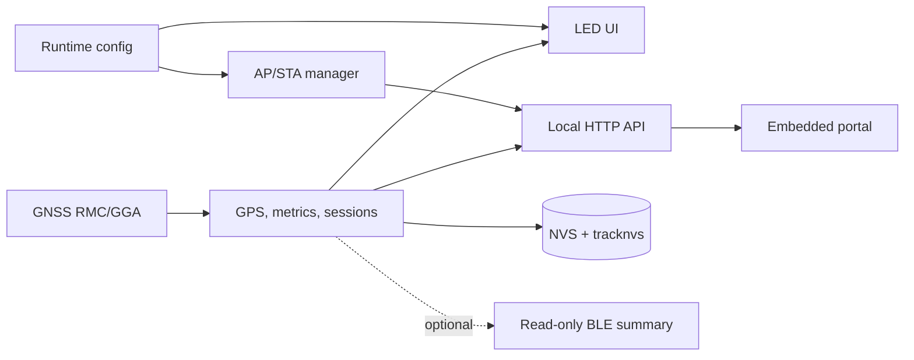

# Dog-RGB

[English (canonical)](README.md) · [Español](README.es.md) · [Documentation](docs/README.md) · [Build guide](docs/manual_de_construccion.en.md)

Dog-RGB is an intentionally over-engineered DIY smart collar built around a simple idea: put high-visibility RGBW LEDs, GNSS telemetry, and an ESP32-S3 on a dog collar, then explore how far careful firmware and electronics can take it.

The active implementation is local-first. The collar records activity, drives two LED strips, and serves its own mobile-friendly Wi-Fi portal. It does not require a cloud account or Internet connection.

> **Project status — working prototype.** The firmware and portal are implemented and tested in CI and Wokwi. The mechanical enclosure, weatherproofing, battery runtime, thermal behavior, and final wiring still require validation on the physical collar. This is a DIY project, not certified pet-safety or production hardware.

## What works today

| Area | Implemented behavior |
| --- | --- |
| GNSS | NMEA RMC/GGA parsing, fix-quality gates, Haversine distance, active time, average/max speed, spike rejection, trusted date rollover |
| Route history | Latest two hours at a nominal 5-second interval, plus the current and three completed session summaries; JSON, CSV, and GeoJSON streaming exports |
| LEDs | Two 24-pixel SK6812 RGBW strips by default, reserved status pixels, 12 effects, Speed/Geofence/Show/Simple modes, and a global estimated-current limiter for both buses |
| Power saving | Optional Day Mode turns off effect pixels from 06:00 to 16:00 in America/Bogota while keeping status LEDs, GNSS, storage, and the portal active |
| Wi-Fi | SoftAP + station mode, captive-portal helpers, on-demand network scan, mDNS, bounded retry/backoff, and automatic AP availability policy |
| Portal | Dashboard, route preview, Wi-Fi setup, runtime configuration (including optional LED power calibration), diagnostics, optional write PIN, and safe configuration reset |
| Persistence | CRC-protected A/B records for runtime config, metrics, sessions, home, and Wi-Fi credentials; dedicated NVS partition for route points |
| BLE | A read-only 16-byte daily summary is implemented but **disabled by default** because SoftAP/BLE coexistence is unreliable on the shared ESP32-S3 antenna |
| Verification | PlatformIO build, Python host tests, static portal checks, Playwright behavior/a11y tests, committed visual baselines, and eight Wokwi scenarios |

Not implemented: cloud sync, user accounts, a native mobile app, IMU/heart-rate input, battery telemetry, OTA updates, and portal presets. Those ideas remain optional roadmap items.

## Hardware baseline

| Component | Current baseline |
| --- | --- |
| MCU | Seeed Studio XIAO ESP32-S3 |
| GNSS | EBYTE E108-GN02, 9,600 baud; receiver supports higher rates, firmware samples metrics at 1 Hz |
| LEDs | SK6812 RGBW, 5 V, two independent strips, 24 pixels per strip |
| Battery | One protected 21700 Li-ion cell, charger/BMS, and a measured/suitably rated 5 V boost stage |
| LED logic | 74AHCT125/74HCT125-class 3.3 V-to-5 V level shifter recommended |

Default pin assignment:

| Signal | XIAO pin | GPIO |
| --- | --- | ---: |
| LED strip A data | D0 | 1 |
| LED strip B data | D1 | 2 |
| External status LED | D2 | 3 |
| ESP32 GNSS TX | D6 | 43 |
| ESP32 GNSS RX | D7 | 44 |

See the [build guide](docs/manual_de_construccion.en.md), [wiring reference](docs/sk6812_wiring.md), and [power-budget assumptions](docs/bom_power_budget.md) before connecting a cell or LED strip.

## Quick start

### 1. Build the firmware

Install [PlatformIO Core](https://docs.platformio.org/en/latest/core/installation/index.html), then run:

```powershell
cd Platformio\Dog-RGB
pio run -e seeed_xiao_esp32s3
```

The environment is pinned to pioarduino `55.03.311` (Arduino-ESP32 3.3.11 / ESP-IDF 5.5.5), ArduinoJson 7.4.3, and Adafruit NeoPixel 1.15.5.

### 2. Flash the complete image

```powershell
pio run -e seeed_xiao_esp32s3 -t upload
pio device monitor -e seeed_xiao_esp32s3
```

Use the PlatformIO upload target at least once when moving to this firmware layout. Uploading only `firmware.bin` does not install [`partitions_dog_rgb.csv`](Platformio/Dog-RGB/partitions_dog_rgb.csv), including the dedicated `tracknvs` partition.

### 3. Open the local portal

1. Connect to Wi-Fi `DogRGB` with the default password `Dog12345`.
2. Let the captive portal open, or browse to `http://192.168.4.1/`.
3. Use `/wifi` to join a home network, `/config` for runtime settings, or `/dev` for diagnostics.
4. When station mode is connected, try `http://dog-collar.local/` on a client that supports mDNS.

Change the default AP password before regular use. The optional 4–8 digit portal PIN protects write actions, but read-only telemetry remains visible to clients that can join the collar network.

## Development checks

Run firmware contract tests from the active firmware directory:

```powershell
cd Platformio\Dog-RGB
python -m unittest discover -s test -p "test_*.py" -v
```

Run portal checks from the repository root with Node.js 24:

```powershell
npm ci
npm run smoke
npx playwright test --project=iphone-13-pro-max-chromium
```

Prepare or exercise the Wokwi simulation:

```powershell
cd Platformio\Dog-RGB
.\tools\wokwi.ps1 -Action prepare
.\tools\wokwi.ps1 -Action suite -TimeoutMs 90000
```

Wokwi automation needs a local `WOKWI_CLI_TOKEN`; copy `.env.example` to the ignored `.env` file. See [Testing and simulation](docs/testing.md) for the full matrix and platform notes.

## Architecture at a glance



`main.cpp` orchestrates bounded ticks; domain state lives inside modules. Wi-Fi callbacks enqueue events for processing in the main loop, route exports stream in bounded chunks while servicing GNSS, and persistent records use validation plus CRC/generation selection. The detailed module and data-flow map is in [Architecture](docs/architecture.md).

## Documentation map

- [Documentation hub](docs/README.md) — canonical index and document status definitions
- [User guide](docs/user-guide.md) — operation, portal access, modes, exports, and troubleshooting
- [Build guide](docs/manual_de_construccion.en.md) — assembly and bench-test sequence
- [Architecture](docs/architecture.md) — modules, runtime flow, storage, and design constraints
- [Local HTTP API](docs/api-reference.md) — pages, endpoints, headers, payloads, and errors
- [Runtime configuration](docs/portal_config.md) — fields, defaults, validation, and persistence
- [Testing and simulation](docs/testing.md) — host, portal, visual, CI, and Wokwi workflows
- [Requirements](docs/requirements.md), [roadmap](docs/roadmap.md), and [work queue](docs/tasks.md)

Historical audits and implementation plans are retained for engineering traceability. Their line references and proposed designs may no longer match the current source; the [documentation hub](docs/README.md) labels each one.

## Repository layout

```text
Dog-RGB-1/
├── Platformio/Dog-RGB/   active ESP32-S3 firmware and Wokwi project
├── docs/                 current guides, specifications, audits, and plans
├── tests/                portal behavior, accessibility, and visual tests
├── tools/                portal extraction, preview, and smoke tooling
├── hardware/             hardware-area entry point
├── firmware/             firmware-area entry point
├── software/             future companion/cloud software placeholder
└── Datasheets/           locally retained component references
```

## Design principles

- Keep the collar useful offline and recoverable by a hobbyist.
- Make advanced security, cloud, and production hardening optional unless the project goal changes.
- Prefer bounded work and explicit diagnostics on the MCU.
- Never turn estimates into safety claims: measure current, temperature, runtime, RF behavior, and weather resistance on the assembled collar.
- Update canonical docs with the code; preserve dated audits and plans as snapshots.

Contributions are welcome; start with [CONTRIBUTING.md](CONTRIBUTING.md).

## Acknowledgements

Dog-RGB is proudly developed with support from [Codex for Open Source](https://developers.openai.com/community/codex-for-oss).

A heartfelt thank-you to **OpenAI** and the **Codex team** for providing access to **ChatGPT Pro with Codex** in support of open-source maintainers. Their generosity gives this delightfully over-engineered DIY project more room to explore ambitious ideas, strengthen its engineering and documentation, and share what we learn with the community.

Dog-RGB is an independent community project and is not affiliated with or endorsed by OpenAI.

## License

Unless a file states otherwise, the original source code, tooling, and project documentation in this repository are available under the permissive [MIT License](LICENSE). You may use, copy, modify, merge, publish, distribute, sublicense, and sell copies, provided that the copyright and license notice are preserved.

Third-party dependencies, vendor datasheets, referenced projects, trademarks, and other externally authored material remain subject to their respective owners and license terms. In particular, work inspired by WLED must follow the [clean-room and provenance decision](docs/adr/0001-wled-clean-room-y-licencia-del-proyecto.md); Dog-RGB's MIT license does not grant rights to WLED code or assets.
