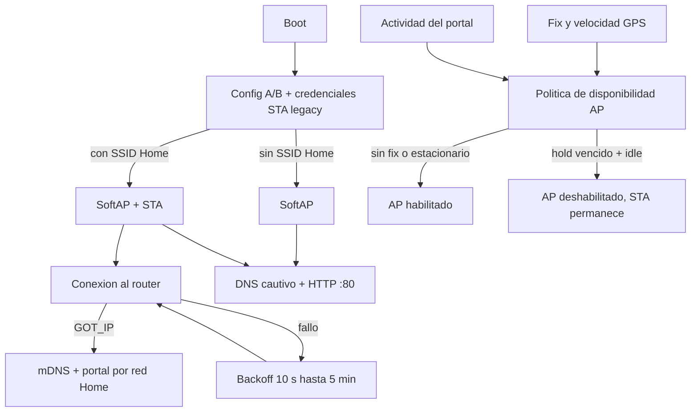

# Auditoria profunda de AP, Wi-Fi y portal local

Fecha original: 2026-07-31; actualizada: 2026-08-01  
Proyecto auditado: Dog-RGB, rama `main`, commit `c5b77be`  
Objetivo real: collar DIY configurable desde el telefono, con acceso local simple, GPS, LEDs y funcionamiento util con o sin router domestico.

## Resultado ejecutivo

El subsistema Wi-Fi tiene una base razonable y varias decisiones correctas para este proyecto: mantiene un SoftAP de recuperacion, permite STA opcional, usa AP+STA sin bloquear el arranque, limita clientes, aplica backoff a STA, desacopla los callbacks Wi-Fi mediante una cola estatica y protege el procesamiento GNSS durante exportaciones HTTP largas.

La clave inicial `Dog12345`, la posibilidad de cambiarla y la opcion de AP abierto son decisiones deliberadas de usabilidad DIY. **No se consideran defectos en esta auditoria.** Tampoco se recomienda agregar cuentas, nube, login obligatorio ni provisionamiento empresarial.

Los problemas principales son de robustez y autonomia:

1. **Resuelto 2026-08-01:** las credenciales Home Wi-Fi ahora forman un registro A/B unico, versionado, con CRC y readback antes de actualizar RAM.
2. Si el SoftAP falla al arrancar, despues de agotar tres intentos el loop puede volver a ejecutar un intento bloqueante cada vuelta, sin backoff.
3. Varias transiciones marcan el estado deseado como real aunque fallen `WiFi.mode()`, `softAPConfig()`, `softAPdisconnect()` o `WiFi.begin()`.
4. La politica `sin fix GPS => AP forzado` mantiene AP+STA activo incluso cuando Home Wi-Fi funciona; ademas `WiFi.setSleep(false)` nunca se revierte al quedar en STA-only. En un collar a bateria esta combinacion puede costar autonomia real.
5. Se descarta la razon numerica de desconexion STA. Los logs no pueden distinguir password incorrecto, AP inexistente, perdida de beacons o desconexion intencional.

Resueltas las credenciales, la prioridad recomendada pasa a la maquina de estados; despues se debe medir y optimizar la energia sin sacrificar el acceso facil al collar.

## Alcance y verdad tecnica

Se leyeron directamente:

- `Platformio/Dog-RGB/src/wifi/wifi_mgr.cpp` y su interfaz;
- `src/web/portal_http.cpp` y `src/web/pages.cpp`;
- configuracion runtime, NVS, `main.cpp`, politica LED y coexistencia BLE;
- configuracion PlatformIO, particiones, Wokwi y los ocho escenarios actuales;
- pruebas host, en especial `test_wifi_event_queue.py`;
- la implementacion instalada de Arduino-ESP32 usada por el build, no solamente APIs modernas.

Versiones efectivas fijadas por el proyecto:

| Componente | Version efectiva |
|---|---:|
| PlatformIO Espressif32 | 6.7.0 |
| Arduino-ESP32 | 2.0.16 (`framework-arduinoespressif32 3.20016.0`) |
| ESP-IDF base | familia 4.4 incluida por ese core |
| ArduinoJson | 7.2.1 |
| Placa | Seeed XIAO ESP32-S3 |

Las conclusiones de comportamiento de `WiFi.mode`, `WiFi.begin`, `softAP`, `softAPConfig`, `softAPdisconnect`, `setSleep` y `Preferences` se verificaron contra el codigo fuente local de esas dependencias. La documentacion externa se uso para confirmar el comportamiento esperado del chip y planear pruebas; el repositorio sigue siendo la fuente principal.

### Verificacion ejecutada durante esta auditoria

| Verificacion | Resultado |
|---|---|
| `python -m unittest discover -s test -p "test_*.py" -v` | **100/100 pass**. Solo seis pruebas cubren especificamente la cola Wi-Fi; ninguna ejecuta aun las transiciones/AP policy identificadas abajo. |
| `platformio run -e seeed_xiao_esp32s3` | **Pass** con el entorno fijado. RAM estatica 54,084/327,680 B (16.5%); flash 965,637/3,342,336 B (28.9%). |
| Inspeccion de Wokwi | Ocho escenarios presentes; solo hay aserciones seriales de boot/latencia relacionadas con Wi-Fi. No existe provisionamiento STA ni request HTTP automatizado. |
| Wokwi CLI en esta tarea | No ejecutado: los escenarios actuales no ejercitan los hallazgos AP/STA y gastar minutos no aportaria nueva evidencia. |

## Arquitectura recuperada del codigo



### Estados observados

| Condicion | Comportamiento actual |
|---|---|
| Sin credenciales Home | Arranca AP-only en `192.168.4.1`, canal 1, maximo 2 clientes. |
| Con credenciales Home | Arranca directamente AP+STA, luego intenta el router. |
| STA conectado | mDNS se inicia; AP sigue disponible hasta que la politica lo apague. |
| STA falla | AP permanece; STA reintenta con backoff exponencial de 10 s a 300 s. |
| Hay cliente AP | Se pospone el reintento STA para no romper la sesion por un cambio de canal. |
| No hay fix GPS | El AP se fuerza encendido indefinidamente. |
| Fix valido y movimiento | Tras hold/idle, el AP se apaga y STA puede continuar. |
| Fix valido y velocidad baja durante 120 s | El AP vuelve a encenderse. |
| Trafico HTTP | Extiende 300 s el hold del AP. |

## Lo que esta bien resuelto

### Cola de eventos y propietario unico

`wifi_mgr.cpp`, mediante `on_wifi_event()`, `drain_wifi_events()` y `process_wifi_event()`, hace que el callback de otro task solamente capture ID y tiempo en una cola FreeRTOS estatica de 16 entradas. El loop drena esa cola y es el propietario de los booleanos y contadores. Esto respeta la advertencia oficial de Arduino-ESP32 de que los eventos se ejecutan en otro task y evita la carrera anterior.

La cola es acotada, cuenta drops, mide high-water y fuerza reconciliacion si se desborda. Es una solucion apropiada para firmware pequeno.

### AP+STA y continuidad de configuracion

El arranque con credenciales usa AP+STA desde el principio (`wifi_mgr::begin()`), evitando un salto AP -> AP+STA inmediatamente despues de `softAP()`. `wifi_mgr::tick()` tambien evita reintentar STA mientras existe un cliente AP, porque al conectar STA el canal del router tiene prioridad y el SoftAP puede cambiar de canal.

### Politica temporal rollover-safe

Los deadlines largos de hold y backoff usan `time_utils`, y el resto de intervalos usa resta unsigned. La politica resiste el rollover de `millis()` mucho mejor que comparaciones absolutas ingenuas.

### Portal y GNSS

El servidor es sincrono, pero los exports de track agrupan datos en chunks de 768 bytes y llaman `gps::tick()` antes y despues de cada escritura (`portal_http.cpp:32-86`). El RX GNSS de 16 KiB aporta una segunda defensa. Esto esta alineado con la prioridad GPS-first del collar.

### Diagnosticos existentes

`/api/dev` expone conteos AP/STA, drops de cola, high-water, holds, retries, canal, tiempos maximos de consultas al driver y estado DNS (`portal_http.cpp:286-342`). Los logs periodicos tambien separan latencia de radio, HTTP y UART.

## Registro de hallazgos

### WFA-001 — Resuelto 2026-08-01 — Credenciales Home Wi-Fi transaccionales

**Evidencia original corregida:** antes de 2026-08-01, `load_wifi_creds()` leia `wifi_ssid` y `wifi_pass` por separado y `save_creds()` llamaba dos veces a `Preferences::putString()`, ignoraba ambos retornos y cambiaba RAM incondicionalmente. `handle_wifi_save()` respondia exito y comenzaba STA sin saber si NVS habia guardado el par.

**Fallo real:**

- corte entre las dos escrituras: SSID nuevo con password viejo, o viceversa;
- NVS lleno/error: funciona temporalmente con RAM nueva, pero tras reboot reaparece la configuracion vieja;
- una escritura falla y otra pasa: el portal dice “saved” aunque el estado persistido sea incoherente.

NVS protege una entrada individual frente a un corte, pero no convierte dos claves de aplicacion en una sola transaccion. La documentacion de Espressif indica que se puede perder el nuevo key-value que estaba siendo escrito; por eso el par debe ser una unidad versionada.

**Implementacion:** `WifiCredentialsRecord` guarda SSID y password como una unica unidad de 118 bytes con magic, version, size, generation wrap-safe, estado configured, longitudes, campos reservados y CRC32. `wifi_a`/`wifi_b` alternan generaciones; cada escritura exige byte-count exacto, readback, decode y `memcmp` antes de cambiar slot, generation o RAM. Si solo queda un slot valido durante boot, se reconstruye el redundante. Las claves `wifi_ssid`/`wifi_pass` se leen exclusivamente para una migracion compatible y se crean dos generaciones verificadas antes de marcar `wifi_blob`.

`save_creds()` ahora devuelve `bool`. Ante fallo, conserva credenciales y backoff anteriores, no inicia STA y `/wifi` responde HTTP 500 con `{"ok":false,"reason":"storage"}`. `/api/dev` expone slot, generation y save_failures sin publicar la contraseña. El registro admite red abierta, PSK de hasta 64 bytes y un estado unconfigured explicito que deja preparada una futura accion transaccional de olvidar red.

**Validacion:** ocho pruebas enfocadas modelan truncamiento, bit flip, reboot, seleccion A/B, rollover de generation, red abierta, PSK de 64 bytes y estado unconfigured. La suite completa pasa 108/108. El build fisico `seeed_xiao_esp32s3` pasa con 54,092 bytes RAM (16.5%) y 968,301 bytes flash (29.0%). Falta todavia fault injection NVS sobre hardware; no invalida la cobertura determinista del formato y la FSM de persistencia.

### WFA-002 — Alta — Reintento SoftAP sin backoff despues de fallo de arranque

**Evidencia:** `begin()` limita el boot a tres intentos. Si todos fallan, `ap_enabled_state` queda false. En el primer `tick`, `update_ap_policy()` calcula `ap_force_on = !gps::has_fix()` y llama `enable_ap("gps_no_fix")`. `enable_ap()` llama inmediatamente a `start_ap_radio()`, que incluye `delay(WIFI_MODE_SETTLE_MS)` de 150 ms. No existe deadline de retry AP.

**Fallo real:** durante un fallo persistente del driver/radio, el firmware puede intentar arrancar AP en cada loop, introducir stalls de 150 ms repetidos, inundar Serial y degradar GPS, LEDs y watchdog. El limite de tres intentos solo protege `setup()`, no el runtime.

**Mejora propuesta:** estado `ap_retry_scheduled`, backoff acotado (por ejemplo 1, 2, 5, 10, 30 s), clasificar fallo de modo/config/AP, y cancelar el backoff al recibir `AP_START` o un arranque verificado. La politica debe expresar “AP solicitado” sin ejecutar el driver repetidamente.

**Pruebas:** inyectar 20 fallos consecutivos y verificar numero maximo de intentos, ausencia de loop stalls continuos y recuperacion al primer exito posterior.

### WFA-003 — Alta — Estado interno puede divergir del driver

**Evidencia:**

- `start_ap_radio()` ignora el resultado de `set_wifi_mode()`, `WiFi.setSleep(false)` y `WiFi.softAPConfig()`; solo usa el retorno final de `softAP()`.
- `stop_ap_radio()` ignora `softAPdisconnect(true)` y declara AP apagado de todas formas (`:172-190`).
- `set_wifi_off(true)` llama `set_wifi_mode(WIFI_OFF)` y marca todo apagado incluso si la llamada falla (`:390-405`).
- `start_sta_mode_internal()` ignora el `wl_status_t` inmediato de `WiFi.begin()` y siempre marca `sta_connecting=true` (`:344-371`).

**Fallo real:** `/api/status`, LEDs, DNS, retries y politica pueden operar sobre un estado que el driver no alcanzo. Un AP viejo puede seguir vivo mientras firmware/DNS creen que esta apagado, o un fallo inmediato de STA puede consumir el timeout completo como si estuviera conectando.

**Mejora propuesta:** transiciones con resultado estructurado: modo, IP config, AP config, sleep, connect/disconnect y estado final observado. Cambiar el estado interno solo despues de confirmar la etapa obligatoria. Añadir reconciliacion periodica barata con `WiFi.getMode()`/eventos, no consultas bloqueantes en cada loop.

**Nota de version:** en Arduino-ESP32 2.0.16 `setSleep(false)` puede retornar false cuando el valor ya era el mismo; no debe tratarse como error fatal sin consultar el comportamiento especifico. En cambio `WiFi.mode`, `softAPConfig`, `softAP`, `softAPdisconnect` y el fallo inmediato de `WiFi.begin` si deben formar parte del resultado.

### WFA-004 — Alta — Sin fix GPS fuerza AP aunque STA ya ofrezca portal

**Evidencia:** `update_ap_policy()` usa `const bool ap_force_on = !gps::has_fix();`. Ese estado retorna antes de la logica de apagado.

**Fallo real:** dentro de casa es normal no tener fix. Incluso conectado correctamente al router y accesible por mDNS, el collar mantiene AP+STA activo para siempre. Esto evita llegar a STA-only, conserva beacons SoftAP y mantiene el camino de mayor consumo durante almacenamiento/carga interior.

**Mejora propuesta:** separar “sin fix” de “sin camino de configuracion”. Regla inicial sugerida:

```text
force_ap = !gps_fix && !sta_connected
```

Con STA conectado, respetar hold/cliente/actividad y permitir apagar AP. Si STA cae, el AP vuelve inmediatamente. Mantener AP forzado cuando no hay credenciales Home conserva la recuperabilidad DIY.

**Pruebas:** matriz fix/no-fix x STA conectado/desconectado x cliente AP, incluyendo perdida del router y retorno inmediato del AP.

### WFA-005 — Alta para autonomia — Modem-sleep nunca se restaura en STA-only

**Evidencia:** `WiFi.setSleep(false)` se ejecuta en `start_ap_radio()` y `start_sta_mode_internal()`. Al apagar AP, `disable_ap()` cambia a `WIFI_STA`, pero no llama `WiFi.setSleep(true)`.

**Fallo real:** Espressif documenta que desactivar modem-sleep aumenta el consumo y reduce latencia. En este collar, despues de apagar AP el radio STA sigue configurado sin ahorro. El impacto exacto depende de DTIM, trafico, RSSI y placa, y **debe medirse**, pero la direccion del efecto esta confirmada. Como referencia de orden de magnitud —no como garantia para este montaje— Seeed publica para la XIAO ESP32-S3 aproximadamente **100 mA en Wi-Fi activo y 27 mA en modem-sleep**. LEDs, GNSS, regulador, RSSI y trafico cambiaran el total del collar.

**Mejora propuesta:** mantener `WIFI_PS_NONE` solo mientras AP este activo si las pruebas demuestran que es necesario para estabilidad. Al entrar en STA-only conectado, activar `WIFI_PS_MIN_MODEM`; al reabrir AP, desactivarlo antes de servir el portal. Exponer `power_save_mode` en diagnosticos.

**Pruebas fisicas:** corriente promedio y picos en AP+STA, STA-only sin sleep, STA-only MIN_MODEM y radio off; medir latencia del portal, reconexiones y recepcion mDNS durante 30-60 min por modo. Probar MIN_MODEM primero; MAX_MODEM no entra al plan inicial porque puede perder multicast/broadcast y perjudicar mDNS.

### WFA-006 — Media — Se pierde la causa real de desconexion STA

**Evidencia:** `PendingWifiEvent` solo guarda ID y tiempo. `on_wifi_event()` usa la firma sin `WiFiEventInfo_t`. Toda desconexion procesada por `process_wifi_event()` termina como `sta_disconnected`.

**Fallo real:** el usuario y los logs no pueden distinguir `NO_AP_FOUND`, password/auth incorrecto, handshake timeout, beacon timeout o desconexion voluntaria. Tambien se dificulta impedir que un evento generado por `WiFi.disconnect()` programe un retry no deseado.

Espressif exige que la aplicacion diferencie una desconexion intencional de una perdida real. El codigo actual aplica el mismo tratamiento a ambas.

**Mejora propuesta:** capturar en la cola el reason code de `info.wifi_sta_disconnected.reason`, mas una generacion/intencion de conexion. Exponer ultimo reason numerico y nombre, conteos por clase, y distinguir:

- configuracion/auth: backoff largo y mensaje “revisa password”;
- AP no encontrado: backoff normal;
- beacon/loss: retry rapido limitado;
- desconexion intencional por cambio de credenciales/timeout: no duplicar scheduling.

### WFA-007 — Media — Se cambia la radio antes de entregar la respuesta “saved”

**Evidencia:** `/api/wifi` guarda y llama `start_sta_mode()` antes de `server.send(200, ...)` (`portal_http.cpp:1041-1043`). Con AP+STA, conectar al router puede mover el SoftAP al canal del STA.

**Fallo real:** el telefono que envio la configuracion puede perder el canal/AP antes de recibir el HTTP 200. El frontend interpreta una excepcion como “Error” aunque la credencial se haya guardado y la conexion haya comenzado.

**Mejora propuesta:** persistir, responder 200 y programar `pending_sta_connect` con 300-500 ms, igual que ya se difiere el restart de AP. Incluir `operation_id` o generation para que el polling conozca la operacion activa.

### WFA-008 — Media — No existe una accion para borrar Home Wi-Fi

**Evidencia:** el formulario exige SSID; `handle_wifi_save()` rechaza vacio (`portal_http.cpp:1027-1036`). Solo se puede reemplazar la red. El reset de runtime config no borra `wifi_ssid/wifi_pass`, porque viven en otro namespace/logica.

**Fallo real:** para volver intencionalmente a AP-only, retirar un router antiguo o limpiar un password erroneo, el usuario debe inventar otra red o borrar flash/reflashear.

**Mejora propuesta:** boton “Olvidar Home Wi-Fi”, endpoint POST dedicado y clear dentro del mismo registro A/B de WFA-001. Tras confirmar NVS, desconectar STA de forma intencional y mantener AP-only. No mezclarlo implicitamente con el reset de LEDs/GPS.

### WFA-009 — Media — Redireccion NotFound incorrecta sobre STA

**Evidencia:** cualquier ruta desconocida ejecuta `redirect_to_portal()` (`portal_http.cpp:115-120,1073`). La URL se construye siempre con `wifi_mgr::ap_ip()`. Si AP esta apagado devuelve `0.0.0.0`; si la peticion llego por Home Wi-Fi, `192.168.4.1` tampoco es la interfaz que usa el cliente.

**Fallo real:** una URL desconocida desde `dog-collar.local` puede redirigir a `http://0.0.0.0/` o a una IP AP inalcanzable desde la LAN.

**Mejora propuesta:** usar `Location: /` para conservar host/interfaz, o diferenciar `server.client().localIP()` y devolver 404 JSON/HTML en STA. Mantener comportamiento cautivo solamente para probes y trafico recibido por AP.

### WFA-010 — Media — SSID Home valido puede romper el HTML

**Evidencia:** `pages.cpp:579-581` concatena `wifi_mgr::ssid()` directamente dentro de un atributo HTML entre comillas. El validador permite caracteres imprimibles como `"`, `&`, `<` y `>` (`runtime_config.cpp:599-612`).

**Fallo real:** una red domestica con un SSID legal como `Casa "2G"` rompe el atributo `value`; otros caracteres se interpretan como entidades/markup. Es principalmente un bug de compatibilidad de nombres reales, no una razon para añadir autenticacion.

**Mejora propuesta:** helper unico de escape HTML para texto y atributos (`&`, `<`, `>`, `"`, `'`) y pruebas de round-trip con SSID de 1/32 bytes, espacios internos, ampersand, comillas y UTF-8 valido. La UI debe validar **bytes UTF-8**, no solamente `String.length` de JavaScript; `TextEncoder` evita aceptar visualmente un nombre que excede los 32 bytes del driver.

### WFA-011 — Media — mDNS se considera iniciado sin comprobarlo

**Evidencia:** `begin_mdns()` ejecuta `MDNS.end(); MDNS.begin(...)` e ignora el retorno. `apply_mdns()` hace lo mismo. `/api/status` muestra el nombre configurado, no el estado real.

**Fallo real:** si mDNS falla por memoria/driver, el portal afirma `http://dog-collar.local/` aunque solo funcione la IP. No hay contador ni fallback visible.

**Mejora propuesta:** guardar `mdns_running`, `mdns_start_count/fail_count`, publicar servicio `_http._tcp:80`, mostrar siempre tambien la IP STA y reiniciar mDNS solo tras GOT_IP real. La publicacion del servicio no es necesaria para que `dog-collar.local` resuelva, pero si permite que navegadores/herramientas de descubrimiento encuentren el portal como servicio HTTP.

### WFA-012 — Media — Cobertura de prueba Wi-Fi insuficiente

**Evidencia:** `test_wifi_event_queue.py` verifica FIFO, saturacion y contratos mediante modelo/source inspection. No ejecuta la maquina de estados C++, politica AP, backoff, errores del driver, persistencia de credenciales, DNS, HTTP sobre STA ni cambios de canal. Los ocho YAML Wokwi solo observan logs Wi-Fi de boot; ninguno provisiona una red ni hace requests al portal.

**Fallo real:** las partes mas delicadas de Wi-Fi pueden cambiar sin una prueba que reproduzca su secuencia temporal.

**Mejora propuesta:** extraer decisiones puras a un FSM testeable, añadir adaptador de driver inyectable y complementar con Wokwi/target y HIL fisico. Wokwi documenta AP personalizados con SSID/password/canal estaticos, pero no documenta un control de automation para apagar/encender ese AP: usar diagramas separados para red valida, ausente y password incorrecto; reservar la perdida/retorno dinamicos para hardware salvo que aparezca un control oficial.

### WFA-013 — Baja — Fallo de DNS cautivo sin contador ni backoff

**Evidencia:** si `dns_server.start()` falla, `dns_running` queda false y `sync_dns()` lo vuelve a intentar en cada loop (`portal_http.cpp:130-142`). Solo existen contadores de start exitoso y stop.

**Impacto:** un fallo persistente de UDP/heap puede crear churn continuo invisible.

**Mejora propuesta:** `dns_start_fail_count`, ultimo intento/error aproximado y retry cada 1-5 s. El HTTP por `192.168.4.1` debe seguir funcionando aunque DNS cautivo falle.

### WFA-014 — Baja — Validador STA reutiliza reglas de password AP

**Evidencia:** `/api/wifi` llama `valid_ap_pass()` (`portal_http.cpp:1037`). Este acepta 0 o 8-63 caracteres. El `WiFiSTA` fijado por el proyecto admite hasta 64 bytes y trata STA separadamente.

**Impacto:** una red que use PSK hexadecimal de 64 caracteres no se puede configurar aunque el driver la soporte.

**Mejora propuesta:** `valid_sta_ssid` y `valid_sta_pass` separados: abierto, passphrase imprimible 8-63 o exactamente 64 hex. Mantener las reglas AP actuales.

### WFA-015 — Baja — Coste sincronico y heap aun no se prueba bajo clientes lentos

**Evidencia:** `WebServer` 2.0.16 usa waits de hasta 5 s por datos POST y ACK de envio. Las paginas se construyen en `String` de gran reserva y se mandan de forma sincrona; solo los exports de track tienen streaming GNSS-aware. `/api/dev` tambien construye JSON grande en RAM.

**Impacto:** no hay evidencia de fallo actual; el RX GNSS de 16 KiB mitiga mas de 17 s a 9600 baud. Falta probar requests lentos repetidos, desconexiones a mitad de pagina, fragmentacion de heap y acumulacion de NMEA.

**Mejora propuesta:** medir, no reescribir por intuicion. Registrar minimum free heap, largest free block, max HTTP duration y GPS overflow durante un soak. Solo si falla, servir paginas constantes desde flash/chunks o migrar endpoints pesados.

### WFA-016 — Baja — La base Arduino/ESP-IDF fijada esta fuera de la linea actual

**Evidencia:** PlatformIO fija Espressif32 6.7.0 y Arduino-ESP32 2.0.16. La propia documentacion ESP-IDF marca la rama 4.4 como end-of-life. El proyecto mantiene esta version deliberadamente porque el target Wokwi tiene un workaround HWCDC documentado y hoy compila de forma reproducible.

**Impacto:** no es un fallo inmediato ni una orden de actualizar. Aumenta la deuda de compatibilidad y hace peligroso copiar ejemplos de APIs actuales sin verificar la implementacion 2.0.16; una actualizacion grande podria cambiar eventos, `WebServer`, mDNS, USB y simulacion a la vez.

**Mejora propuesta:** completar primero los tests de P0-P4 sobre la version fijada. Luego crear una rama de upgrade aislada, revisar release notes, compilar fisico/Wokwi y ejecutar la matriz AP/STA completa. No mezclar el salto de core con las correcciones funcionales.

## Riesgos que esta auditoria no eleva a defecto

| Tema | Decision |
|---|---|
| Password inicial simple | Intencional y configurable; correcta para el objetivo DIY. |
| AP abierto seleccionable | Opcion explicita del dueño; no bloquearla. |
| Portal sin login adicional | Adecuado para acceso local directo; no se propone auth empresarial. |
| Solo dos clientes AP | Limite sensato para recursos y uso esperado. |
| BLE desactivado | Correcto mientras no exista una estrategia y pruebas de coexistencia; ESP32-S3 comparte RF 2.4 GHz. |
| HTTPS local | No es prioridad: certificados locales empeorarian la experiencia sin resolver los fallos funcionales anteriores. |
| Reducir potencia TX por intuicion | No hacerlo inicialmente. Puede ahorrar durante TX, pero empeora alcance/RSSI y puede aumentar retries; primero optimizar tiempo de radio activo y medir el collar cerrado. |
| Implementar DHCP option 114 ya | Android lo soporta, pero los probes HTTP actuales siguen siendo fallback oficial y el core fijado no ofrece un camino simple documentado. Probar compatibilidad antes de añadir una pila DHCP personalizada. |

## Plan de mejora priorizado

### P0 — Coherencia y recuperacion

1. **Completado 2026-08-01:** credenciales STA A/B con readback, CRC, reparacion de redundancia y migracion unica.
2. **Completado 2026-08-01:** `save_creds()` fallable; STA no inicia si storage no se confirma.
3. Añadir “Olvidar Home Wi-Fi” transaccional.
4. Diferir la conexion STA hasta despues de responder HTTP.

**Criterio de salida:** ante cualquier corte se carga el par anterior o el nuevo completo; nunca mezcla SSID/password; el portal comunica storage failure; save/clear no dejan al usuario sin AP.

### P1 — Maquina de estados y fallos del driver

1. Separar estado solicitado, transicion en curso y estado observado.
2. Comprobar retornos obligatorios de modo, AP config, AP start/stop y STA begin.
3. Añadir backoff AP y reconciliacion posterior a overflow/fallo.
4. Capturar disconnect reason e intenciones locales.

**Criterio de salida:** 20 fallos AP consecutivos no bloquean el loop; los contadores explican cada fallo; un driver que rechaza una transicion no produce estado falso.

### P2 — Autonomia sin perder facilidad de uso

1. Cambiar `no fix` para forzar AP solo cuando no exista STA util.
2. Activar MIN_MODEM al entrar en STA-only y desactivarlo al reabrir AP.
3. Mantener potencia TX por defecto durante la primera medicion; evaluar reduccion solo si sobra margen de RSSI/alcance en el collar cerrado.
4. Medir corriente, picos, rail 3.3 V y latencia en hardware antes/despues.

**Criterio de salida:** sin GPS pero con Home Wi-Fi, el AP puede dormir tras el hold; si Home Wi-Fi cae, AP vuelve; hay una medida de mA/promedio y no aumentan desconexiones ni perdida del portal.

### P3 — Portal y diagnostico

1. Corregir redirect por interfaz.
2. Escapar SSID en HTML.
3. Instrumentar mDNS/DNS y publicar `_http._tcp`.
4. Mostrar reason code, generation de credenciales, power-save y ultimo resultado de transicion.

### P4 — Pruebas

1. Host: FSM pura con tablas de eventos, rollover, backoffs y power policy.
2. Host: modelo binario A/B de credenciales y fault injection.
3. Wokwi: agregar un `wokwi-wifi-ap` en diagramas/perfiles cortos para credencial valida, password incorrecto y red ausente; validar GOT_IP, reason/retry serial y portal HTTP por `[[net.forward]]`/private gateway.
4. Wokwi: capturar PCAP para DHCP/DNS/HTTP y usar timeouts de 10-20 s. Los escenarios son alpha y los AP personalizados requieren Hobby+/Pro; no gastar minutos en RF/consumo que el simulador no puede demostrar.
5. Hardware: telefono conectado al SoftAP durante cambio de canal, router on/off dinamico, password malo, 30 conexiones/desconexiones secuenciales, DNS/probes Android/Windows/iOS y slow HTTP.
6. Energia/RF: amperimetro/logger para AP-only, AP+STA, STA-only, STA MIN_MODEM y radio off; registrar RSSI, orientacion, alcance, picos y droop de 3.3 V con el collar ensamblado.

## Matriz minima de pruebas futuras

| Caso | Resultado exigido |
|---|---|
| Boot sin credenciales ni fix | AP visible, DNS/HTTP util, sin retry storm. |
| Boot con credenciales validas | AP+STA, GOT_IP, mDNS real, eventual STA-only segun politica. |
| Password Home incorrecto | AP permanece, reason de auth visible, backoff acotado. |
| Router inexistente | AP permanece, NO_AP_FOUND visible, loop sano. |
| Router cambia de canal | STA reconecta; cliente AP recibe comportamiento controlado. |
| Corte durante save credenciales | Par viejo o nuevo completo, nunca mezcla. |
| NVS lleno/falla | HTTP 500/storage; RAM y flash siguen coherentes. |
| AP start falla 20 veces | Backoff; GPS/LED/loop continúan. |
| Sin GPS, STA conectado | AP puede apagar; portal sigue por IP/mDNS. |
| STA cae con AP apagado | AP vuelve sin esperar estacionario. |
| `millis()` cruza `0xffffffff` | Holds y retries conservan duracion. |
| SSID con `&`, `"`, UTF-8 | Formulario renderiza y round-trip correcto. |
| Request desconocida por STA | 404 o redirect valido, nunca `0.0.0.0`. |
| Cliente HTTP lento | Sin watchdog, heap estable, GNSS sin overflow. |
| Android `/generate_204` | Abre portal de forma consistente o permite llegar manualmente a `192.168.4.1`; no debe declarar Internet real. |
| Windows `/connecttest.txt` y `/ncsi.txt` | Contenido diferente al esperado dispara portal/local correctamente; sin redirect a interfaz incorrecta. |
| iPhone/iPad sin Internet | Portal abre; elegir “Without Internet/Sin Internet” mantiene asociacion y acceso local. |
| mDNS por STA | `dog-collar.local` resuelve y `_http._tcp` se anuncia; si falla, la IP STA queda visible. |
| Rail durante TX/reconnect | Sin brownout/reset; picos y droop registrados con LEDs/GNSS activos. |
| Collar cerrado/orientado | RSSI y portal utilizables en posiciones reales; no optimizar TX usando solamente la placa abierta en mesa. |

## Investigacion oficial ampliada y efecto sobre el plan

Se realizaron **24 investigaciones tecnicas independientes**. Se priorizaron fuentes del fabricante, autores del framework, fabricantes de los sistemas cliente y Wokwi. Para comportamiento de API se confronto documentacion reciente con el codigo local Arduino-ESP32 2.0.16; una API “latest” no se asumio compatible automaticamente. Cada consulta termina en una decision o prueba, no en una recomendacion generica.

| # | Pregunta investigada | Evidencia primaria/oficial | Conclusion aplicada al proyecto |
|---:|---|---|---|
| 1 | ¿En que contexto ejecuta Arduino los callbacks Wi-Fi? | [Arduino-ESP32 Wi-Fi API](https://docs.espressif.com/projects/arduino-esp32/en/latest/api/wifi.html) declara un task FreeRTOS separado y callbacks con `event_info`. | Conservar la cola estatica y ampliarla con reason code; nunca tocar `String`, Serial, mDNS o estado compartido desde el callback. |
| 2 | ¿AP, STA y AP+STA son configuraciones soportadas del S3? | [ESP-IDF Wi-Fi overview](https://docs.espressif.com/projects/esp-idf/en/latest/esp32s3/api-guides/wifi-driver/overview.html). | La arquitectura general es valida; no hace falta reemplazarla por BLE/cloud para configurar el collar. |
| 3 | ¿Que canal gana en AP+STA? | [ESP-IDF Home Channel](https://docs.espressif.com/projects/esp-idf/en/latest/esp32s3/api-guides/wifi-driver/overview.html) indica un unico home channel y prioridad STA, con Channel Switch Announcement para el AP. | WFA-007 es real: responder HTTP antes de `WiFi.begin`; probar telefono durante cambio 1 -> 6/11. |
| 4 | ¿Todos los telefonos siguen el cambio de canal sin desconectar? | La misma guia dice que las estaciones **que soportan** channel switching migran; no promete que todas lo hagan. | La recuperacion UI debe asumir desconexion posible y mostrar SSID/IP antes del cambio; HIL con Android/iPhone reales. |
| 5 | ¿Quien reconecta STA tras una perdida? | [ESP-IDF Station Scenarios](https://docs.espressif.com/projects/esp-idf/en/latest/esp32s3/api-guides/wifi-driver/station-scenarios.html) asigna la reconexion a la aplicacion. | Mantener retry propio y backoff acotado; no depender de una reconexion magica del core. |
| 6 | ¿Una desconexion voluntaria debe reintentar? | [ESP-IDF Wi-Fi Event Description](https://docs.espressif.com/projects/esp-idf/en/latest/esp32s3/api-guides/wifi-driver/overview.html) exige distinguir `esp_wifi_disconnect()` de una perdida. | Añadir intent/generation de conexion; eventos viejos no deben cancelar o duplicar una conexion nueva. |
| 7 | ¿Los reason codes permiten mensajes utiles? | [ESP-IDF reason codes](https://docs.espressif.com/projects/esp-idf/en/latest/esp32s3/api-guides/wifi-driver/station-scenarios.html) separa auth/association/handshake/beacon/no-AP. | Exponer numero y clase en `/api/dev`; backoff y mensaje distintos para password malo, red ausente y enlace perdido. |
| 8 | ¿Que hace realmente `WIFI_PS_NONE`? | [ESP32-S3 Wi-Fi Power Save](https://docs.espressif.com/projects/esp-idf/en/stable/esp32s3/api-guides/wifi-driver/wifi-performance-and-power-save.html) confirma mayor consumo y menor latencia; default es MIN_MODEM. | Restaurar MIN_MODEM solamente en STA-only y medir; no habilitar MAX_MODEM inicialmente. |
| 9 | ¿SoftAP puede aprovechar el mismo ahorro? | La misma [guia de power save](https://docs.espressif.com/projects/esp-idf/en/stable/esp32s3/api-guides/wifi-driver/wifi-performance-and-power-save.html) limita modem-sleep util a STA y describe limites AP con multicast. | El mayor ahorro es apagar AP cuando existe STA util, no intentar “dormir” beacons SoftAP. |
| 10 | ¿Cual es el orden de magnitud en la placa XIAO real? | [Seeed XIAO ESP32-S3](https://wiki.seeedstudio.com/xiao_esp32s3_getting_started/) publica tipicos de 100 mA Wi-Fi activo y 27 mA modem-sleep. | Elevar P2: medir el collar completo. Usar estos numeros solo como hipotesis, no como resultado del proyecto. |
| 11 | ¿Conviene bajar TX power de inmediato? | [ESP-IDF 4.4 `esp_wifi_set_max_tx_power`](https://docs.espressif.com/projects/esp-idf/en/v4.4.4/esp32s3/api-reference/network/esp_wifi.html) permite 2-20 dBm; [Kconfig](https://docs.espressif.com/projects/esp-idf/en/v4.4/esp32s3/api-reference/kconfig.html) fija normalmente 20 dBm max. | No tocarlo en P0-P2: menor potencia puede empeorar RSSI, alcance y retries. Evaluarlo despues con margen medido. |
| 12 | ¿Puede Wi-Fi provocar picos/brownout aunque el promedio sea aceptable? | [Espressif Hardware Design Guidelines](https://documentation.espressif.com/projects/esp-hardware-design-guidelines/en/latest/esp32s3/schematic-checklist.html) pide fuente >=500 mA y 10 uF por aumentos bruscos durante TX. | En HIL medir rail 3.3 V durante associate/TX con LEDs y GNSS; registrar reset reason y droop. |
| 13 | ¿La colocacion de antena importa en este wearable? | [Seeed XIAO ESP32-S3](https://wiki.seeedstudio.com/xiao_esp32s3_getting_started/) documenta conector U.FL y alcance con antena; [guia RF Espressif](https://documentation.espressif.com/projects/esp-hardware-design-guidelines/en/latest/esp32s3/pcb-layout-design.html) exige cuidado de RF/entorno. | Probar el collar cerrado, junto a bateria, cuerpo, cables y LEDs; no aceptar una prueba de mesa como evidencia de alcance. |
| 14 | ¿NVS hace segura una escritura frente a power loss? | [ESP-IDF 4.4 NVS](https://docs.espressif.com/projects/esp-idf/en/release-v4.4/esp32s3/api-reference/storage/nvs_flash.html) puede perder el nuevo key-value que estaba escribiendose pero conserva consistencia. | Un blob A/B hace atomico el **par** SSID/password a nivel de aplicacion; dos `putString` no. |
| 15 | ¿`Preferences::putString` permite detectar fallo? | [Codigo oficial Arduino-ESP32 2.0.16](https://github.com/espressif/arduino-esp32/blob/2.0.16/libraries/Preferences/src/Preferences.cpp) retorna longitud tras `nvs_commit` y cero en error; una cadena vacia tambien retorna cero. | Preferir record binario no vacio con `putBytes`, byte-count exacto y readback; no basar clear en el retorno ambiguo de string vacio. |
| 16 | ¿Que debe publicar mDNS? | [ESP-IDF 4.4 mDNS](https://docs.espressif.com/projects/esp-idf/en/v4.4/esp32s3/api-reference/protocols/mdns.html) separa hostname y servicio `_http._tcp:80` y enumera errores de init/memoria. | Verificar `MDNS.begin`, contar fallos, mantener IP visible y anunciar `_http._tcp`; no afirmar mDNS si begin fallo. |
| 17 | ¿Cuanto puede bloquear el servidor sincrono fijado? | [WebServer oficial](https://github.com/espressif/arduino-esp32/blob/2.0.16/libraries/WebServer/src/WebServer.h) define 5 s para datos POST y ACK de envio. | Mantener buffer GNSS y streaming; añadir soak slow-client, minimum heap y max HTTP time antes de migrar framework. |
| 18 | ¿Android depende unicamente de `/generate_204`? | [Android Captive Portal API](https://developer.android.com/about/versions/11/features/captive-portal) mantiene probes HTTP/HTTPS como fallback y añade DHCP option 114. | Conservar probes actuales y probarlos. No implementar option 114 sin soporte claro/beneficio medido en este core. |
| 19 | ¿Que pasa en iPhone/iPad con una red sin Internet? | [Apple Support](https://support.apple.com/en-us/102554) indica que “Without Internet” mantiene asociacion, mientras cancelar puede desasociar. | Añadir instruccion corta en portal/README y probar auto-login/auto-join; no interpretar una desasociacion del usuario como fallo del ESP. |
| 20 | ¿Que espera Windows de `connecttest.txt`/`ncsi.txt`? | [Microsoft NCSI FAQ](https://learn.microsoft.com/en-us/windows-server/networking/ncsi/ncsi-frequently-asked-questions) documenta payloads exactos y que 200 diferente o 302 indica hotspot. | Las rutas actuales son razonables; validar por PCAP que devuelven contenido diferente y no redirigen a interfaz incorrecta. |
| 21 | ¿Que puede probar un AP custom de Wokwi? | [Wokwi WiFi AP](https://docs.wokwi.com/parts/wokwi-wifi-ap) ofrece SSID, WPA2, canal 1-13, BSSID y red sin Internet; requiere Hobby+/Pro. | Tres perfiles cortos: Home correcta, password malo y AP ausente. No asumir que puede apagarse dinamicamente sin control documentado. |
| 22 | ¿Puede probarse el portal HTTP y verse el trafico? | [Wokwi Wi-Fi Networking](https://docs.wokwi.com/guides/esp32-wifi) y [wokwi.toml](https://docs.wokwi.com/vscode/project-config) soportan private gateway, port forward y PCAP 802.11-DNS-HTTP. | Usar `localhost:8180`, requests reales y PCAP; no usar ping porque el gateway no soporta ICMP. |
| 23 | ¿Como gastar pocos minutos Wokwi con evidencia reproducible? | [Wokwi CLI](https://docs.wokwi.com/wokwi-ci/cli-usage) ofrece `--timeout`, scenario, serial log y VCD; [scenarios](https://docs.wokwi.com/wokwi-ci/automation-scenarios) siguen alpha. | Tests de 10-20 s, una hipotesis por escenario, timeout duro y assertions serial/HTTP externas; no soaks de energia simulada. |
| 24 | ¿Se debe actualizar ya Arduino-ESP32/IDF? | La [documentacion ESP-IDF 4.4](https://docs.espressif.com/projects/esp-idf/en/v4.4.4/esp32s3/) la marca EOL; el build local confirma 2.0.16 reproducible. | Registrar WFA-016, pero hacer upgrade en rama separada despues de tener tests Wi-Fi; no mezclar cambio de plataforma y logica. |

### Como estas investigaciones fortalecieron la prioridad

1. **P0 confirmado y resuelto 2026-08-01:** NVS oficial y el retorno real de `Preferences` justificaron implementar WFA-001 primero.
2. **P1 gana detalle:** no basta guardar un reason code; se necesita una intencion/generacion para diferenciar eventos voluntarios y atrasados.
3. **P2 sube de valor:** los datos tipicos de Seeed hacen plausible una diferencia grande entre activo y modem-sleep, pero la aceptacion exige mA medidos con el collar completo.
4. **TX power baja de prioridad:** alcance y retries pueden anular el ahorro; no modificar hasta medir RSSI/orientacion.
5. **Portal cautivo se conserva simple:** Android, Apple y Windows justifican probes y una guia de “sin Internet”; DHCP option 114 queda fuera por ahora.
6. **Wokwi se vuelve especifico y economico:** tres perfiles estaticos, requests/PCAP y timeouts cortos; router on/off dinamico, RF, corriente y brownout quedan en hardware.
7. **El upgrade de core queda aislado:** primero una red de seguridad de tests, despues migracion; asi una regresion tiene una sola causa probable.

## Limites de esta auditoria

- No se midio corriente real, RF, alcance, antena, temperatura ni brownout.
- No se conecto un telefono real al SoftAP durante esta auditoria.
- Wokwi puede validar STA, TCP/UDP y portal con gateway, pero no prueba propagacion RF, coexistencia fisica, consumo ni comportamiento de cada telefono.
- WFA-001 ya se implemento y valido en firmware. Las correcciones restantes deben continuar separadas para aislar regresiones.

## Recomendacion final

Con **WFA-001 resuelto**, la siguiente correccion de mayor valor es resolver juntos **WFA-002/WFA-003**, porque un estado del driver falso o un retry AP en hot loop puede afectar GPS y LEDs, que son funciones centrales del collar. La accion “Olvidar Home Wi-Fi” permanece como WFA-008 y ya puede reutilizar el estado unconfigured del nuevo registro.

La mejora con mayor ventaja de autonomia probable es **WFA-004/WFA-005**, pero debe cerrarse con medidas fisicas: el objetivo no es apagar Wi-Fi agresivamente, sino conservar siempre un camino simple al portal usando AP cuando hace falta y STA de bajo consumo cuando ya existe una red util.
