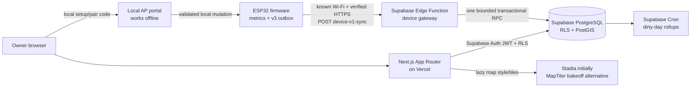
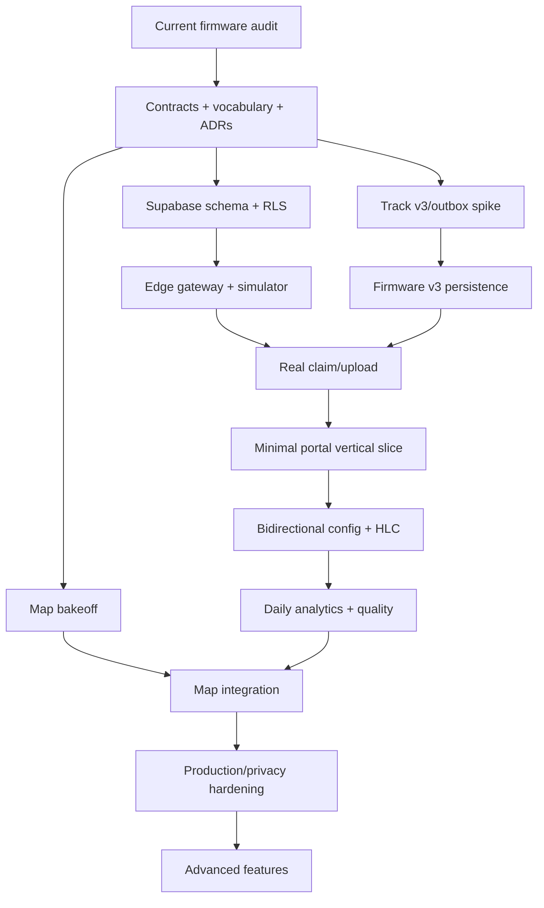

# Dog RGB cloud web platform and bidirectional synchronization

**Status:** Accepted optional implementation direction. Phase 0 contracts, ADRs, and local evidence remain in progress; its physical ESP32 outbox evidence, independent recovery/reclaim review, and credentialed map-provider gate are still missing. Under explicit owner direction, Phase 1 local-cloud work has started in parallel without waiving those Phase 0 exit requirements and without authorizing Phase 2. The repository now contains the portal scaffold, Supabase migrations/Edge Functions, shared analytics/contracts packages, and a device simulator. The complete device-v1 contract passes 48/48; the current Phase 1 clean-room gate passes 250 pgTAP assertions, 49 adversarial HTTP boundary scenarios across all four Edge endpoints, schema drift checks, lint/type/unit/secret checks, database lint/advisors, and the local Edge/simulator/restore/deletion/retention scenarios documented below. Phase 1 remains in progress until its remaining operational items are closed.
**Prepared:** 2026-08-13 (America/Bogota).  
**Repository baseline:** commit `efc9329e0053551f4be8fcb1ab964aad08e5238d`.  
**Research/pricing snapshot:** 2026-08-13; recheck service limits, prices, and terms before purchasing or deploying.  
**Relationship to older plans:** this plan supersedes the cloud, authentication, mapping, and synchronization decisions in the [2026-08-01 cloud portal plan](2026-08-01_cloud-portal-master-plan.md) and the [2026-02-03 Supabase sync plan](2026-02-03_supabase-sync-plan.md). Those files remain design history. Current source, tests, and normative documentation remain authoritative until this plan is implemented.

## Contents

1. [Executive decision](#1-executive-decision)
2. [Non-negotiable product invariants](#2-non-negotiable-product-invariants)
3. [Repository audit](#3-repository-audit-what-exists-now)
4. [Scope and truthful terminology](#4-scope-and-truthful-terminology)
5. [Target architecture](#5-target-architecture)
6. [Identity, authentication, and pairing](#6-identity-account-authentication-and-collar-pairing)
7. [Firmware data foundation](#7-firmware-data-foundation-track-v3-and-a-durable-outbox)
8. [Device sync protocol](#8-device-synchronization-protocol-v1)
9. [Configuration and LWW](#9-bidirectional-configuration-and-last-write-wins)
10. [Firmware change map](#10-firmware-change-map)
11. [Supabase data architecture](#11-supabase-data-architecture)
12. [Edge Function/API](#12-edge-function-and-api-implementation)
13. [Web application](#13-web-application-plan)
14. [Maps](#14-map-provider-decision-and-route-visualization)
15. [Security and privacy](#15-security-and-privacy-plan)
16. [Environments, credentials, and cost](#16-environments-secrets-and-external-credentials)
17. [Testing](#17-test-strategy-and-release-gates)
18. [Phased roadmap](#18-phased-implementation-roadmap)
19. [Dependencies and implementation slices](#19-dependency-graph-and-recommended-implementation-slices)
20. [Definition of success](#20-definition-of-foundational-success)
21. [Owner decisions and inputs](#21-decisions-and-inputs-needed-from-the-owner)
22. [Primary-source register](#22-current-primary-source-reference-register)

## 1. Executive decision

Build an **optional, local-first cloud extension**, not a replacement for the collar's existing operation.

- The ESP32 must keep measuring, driving LEDs, retaining bounded local history, and serving its AP portal when the Internet, Vercel, Supabase, DNS, or the map provider is unavailable.
- Vercel hosts a Next.js App Router web application. The browser authenticates with Supabase Auth and reads user-owned data through Row Level Security (RLS).
- A versioned Supabase Edge Function is the device gateway. It performs custom per-collar authentication, validates a tightly bounded request, and invokes one transactional PostgreSQL function for upload ACKs and configuration reconciliation.
- Telemetry is append-only and delivered at least once with idempotent database effects. **LWW is never used for historical telemetry.**
- Configuration uses a desired/reported model, immutable revision history, and last-write-wins at coherent resource granularity.
- The collar is paired to an account with a one-time claim code. It never stores or submits the owner's email, username, website password, Supabase session, publishable key, secret key, or service-role key.
- Track storage must advance from the current v2 point format before the product claims route speed, inactivity, or movement-phase analytics.
- Use MapLibre GL JS as the renderer and provisionally use Stadia Maps Alidade Smooth Dark as the initial basemap. Run an explicit Stadia-versus-MapTiler visual bakeoff with Colombian routes before freezing that provider. Keep the domain route data as provider-neutral GeoJSON so a later Google Maps implementation is contained.
- Do not call the result “live tracking.” The collar only synchronizes when it reaches known Wi-Fi. Every screen must display data freshness as “last synchronized.”

The first end-to-end proof is deliberately narrow: one account, one dog, one collar, one safely syncable setting (brightness), one real sealed telemetry chunk, an idempotent resend, and an applied-configuration acknowledgement. Rich maps and advanced analytics start only after that slice survives power cuts and network failures.

## 2. Non-negotiable product invariants

| ID | Invariant | Consequence |
| --- | --- | --- |
| INV-01 | Local operation never depends on cloud availability. | Cloud startup and failures cannot prevent GPS, LEDs, AP recovery, local config, or current local exports. |
| INV-02 | Human credentials never enter firmware. | Pairing yields a device-scoped credential; account password and MFA remain browser/Auth concerns. |
| INV-03 | An upload is acknowledged only after its database transaction commits. | Lost responses cause safe resends, not data loss. |
| INV-04 | Unacknowledged movement data is never silently overwritten. | Storage pressure creates an explicit coverage gap and counter if no safe reclaim is possible. |
| INV-05 | Missing observation is not inactivity. | Daily reports separate moving, inactive, observed, and unknown time. |
| INV-06 | Local and cloud configuration share one validator and commit path. | Neither AP handlers nor cloud code may mutate and save config independently. |
| INV-07 | Connectivity and security settings stay local by default. | Wi-Fi/AP passwords, portal PIN, device secret, and recovery settings never sync. |
| INV-08 | Precise route history is private by default. | No public links, indexing, advertising analytics, or route-bearing logs in the MVP. |
| INV-09 | Claims follow measured capability, not marketing aspiration. | “Estimated movement phase” is allowed only after Track v3 validation; no behavior or medical diagnosis. |
| INV-10 | Advanced hardening remains optional for the DIY build, but Internet basics are mandatory. | Secure Boot/eFuse hardening can wait; verified TLS, unique credentials, RLS, input bounds, and revocation cannot. |

## 3. Repository audit: what exists now

This section records the implementation that was inspected before selecting the architecture. It prevents the cloud work from being designed against an imagined collar.

### 3.1 Runtime and radio architecture

- Target: Seeed XIAO ESP32-S3 using Arduino on pinned pioarduino/ESP-IDF dependencies in `Platformio/Dog-RGB/platformio.ini`.
- `setup()` in `Platformio/Dog-RGB/src/main.cpp` initializes storage, runtime configuration, scenes, GPS/geofence/LEDs, optional BLE, Wi-Fi, and then the local portal.
- `loop()` is cooperative. It services GPS, simulation, geofence, metric/track persistence, diagnostics, BLE/Wi-Fi, LEDs, and the synchronous `WebServer` portal. Long TLS or upload work in this loop would delay GNSS processing and visual behavior.
- The GNSS UART has a 16 KiB receive buffer, but draining a backlog gives sentences nearly identical `millis()` values. That means a large blocking cloud operation can still cause the one-second metric/route gates to skip samples even if bytes were not lost.
- Wi-Fi supports AP, station, and AP+STA, with one saved 2.4 GHz station network, bounded connection attempts, exponential retry up to five minutes, and AP recovery behavior. Cloud work must subscribe to connection state; it must not take ownership away from `wifi_mgr`.
- BLE summary transport exists but is compile-time disabled by default because radio coexistence is still a concern.

**Required design response:** implement a bounded `cloud_sync` state machine or a low-priority isolated task with explicit data ownership. It may perform blocking TLS only outside the cooperative owner loop, must never hold an NVS/storage lock during network I/O, and must expose handshake/request/response latency plus free/minimum heap diagnostics.

### 3.2 Current telemetry and its limits

The firmware already calculates and persists:

- GPS-derived distance;
- active time using the current movement evidence and `0.7 km/h` threshold;
- average active speed (`distance / active time`);
- maximum accepted speed, subject to the current 40 km/h validity gate;
- current coordinates and GNSS quality diagnostics;
- current/completed-day summaries;
- the current boot session and three prior boot sessions;
- a current route and three prior route slots.

However:

- A “session” is a boot-to-reboot recording, not a detected walk.
- `TrackPoint` is a packed 10-byte v2 record: `lat_e7`, `lon_e7`, and minute-of-day. It has no seconds, speed, satellite count, quality flag, point sequence, activity state, or stable identity.
- Route persistence admits movement-filtered points and therefore drops regular stationary observations.
- Inactivity cannot be reconstructed reliably from a route that excludes stationary samples.
- A speed-colored route cannot be reconstructed honestly from minute-resolution points without persisted point speed.
- There is no accelerometer, altitude, battery percentage, current, temperature, heart-rate, sleep, bark, or other health sensor input.
- Current retained history is deliberately short: one completed daily journal, three completed sessions, and four route slots. A two-hour rolling route can be overwritten before the next known-Wi-Fi connection.

This yields the following product capability matrix:

| Portal claim | Current data | Track/storage upgrade | Later sensor/analytics work |
| --- | --- | --- | --- |
| Daily distance | Yes | Improve provenance/coverage | Recalculation refinements |
| Active time | Yes, current firmware definition | Persist observation coverage | Individual baseline later |
| Average active speed | Yes | Preserve device and cloud versions | Algorithm comparison later |
| Maximum accepted speed | Yes | Persist per-point speed/quality | Cloud-confirmed filtered maximum |
| Route geometry | Recent/bounded | Durable v3 chunks and upload | Heatmaps later |
| Speed along route | No | UTC seconds + point speed required | Interactive overlay |
| Inactive time | No reliable history | Regular stationary observation required | Threshold validation |
| Unknown/unobserved time | Not modeled | Coverage/gap records required | Quality trend |
| Walk/run phases | No | Point series enables an estimate | IMU-backed classifier if hardware changes |
| Sleep/health/calories | No | Not a GPS-only claim | Requires sensors and validation; postpone |

### 3.3 Persistence and power-cut behavior

Current storage is already thoughtfully transactional:

- Runtime config schema 6 is a validated, CRC-protected A/B record.
- Metrics, daily journal, sessions, Home, station Wi-Fi credentials, portal lock, and scenes use separate records/stores; several use their own A/B generations.
- The scene bank has optimistic concurrency through `store_generation` and `expected_generation`.
- Routes use a dedicated 192 KiB `tracknvs` partition with v2 metadata/chunks, four slots, 48-point chunks, a nominal five-second cadence, a 1,440-point/two-hour window, and periodic partial flushes.
- The 8 MiB partition table also contains an unused `0x150000` (1.3125 MiB) SPIFFS partition while preserving two `0x330000` OTA application slots.

Those local A/B generations are **storage generations**, not cross-device configuration revisions. They cannot order an AP edit against a website edit.

Track v3 must not merely increment the current version and trigger `track_clear_all()`. The implementation must dual-read/export legacy v2 or explicitly migrate it; otherwise an upgrade destroys the user's retained routes.

### 3.4 Local portal and visual identity

The editable AP UI is generated from `webui/src/pages/*.html` and `webui/src/styles/app.css`, then deterministically compressed into firmware. `pages.cpp` is not a source of truth.

Current pages are:

- `/` — metrics, current/prior sessions, route preview, CSV/GeoJSON export;
- `/wifi` — station state/scan and station/AP identity settings;
- `/config` — modes, brightness, Day Mode, power model, speed zones/effects, geofence, GPS gates, Simple/Show, palettes/scenes, optional PIN;
- `/dev` — raw diagnostics.

The current `/config` page is already close to its gzip gate. Cloud linking and diagnostics are a separate user job, so add a dedicated `/cloud` page rather than crowding `/config`.

Canonical identity tokens from the implemented CSS are:

| Token | Value/meaning |
| --- | --- |
| Background | `#000000` |
| Surface | `#0A0A0A` |
| Text/accent | `#00FF41` phosphor green |
| Muted | `#00A838` |
| Attention | `#FFD700` gold |
| Failure/destructive | `#FF0055` magenta |
| Border | `#003300` |
| Radius | `3px` |
| Type | Courier/Lucida/DejaVu monospace stack |

Preserve `DOG-RGB_`, compact status pills, square outlined controls, short uppercase labels, text-plus-color status, visible focus, 44 px targets, and reduced-motion behavior. The online portal may be roomier and use a readable second typeface, but it must look like the same product.

### 3.5 Baseline verification evidence

At this audit baseline:

- the production firmware build completed at approximately 17.6% static RAM and 34.5% application flash;
- 131 host tests passed;
- existing tests cover persistence interruption, route integrity/streaming, Wi-Fi event/backoff behavior, time rollover, scenes, portal contracts, and Wokwi assets;
- existing portal Playwright suites cover mobile/desktop layout, hostile content, write headers/PIN behavior, accessibility, and committed visual baselines.

This is good headroom, not proof that TLS fits safely. Phase 2 must measure peak and minimum heap during DNS, SNTP, TLS handshake, serialization, upload, response parse, AP client activity, and active LEDs on physical hardware.

## 4. Scope and truthful terminology

### 4.1 Foundational product scope

The first releasable cloud product supports:

- email/password account signup, confirmation, login, recovery, and logout;
- a dog profile with an IANA timezone and unit preference;
- one or more collars linked to a dog, even if the first UI optimizes for one-to-one use;
- explicit, opt-in pairing through the collar AP;
- known-Wi-Fi background synchronization;
- historical recordings and daily summaries;
- route display with synchronization freshness and GPS-quality gaps;
- remote configuration for an explicit safe allowlist;
- configuration revision/apply status;
- unlink/revoke, export, and delete workflows;
- local AP configuration that remains immediate and independent.

### 4.2 Language contract

Use these terms consistently in schemas, UI copy, analytics, and tests:

| Term | Definition |
| --- | --- |
| Recording/session | A bounded collar recording, initially aligned with a boot/session boundary. It is not automatically a walk. |
| Observed time | Intervals covered by sufficiently trustworthy, temporally adjacent observations. |
| Moving time | The subset of observed time meeting the versioned movement rule. |
| Inactive time | The subset of observed time meeting the versioned stationary rule; it means the collar was observed stationary, not that the dog was asleep/resting or even provably wearing it. |
| Unknown time | Time in the selected day/window that was not validly observed; may include collar off, no fix, storage loss, or not worn. |
| Average moving speed | Accepted distance divided by moving time. |
| Average observed speed | Accepted distance divided by observed duration; label separately from moving speed. |
| Filtered maximum speed | Maximum after explicit GNSS quality and plausibility rules, not a raw single spike. |
| Estimated movement phase | GPS-derived speed band with a named algorithm version; not verified behavior. |
| Last synchronized | Time the server last committed a successful device sync. It is not current/live location time. |

Garmin is useful here as an information model: it separates moving, elapsed, and timer time and presents routes with speed/pace charts and overlays. It should inspire metric clarity and drill-down, not visual imitation. See [Garmin's time/speed definitions](https://support.garmin.com/en-IN/?faq=k5TPjwyAWi5f4hnObUAVf7), [GPS track overlays](https://support.garmin.com/en-GB/?faq=TldUa5u9Mj67FFw4usMcX7), and [Alpha dog tracks](https://www8.garmin.com/manuals/webhelp/GUID-15D7F576-09F1-44C0-AC5E-29A402C2BBAE/EN-US/GUID-BFFEABD3-6933-471F-87E4-77976BD48639.html).

Tractive's activity summaries, location history, and heatmaps are useful later-product references, but its sensor stack and cellular/live behavior are not comparable to this Wi-Fi/GPS prototype. Its own documentation separates active minutes from small movements and disclaims medical diagnosis; Dog RGB must be at least as explicit. See [activity tracking](https://help.tractive.com/hc/en-us/articles/360010904460-How-to-track-your-pet-s-activity), [location heatmaps](https://help.tractive.com/hc/en-us/articles/115003199225-How-to-enable-the-Heatmap), and [health-alert limitations](https://help.tractive.com/hc/en-us/articles/13362814092562-Health-Alerts-How-To-Guide).

### 4.3 Explicit non-goals for the foundation

Do not include these in the first production slice:

- live location, cellular tracking, or push geofence alerts;
- public route links or social feeds;
- veterinary/medical, sleep, calorie, anxiety, bark, or health claims;
- automatic walk detection presented as ground truth;
- Google Directions/Roads map matching or route snapping;
- native Android/iOS applications;
- Realtime subscriptions or durable WebSockets;
- OTA fleet rollout;
- machine learning, anomaly detection, breed comparisons, or leaderboards;
- database partitioning, a data warehouse, microservices, Kafka, or a separate analytics platform;
- multi-region database replication;
- irreversible secure-boot/flash-encryption eFuse operations on development collars.

## 5. Target architecture



### 5.1 Component responsibilities

| Component | Owns | Must not own |
| --- | --- | --- |
| Firmware | sensing, local metrics, durable outbox, local config, HLC state, device credential, retry/ACK state | account password, cloud history queries, analytics truth, service keys |
| AP portal | Wi-Fi setup, one-time claim input, local configuration, local/cloud status and recovery | Internet account login, route sharing, server admin actions |
| Device Edge Function | request bounds, device credential verification, rate/quota decisions, protocol errors, transactional RPC invocation | long jobs, in-memory durability, human UI rendering |
| PostgreSQL | idempotency, immutable observations/revisions, ownership, RLS, desired/reported heads, rollups, audit trail | arbitrary unbounded payload processing |
| Supabase Auth | human identity, email/password, sessions, optional MFA | collar identity |
| Next.js/Vercel | product UI, SSR session handling, user mutations, map/chart orchestration | durable queues, device credentials, bypassing RLS in browser code |
| Map provider | basemap tiles/style only | route GeoJSON, dog/account identity, analytics |

### 5.2 Why the collar gateway is not the website API

The website and collar have different trust and lifecycle models. A Supabase Edge Function is recommended for the device boundary because it can validate a small custom-auth request and immediately invoke one database transaction without making Vercel a durable queue. Vercel remains the required website host.

Next.js Route Handlers remain appropriate for website-specific BFF endpoints, but Next.js documents that serverless deployments are stateless and may time out; no protocol may rely on a function instance surviving. See the [Next.js backend-for-frontend guidance](https://nextjs.org/docs/app/guides/backend-for-frontend). Supabase documents Edge Functions as globally distributed TypeScript functions behind its gateway, while the database transaction remains the actual correctness boundary: [Edge Functions](https://supabase.com/docs/guides/functions).

Before a collar leaves development use, its firmware must target a project-owned stable hostname. For the proof, the default Supabase project URL is acceptable. For field deployment, use a Supabase custom API domain such as `api.dog-rgb.example`; Supabase documents that Edge Functions then remain reachable below that domain and that a custom domain improves migration portability. It is currently a paid-project add-on (about USD 10/month in addition to the paid plan), so it is a production gate rather than a free-prototype requirement: [custom-domain behavior](https://supabase.com/docs/guides/platform/custom-domains), [current custom-domain pricing](https://supabase.com/docs/guides/platform/manage-your-usage/custom-domains).

Do not make the production API base URL freely editable in the AP UI: a malicious URL could collect the device bearer credential. Use a compile-time release-channel endpoint; a future endpoint change must be signed or delivered by trusted firmware/OTA.

### 5.3 Repository layout to add

Use the existing repository as a monorepo and keep generated/secret state out of Git:

```text
apps/
  portal/                      # Next.js App Router application
packages/
  contracts/                   # JSON Schema/types/fixtures; no runtime secrets
  analytics/                   # pure versioned metric functions usable in tests
supabase/
  config.toml
  migrations/                  # authoritative reviewed SQL migrations
  seed.sql                     # deterministic non-sensitive development data
  functions/
    user-v1-issue-claim/
    device-v1-claim/
    device-v1-sync/
    device-v1-revoke/
  tests/                       # pgTAP/RLS/RPC tests
tools/
  device-simulator/            # loss/retry/config/clock simulator
docs/
  adr/                         # accepted implementation decisions
```

Keep the embedded portal pipeline under `webui/`; do not introduce React, the map renderer, or cloud SDKs into firmware assets.

### 5.4 Technology baseline

- Next.js App Router + TypeScript, pinned to the current stable release at Phase 1 lockfile creation.
- Node 24 LTS for the portal toolchain, matching the repository's current Node 24 pin unless a documented compatibility test requires otherwise. Node's current release table identifies Node 24 as LTS: [Node releases](https://nodejs.org/en/about/previous-releases).
- Server Components by default; Client Components only for maps, charts, timeline scrubbing, and browser-only interaction: [Next.js server/client component guidance](https://nextjs.org/docs/app/getting-started/server-and-client-components).
- Supabase CLI for local Auth/Postgres/Edge Function development; migrations, not dashboard-only edits, are authoritative.
- Supabase Auth, PostgreSQL, PostGIS, Edge Functions, and Cron.
- MapLibre GL JS behind a narrow route-map adapter.
- JSON protocol v1 with bounded compact integer points; reserve CBOR as a measured later optimization, not a launch dependency. CBOR is standardized by [RFC 8949](https://www.rfc-editor.org/rfc/rfc8949.html), but adding a second encoding before the JSON contract is proven adds avoidable test surface.

At the start of each implementation phase, re-read the [Supabase breaking-change changelog](https://supabase.com/changelog?types=breaking-change). A relevant current change is that newly created tables are no longer automatically exposed to the Data API for new projects and the change is scheduled to reach all projects in 2026; migrations in this plan therefore use explicit grants rather than relying on dashboard defaults.

## 6. Identity, account authentication, and collar pairing

### 6.1 Human authentication

Use Supabase email/password authentication for the website because it matches the requested account model. Hosted Supabase projects enable email confirmation by default; production signup and password recovery require custom SMTP because the built-in sender is best-effort and currently limited to two emails per hour. See [password authentication](https://supabase.com/docs/guides/auth/passwords) and the [production checklist](https://supabase.com/docs/guides/deployment/going-into-prod).

Requirements:

- email verification before a user can claim a collar;
- minimum password length of 12, password-manager-friendly rules, and server-side rate limits;
- recovery flow tested end to end against the production hostname;
- locally captured email via Mailpit in development;
- custom SMTP, SPF/DKIM/DMARC, and disabled link tracking before public production;
- CAPTCHA only after abuse evidence or before public signup; it is not needed to prove the private DIY slice;
- TOTP MFA offered later and required for project administrators immediately;
- never authorize from `raw_user_meta_data`/user-controlled metadata;
- SSR cookies handled with separate browser/server Supabase clients and identity verified server-side with claims;
- authenticated pages marked private/dynamic/no-store so a session-bearing response cannot be served to another user.

Supabase stores password hashes with bcrypt and supports leaked-password rejection on paid plans, but application password policy and account recovery still require testing: [password security](https://supabase.com/docs/guides/auth/password-security).

### 6.2 Dog and collar ownership model

Separate the animal from the physical device:

```text
auth.users 1---1 profiles
profiles   *---* dogs through dog_memberships
dogs       1---* collars
collars    1---* recordings / telemetry / config revisions
```

Even though the first UI targets one owner, one dog, and one collar, `dog_memberships(user_id, dog_id, role)` avoids embedding dog identity into hardware and leaves a clean later path for family/veterinarian access. Only `owner` and `editor` may change configuration; `viewer` is read-only. Sharing UI remains out of MVP.

### 6.3 Pairing protocol

The user does **not** type an account password into the collar. Use this claim flow:

1. A verified, authenticated owner creates/selects a dog and chooses **Add collar**.
2. The website creates 80 random bits encoded as 16 unambiguous Crockford Base32 characters, displayed as `XXXX-XXXX-XXXX-XXXX` and optionally a QR code. The claim expires after 15 minutes and after five failed attempts.
3. PostgreSQL stores only `HMAC-SHA-256(claim_pepper, normalized_code)`, its expiry, attempt count, intended dog/user, and state. The raw code is returned once.
4. The owner opens the local `/cloud` page and enters/scans the code. The page never asks for email or password.
5. With Wi-Fi/RF entropy available, the collar creates and durably stores a random 256-bit secret, a public device UUID, and a credential identifier in a `PAIR_PENDING` A/B record **before** its first claim request. Espressif documents `esp_fill_random()` and its entropy conditions: [ESP32-S3 random number generation](https://docs.espressif.com/projects/esp-idf/en/stable/esp32/api-reference/system/random.html).
6. Over verified TLS, the collar sends the claim code, public device ID, credential ID, secret, hardware/firmware/protocol versions, and capability hash.
7. One database transaction locks and consumes the claim, links the collar to the intended dog, and stores only `HMAC-SHA-256(device_credential_pepper, secret)` with its credential ID. The raw secret is never logged or returned.
8. If the response is lost, the collar repeats the identical claim with its already-persisted credential. The transaction returns the same linked result rather than consuming a second collar or invalidating the device.
9. On a committed success response, the collar changes local state to `PAIRED`; on expiry it retains no useful claim code and allows a new one.

This follows the constrained-device separation used by the OAuth device authorization pattern without making the collar an OAuth client session holder: [RFC 8628](https://www.rfc-editor.org/info/rfc8628/).

### 6.4 Routine device authentication

Use a unique high-entropy bearer value over verified HTTPS:

```http
Authorization: Bearer drgb_v1_<credential-id>.<base64url-32-byte-secret>
Content-Type: application/json
User-Agent: DogRGB/<firmware-version> (<hardware-revision>)
```

- The credential ID performs indexed lookup; compare the HMAC digest in constant time.
- One credential can access only its collar's sync and revoke operations plus current desired config. It cannot query historical routes or other devices.
- Support `active`, `rotating`, `revoked`, and `expired` states. Rotation allows old and new credentials to overlap for one confirmed round trip.
- A website unlink revokes the server credential immediately. An offline collar learns this on its next sync, marks `REVOKED`, stops aggressive retries, and keeps all local collar functionality.
- A local unlink first enters `REVOKE_PENDING`: stop ordinary exchange, persist one exact bounded `device-v1-revoke` request, and retain the credential until a schema-valid matching `200` with disposition `newly_revoked` or `already_revoked`. Exact replay returns the persisted original result; a prior website/different-request revoke authenticates through a revoke-only tombstone and creates an `already_revoked` receipt. Generic auth/network failures never authorize local erasure. A separate force-clear action is allowed offline only after an explicit warning that the website must still revoke the server-side credential; erasing the only local copy cannot invalidate a copied/stolen bearer token.
- A stolen bearer token is bounded to one collar but can still forge its uploads. Revocation is mandatory; device-generated P-256 request signatures or mTLS are optional later hardening.

Never use a MAC address, serial number, Supabase publishable key, one fleet token, or a human refresh token as device authentication. RFC 6750 describes the confidentiality requirements and bearer-token risk model: [Bearer Token Usage](https://www.rfc-editor.org/rfc/rfc6750.html).

The collar never calls PostgREST directly and contains no Supabase publishable, secret, or service-role key. Its only cloud authority is its own revocable device credential against the narrow versioned device gateway.

## 7. Firmware data foundation: Track v3 and a durable outbox

### 7.1 Separate observation from distance accounting

Current route admission is movement-filtered. Replace that coupling with two paths fed by the same accepted GNSS observation:

1. **Metric path:** retain the current distance/activity gates so stationary jitter does not add distance.
2. **Observation path:** record trustworthy stationary heartbeats as well as movement, so the cloud can distinguish inactive from unknown time.

Recommended adaptive observation cadence:

- moving: nominal 5 seconds;
- trusted stationary: nominal 60 seconds;
- significant state transition, first fix, fix loss/recovery, day/session boundary: immediate marker;
- untrusted/no fix: a compact gap/quality event, not a fake coordinate;
- all cadence values remain compile-time/profile defaults until power/storage measurements justify remote configurability.

With four hours moving and twenty stationary hours this is about 4,080 point observations/day; continuous movement is 17,280/day. Those numbers drive both flash and database capacity tests.

### 7.2 Track v3 point and chunk contract

Use a fixed-width, explicitly serialized wire/storage record. A suitable minimum remains 16 bytes:

```cpp
struct TrackPointV3Packed {     // logical fields; serialization defines byte order
  int32_t  lat_e7;             // valid only when FIX_VALID flag is set
  int32_t  lon_e7;
  uint32_t utc_s;              // Unix seconds, 0 only with TIME_UNKNOWN
  uint16_t speed_cmps;         // accepted GNSS speed; 0xFFFF means unavailable
  uint8_t  satellites;         // saturated at 255
  uint8_t  flags;              // fix/time/active/quality/gap semantics
};
```

Do not hash raw C++ struct memory. Freeze field byte order, sentinel values, flags, and test vectors in `packages/contracts` because padding and endianness are implementation details.

Chunk metadata provides the identities that do not fit in every point:

```text
telemetry_schema_version
device_id
boot_sequence                 # persisted monotonic A/B counter
chunk_sequence
first_point_sequence
point_count
start_utc_s / end_utc_s
time_quality_at_seal
final_for_recording
payload_length
payload_crc32
payload_sha256
```

The stable observation identity is `(collar_id, boot_sequence, point_sequence)`. The stable chunk identity is `(collar_id, boot_sequence, chunk_sequence)`. Device boot sequence must be incremented transactionally once per boot; point and chunk sequences are monotonic within it.

Flags must at least distinguish:

- valid coordinate/fix;
- movement evidence;
- trustworthy UTC;
- stationary heartbeat;
- low-quality/usable-with-warning fix;
- explicit gap/fix-loss marker;
- legacy-v2 conversion.

If HDOP cannot fit without unacceptable retention loss, persist a versioned quality bucket plus satellite count in v3 and leave raw HDOP for a later larger point version. Decide this from the storage spike, not by silently omitting quality.

### 7.3 Outbox storage design

Use the currently unused 1.3125 MiB data partition for a purpose-built append-only binary outbox rather than placing frequent variable blobs into the small default NVS partition. The Phase 0 storage ADR must choose one of:

- preferred: a raw `esp_partition` ring with immutable sealed chunks and two CRC-protected metadata superblocks;
- fallback: LittleFS with append-only chunk files after power-cut/wear evidence demonstrates acceptable behavior.

Do not ship a design based only on a desktop model. The physical spike must test at least 10,000 seal/ACK/reclaim cycles, random power removal, corrupt/torn metadata, full storage, and recovery time.

Required ring behavior:

- one mutable tail chunk; all uploadable chunks are immutable and sealed;
- at most 96 fixed v3 points/chunk, as frozen by the codec/contract; a future size change requires a versioned layout and new retention/RAM evidence;
- CRC catches corruption; SHA-256 gives a stable cross-cloud content identity;
- persist exact ACK evidence only after a schema-valid post-commit response matches a chunk in the sent manifest by stable boot/chunk identity, accepted count, through-point bound, and canonical content hash; any compact contiguous reclaim prefix is derived solely from those durable per-chunk proofs and stops at every hole;
- reclaim only fully acknowledged chunks;
- never mutate a chunk while the networking task reads it;
- expose total, used, free, sealed, unacknowledged, oldest age, corruption, recovery, and dropped-observation counters;
- reserve space for a compact loss marker and current daily/session summary even when detailed point storage is full;
- under pressure, reclaim ACKed data, then reduce/coalesce stationary heartbeats; never silently overwrite unacknowledged movement chunks. If no safe space remains, continue local metrics, stop detailed recording, and persist an explicit coverage-gap counter/time.

At 16 bytes/point, point payload alone is roughly 65 KiB/day for the four-hour-moving profile and 270 KiB/day for continuous movement. Metadata, alignment, duplicate superblocks, summaries, and flash erase geometry reduce usable retention. The acceptance test must publish measured worst-case days retained, not just these theoretical numbers.

### 7.4 Legacy migration

The v3 release must:

- recognize existing v2 route metadata;
- keep the current AP route/export usable during migration;
- optionally upload v2 points as `legacy_v2` with minute precision, null point speed, and reduced time quality;
- never label those points as suitable for inactivity or speed-overlay computation;
- erase/reclaim v2 storage only after explicit successful migration/acknowledgement or user-confirmed reset;
- test downgrade/re-upgrade behavior. A downgraded firmware must not interpret v3 bytes as v2.

### 7.5 Time establishment

Current GNSS time expires after five minutes and there is no initialized system clock. Add a time service with an explicit quality enum:

```text
UNKNOWN < APPROXIMATE_PERSISTED < SERVER_ANCHORED < SNTP_SYNCED < GNSS_TRUSTED
```

Recommended order after station connectivity:

1. restore the last committed server/GNSS UTC anchor plus monotonic uptime as an approximate clock;
2. accept trusted GNSS UTC when available;
3. initialize thread-safe ESP-NETIF SNTP with bounded waiting and event notification;
4. after verified TLS, refine the anchor from the signed/transport-authenticated sync response server time;
5. persist anchor, uptime context, source, uncertainty, and last-sync time with bounded write frequency.

Espressif documents both immediate/smooth SNTP modes and the thread-safe ESP-NETIF service: [ESP32-S3 system time](https://docs.espressif.com/projects/esp-idf/en/stable/esp32s3/api-reference/system/system_time.html).

If a new collar has neither plausible persisted time, trusted GNSS, nor reachable SNTP, it must report `TIME_UNAVAILABLE` locally and postpone cloud TLS. It must never fall back to `setInsecure()` or disabling hostname/date validation.

Ordinary SNTP is not cryptographically authenticated. Bound an SNTP result against plausible firmware-build time, persisted anchors, and any GNSS time; use it to bootstrap certificate validation, then refine/validate time from the authenticated HTTPS response or GNSS. An unbounded SNTP sample must never author a configuration HLC that can win indefinitely.

## 8. Device synchronization protocol v1

### 8.1 Endpoint and trigger policy

Initial endpoints:

```text
POST https://<api-host>/functions/v1/user-v1-issue-claim
POST https://<api-host>/functions/v1/device-v1-claim
POST https://<api-host>/functions/v1/device-v1-sync
POST https://<api-host>/functions/v1/device-v1-revoke
```

`user-v1-issue-claim` requires a validated Supabase user JWT and verified email, re-checks owner/editor membership for the dog, generates/HMACs the code with the claim pepper inside Supabase's server environment, stores only the digest transactionally, and returns the raw code once. The Next.js UI invokes it from an authenticated server action. `device-v1-claim` is the separate custom-auth/bootstrap endpoint used by the collar. Centralizing both sides of the claim digest in the Supabase server environment avoids copying the claim pepper into Vercel.

`device-v1-revoke` is the separate custom-auth endpoint for normal AP-initiated unlink; do not overload sync or erase the only local credential first. Its small schema-bound request carries a durable request ID and bounded reason. One transaction revokes that credential and collar cloud link and stores the idempotent receipt before responding. Its schema-valid `200` disposition is `newly_revoked` or `already_revoked`. Exact replay returns the persisted original logical response; a prior website/different-request revoke authenticates through a revoke-only tombstone and creates an `already_revoked` receipt. While in `REVOKE_PENDING`, the collar stops ordinary upload/config exchange and resends the exact request. It clears local credential/cloud metadata only on either valid matching disposition, never a generic `401`/`403`, timeout, malformed, or lost response. Website-initiated revoke remains a user-authenticated/RLS/service operation; offline force-clear warns that server revoke is still required.

Trigger sync when:

- station obtains an address and time is sufficiently plausible;
- unacknowledged data exists after a successful prior batch, with a small inter-batch yield;
- a configured 15-minute poll is due while station remains connected, to collect web configuration;
- the owner presses **Sync now** in `/cloud` while station is connected;
- a previous transient failure reaches its retry deadline.

Pause/defer when an AP client is actively editing, the owner loop is unhealthy, heap is below a measured safety floor, no trustworthy TLS time exists, or backoff is active. Only one request may be in flight.

Use exponential backoff with full jitter, starting near 30 seconds and capped at one hour. A new Wi-Fi connection may trigger one early attempt but must not defeat a server `Retry-After` or authentication cooldown.

### 8.2 Request envelope

Freeze the exact JSON Schema and golden byte/semantic fixtures before firmware implementation. The logical request is:

```json
{
  "protocol_version": 1,
  "request_id": "uuid",
  "device": {
    "device_id": "uuid",
    "boot_sequence": 42,
    "firmware_version": "2.x.y",
    "hardware_revision": "xiao-s3-r1",
    "telemetry_schema": 3,
    "config_schema": 7,
    "capability_hash": "sha256-base64url"
  },
  "clock": {
    "utc_ms": 1786641000000,
    "quality": "sntp_synced",
    "uncertainty_ms": 2500
  },
  "upload": {
    "chunks": [],
    "summaries": [],
    "loss_markers": []
  },
  "configuration": {
    "mutations": [],
    "reported": []
  }
}
```

Protocol limits for v1:

| Limit | Initial value | Rationale |
| --- | --- | --- |
| Issue-claim request / success | 4 KiB / 4 KiB | Small authenticated user operation |
| Device-claim request / success | 32 KiB / 8 KiB | Bounded capabilities/bootstrap document |
| Sync request / success | 128 KiB / 64 KiB | Bounds ESP/Edge memory and desired-state response |
| Device-revoke request / success | 4 KiB / 4 KiB | Request ID/reason and compact committed outcome only |
| Problem response | 16 KiB | Prevent accidental detail/debug dumps |
| Chunks/request | 8 | Bounded transaction and parse time |
| Points/request | 384 | Bounds a request to four maximum-size 96-point v3 chunks; up to eight smaller/partial chunks may still fit |
| Config mutations/request | 16 | More than all initial resource groups |
| Summaries/request | 16 | Allows backlog without unbounded arrays |
| Strings | field-specific, generally 32–128 bytes | Prevents log/DB abuse |
| Overall device request deadline | 30 seconds | Must be verified on field networks |

Compact integer tuples are acceptable inside `chunks[].points`, but names, order, units, null/sentinel rules, and integer ranges must be normative. Do not send floating-point coordinates or speeds when the firmware already owns exact integers.

Every request ID is generated once and persisted with the selected batch until the response is durably acknowledged. The server stores `(collar_id, request_id, request_sha256)`:

- unseen ID: process transaction;
- same ID + same hash: return the previously committed logical result;
- same ID + different hash: `409 request_id_reused` and quarantine the firmware condition.

The emerging HTTP `Idempotency-Key` header remains an expired Internet-Draft as of this research snapshot, so protocol correctness must not cite it as a finalized standard. A project-owned request ID plus a database unique constraint is sufficient. HTTP itself explains why retry safety requires idempotent semantics when the response may be lost: [RFC 9110](https://www.rfc-editor.org/rfc/rfc9110.html).

### 8.3 Transactional processing order

The Edge Function performs cheap rejection before allocating or calling PostgreSQL:

1. require POST, JSON content type, content length, and supported protocol;
2. parse the credential identifier and bounded bearer format without logging it;
3. stream/read at most 128 KiB;
4. validate JSON structure, array counts, numeric ranges, coordinate ranges, versions, enums, and hashes;
5. compute request digest;
6. HMAC the device secret with the server pepper;
7. call one service-only `device_sync_v1(...)` database function.

The PostgreSQL transaction then:

1. locks and validates active credential/collar state;
2. checks rate/quota state and the request-id receipt;
3. returns the stored logical result for an exact replay;
4. upserts chunk receipts and inserts only missing telemetry identities;
5. records validation rejections without acknowledging rejected observations as accepted;
6. upserts summaries/loss markers idempotently;
7. resolves local configuration mutations against resource heads;
8. records the collar's reported/applied configuration;
9. selects current winning desired resources compatible with the collar capability/config schema;
10. updates `last_sync_at`, firmware/capabilities, and diagnostics;
11. writes the request receipt and compact response;
12. commits; only then may the Edge Function return `200`.

### 8.4 Response envelope and ACK semantics

```json
{
  "protocol_version": 1,
  "request_id": "uuid",
  "server_time": "2026-08-13T19:50:00.000Z",
  "telemetry": {
    "accepted_chunks": [
      {"boot_sequence": 42, "chunk_sequence": 8, "through_point_sequence": 383}
    ],
    "rejected": []
  },
  "configuration": {
    "outcomes": [],
    "desired_resources": []
  },
  "next_sync_after_seconds": 900
}
```

- A chunk becomes reclaimable only after the matching ACK is written to verified local metadata.
- A lost response means resend the same request. A crash after server commit but before local ACK cannot duplicate a logical point.
- The ACK identifies accepted point/chunk ranges; an HTTP 200 alone is not an ACK.
- A partially rejected chunk remains retained or is split/quarantined according to the rejection detail. Never treat a caller/server numeric watermark as ACK proof or derive a reclaim frontier past an unexplained hole.
- Cursors optimize selection only. Unique constraints and receipts provide correctness.
- If a known chunk identity arrives under a new request ID with a different content hash, reject that chunk as an integrity conflict; never treat identity alone as proof that its contents match.
- When telemetry committed successfully but one configuration mutation/resource is invalid or loses LWW, return `200` with a per-resource outcome so the telemetry ACK remains usable. Reserve non-2xx responses for fatal authentication, envelope, request-integrity, or whole-transaction failures.

### 8.5 Error contract

Return `application/problem+json` following [RFC 9457](https://www.rfc-editor.org/rfc/rfc9457.html), with a stable `type`, `code`, `status`, safe `detail`, and `request_id`. Never return SQL, stack, token, or coordinate details.

| Status | Device action |
| --- | --- |
| `400` malformed envelope | Quarantine request builder fault; do not hot-loop |
| `401 device_credential_invalid` | Retain data; long cooldown; show re-pair/revoke state |
| `403 device_revoked` | Mark revoked; stop routine retry; local operation continues |
| schema-valid `200` revoke result with `newly_revoked` or `already_revoked` | Treat the pending revoke as committed and clear local cloud credential/metadata; exact replay returns its persisted original disposition |
| `409 request_id_reused` | Generate no replacement automatically; surface firmware integrity fault |
| `413 payload_too_large` | Split batch down to one chunk; treat one-chunk failure as protocol bug |
| `422 unsupported_schema` / invalid point | Quarantine only identified data; keep diagnostic counters |
| `429 rate_limited` | Honor `Retry-After` exactly, then resume with jitter |
| `5xx`/timeout/network loss | Retain exact batch and retry with full jitter |

No response parser may discard local data on an unrecognized status or truncated JSON.

### 8.6 TLS requirements

- Use ESP-IDF/mbedTLS HTTPS with hostname and certificate-chain validation; never `setInsecure()`.
- Prefer the ESP x509 certificate bundle or a deliberately maintained small CA set, not a leaf-certificate pin that expires without an update path. Espressif documents the bundle and its firmware-update implications: [certificate bundle](https://docs.espressif.com/projects/esp-idf/en/stable/esp32s3/api-reference/protocols/esp_crt_bundle.html).
- Bound DNS, connect, TLS handshake, send, and receive phases independently and report their last failure class locally.
- Redact Authorization, claim codes, payload bodies, precise coordinates, Wi-Fi credentials, and configuration secrets from routine serial/cloud logs.
- Test certificate expiry, wrong hostname, unknown CA, DNS poisoning/failure, clock too old/new, captive portal, truncated TLS, and root rotation.

## 9. Bidirectional configuration and last-write-wins

### 9.1 The precise consistency promise

“Whichever change is most recent wins” needs a definition that still works after a collar spends hours offline. Database `updated_at`, request arrival order, a browser clock, `millis()`, and the current local A/B generation are each insufficient by themselves.

The product contract will be:

> Each synchronizable configuration resource is an LWW register. Mutations with trustworthy authored time are ordered by a persisted hybrid logical timestamp `(physical_ms, logical_counter, actor_id)`. If authored time is unavailable or implausible, the server rebases that mutation to its server-acceptance HLC and records `ordering=fallback_received`. The largest total-order stamp wins, regardless of whether the source was AP or web.

This gives deterministic convergence and normally reflects actual edit time. It must also disclose the unavoidable edge case: if an offline AP edit has no trustworthy time, no distributed algorithm can prove whether it occurred before or after a web edit it has never seen. In that case “last accepted by the server wins,” not “last human action in the physical world.” The UI and audit row retain that distinction; no manual conflict dialog is required.

Hybrid logical clocks combine physical-time proximity with logical causality and monotonicity: [Kulkarni/Demirbas HLC paper](https://www.usenix.org/conference/hotcloud15/workshop-program/presentation/demirbas). Desired/reported state and monotonically increasing versions follow mature IoT patterns used by [AWS Device Shadows](https://docs.aws.amazon.com/iot/latest/developerguide/device-shadow-data-flow.html) and [Azure device twins](https://learn.microsoft.com/en-us/azure/iot-hub/iot-hub-devguide-device-twins).

### 9.2 Granularity: coherent resources, not one giant config blob

Whole-document LWW would allow a brightness change to erase newer GPS-filter work. Field-level LWW would split values that must validate together. Use these atomic resources:

| Resource key | Initial fields | Initial cloud policy |
| --- | --- | --- |
| `brightness` | `brightness` | Phase 3 proof; syncable |
| `visual_mode` | `mode`, `day_mode_enabled` | Phase 5; syncable |
| `speed_profile` | ordered `ranges[9]` + `effects[10]` IDs/settings | Phase 5; one coherent resource |
| `simple_effect` | current `single` effect configuration | Phase 5; capability-driven |
| `gps_quality` | fix quality, satellites, HDOP, GGA age, segment gates | Phase 5; expert section with safe validation |
| `geofence_policy` | `fence_max_m` | Phase 5; Home coordinates remain separate |
| `power_model` | limiter enable/budget/base/channel estimates | Deferred/safety-sensitive; require local confirmation option |
| `home_location` | coordinates/source | Deferred/private; separate retention/audit policy |
| `scene:<slot>` | one user scene and tombstone | Deferred; preserve current per-slot generation behavior |

Never synchronize:

- station SSID/password;
- AP SSID/password/open state;
- mDNS hostname unless a later explicit product need appears;
- portal PIN;
- claim code or device credential;
- service/admin keys, recovery material, or arbitrary API hostname;
- volatile scene preview/apply/cancel state;
- developer-only simulation controls.

The server must derive editors, allowed fields, ranges, effect IDs, palette IDs, and limits from the collar's versioned capability manifest. The web application must not recreate a stale JavaScript effect catalog.

### 9.3 HLC generation and validation

Represent a stamp as:

```text
physical_ms: signed 64-bit UTC milliseconds
logical:    unsigned 32-bit counter
actor_id:   stable 128-bit UUID
quality:    gnss_trusted | sntp_synced | server_anchored | approximate | unknown
```

Firmware rules:

1. Persist the last HLC in a CRC-protected A/B config-sync metadata record.
2. On a local AP mutation, choose `max(trusted_now_ms, last.physical_ms)`.
3. If physical time advanced, set logical to zero; otherwise increment logical.
4. Merge every server HLC received: physical becomes the maximum local/server/now value and logical advances according to the standard HLC merge rules.
5. Use the public collar UUID as `actor_id`, not a secret or MAC.
6. Never decrement the persisted stamp after reboot or clock correction.

Normative merge for local `(p,l)`, received `(rp,rl)`, and plausible `now` is:

```text
p2 = max(p, rp, now)
if p2 == p == rp: l2 = max(l, rl) + 1
else if p2 == p:  l2 = l + 1
else if p2 == rp: l2 = rl + 1
else:             l2 = 0
```

The logical counter must never wrap. At overflow, advance a trusted physical millisecond and reset the counter; if no safe physical advance is possible, fail the mutation closed and expose a clock fault. Persist the merged stamp before acknowledging any local configuration write.

Server rules:

1. Serialize resource-head updates with a row lock or compare-and-swap inside the sync transaction.
2. Website mutations use server time and a server/user actor ID; browser wall time is display metadata only.
3. Accept device authored physical time as trusted ordering only when its quality is trusted/anchored and it lies within a documented skew window (initially ±10 minutes of server receipt, subject to field measurement).
4. Rebase unknown, low-quality, or implausibly future timestamps onto server HLC; retain the submitted stamp for audit.
5. Compare lexicographically by physical, logical, then actor UUID bytes. No source gets priority.
6. Increment a separate monotonically increasing `server_version` for every accepted winning resource revision.

If one request contains multiple unknown-time device mutations, order them by their persisted local sequence and mint strictly increasing server HLCs in that order. JSON array order is not an authority and a retry must reproduce the same accepted stamps through the request receipt.

The HLC answers “which authored mutation wins”; `server_version` prevents a delayed response from applying an older head in transport.

### 9.4 Mutation record

Every AP or web change becomes an immutable record:

```json
{
  "mutation_id": "uuid",
  "resource_key": "brightness",
  "resource_schema": 1,
  "base_server_version": 17,
  "authored_hlc": {
    "physical_ms": 1786641000123,
    "logical": 0,
    "actor_id": "uuid"
  },
  "time_quality": "sntp_synced",
  "origin": "ap",
  "body": {"brightness": 96},
  "body_sha256": "base64url"
}
```

Requirements:

- UUID/mutation ID is generated once and persisted until acknowledged.
- Same mutation ID + same hash is an idempotent replay; same ID + different hash is rejected.
- `body` is canonicalized by a contract-defined field order/types before hashing.
- A reset writes the validated default body as a new revision; it is not an ambiguous deletion.
- Resource deletion, where supported for scenes, uses an explicit tombstone revision.
- Store original authored stamp, accepted/winning stamp, origin, actor, clock quality, receive time, base version, disposition, and validation outcome.

### 9.5 AP mutation path

Refactor current write behavior into one firmware service:

```text
portal/cloud input
  -> parse bounded partial input
  -> construct complete candidate resource
  -> common semantic/capability validation
  -> allocate mutation ID + HLC
  -> atomically persist one config/synchronization envelope
  -> apply runtime side effects
  -> return success
```

The AP edit applies immediately even while offline. If persisting mutation metadata fails, the config write must fail/roll back rather than creating a local value the synchronization layer cannot order.

Schema 7 should replace the separate-write idea with one CRC-protected A/B envelope containing the complete `RuntimeConfig`, last HLC, and—per syncable resource—the current mutation ID, local sequence, base/applied server version, body hash, and pending/report state. Reconstruct the pending body from the canonical config fields instead of duplicating it in another store. This makes the value and the metadata that orders it one atomic generation. Applied version/hash also live in that envelope so reboot can reconstruct reported state. Structured rejection outcomes use a separate bounded CRC-protected A/B queue; losing an uncommitted rejection may cause a harmless re-download/rejection, never a false apply.

Do not allow `portal_http.cpp` and `cloud_sync` to call `config::get_mut()`/`save()` independently. Introduce a `config_mutation_service` that owns merge, validation, A/B persistence, HLC, and notification. Existing local routes retain `X-Dog-Portal` and optional `X-Dog-Pin` guards.

### 9.6 Website mutation path

The web form reads a resource plus `server_version` and submits that version as a precondition. Use a Server Action or Route Handler that verifies the user and invokes an RLS-preserving transactional function.

- If the base version is current, commit the new HLC revision.
- If the form is stale, return `409`/precondition failure with the latest head; do not pretend an accidental stale form submission is an offline conflict.
- The user may review and explicitly resubmit; that deliberate new write receives a later server HLC and wins normally.
- Disable optimistic “Applied” wording. Immediately after web commit the state is **Pending collar sync**.

HTTP `If-Match`/ETag may carry the version for ordinary API semantics; RFC 9110 defines conditional requests. The database `base_server_version` is still the authoritative transaction precondition.

### 9.7 Download, staged application, and reported state

For each desired resource returned by sync, firmware must:

1. discard it if its `server_version` is lower than the locally remembered version;
2. verify resource/schema/capability support and body hash;
3. merge it into a full candidate without touching local-only fields;
4. run the same semantic validator used by AP writes;
5. stage and write the complete config + sync metadata through the verified A/B record;
6. read back and verify before making runtime side effects;
7. keep last-known-good state if any step fails;
8. persist a reported outcome: `applied`, `rejected_unsupported`, `rejected_invalid`, or `storage_failed`;
9. send that outcome on the next sync (immediately if healthy, otherwise later).

For `applied`, the server version and body hash are committed in the same config/synchronization envelope as the new value before runtime effects. Rejection records are bounded and idempotent by `(resource_key, server_version, body_hash)`.

The website derives status:

| State | Meaning |
| --- | --- |
| Pending | Desired head exists, collar has not reported its version/hash |
| Downloaded | Optional transient diagnostic; collar received but has not committed |
| Applied | Reported `server_version` and hash exactly match desired head |
| Rejected | Collar named a schema/capability/validation/storage error |
| Superseded | Revision lost LWW or was replaced by a later accepted write |
| Stale device | Last sync is too old to know current physical state |

### 9.8 Conflict examples that must become tests

| Sequence | Required winner/result |
| --- | --- |
| Web brightness 80 at HLC 10; AP brightness 100 at trusted HLC 11 offline | AP 100 after next sync |
| AP edit at trusted HLC 10; web edit at HLC 11 before device sync | Web wins; collar downloads it |
| AP brightness and web GPS-quality edit | Both survive; different resources |
| AP and web edit the same `speed_profile` with equal physical/logical fields | Deterministic actor-ID tie-break |
| AP edit with unknown time arrives after web edit | AP mutation rebased at receipt and wins; audit says fallback ordering |
| Same mutation/request resent after lost response | One revision, same outcome |
| Old successful response arrives after a newer response | Firmware ignores lower `server_version` |
| Reboot after config commit but before reported ACK | Config remains applied; outcome resends idempotently |
| New desired resource unsupported by old firmware | Old config remains; web shows rejected/upgrade required |
| Power loss during candidate config A/B write | Last verified generation remains active |

## 10. Firmware change map

The exact filenames may change after an ADR, but ownership should be explicit before code begins.

### 10.1 New modules

| Module | Responsibility |
| --- | --- |
| `include/cloud/cloud_types.h` | fixed enums/limits/DTOs without networking |
| `src/cloud/device_identity.cpp` | public UUID, credential generation/A/B storage, redaction, rotation/revoke state |
| `src/cloud/time_service.cpp` | GNSS/SNTP/server anchor and quality/uncertainty |
| `src/cloud/outbox_store.cpp` | sealed binary ring, recovery, ACK/reclaim, pressure counters |
| `src/cloud/sync_codec.cpp` | deterministic bounded request stream and bounded response parser |
| `src/cloud/cloud_sync.cpp` | event-driven state machine, retry/backoff, one-in-flight rule |
| `src/config/config_mutation_service.cpp` | common AP/cloud validation, HLC, resource merge, atomic commit |
| `src/web/cloud_json.cpp` | redacted local status/claim request parsing |
| `webui/src/pages/cloud.html` | pairing, sync health, queue, retry/unlink; no human password |

### 10.2 Existing modules to change

| Existing area | Required change |
| --- | --- |
| `main.cpp` | initialize identity/time/outbox; schedule bounded cloud tick; add phase diagnostics |
| `gps.cpp` / `gps.h` | emit v3 observations and gaps separately from metric admission; stable sequences; legacy reader |
| `runtime_config.*` | schema migration from 6 to the next version; persist syncable resource metadata atomically without exposing secrets |
| `wifi_mgr.*` | publish station/time-ready events; do not let cloud code change Wi-Fi ownership |
| `portal_http.cpp` | register `/cloud` and redacted APIs; route config writes through mutation service |
| `nvs_store.*` | independent cloud identity/sync namespaces or handles; failure counters |
| `webui/build.mjs` | fifth page descriptor, gzip budget, deterministic generation |
| portal fixtures/tests | claim/sync/revoke states, secret redaction, new navigation, visual baselines |
| partition CSV | rename/retype unused SPIFFS only after storage ADR and migration analysis |

### 10.3 `/cloud` local page

Show:

- opt-in disabled/unpaired/paired/revoked state;
- 16-character claim-code input or QR-assisted value import;
- station connectivity prerequisite with link to `/wifi`;
- last successful attempt and committed sync time;
- queued chunks/points/oldest age/storage use;
- pending local config mutations;
- last safe error category (`time unavailable`, `DNS`, `TLS`, `unauthorized`, `server busy`, `storage full`);
- **Sync now**, **Retry pairing**, and guarded **Unlink/clear cloud data from this collar** actions.

Never return or render the device secret, raw Authorization header, claim-code digest, Wi-Fi password, or exact request body. Add a fifth-page gzip gate instead of silently consuming the existing `/config` budget. Preserve the current 320/428/768/1280 px coverage, reduced motion, and no-JS evidence.

### 10.4 Concurrency and resource rules

- `cloud_sync` reads only immutable sealed chunks; owner-loop code alone seals/appends/reclaims through messages or short critical sections.
- No NVS/flash mutex is held during DNS, SNTP, TLS, HTTP, or response waiting.
- Response parsing is incremental/bounded; no complete multi-route allocation.
- Cloud work yields or blocks only its own low-priority task. If implemented as a cooperative state machine, every tick has a measured microsecond/millisecond budget.
- Start with one persistent TLS client only if heap/connection-reuse tests demonstrate a benefit; correctness must not depend on connection reuse.
- Do not synchronize while the local portal is actively applying a change. Snapshot resource mutations transactionally, then release ownership before network work.
- Add watchdog-safe cancellation and an explicit shutdown/reboot boundary.

## 11. Supabase data architecture

### 11.1 Schema boundaries

Use two PostgreSQL schemas:

- `api`: intentionally Data-API-visible user domain tables/views/functions. Every table has RLS and explicit grants.
- `private`: claims, credential digests, request receipts, ingest internals, rollup work, and security helpers. It is not an exposed Data API schema and grants to `anon`/`authenticated` are revoked.

Because PostgREST cannot invoke a function in an unexposed schema, every Edge Function RPC entry point that uses `supabase-js` lives as a narrowly named wrapper in `api` (for example `api.device_sync_v1`). The wrapper may be `SECURITY DEFINER`, uses an empty search path and fully qualified names, and accesses `private` tables internally. Revoke it from `public`, `anon`, and `authenticated`; grant it only to `service_role`. Keeping the implementation tables private is not the same as placing an unreachable RPC in `private`.

Rules:

- `anon` receives no dog, collar, route, config, or profile table privileges.
- `authenticated` receives only explicit `SELECT` and narrowly required insert/update/function privileges.
- Grants and RLS are both required; RLS does not replace SQL privileges. See [securing the Supabase Data API](https://supabase.com/docs/guides/api/securing-your-api).
- Enable RLS in the migration that creates each `api` table; never rely on a follow-up dashboard step.
- PostgreSQL views exposed to users use `security_invoker = true` so they do not silently bypass underlying RLS.
- Default functions are security invoker. Any required security-definer function has `SET search_path = ''`, schema-qualified objects, least-privilege ownership, revoked public execute, narrow return values, and adversarial tests.
- Browser/Next.js code never contains a Supabase secret/service key. Secret keys bypass RLS and belong only in the Edge Function/server environment: [Supabase secure data guidance](https://supabase.com/docs/guides/database/secure-data).

### 11.2 Core tables

The migration should implement the following logical model. Exact SQL types/check names belong in the schema ADR and migrations.

#### User and ownership

`api.profiles`

```text
user_id uuid PK -> auth.users on delete cascade
display_name text
default_timezone text not null default 'America/Bogota'
units text check metric|imperial
created_at, updated_at timestamptz
```

`api.dogs`

```text
id uuid PK
name text not null (bounded)
timezone text not null
timezone_effective_at timestamptz
breed, birth_date, weight_kg nullable profile metadata
created_by uuid -> auth.users
created_at, updated_at, deleted_at
```

Breed/weight are profile data only in MVP; do not derive calories or medical comparisons from them.

`api.dog_memberships`

```text
dog_id uuid FK
user_id uuid FK
role text check owner|editor|viewer
created_at
PK (dog_id, user_id)
```

`api.collars`

```text
id uuid PK                              # internal collar id
device_public_id uuid unique not null   # firmware public identity
dog_id uuid FK not null
display_name text
state text check pending|active|revoked|retired
hardware_revision, firmware_version
protocol_version, telemetry_schema, config_schema
capability_manifest jsonb, capability_hash bytea
linked_at, last_sync_at, revoked_at, created_at, updated_at
```

#### Device security and receipts (`private`)

`private.device_claims`

```text
id uuid PK
dog_id, requested_by
code_digest bytea unique
expires_at
attempt_count, max_attempts
state issued|consumed|expired|cancelled
consumed_by_device_id
created_at, consumed_at
```

`private.device_credentials`

```text
credential_id uuid PK
collar_id uuid FK
secret_digest bytea unique not null
credential_version integer
state active|rotating|revoked|expired
valid_from, valid_until, last_used_at, revoked_at, created_at
```

`private.sync_requests`

```text
collar_id uuid
request_id uuid
request_sha256 bytea
protocol_version integer
received_at, committed_at
status text
response_json jsonb             # compact logical replay result, bounded
PK (collar_id, request_id)
```

Retain request receipts long enough to cover maximum device retry/backlog behavior; start with 30 days after commit and prove cleanup does not break delayed exact replay.

#### Raw telemetry

`api.recordings`

```text
id uuid PK
collar_id uuid FK
boot_sequence bigint
started_at, ended_at timestamptz nullable
timezone_at_start text
state open|closed|legacy|incomplete
first_point_sequence, last_point_sequence bigint
point_count integer
min/max lat_e7/lon_e7
clock_quality text
telemetry_schema integer
firmware_version text
created_at, updated_at
UNIQUE (collar_id, boot_sequence)
```

`private.telemetry_chunks`

```text
collar_id, boot_sequence, chunk_sequence
first_point_sequence, last_point_sequence, point_count
content_sha256 bytea
received_at, request_id
is_final boolean
PK (collar_id, boot_sequence, chunk_sequence)
UNIQUE (collar_id, boot_sequence, first_point_sequence, last_point_sequence)
```

`api.telemetry_points`

```text
collar_id uuid
boot_sequence bigint
point_sequence bigint
recorded_at timestamptz nullable
received_at timestamptz not null
lat_e7 integer nullable
lon_e7 integer nullable
position geography(Point,4326) nullable
reported_speed_cmps integer nullable
satellites smallint nullable
flags integer not null
time_quality text not null
telemetry_schema integer not null
firmware_version text not null
chunk_sequence bigint not null
PK (collar_id, boot_sequence, point_sequence)
```

Checks enforce coordinate range, simultaneous lat/lon nullability, speed/satellite range, non-negative sequence, known flags, and sane recorded timestamps. Store the exact integer inputs even when PostGIS position is also populated.

Indexes:

- B-tree `(collar_id, recorded_at, point_sequence)` for history detail;
- B-tree `(collar_id, boot_sequence, point_sequence)` is already covered by the PK;
- B-tree recordings `(collar_id, started_at desc)`;
- add GiST on `position` only when measured spatial queries (bbox/geofence/heatmap) require it. Normal route lookup is collar/time ordered, not a spatial search.

PostGIS `geography(Point,4326)` is suitable for Earth distances and spatial functions: [Supabase PostGIS guide](https://supabase.com/docs/guides/database/extensions/postgis). Do not partition `telemetry_points` initially. PostgreSQL recommends partitioning when table scale/access patterns justify the operational cost: [PostgreSQL partitioning](https://www.postgresql.org/docs/current/ddl-partitioning.html).

#### Derived data

`api.daily_summaries`

```text
dog_id uuid
local_date date
timezone text
observed_s, moving_s, inactive_s, unknown_s bigint
distance_m bigint
average_observed_cmps, average_moving_cmps integer nullable
filtered_max_speed_cmps integer nullable
valid_points, warning_points, gap_count, dropped_points integer
coverage_ratio numeric
algorithm_version integer
source_revision bigint
computed_at timestamptz
PK (dog_id, local_date, algorithm_version)
```

`api.recording_summaries`

```text
recording_id uuid
same metric family as daily summary
phase_durations jsonb (only after phase algorithm exists)
algorithm_version, computed_at
PK (recording_id, algorithm_version)
```

`private.dirty_summary_days`

```text
dog_id, local_date, timezone
reason, first_marked_at, last_marked_at
attempts, locked_at, last_error_code
PK (dog_id, local_date, timezone)
```

Raw telemetry is immutable apart from narrowly controlled correction/quarantine metadata and an explicit privacy/account-deletion workflow. Derived rows are disposable and reproducible by `algorithm_version`; deletion must cascade through raw, derived, export, and geometry representations according to the documented retention policy.

#### Configuration

`api.config_resource_heads`

```text
collar_id uuid
resource_key text
resource_schema integer
server_version bigint
body jsonb
body_sha256 bytea
winning_revision_id uuid
accepted_hlc_physical_ms bigint
accepted_hlc_logical integer
accepted_actor_id uuid
updated_at timestamptz
PK (collar_id, resource_key)
```

`api.config_revisions`

```text
id uuid PK
collar_id, resource_key
mutation_id uuid
resource_schema
base_server_version
origin ap|web|migration|system
actor_user_id nullable
actor_device_id nullable
submitted HLC fields + time_quality
accepted HLC fields + ordering_mode
server_version nullable
body jsonb, body_sha256
disposition winning|superseded|rejected
rejection_code nullable
received_at
UNIQUE (collar_id, mutation_id)
```

`api.config_reported`

```text
collar_id, resource_key
reported_server_version
reported_body_sha256
status applied|rejected_unsupported|rejected_invalid|storage_failed
error_code nullable
firmware_version, config_schema
device_applied_at nullable
cloud_received_at
PK (collar_id, resource_key)
```

Direct writes to heads/revisions/reported are not granted to browser roles. User mutations go through a checked function; device mutations go through the service-only sync function.

### 11.3 RLS policy shape

All access resolves through dog membership:

```text
can_read(dog_id):   auth.uid() has owner/editor/viewer membership
can_write(dog_id):  auth.uid() has owner/editor membership
can_admin(dog_id):  auth.uid() has owner membership
```

Avoid recursive policies on `dog_memberships`. Implement a minimal, stable membership helper owned by a dedicated non-login role, referencing `auth.uid()` internally, with an empty search path and execute granted only to `authenticated`. It returns a boolean/role, never row data. Test it as anonymous, each member role, non-member, deleted user, and with forged IDs.

Policy examples at the design level:

- profiles: user reads/updates self;
- dogs: members select; owners update/delete;
- memberships: members may see relevant memberships; only owner-specific RPC changes them (sharing UI later);
- collars/recordings/points/summaries/config: select if member of the collar's dog;
- config mutation RPC: owner/editor only;
- no client insert/update/delete on telemetry;
- no anonymous access anywhere in the application schema.

Remember that a PostgreSQL `UPDATE` policy also needs a matching `SELECT` policy and appropriate grants. Test raw REST/RPC calls, not just the website UI.

### 11.4 Transaction functions

Required database entry points:

| Function | Caller | Transaction purpose |
| --- | --- | --- |
| `api.issue_device_claim_v1(...)` | authenticated user Edge Function/service role | re-check supplied authenticated user ID against ownership; create bounded expiring digest; return no reusable secret |
| `api.consume_device_claim_v1(...)` | claim Edge Function/service role | lock/consume claim; idempotently link device/credential |
| `api.device_sync_v1(...)` | sync Edge Function/service role | credential check, request replay, telemetry/config/report commit and response |
| `api.device_revoke_v1(...)` | device-revoke Edge Function/service role | authenticate the still-present device credential; deduplicate exact request ID/body; atomically revoke that credential/collar link and store the stable replay result before response |
| `api.mutate_config_resource_v1(...)` | authenticated owner/editor | base-version check, validation, server HLC, immutable revision/head update |
| `api.revoke_collar_v1(collar_id)` | authenticated owner/editor workflow | website-side authorization; revoke every active credential and collar state atomically, independently of the device endpoint |
| `recompute_dirty_summaries_v1(limit)` | Cron-owned role | claim dirty days with `FOR UPDATE SKIP LOCKED`, recompute deterministically |
| `request_account_export_v1(...)` | authenticated owner | later bounded export job creation |

Service-only RPC wrappers in exposed `api` are security-definer only where required by the Supabase API boundary. Revoke them from `public`, `anon`, and `authenticated`; grant only to `service_role`, invoked with an `sb_secret_...` server key from the Edge Function. User-callable functions remain security-invoker/RLS-preserving where possible. The user claim endpoint validates the JWT, passes the verified user ID to the service-only transaction, and that transaction re-checks membership while it inserts the digest. Device sync validates collar ownership from the credential inside the same transaction, not in a prior race-prone query.

### 11.5 Summary recomputation

On successful point ingestion, upsert each affected local day into `private.dirty_summary_days`. Supabase Cron runs a bounded SQL function every minute (or a measured longer interval) and processes a small batch. Supabase Cron can run SQL/database functions close to the data and supports schedules from seconds to annual; Supabase recommends no more than eight concurrent jobs and jobs under ten minutes: [Supabase Cron](https://supabase.com/docs/guides/cron).

This avoids depending on Vercel Hobby cron, which is currently limited to daily schedules with approximately hourly timing precision: [Vercel Cron limits](https://vercel.com/docs/cron-jobs/usage-and-pricing).

Job requirements:

- use `FOR UPDATE SKIP LOCKED`/bounded work to avoid duplicate workers;
- deterministic, idempotent upsert;
- store algorithm/source revision;
- retry with capped attempts and safe error codes;
- expose stale/failed summary status;
- delete old Cron run logs/receipts under an explicit retention job;
- allow an owner-requested recompute after an algorithm upgrade without blocking ingest.

### 11.6 Daily metric formulas

For consecutive observations `a,b`, include interval `dt` only when both time/fix quality satisfy the algorithm and `0 < dt <= MAX_OBSERVATION_GAP`. Then:

```text
observed_s = sum(valid dt)
moving_s   = sum(valid dt classified moving)
inactive_s = sum(valid dt classified stationary)
unknown_s  = reporting_window_s - observed_s
distance_m = sum(accepted geodesic segments)
average_moving_speed = distance_m / moving_s
average_observed_speed = distance_m / observed_s
coverage_ratio = observed_s / reporting_window_s
```

`moving_s + inactive_s` must equal `observed_s` within rounding. Unknown time never becomes inactive. Break, rather than draw, a route at invalid coordinates or intervals above the configured gap threshold.

Store UTC on observations and snapshot an IANA timezone on each recording/summary boundary. Dog timezone changes apply prospectively; they do not silently regroup completed history. Do not hard-code a UTC offset in the cloud because IANA rules may include daylight changes even though the current firmware default is America/Bogota.

Compute `reporting_window_s` from the UTC difference between the selected local calendar boundaries, not a fixed 86,400 seconds: daylight-saving transitions can produce 23- or 25-hour days. For the current local day, the window ends at the computation's `now`; for a collar that was not worn, powered, or reporting, that time remains unknown rather than dog inactivity. Product copy should say “observed stationary/inactive while the collar was worn,” never infer sleep, rest, or behavior from absence alone.

### 11.7 Capacity and retention gate

At five-second continuous cadence one collar produces about 6.31 million points/year. At the proposed four-hour-moving/60-second-stationary profile it produces about 1.49 million/year. PostgreSQL row and index overhead can exceed the 16-byte device point many times.

Before selecting a paid tier or retention policy:

1. seed 1,000,000 representative points locally and in a disposable hosted project;
2. measure `pg_total_relation_size` for the table and every index;
3. benchmark day, month, recording, and bbox queries at cold/warm cache;
4. extrapolate one, five, and ten collars at 1/5/15/60-second profiles;
5. measure egress for real route pages and map use;
6. set alerts at 50/70/85% of database and egress budgets.

The current Supabase Free plan advertises 500 MB database size, 5 GB egress, and pausing after a week of inactivity; Pro starts around USD 25/month and includes 8 GB disk plus daily backups. Free is appropriate for development/proof, not an availability promise for a field collar: [Supabase pricing](https://supabase.com/pricing).

Suggested product policy to validate with the owner:

- private raw telemetry: 12 months by default; a later UI may offer shorter retention, while any longer or infinite option requires a new privacy/cost decision and explicit consent;
- daily/recording summaries: retain until dog/account deletion;
- sync receipts: 30 days;
- security/config revision audit: at least 12 months;
- precise route deletion propagates to derived geometry/exports and backup-retention documentation.

Do not activate automatic deletion until export/deletion tests and policy copy exist. Pairing must disclose and affirm the 12-month default; a future shorter choice applies at the next bounded purge after a destructive-change confirmation.

## 12. Edge Function and API implementation

### 12.1 Function boundary

Each device Edge Function is intentionally thin:

```text
HTTP/TLS gateway
  -> method/content-length/content-type check
  -> bounded parse and schema validation
  -> credential/request digest derivation
  -> one transactional RPC
  -> problem+json or compact success response
```

Do not implement business transactions as a series of Supabase client inserts from the function. A timeout between separate calls would create partial success. One PostgreSQL function is the commit/ACK boundary.

The device claim/sync/revoke functions do not accept Supabase user JWTs. Disable automatic JWT enforcement only for those functions and immediately require custom claim/device authentication in code. The separate `user-v1-issue-claim` function does require and verify a Supabase user JWT. Supabase explicitly warns that a function without JWT verification must implement its own authorization: [Edge Function authentication](https://supabase.com/docs/guides/functions/auth).

### 12.2 Validation layers

Apply validation twice:

1. **Edge structural bounds:** bytes, JSON depth/shape, arrays, strings, integer types/ranges, coordinate syntax, hash lengths, known protocol and enum values.
2. **Database/domain validation:** active identity/ownership, sequence continuity rules, duplicate hash consistency, timestamp policy, capability/config compatibility, HLC ordering, relational constraints.

Never trust `device_id`, dog/collar IDs in the body, firmware version, source/origin, recorded timestamps, point count, or content hash merely because the bearer credential was valid. Derive collar identity from the credential row and compare declared identifiers.

### 12.3 Rate limits and quotas

Start with conservative server-side limits, configurable without a firmware release:

- claim issue: 5/user/hour and one active claim/dog;
- claim consume: five attempts/claim plus IP/device cooldown;
- sync: one concurrent request/collar, short burst of 6/minute while draining backlog, sustained average below one/minute;
- revoke: one in-flight durable request/collar, exact replay permitted with bounded retry/cooldown; a new body under the same ID is rejected;
- maximum accepted points/collar/day based on the configured cadence plus safety margin;
- maximum future/past timestamp windows per time-quality class;
- maximum stored request receipts and rejection diagnostics;
- no unbounded response containing all config history or all telemetry.

Return 429 with `Retry-After`. Rate limiting is defense in depth; database uniqueness remains the retry correctness mechanism.

**Implementation note — 2026-08-17:** the first enforceable slice lives in PostgreSQL rather than Edge-instance memory: one active claim per dog, `5/user/hour` claim issuance, `6/collar/minute` and `45/collar/hour` sync limits, and `120000 points/collar/UTC day`. Advisory transaction locks serialize counters per identity, exact committed sync replay is checked before rate enforcement, and revoke receipts bypass ordinary sync limits. Defaults are stored in an inaccessible singleton configuration row and the whole layer can be disabled explicitly for local/DIY operation. Claim consume now persists failure windows keyed by independent HMACs of the gateway-appended source address and device UUID; no raw address or device identity is stored in the attempt ledger. Five failures in 15 minutes create a dynamic `Retry-After` cooldown for either key, blocked sources cannot create unbounded randomized-device rows, stale buckets are removed in bounded batches, and exact committed claim replay bypasses later cooldown. Edge maps every expected limit result to the frozen problem catalog. Hosted deployment must preserve the trusted proxy rule that appends the client address as the final `X-Forwarded-For` hop.

### 12.4 Version negotiation

Version independently:

- HTTP/device protocol;
- telemetry point schema;
- configuration envelope schema;
- each configuration resource schema;
- capability manifest;
- analytics algorithm;
- firmware and hardware revision.

Compatibility rules:

- server accepts current protocol and at least the immediately previous supported protocol during rollout;
- unknown required top-level fields/version: reject, do not guess;
- unknown optional response fields: firmware ignores safely;
- a config resource is sent only when the device advertises a supported schema/capability;
- server records minimum firmware for new features;
- protocol removal requires telemetry showing no active collar depends on it and a documented sunset window.

### 12.5 Observability without leaking location

Generate a server `trace_id` and retain:

- route/function name, status/error code, latency phase, request/response byte counts;
- collar ID in a pseudonymous/hashed form suitable for lookup, not secret credential;
- firmware/protocol/schema versions;
- counts of accepted/duplicate/rejected chunks/points/mutations;
- database/RPC latency and cold-start indicator;
- clock quality/skew bucket;
- queue depth/oldest age as aggregate diagnostics.

Never place raw coordinates, full route JSON, Authorization, claim code, device secret, Wi-Fi data, dog name, email, or config payload in normal logs. Add a time-limited, owner-consented diagnostic mode only if redacted metrics prove insufficient.

## 13. Web application plan

### 13.1 Route and information architecture

```text
/
/login
/signup
/forgot-password
/auth/confirm
/onboarding
/app/[dogId]/today
/app/[dogId]/history
/app/[dogId]/recordings/[recordingId]
/app/[dogId]/collars
/app/[dogId]/collars/[collarId]
/app/[dogId]/collars/[collarId]/configuration
/app/[dogId]/privacy
/account
```

Navigation order:

1. **Today** — freshness, coverage, distance/movement, latest recording.
2. **History** — calendar/list with coverage and recording summaries.
3. **Recording detail** — route, synchronized speed timeline, gaps and quality.
4. **Collar** — pairing, last sync, firmware, queue/storage/clock health.
5. **Configuration** — capability-driven resources and pending/applied history.
6. **Dog/account/privacy** — profile, timezone/units, export/delete, sessions.

### 13.2 Rendering/data rules

- Server Components render private shells, summaries, history, dog/collar metadata, and config heads.
- Map, chart, timeline scrubber, and locally optimistic form affordances are Client Components.
- Server Components query Supabase directly with the user's SSR client; they do not call the app's own Route Handlers, consistent with [Next.js guidance](https://nextjs.org/docs/app/guides/backend-for-frontend).
- Never put service-role/secret keys or device credentials in `NEXT_PUBLIC_*`.
- Validate the authenticated identity on the server with current Supabase SSR guidance; do not trust a raw client session object as authorization.
- Authenticated routes use `Cache-Control: private, no-store` and opt out of shared/static caching.
- Public marketing/auth pages may be static, but no private dog metadata may enter their build artifacts.
- Use keyset/cursor pagination by `(started_at,id)` and `(recorded_at,point_sequence)`, not large offsets.
- Load track points only on recording detail and only after metadata/summary; never fetch all history on Today.
- Keep route GeoJSON in memory/browser state only as needed and clear it on dog/account navigation.

Supabase's current SSR package is still documented with beta caveats; pin it and exercise login/refresh/logout/recovery on every upgrade: [SSR guide](https://supabase.com/docs/guides/auth/server-side).

### 13.3 Today view

Lead with state, not a decorative dashboard grid:

```text
DOG-RGB_  Luna                         Last sync 18 min ago [WARN]

TODAY · 13 AUG
Distance        Moving        Inactive        Unknown
4.82 km         01:14:06      05:38:20        17:07:34
Coverage 28.6%  ━━━━━━━━━━━░░░░░░░░░░░░░░░░░░░░░

[activity timeline across the local day]

LATEST RECORDING
15:42–17:08 · 3.10 km · avg moving 5.4 km/h · max 12.8 km/h
[route thumbnail or deliberate “Open route” visual]

RECENT
...
```

Requirements:

- stale/offline banner is more prominent than fresh metrics when last sync exceeds the chosen threshold;
- unknown time is always visible when material;
- tooltips/glossary distinguish average moving versus observed speed;
- today summary shows processing state when a dirty-day job is pending;
- no “live,” “current location,” “healthy,” “normal,” or veterinary language;
- units format in the UI, while storage remains SI integers.

### 13.4 History and recording detail

History offers calendar and chronological list, but does not infer a walk name. Each row shows:

- local date/time and recording completeness;
- distance, moving/observed time, average moving speed, filtered maximum;
- coverage/GPS-quality indicator;
- last algorithm version or a subtle recomputation notice;
- route availability, including legacy-v2 limitations.

Recording detail combines:

- metric header;
- route map as the primary visual anchor;
- speed-over-time chart beneath/alongside it;
- movement/quality timeline;
- start/end/gap markers;
- accessible table/summary alternative;
- source notes: firmware, GPS quality, sampling cadence, algorithm version, sync time.

Hover/touching a chart timestamp highlights its route segment; selecting a route segment moves the chart cursor. Keyboard users can step through sampled segments without requiring pointer hover.

### 13.5 Configuration experience

- Render only resources/capabilities advertised by that collar.
- Group settings using the same terminology/order as the AP portal.
- Show the physical collar's reported value beside pending desired value when they differ.
- Save one resource group per action so unrelated sections do not enter one LWW conflict.
- Submit `base_server_version` and render stale-form conflicts explicitly.
- Status text must be `Saved to cloud — waiting for collar`, `Applied on collar`, `Rejected by collar`, or `Superseded`, never a generic checkmark.
- Include origin/time in revision history (`Local AP`, `Web`, `Migration`) without exposing actor email to viewers who should not see it.
- Power-model/Home/scene controls remain absent until their later gates pass.

### 13.6 Design system

Visual thesis: **night field terminal** — deep black, precise phosphor-green instrumentation, sparse gold attention, and dark cartography, with the route as the visual evidence rather than decorative cards.

Content thesis: each page answers one operational question: “What happened today?”, “Where and how did this recording change?”, or “What will the collar apply next?”

Interaction thesis: details reveal progressively from a compact summary; map and timeline share one cursor; configuration communicates desired versus physical state.

Implementation rules:

- promote current AP tokens to a small shared design-token package, while keeping generated firmware CSS independent;
- use at most two self-hosted typefaces: a legible sans for prose and a monospace for brand, values, labels, and diagnostics; fall back to the AP mono stack;
- maintain black/`#0A0A0A`, `#00FF41`, `#00A838`, `#FFD700`, `#FF0055`, `#003300`, 3 px radii, and restrained glow;
- reserve magenta for failure/destructive/end marker and gold for attention/warning;
- use text/icons/patterns in addition to color;
- keep CRT scanlines/flicker subtle, outside maps/charts, and disabled by `prefers-reduced-motion`;
- never place a scanline overlay over the basemap or dense numeric plot;
- retain 44 px touch targets, strong focus, skip links, landmark structure, and 320 px support;
- default product copy to Spanish to match the AP portal; put copy behind stable message keys so English can follow without restructuring;
- no generic marketing hero inside the signed-in app, card mosaic, gratuitous gradients, glass effects, or competing accent colors.

### 13.7 Accessibility and performance budgets

Initial budgets, enforced in CI and measured on a mid-range mobile profile:

- no map JavaScript on login, Today (until route requested), History list, or Configuration;
- recording metadata and semantic summary usable before map hydration;
- map dynamically imported on detail;
- initial authenticated page JS target under 180 KiB gzip excluding the lazily loaded map bundle; establish a measured baseline and ratchet downward/upward only by ADR;
- LCP target under 2.5 s p75 on the defined test profile;
- CLS under 0.1; reserve map/chart dimensions;
- all flows keyboard operable and meet WCAG 2.2 AA contrast/focus expectations;
- chart/map have a text/table equivalent, units, legend, and non-color gap/status encoding;
- no continuous animation; respect reduced motion;
- route rendering remains responsive at the v1 maximum points and at a synthetic 20,000-point future case.

## 14. Map provider decision and route visualization

### 14.1 Renderer/provider separation

MapLibre GL JS is the renderer, not the map-data provider. It accepts MapLibre style/source definitions and gives the product an open, portable display layer: [MapLibre documentation](https://maplibre.org/maplibre-gl-js/docs/).

Define a deliberately small adapter around product needs:

```ts
interface RouteMapAdapter {
  mount(container: HTMLElement, options: ThemeOptions): Promise<void>;
  setSegments(featureCollection: GeoJSON.FeatureCollection): void;
  setMarkers(markers: RouteMarker[]): void;
  setHighlightedPoint(pointSequence: number | null): void;
  setColorMetric(metric: 'speed' | 'movement' | 'quality'): void;
  fitBounds(bounds: Bounds, padding: number): void;
  destroy(): void;
}
```

Keep domain GeoJSON/provider-independent metadata outside the adapter. Do not abstract every MapLibre method. A later Google adapter is a bounded renderer integration, not merely a style URL swap, but it consumes the same route-segment model.

### 14.2 Provider comparison (prices/terms as of 2026-08-13)

| Provider | Aesthetic/technical fit | Current entry allowance | Decision |
| --- | --- | --- | --- |
| **Stadia Maps + MapLibre** | Alidade Smooth intentionally reduces visual noise/POIs; light/dark/outdoors styles; domain auth | Free noncommercial: 200,000 credits/month; Starter about USD 20/month and 1M credits | **Provisional first choice** |
| **MapTiler Cloud + MapLibre** | Strong dark/DataViz/outdoor catalog, visual editor/custom styles, origin-restricted keys | Free noncommercial: 5,000 sessions + 100,000 requests; Flex USD 25/month, 25,000 sessions + 500,000 requests, then USD 2/1,000 sessions or USD 0.10/1,000 requests | Bakeoff finalist; choose if styling/Colombian detail is materially better |
| Mapbox GL | Highly polished and generous initial map-load tier, but more SDK/provider coupling | Up to 50,000 GL JS map loads/month before usage pricing | Not first choice; retain as alternative |
| Google Maps JS | Familiar, excellent POI/imagery ecosystem; later requested migration path | Dynamic Maps: 10,000 free monthly events, then currently USD 7/1,000 in first paid tier | Later adapter after credentials/business need |
| OpenFreeMap | No key and easy MapLibre styles, visually promising | Community/donation-funded public service | Development/bakeoff only until SLA/terms fit is proven |
| Self-hosted Protomaps/PMTiles | Full control/privacy and MapLibre-compatible; operational/data-update work | Storage/CDN costs rather than per-map SaaS | Later privacy/cost optimization, not foundation |
| `tile.openstreetmap.org` | Raw public tile service, not a production provider | Best effort/no SLA | **Do not use** |

Sources: [Stadia pricing](https://stadiamaps.com/pricing), [Alidade Smooth Dark](https://docs.stadiamaps.com/map-styles/alidade-smooth-dark/), [Stadia domain authentication](https://docs.stadiamaps.com/authentication/), [MapTiler pricing](https://www.maptiler.com/cloud/pricing/), [MapTiler styles](https://docs.maptiler.com/sdk-js/api/map-styles/), [MapTiler key restrictions](https://docs.maptiler.com/cloud/api/authentication-key/), [Mapbox pricing](https://www.mapbox.com/pricing), [Google Maps pricing](https://developers.google.com/maps/billing-and-pricing/pricing), [OpenStreetMap tile policy](https://operations.osmfoundation.org/policies/tiles/), and [PMTiles concepts](https://docs.protomaps.com/pmtiles/).

### 14.3 Mandatory visual bakeoff

Before opening a paid map account, render the same anonymized representative routes in Stadia and MapTiler:

- Bogotá dense urban streets;
- a Colombian park/trail;
- rural/low-road-detail terrain;
- sparse one-kilometre and dense two-hour tracks;
- desktop and 428 px mobile at 1x/2x DPR;
- light/dark/outdoor candidates;
- green/gold/magenta route overlays and color-vision simulation;
- labels normal and de-emphasized;
- low-bandwidth/cold-cache behavior.

Score 1–5 for route salience, label collision, rural detail, visual identity, mobile legibility, request count/load time, attribution fit, key restriction, commercial terms, and Google migration cost. Record screenshots, request counts, choice, and fallback in an ADR. Aesthetic judgment is product evidence; do not choose solely from pricing tables.

### 14.4 Speed and quality along the route

Use a GeoJSON `FeatureCollection` of individual valid segments. Each segment carries:

```text
from/to point sequence and UTC
speed_cmps (reported and/or derived)
movement_phase nullable
quality class
gap_before/gap_after
algorithm version
```

Segmented features are preferred over one smooth gradient for v1 because they support hit testing, explicit gaps, per-segment speed/quality, and timeline linkage. MapLibre can also render line gradients using `lineMetrics`/`line-gradient`, which remains an optional polish pass: [gradient-line example](https://maplibre.org/maplibre-gl-js/docs/examples/create-a-gradient-line-using-an-expression/).

Rendering requirements:

- never connect across a missing/invalid interval as if the dog traveled a straight line;
- use a dashed/outlined gap indication only when showing that two valid sections are discontinuous;
- green start and magenta end markers consistent with the AP preview;
- legend with exact unit bands; speed color scale remains stable across a session unless clearly labeled relative;
- low-quality points use reduced opacity/pattern and a text tooltip;
- invisible wider interaction line for touch/hover;
- selected chart time highlights route and vice versa;
- no Directions/Roads snapping—dogs do not necessarily follow mapped roads;
- preserve required provider/OpenStreetMap attribution;
- hide precise route data from third-party map URLs: send it only to MapLibre in the browser, never as provider query parameters.

The tile provider will still see the requested map viewport/IP. Disclose that in privacy copy even though it does not receive the route GeoJSON.

### 14.5 Google migration later

When Google credentials are provided:

1. re-run pricing/terms/security review;
2. create a separate restricted browser key for Maps JavaScript, restricted by exact production/preview origins and APIs;
3. implement `GoogleRouteMapAdapter` against the same segment/marker domain model;
4. reproduce gap, speed/quality, accessibility, timeline, and attribution tests;
5. compare bundle/load/cost and run both adapters behind a server-controlled feature flag;
6. migrate only after visual and cost acceptance; retain one rollback release.

Google recommends both application and API restrictions on keys: [Maps API security practices](https://developers.google.com/maps/api-security-best-practices). Do not request a Google key during foundational phases.

## 15. Security and privacy plan

### 15.1 Mandatory foundation versus optional hardening

The repository correctly treats advanced product hardening as optional for a DIY prototype. Once precise location is uploaded to the Internet, however, the following baseline is not optional:

| Mandatory for cloud | Optional after the proof |
| --- | --- |
| verified TLS certificate and hostname | NVS/flash encryption |
| plausible trusted time for TLS | Secure Boot v2/eFuse production profile |
| unique revocable device credential | mTLS or device P-256 signatures |
| short-lived one-time claim | hardware secure element |
| bounded parser/request/response | signed OTA, anti-rollback, staged rollout |
| service-side rate/quota limits | WAF/bot service before private use warrants it |
| RLS + explicit grants + adversarial tests | end-user MFA requirement |
| server-only secrets and redacted logs | SIEM/log drain |
| private-by-default routes | public sharing with privacy zones |
| export/delete and retention policy | cold encrypted archival |
| dependency/secret scanning in CI | formal penetration test |

NIST's IoT baseline covers device identification, controlled configuration, data protection, interface access, secure updates, and security-state awareness: [NISTIR 8259A](https://csrc.nist.gov/pubs/ir/8259/a/final). Espressif recommends TLS for external communications and provides NVS encryption, flash encryption, and Secure Boot workflows: [ESP32-S3 security overview](https://docs.espressif.com/projects/esp-idf/en/stable/esp32s3/security/security.html).

Do not burn irreversible eFuses on development collars. First rehearse provisioning, signed builds, recovery, and replacement hardware. Espressif's enablement workflow documents the reflash/key implications: [security feature workflow](https://docs.espressif.com/projects/esp-idf/en/stable/esp32/security/security-features-enablement-workflows.html).

### 15.2 Threat model and mitigations

| Threat | Foundation mitigation | Residual/next step |
| --- | --- | --- |
| Cross-account route access | membership RLS, grants, private schemas, raw REST/RPC attack tests | periodic advisor/audit |
| Claim brute force | 80-bit code, 15-minute TTL, five attempts, per-user/IP rate limit, digest only | CAPTCHA if public abuse appears |
| Database dump | HMAC/peppered device and claim digests; Auth-managed password hashes | rotate peppers/credentials with runbook |
| Physical flash extraction | device-scoped token, no history-read permission, server revocation | optional NVS/flash encryption/P-256 |
| Bearer replay | TLS plus request-id/hash idempotency; exact replay has no extra effect | signatures/nonces later if risk justifies |
| Stolen token forging new data | one-collar scope, quotas, plausibility checks, revoke UI | device signing does not solve physical key theft without protected key storage |
| Oversized/malformed device payload | 128 KiB and count/depth/range bounds, double validation, timeouts | fuzz continuously |
| Future timestamp wins forever | time quality/skew validation and server HLC rebasing | clock diagnostics/alerts |
| Stale response overwrites config | monotonic server versions + resource hashes | none if correctly persisted |
| Stale browser form erases config | base version/If-Match and explicit resubmit | revision audit |
| Local AP attacker | existing write header + optional PIN; AP is local-only and documented | stronger local control optional |
| Location leaks through logs/errors | no payload/coordinate logs; structured safe codes; log review tests | privacy-safe debug mode only |
| Map provider learns route | provider receives only viewport tiles, never route GeoJSON | self-hosted PMTiles later |
| Edge/service secret leaks to browser | separate envs, no `NEXT_PUBLIC`, bundle scan | key rotation drill |
| Dependency/supply-chain change | pinned lockfiles, automated audit, controlled upgrade PR | signed provenance later |

The local AP's HTTP + optional short PIN posture is not Internet authentication. Never proxy or expose its routes publicly.

### 15.3 GPS privacy

A dog route can reveal the owner's home, routines, work, and absence patterns. Treat exact GPS history as sensitive personal data even though the dog is not itself the data subject.

Requirements:

- cloud sync is off/unpaired by default and requires informed opt-in;
- explain what is uploaded, when known-Wi-Fi sync happens, provider subprocessors, retention, and how to unlink/delete;
- no advertising/behavioral analytics on authenticated route pages;
- use privacy-preserving product analytics only after a separate review; no coordinates or dog names;
- production route data stays in a region chosen for users/residency needs;
- expose account/dog export and deletion, with deletion receipts and backup-retention explanation;
- raw versus aggregate retention controlled separately;
- no public sharing in MVP;
- before any future sharing, add home/privacy-zone masking on exported/shared geometry without corrupting private originals;
- test that preview deployments, error pages, support logs, and map URLs contain no exact route.

European data-protection principles provide a useful design baseline of purpose limitation, minimization, retention limitation, and confidentiality even if a separate legal review later determines exact jurisdictional obligations: [European Commission overview](https://commission.europa.eu/law/law-topic/data-protection/rules-business-and-organisations/principles-gdpr/overview-principles/what-data-can-we-process-and-under-which-conditions_en).

### 15.4 Backup and recovery

- Development may use Supabase Free with synthetic/anonymized data only.
- A persistent field deployment should move to a plan with automatic backups before it is treated as durable history.
- Document recovery point/time objectives; perform a restore into a separate project, then verify RLS, functions, Auth linkage, counts, route hashes, and config heads.
- Database backups do not automatically solve any future Storage object backup; create a separate restore strategy before placing route archives/exports in Storage.
- Keep migration rollback scripts or forward-fix procedures; never assume a down migration is safe for telemetry.
- Export cryptographic/row-count manifests for restore verification without exposing coordinates in CI logs.

## 16. Environments, secrets, and external credentials

### 16.1 Environment model

Use:

- local: Supabase CLI, Mailpit, simulated map/no billable calls, synthetic routes;
- preview: Vercel preview + a dedicated non-production Supabase project if budget allows; otherwise previews use local/ephemeral CI and never production data;
- production: isolated Supabase project, production Vercel project/domain, production SMTP/map credentials.

Never point untrusted pull-request previews at production Supabase. Vercel separates development, preview, and production environment variables and requires redeployment after changes: [Vercel environments](https://vercel.com/docs/deployments/environments), [environment variables](https://vercel.com/docs/environment-variables).

Select the Supabase primary region only after testing latency from the actual collar networks and considering residency. Supabase currently offers São Paulo (`sa-east-1`) as a specific South America region, but Colombian routing to North Virginia may sometimes be competitive; measure before the region becomes a migration cost: [Supabase regions](https://supabase.com/docs/guides/platform/regions).

### 16.2 Credentials/services eventually required

| Credential/service | Needed | Stored where | Notes |
| --- | --- | --- | --- |
| Supabase project URL | Phase 1 | server/portal public config; firmware release endpoint | use local/default URL for proof, stable custom domain before field release |
| Supabase `sb_publishable_...` key | Phase 1 | portal public env | safe only with correct grants/RLS; never device identity |
| Supabase `sb_secret_...` key (service-role privileges) | Phase 1 | Edge Function secret only | bypasses RLS; never browser/firmware/Git |
| Database migration credentials | Phase 1 | developer/CI secret store | no application runtime use |
| Claim HMAC pepper | Phase 1 | Edge Function secret | independently rotatable/versioned |
| Device-credential HMAC pepper | Phase 1 | Edge Function secret | different from claim pepper; rotation runbook |
| Vercel project + website domain | Phase 3 | Vercel | production and preview domain allowlists |
| SMTP host/user/password/from domain | Phase 3 prod | Supabase Auth settings/secret manager | SPF/DKIM/DMARC, link tracking off |
| Temporary map bake-off credentials | Phase 0 exit | origin-restricted MapTiler key plus Stadia test property/domain auth, used only by the checked harness | temporary, never Git/screenshots/logs; required to complete the identical Colombia comparison and prove unapproved-origin rejection for both candidates |
| Selected basemap browser key | Phase 6 product integration | Vercel public env | exact-origin/domain restricted, quota alerts; issue only after the Phase 0 provider decision |
| Supabase custom API domain/DNS | Before field deployment | DNS + Supabase | paid production gate, stable firmware endpoint |
| Cron/job configuration | Phase 4 | migration SQL | no Vercel Hobby dependency |
| Google Maps key/billing | Later only | Google/Vercel public env | app+API restricted; not requested now |
| Error monitoring | Optional Phase 7 | server/client separated DSNs | redact route data before enabling |

Commit `.env.example` with names and safe comments only. Add pre-commit/CI secret scanning and a bundle assertion that secret-key prefixes and device-token prefixes are absent from client assets.

### 16.3 Cost controls

- Set Supabase/Vercel/map usage alerts before field use.
- Keep Vercel Hobby only while use remains personal/noncommercial; Vercel states Hobby is for personal/noncommercial use: [Vercel pricing](https://vercel.com/pricing).
- Monitor database bytes/point, egress/route view, function invocations/sync, map requests/session, SMTP delivery, and log volume monthly.
- Use server-side pagination and lazy maps; do not reduce cost by discarding unacknowledged telemetry silently.
- Treat every price in this document as dated evidence, not a forever contract.

## 17. Test strategy and release gates

### 17.1 Contract/unit tests

Build one shared fixture corpus consumed by TypeScript, SQL integration tests, simulator, and C++ host tests:

- v2/v3 point encodings and byte order;
- min/max/sentinel values and invalid coordinates;
- request/response schemas and exact size boundaries;
- content hashes and idempotent request fixtures;
- HLC create/merge/compare, counter overflow handling, ties, reboot persistence, future skew, and unknown-time rebasing;
- metric interval, gaps, moving/inactive/unknown, daily timezone boundaries, and algorithm versions;
- capability/config resource validation and canonical hashes;
- every documented problem code/status.

Use property/fuzz tests for point decoding, JSON response parsing, HLC ordering, config merging, and truncated/corrupt flash records.

### 17.2 PostgreSQL/Supabase tests

Use pgTAP plus API-level tests against the local Supabase stack:

- migrations apply from empty and upgrade the previous schema;
- RLS denies anonymous and cross-user access to every table/view/function;
- owner/editor/viewer operations match the role matrix;
- direct telemetry/config-head mutation is denied;
- claim consume is atomic under concurrent requests;
- credential revoke racing a sync cannot admit a post-revocation commit;
- device revoke atomically changes credential/link state and stores its idempotent receipt before response; exact replay returns the same logical result and same ID/different reason is rejected;
- identical request produces one point/chunk/revision and the same logical response;
- request ID with different hash is rejected;
- duplicate/out-of-order chunks and holes behave as specified;
- resource head/HLC update is serializable under competing AP/web writes;
- views remain `security_invoker` and grants match migration assertions;
- dirty-day workers do not double process, retry safely, and reproduce exact metrics;
- cascade/delete behavior removes or tombstones every intended record without cross-dog effects;
- Security and Performance Advisors are reviewed with no unexplained critical finding.

### 17.3 Edge Function/API tests

- missing/malformed/expired/revoked credential;
- method/content-type/content-length/JSON-depth/count bounds;
- bad hash, point count, coordinate, enum, firmware/schema, timestamp;
- `400/401/403/409/413/422/429/5xx` bodies follow the documented problem contract;
- timeout before DB, during RPC, and lost response after DB commit;
- same exact request concurrently from two clients;
- revoke success lost after commit and exact retry returning the persisted original disposition; prior website/different-request revoke returning `already_revoked`; generic auth failure retaining `REVOKE_PENDING`; and website-revoke/device-revoke races;
- rate/quota behavior and `Retry-After`;
- logs contain no token, email, dog name, raw coordinate, or payload;
- function secret is absent from response, source map, and client bundle;
- load test sustains forecast collars with bounded p95 latency and no database connection exhaustion.

### 17.4 Device simulator

The simulator is a release tool, not a one-off script. It must support:

- deterministic synthetic collars/boots/routes;
- readable and corrupt v2/v3 chunks;
- request loss, response loss, duplication, reordering, partial response, timeout;
- configurable clock skew/jumps/unknown time;
- AP/web mutation schedules and reboots;
- storage pressure and dropped markers;
- revoked/rotating credentials;
- old firmware/capability manifests;
- assertion of final database and desired/reported state.

Run randomized state-machine sequences and store failing seeds.

### 17.5 Firmware host/Wokwi/physical tests

Extend the existing 131-test baseline instead of replacing it:

- outbox format, A/B superblock recovery, seal/ACK/reclaim, wraparound, corruption, full policy;
- boot/point/chunk sequence persistence;
- config schema 6 migration and v2 track preservation;
- shared AP/cloud mutation service rollback;
- HLC/time quality behavior through `millis()` rollover and reboot;
- response parser fuzz/truncation and no data deletion without explicit ACK;
- Wi-Fi event integration/backoff without callback ownership regressions;
- loop latency thresholds with cloud enabled/disabled.

Physical fault matrix:

1. power cut before chunk seal;
2. during seal metadata write;
3. after server commit/before response;
4. during response;
5. after response/before ACK metadata write;
6. during config candidate write;
7. after config commit/before report;
8. storage completely full;
9. captive portal/DNS hijack/no SNTP;
10. wrong/expired/rotated certificate;
11. poor GNSS while Wi-Fi/TLS and high-current LED effect run;
12. AP client connects/edits during pending sync;
13. repeated reboot at every state transition.

For every cut, assert no acknowledged-data loss, no duplicate logical observation, last-known-good config, AP recovery, and explicit coverage/error counters.

Measure on physical hardware:

- free/minimum heap and largest allocatable block through TLS;
- GPS bytes/sentences lost, checksum failures, fix continuity;
- loop phase maxima and LED jitter;
- sync energy/time and radio coexistence;
- flash erase/write counts and recovery duration;
- queue retention under offline scenarios.

### 17.6 Website tests

- Auth signup/confirm/login/refresh/logout/recovery and hostile redirects;
- onboarding/claim/unlink and multi-dog URL authorization;
- Today/history/detail/config happy and empty/error/stale states;
- pending/applied/rejected/superseded config status;
- stale form precondition;
- map lazy loading, provider failure, WebGL unavailable, and attribution;
- route gaps, legacy points, quality style, speed legend, chart/map linkage;
- keyboard and screen-reader flow, accessible data alternative, 44 px targets, contrast, reduced motion;
- 320, 428, 768, and 1280 px visual regression, plus high DPR;
- hostile dog/collar names and all stored text escaped;
- no coordinates/secrets in console, error page, analytics, map URL, metadata, or HTML source;
- performance budgets under cold mobile throttling.

Reuse the existing AP portal test vocabulary, fixtures, contrast expectations, and 428×926 visual baseline conventions where relevant, while creating separate web-application baselines.

### 17.7 Operational drills

Before production acceptance:

- restore a database backup into isolation and verify manifests/RLS;
- rotate device pepper/version and one collar credential;
- revoke a stolen collar and prove it cannot sync;
- delete one dog/account and verify every data class plus documented backup lag;
- export one complete dog and verify counts/hashes/units;
- simulate Supabase, Edge Function, Vercel, SMTP, and map-provider outage independently;
- migrate/rollback one portal deployment without changing the device protocol;
- exhaust each free-plan quota in a test/forecast and document user-visible failure mode;
- verify production DNS/certificate renewal monitoring for the stable device API hostname.

## 18. Phased implementation roadmap

No firmware phase begins until the preceding gate is evidenced. The sole current
exception is the owner-authorized, local-only Phase 1 cloud foundation described
below: it may proceed in parallel, but it neither closes Phase 0 nor authorizes
Phase 2 firmware/cloud integration. Estimates are engineering ranges for one
experienced developer working substantially full-time; hardware fault testing
and external credential setup can extend calendar time.

### Phase 0 — Contract, evidence, and decision lock (exit still open)

**Dependencies:** current firmware/docs/tests; no Supabase or Vercel implementation credentials required. Formal Phase 0 exit does require temporary origin-restricted MapTiler and Stadia test setups for the checked comparative bake-off and unapproved-origin proofs.

**Operational snapshot — 2026-08-18:** most design and deterministic evidence
work is complete. Phase 0 has exactly three unresolved evidence gates: independent
acceptance of the corrected host outbox model, target ESP32-S3 physical outbox
acceptance, and the credentialed/two-reviewer basemap-provider decision. Phase 0
is therefore **open** and Phase 2 remains **unauthorized**. The detailed audit
trail is maintained in the [Phase 0 execution report](../cloud/phase0-execution-report.md).

The original 1–2 week estimate described the whole phase, not the remaining
work. The remaining hands-on work is approximately 4–7 focused engineering days,
but calendar completion depends on physical hardware, two temporary provider
setups, and two available reviewers. Do not convert that estimate into a deadline.

#### Status vocabulary

- **Closed:** Phase 0 evidence has been accepted. Preserve it as a regression;
  do not repeat it unless its inputs or contract change.
- **Review/open:** an implementation candidate and reproducible evidence exist,
  but a reviewer other than the implementation author has not accepted the gate.
- **External/open:** closure requires target hardware, temporary credentials, or
  independent human review that cannot be manufactured by a passing host test.
- **Reopened:** a failed criterion or incompatible contract change invalidates the
  decision and returns it to design; schedule pressure never downgrades a gate.

#### Completed work and evidence that must stay green

| Work package | State | Accepted evidence and boundary |
| --- | --- | --- |
| 0A — optional/local-first product contract | **Closed** | Requirements, architecture, roadmap, API/testing docs, and ADR-0005 through ADR-0010 define opt-in cloud behavior and preserve offline collar/AP/export operation. Accepted ADRs are design decisions, not proof of firmware or production deployment. |
| 0A — field ownership and privacy inventory | **Closed** | The [field matrix](../cloud/phase0-field-matrix.md) records unit, range, privacy, source of truth, and sync/exclusion policy for every current runtime/telemetry surface. Home, LED power calibration, network credentials, local PIN, mDNS, and scenes remain collar-local for the first cloud release. Any new or remotely exposed field reopens this row. |
| 0B — Track v3 format, fixtures, retention, and legacy behavior | **Closed for design** | The [storage report](../cloud/phase0-storage-feasibility.md) freezes the 16-byte point, 92-byte header, deterministic non-behavior fixtures, profile retention arithmetic, and v2 dual-read/export rules. This does not prove physical flash safety. |
| 0B — raw ring versus LittleFS direction | **Accepted direction; physical proof open** | ADR-0007 selects the 664-slot raw ring provisionally. The corrected byte-addressed candidate passes 51/51, including all seven reproduced fallback/loss/corruption regressions. Journal v2 irreversibly consumes reclaim intent before refill, quarantines corrupt payloads with readable identity, fails read-only on unreadable committed headers, and finalizes acknowledged sparse loss without a second server ACK. Generated metrics remain provisional until P0-R1 and P0-R2 below close. The superseded RAM-only 20/20 result is permanently invalid evidence. |
| 0C — device-v1 protocol and LWW | **Closed; regression gate** | Versioned schemas, positive/negative fixtures, HLC vectors, compatibility matrix, problem catalog, exact ACK/hole rules, and revoke semantics pass 48/48. Changes to these contracts must remain backward compatible or explicitly reopen the gate. |
| 0C — PostgreSQL capacity direction | **Closed as local sizing input** | The [one-million-point benchmark](../cloud/phase0-capacity-benchmark.md) supports the initial unpartitioned/no-GiST direction. Hosted plan, authenticated RLS, concurrency, and current cost checks are later operational gates, not missing Phase 0 proof. |
| 0C — renderer and no-credential map harness | **Renderer closed; provider open** | MapLibre and provider-neutral GeoJSON are accepted. The retained no-credential evidence passed its original 7/7 harness and 17/17 Stadia matrix; the hardened credentialed-runner readiness suite now passes 12/12. No credentialed MapTiler visual comparison, rejected-origin proof, or two-reviewer provider score has been captured. |
| 0C — threat/privacy/retention/credential design | **Closed for documentation** | The [threat model](../cloud/threat-model.md), [privacy flow](../cloud/privacy-data-flow.md), [retention policy](../cloud/retention-policy.md), and [credential checklist](../cloud/credential-checklist.md) are the design baseline. Their implementation drills remain phase-specific release gates. |

#### Remaining critical path

##### P0-R1 — Independently accept the corrected host outbox candidate

**State:** Review/open; reproducible review packet and fail-closed verifier ready.
**Dependency:** an independent reviewer. **Estimate:** 0.5–1 focused day.

1. A reviewer other than the candidate's implementation author reviews the
   byte-image state machine, exact manifest-bound ACK semantics, durable holes,
   sector-safe reclaim, bounded loss coalescing, corrupt-copy fallback, and
   fresh-instance recovery after every cut.
2. From the repository root, reproduce the complete matrix and canonical
   evidence:

   ```powershell
   python -m unittest discover -s tools/cloud_phase0 -p "test_*.py" -v
   python tools/cloud_phase0/generate_evidence.py
   ```

   The clean-room shortcut below runs those checks, binds the seven candidate
   source artifacts to hardened origin commit `255136d`, verifies the seven
   mandatory regressions and canonical evidence digest, and still cannot decide
   acceptance:

   ```powershell
   python tools/cloud_phase0/review_readiness_test.py -v
   python tools/cloud_phase0/verify_review_candidate.py
   ```

3. Confirm the seven historical destructive probes remain permanent regressions,
   verify the generated figures against the implementation rather than copying
   old report values, and record source/evidence SHA-256 values.
4. Use the
   [independent-review packet](../cloud/phase0-outbox-review-packet.md) to inspect
   all 12 invariants, then commit a signed review ledger at
   `docs/cloud/phase0-outbox-independent-review.md` containing reviewer,
   reviewed commit, commands, results, findings, and an explicit
   `accepted`/`rejected` decision. “Tests are green” is not an acceptance note.

**Pass:** the verifier reports `review_eligible: true`, 51/51 remains green,
canonical evidence matches the frozen 9,505-byte digest, every invariant is
explicitly accepted, and no unresolved high-integrity finding remains. **Fail:**
mark the ledger rejected, reopen ADR-0007, preserve the failing image/seed as a
regression, and do not start P0-R2 or Phase 2.

##### P0-R2 — Prove the outbox on the target ESP32-S3

**State:** External/open. **Dependency:** P0-R1 accepted and target hardware/power-cut
harness available. **Estimate:** 3–5 focused lab days after the harness exists.

1. Implement the production codec and both instrumented raw-ring and LittleFS
   candidates behind a test-only harness; keep normal cloud behavior disabled.
2. Use the intended Seeed XIAO ESP32-S3 flash revision, pinned firmware toolchain,
   normal GNSS/LED scheduling, an independent MOSFET/relay power controller, a
   persistent oracle, and partition read/program/erase counters.
3. Run the complete matrix in
   [storage feasibility §12](../cloud/phase0-storage-feasibility.md#12-mandatory-physical-esp32-s3-gate):
   10,000 seal/ACK/reclaim cycles per candidate, at least 1,000 asynchronous
   cuts per candidate across every write boundary, full/pressure/loss behavior,
   corruption and I/O failures, concurrent reads, and v2 downgrade/re-upgrade.
4. Retain sanitized raw traces plus a machine-readable manifest under
   `tools/cloud_phase0/evidence/esp32/<date>/`; commit the summarized decision,
   setup/flash identifiers, commands, seeds, hashes, and measurements in
   `docs/cloud/phase0-esp32-outbox-evidence.md`. Never include coordinates or
   credentials.

**Pass:** every integrity criterion in §12.3 passes; p99 recovery is within two
seconds; working-memory, GNSS/LED gaps, watchdog margin, latency, energy, and
erase distribution are measured and accepted; legacy data survives. **Fail:**
reopen ADR-0007 and choose LittleFS only if it passes the identical matrix. If
neither candidate passes, redesign the outbox; do not weaken the criteria.

##### P0-R3 — Complete the credentialed Colombia provider bake-off

**State:** External/open; local runner preparation completed 2026-08-18.
**Dependency:** temporary provider setups and two reviewers; independent of
P0-R1/P0-R2. **Estimate:** 0.5–1 focused day after access is provisioned.

1. Provision one temporary origin-restricted MapTiler key and one temporary
   Stadia property/domain-auth setup. Do not commit, print, screenshot, or retain
   either credential.
2. **Completed locally:** the evidence runner accepts the temporary MapTiler key
   only from the process environment, passes it through a Playwright init script,
   excludes it from the static-server environment, redacts diagnostics
   recursively, persists request origins/paths rather than full URLs, and refuses
   to write a manifest containing the supplied value. It includes explicit
   allowed-origin success and unapproved-origin rejection cells for both
   providers. MapTiler's documented browser API necessarily sends its public key
   in upstream `key=` request parameters; the key must therefore be ephemeral,
   exact-origin restricted, absent from the harness/navigation URL and retained
   artifacts, and revoked after verification.
3. Run the same six synthetic Colombian fixtures, styles, viewports, DPRs,
   accessibility/layout checks, request accounting, cache/network diagnostics,
   and coordinate-leak assertions for both providers. A missing/failed cell fails
   the matrix; no substitution is allowed.
4. Two reviewers independently score route salience, label noise, terrain/trail
   usefulness, mobile readability/touch behavior, CVD review aids, attribution,
   request counts, current terms, and current price fit. Preserve both scorecards
   before resolving disagreement.
5. Commit the sanitized manifest/screenshots/review ledger, rerun the repository
   secret scan, select the winner, and amend ADR-0009. Revoke the temporary
   credentials after evidence verification.

**Pass:** both full matrices pass, both unauthorized origins are rejected, no
secret or raw coordinate leaks, both scorecards are complete, and ADR-0009 names
the final provider with dated terms/cost assumptions. **Fail:** keep the provider
undecided; MapLibre and the non-map fallback remain valid, but Phase 0 stays open.

##### P0-R4 — Perform the explicit Phase 0 exit review

**State:** Blocked by P0-R1, P0-R2, and P0-R3. **Estimate:** 0.5 focused day.

1. Verify every closed row above still matches the current contracts and code;
   rerun the 48/48 device-v1 suite plus the accepted storage/map commands.
2. Audit every Phase 1 migration and generated Edge schema copy against the
   frozen Phase 0 contracts. Because Phase 1 already proceeded by explicit
   exception, any mismatch must be reconciled with an additive migration or a
   deliberately reopened ADR—not hidden by editing history.
3. Update this snapshot, the execution report, roadmap, ADR index, ADR-0007, and
   ADR-0009 in one change. Record the exact reviewed commit and links to all three
   closure artifacts.
4. Mark Phase 0 passed only when every checkbox below has committed evidence and
   no unresolved ambiguity can alter the schema, wire contract, storage format,
   ownership/privacy boundary, or provider choice.

#### Phase 0 exit checklist

- [x] Every current field has unit, range, ownership, privacy, and sync policy.
- [x] Device-v1 schemas, fixtures, HLC/LWW vectors, ACK/hole rules, and revoke
  semantics pass 48/48.
- [x] Track v3 codec, retention profiles, v2 behavior, and synthetic reference
  datasets are frozen.
- [x] One-million-point local database capacity evidence is retained.
- [x] Threat, privacy/data-flow, retention, and credential plans are retained.
- [x] MapLibre/provider-neutral rendering decision and no-credential harness are
  retained.
- [ ] P0-R1: corrected host recovery/reclaim model is independently accepted.
- [ ] P0-R2: target ESP32-S3 power-cut, timing, wear, memory, watchdog, and energy
  evidence passes.
- [ ] P0-R3: identical credentialed MapTiler/Stadia matrices, unauthorized-origin
  proofs, two-reviewer scores, and final provider ADR are complete.
- [ ] P0-R4: explicit exit review reconciles the frozen contracts with current
  Phase 1 artifacts and records the reviewed commit.

Until all four unchecked items close, the truthful state is **Phase 0 open**.
Continue preserving already-closed evidence, but do not rerun or redesign it
without a changed input. Phase 1 may continue only within its documented
local-cloud exception; Phase 2 firmware/cloud integration remains unauthorized.

### Phase 1 — Local cloud foundation and simulator (2–3 weeks)

**Dependencies:** Phase 0 schemas/ADRs; Docker/Supabase CLI; no firmware network code.

**Implementation evidence — 2026-08-18:** `npm run phase1:local -- --clean` now requires explicit authorization before replacing this repository's disposable local database. From a stopped stack it creates the environment, applies all ten migrations, seeds synthetic accounts, passes 226 pgTAP assertions, checks only project-owned `api`/`private` schemas with database lint, returns no local Security/Performance Advisor findings, verifies eight generated Edge schema copies against the frozen contract, runs the 48 contract cases plus workspace checks, passes 49 adversarial HTTP boundary scenarios across all four Edge endpoints, and completes the device simulator without infrastructure retries. Twelve direct gateway/simulator tests separately preserve the `411` fallback when a public proxy normalizes chunked framing, strict JSON media-type and UTF-8 behavior, bounded non-recursive depth handling, streamed body limits, required `Allow`/`WWW-Authenticate` response metadata, early rejection of invalid telemetry relationships, the normative LWW matrix, and deterministic randomized state-machine coverage. Rejected and oversized bodies are drained without retaining attacker-controlled bytes, avoiding the local Edge runtime's aborted body-writer/wall-clock failure while keeping memory bounded. The user claim endpoint now enables platform JWT verification in addition to `withSupabase({ auth: "user" })`; the three device endpoints retain explicit custom authentication. PostgreSQL independently reconstructs each Track v3 point's little-endian wire bytes and verifies the frozen chunk SHA-256 inside the sync transaction. Database-owned transactional limits now enforce one active claim/dog, claim issuance/consume cooldowns, per-collar sync burst/sustained limits, and UTC-day telemetry quotas; the optional switch preserves the private DIY workflow. Telemetry streams are serialized per collar and reject cross-request point overlap, chunks after finality, multiple final chunks, and contradictions between retained chunks and irrecoverable-loss ranges. Exact chunk, summary, and loss-marker replays do not write or consume chunk quota, while identity reuse with changed content fails atomically; loss markers now persist their contract-defined boot namespace and device clock evidence. Deferred reconciliation derives recording counts and `open`/`closed`/`incomplete` state from accepted non-overlapping chunks and loss evidence, and daily summaries require exact duration accounting, a positive bounded window, a real IANA timezone, and stable ID/revision identities. LWW now uses one private, row-locked server HLC per collar across all resource registers. Trusted device stamps merge that clock, web/fallback writes tick it monotonically, fallback uses the normative server actor, and trusted-labelled timestamps outside the inclusive ±10-minute window join unknown-time mutations ordered by persisted `local_sequence`. Exact mutation replay returns before ticking; stale web forms and server HLC overflow fail without partial revisions. The deterministic simulator runs four retained regression seeds plus 96 generated seeds, each for 300 state transitions; a failure writes its seed and diagnostic to the ignored `test-results/lww-failures/` directory for exact replay with `DOG_RGB_LWW_SEED`. Narrow claim and sync gateways prevent service-role bypass and preserve exact replay, while the sync gateway holds the credential row lock through the transaction so revoke/sync races serialize. The 36-scenario HTTP simulator now includes all six normative LWW examples plus implausible-clock fallback ordering and cross-request mutation replay, in addition to the claim, telemetry, rate-limit, reported-state, and revoke races listed above. The final Edge/Kong log audit found no error-like lines, known secret/identity/coordinate patterns, or runtime restarts; the ephemeral function `.env` was removed after startup.

`npm run phase1:capacity -- --clean` now resets the same disposable local project, loads 1,000,000 observations across two collars into the migrated `api.telemetry_points` table, measures every real index, executes owner and non-member RLS plans, writes ignored local evidence, and restores the seed state in a `finally` path. The table, generated geography, PK, collar/time index, and chunk index consume 323,780,608 bytes or 323.78 bytes/point, 18.25% above the accepted no-GiST Phase 0 baseline and within its explicit +20% gate. The first run exposed a correlated RLS membership check: a 17,280-point day took 2.35 seconds and a 500,000-point month exceeded 60 seconds. Migration `20260818001742_optimize_telemetry_rls.sql` preserves membership semantics while hashing the caller-visible collar set once; the identical day, month, 2,000-point keyset route, bbox diagnostic, and non-member exact lookup then completed in 11.97 ms, 328.70 ms, 1.36 ms, 433.94 ms, and 0.33 ms respectively. The detailed evidence and retention consequences are recorded in [the Phase 1 capacity report](../cloud/phase1-capacity-benchmark.md). Raw telemetry and sync-receipt deletion remain deliberately inactive until their separate consent/export/delete/backup and maximum-replay-horizon gates exist.

The local [Phase 1 deletion drill](../cloud/phase1-deletion-drill.md) adds 13 transactional assertions over two independently owned dogs. It locks the recursive cascade inventory to all 20 current dependent tables, audits every project foreign key for an effective leading index, proves dog deletion removes raw/derived/receipt/credential/loss/configuration/retention state without touching the control dog, and verifies the required account ordering plus profile/membership cleanup and retained-audit anonymization. This is the low-level cascade layer used by the later owner-authorized jobs and restore-replay primitives; user-facing data export/confirmation/account orchestration and managed hosted restore remain separate gates.

The clean local command now also performs a complete logical backup and restores the same snapshot into two randomly named databases in the disposable local Supabase cluster. A coordinate-free manifest first proves exact data/Auth/schema/function/RLS equivalence. One isolated database then produces a later deletion export; the older restored database rejects a modified tombstone, replays the exact item, closes user/device access, completes the bounded worker, and matches the source deletion's non-audit state. The backup and tombstone item remain in memory, both databases are removed in a `finally` path, and CI retains only hashes/counts/statuses/timings. Detailed scope is in [the Phase 1 restore report](../cloud/phase1-restore-drill.md). This closes local logical recoverability/replay drift, not off-site custody or a managed backup/PITR restore into a distinct hosted project.

Migration `20260818014827_phase1_deletion_jobs.sql` adds the local owner-authorized dog-deletion primitive. A narrow authenticated RPC serializes exact request replay, verifies ownership, revokes device ingress, captures a coordinate-free 21-class count manifest, writes a tombstone/job, marks the dog deleting, and removes memberships atomically. A private `service_role` worker deletes at most 10,000 points per transaction, verifies counts, cascades the remaining graph, and emits a hashed receipt. Thirty-four pgTAP assertions and the clean HTTP drill cover grants, replay, cross-user denial, batching, rollback/retry and cross-dog survival. Cron and user-facing workflows remain disabled; data export, reauthentication UX and account deletion are separate gates. Detailed scope is in [the Phase 1 deletion report](../cloud/phase1-deletion-drill.md).

Migration `20260818174922_phase1_raw_telemetry_retention.sql` adds the local [raw-telemetry retention drill](../cloud/phase1-retention-drill.md) without activating deletion. A `service_role`-only enqueue/process boundary creates deterministic per-collar UTC-day jobs, advances an ingestion-rejection watermark under the same advisory lock as sync, deletes points and orphaned chunk identities in bounded `SKIP LOCKED` batches, retries with SQLSTATE-only failures, and emits coordinate-free hashed receipts. Exact deadline-minus-one/deadline/deadline-plus-one, unknown/future time fallback, leap-day, forced rollback/retry, chunk cleanup, dog-delete topology, privilege and anti-resurrection cases pass 33/33. A rejected full functional index measured 406.21 bytes/point; the accepted partial fallback index is 8 KiB at one million normal points and the complete relation remains at 323.79 bytes/point. The capacity runner now raises a real SQL error instead of relying on PostgreSQL-17-incompatible `\\quit <code>` behavior. No `pg_cron` extension/job is created, no UI consent is implied, and non-raw retention classes remain unimplemented.

GitHub Actions run [`32084616942`](https://github.com/bultodepapas/Dog-RGB/actions/runs/32084616942) passed all five jobs from clean Ubuntu runners on commit `5863b4e`: the complete Supabase foundation plus capacity artifact, firmware host tests, production PlatformIO build/size capture, portal smoke/Playwright, and pinned-container visual regression. Its capacity artifact reproduced 323.78 bytes/point exactly and completed the owner day, month, 2,000-point keyset route, bbox diagnostic, and non-member exact lookup in 9.56 ms, 255.89 ms, 1.31 ms, 283.90 ms, and 0.38 ms. This closes the clean remote runner and local migrated-schema capacity evidence. The earlier run `32082463534` had exposed stale generated web-asset fingerprints; the pinned Node 24.18.0 artifacts are now current and `webui:check` is part of `phase1:check`, so the clean foundation gate catches that drift before downstream jobs.

Migration `20260818182500_phase1_deletion_tombstone_replay.sql` adds the local restore-replay boundary. A `service_role`-only cursor exporter emits an exact versioned, coordinate-free field set; replay validates canonical UTC/base64url encoding plus request, tombstone, and whole-record hashes before recreating the ordinary job. New tombstone hashing is pinned to UTC, malformed or modified items fail before state changes, a missing restored scope fails closed, and exact replay is idempotent. Twenty-four additional pgTAP assertions plus the two-database runtime drill bring the clean database suite to 250/250. The local runner now wraps the unkeyed database export in the [canonical Ed25519 tombstone artifact](../cloud/phase1-tombstone-artifact.md), verifies its trusted-key signature and complete sequence/digest/cursor chain, rejects signed-payload tampering, and only then calls SQL replay. Production KMS/HSM keys, immutable off-site storage, export-lag monitoring, and the hosted replay remain open. This is the eleventh migration; the earlier 226-test/ten-migration execution snapshot above is retained as historical evidence and superseded by this result.

**Still open:** a deliberately disposable hosted capacity/concurrency/network run; pre-deletion data export and strong-confirmation UI; account deletion; reviewed hosted scheduling/monitoring and consent activation for the implemented raw-telemetry worker; retention for the other policy classes; authenticated/monitored off-site tombstone custody; a managed backup/PITR restore and replay into a distinct hosted project; and the remaining outage/rotation/quota operational drills. Phase 1 is not complete while these items remain.

#### 1A. Scaffold reproducibly

- Add `apps/portal`, `packages/contracts`, `packages/analytics`, `supabase`, and `tools/device-simulator`.
- Pin Node/dependencies; add formatting, lint, type check, unit tests, migration reset, pgTAP, secret scanning, and CI.
- Configure local Auth/Mailpit and synthetic seed data.

#### 1B. Implement schema/security

- Record installed extension versions and review the current Supabase changelog; do not assume a migration version clause pins a hosted extension version. Then create schemas, roles/grants, user/dog/membership/collar tables, private claim/credential/receipt tables, telemetry/config/derived tables, constraints, and indexes.
- Implement RLS helpers/policies and adversarial tests before UI.
- Implement claim, sync, config-mutate, revoke, and rollup functions with no public execution leakage.

#### 1C. Implement device gateway/simulator

- Implement local issue-claim/device-claim/sync/revoke Edge Functions with bounded validation and safe errors.
- Simulator pairs, uploads one real v3 fixture, loses the response, resends exactly, uploads out of order, and proves one database result.
- Simulator performs AP-origin brightness mutation, receives a web-origin winner, reports apply/reject, and exercises every LWW matrix case.

**Exit gate:** one clean local command creates the stack and runs all tests; an identical concurrent replay produces one logical telemetry/config result; cross-user/anonymous RLS attacks fail; logs contain no secrets/coordinates.

### Phase 2 — Firmware data foundation, no Internet dependency (3–5 weeks)

**Dependencies:** Phase 1 contracts, Phase 0 chosen storage design.

#### 2A. Add identities/time/outbox

- Persistent public device UUID, boot sequence, point/chunk sequences.
- Time-quality service with GNSS, SNTP, persisted/server anchors.
- V3 observation path and explicit gaps separated from metric/distance admission.
- Durable sealed outbox, pressure/recovery diagnostics, legacy-v2 handling.

#### 2B. Unify configuration writes

- Define safe resource envelopes and migrate runtime config schema 6.
- Introduce common config mutation/validation/commit service.
- Route existing `/api/config` through it without changing local behavior.
- Persist HLC/pending mutation/report metadata atomically.

#### 2C. Preserve baseline behavior

- Extend host/Wokwi suites and generated asset contracts.
- Verify local metrics, AP recovery, scenes, exports, and loop latency with cloud disabled.
- Measure v3 sampling/persistence energy and storage on hardware.

**Exit gate:** seven-day accelerated outbox test and randomized power cuts pass; legacy data is not erased; cloud-disabled firmware remains fully functional and within documented timing/storage budgets.

### Phase 3 — First real end-to-end vertical slice (2–4 weeks)

**Dependencies:** hosted development Supabase project, Phase 2 firmware, Vercel project only when portal slice begins.

#### 3A. Real claim and upload

- Add verified HTTPS, bounded sync codec, retries/ACK persistence, and claim flow to one development collar.
- Use the default Supabase URL for this lab proof; validate CA/hostname/time failures.
- Upload only v3 chunks/summaries; no rich analytics yet.

#### 3B. Minimal web slice

- Signup/confirmation/login/recovery.
- Create dog and issue claim code.
- Today shows last sync, distance/moving/unknown/coverage.
- History shows recording list; detail exposes a plain route without final map styling.
- Configuration exposes brightness only with pending/applied/rejected status.

#### 3C. Fault-injection gate

- Power cuts at every upload/ACK/config boundary.
- Wi-Fi loss, lost response, duplicate request, full outbox, revoked credential, bad clock/certificate.
- Cross-account crafted URL/REST/RPC checks on the hosted development project.

**Exit gate:** one physical collar survives all fault points without logical duplicates, acknowledged-data loss, local feature regression, or false “applied” status. This is the go/no-go decision for broader product work.

### Phase 4 — Reliable bidirectional configuration (2–3 weeks)

**Dependencies:** Phase 3 vertical slice stable for at least one week of normal use.

#### 4A. Complete desired/reported protocol

- Multiple coherent safe resources, server versions, capability/schema negotiation, report outcomes, revision audit.
- Stale website form handling and deterministic resource LWW.
- Remote download/apply uses last-known-good A/B config and reports structured rejection.

#### 4B. Dedicated AP cloud experience

- Add `/cloud`, manifest/budget/build routing, APIs, redaction, claim/queue/status/retry/unlink.
- Update navigation, fixtures, smoke, Playwright, visual baselines.
- Keep Wi-Fi management in `/wifi`; keep config controls in `/config`.

#### 4C. Exhaustive conflict verification

- Generate all AP/web/sync/reboot orderings, trusted/unknown/future clock cases, old responses, old firmware, and storage failures through simulator and physical device.

**Exit gate:** every documented conflict has a deterministic tested winner; desired and reported converge or expose a stable rejection; local-only secrets never appear in cloud/log/read APIs.

### Phase 5 — Daily statistics and data-quality foundation (2–4 weeks)

**Dependencies:** reliable observation upload and stable config state.

- Implement dirty-day Cron worker and versioned pure analytics.
- Establish observed/moving/inactive/unknown definitions against stationary/movement/poor-fix field routes.
- Preserve device-reported and cloud-derived metrics separately and display discrepancies diagnostically.
- Add local-day/timezone behavior, forward-only timezone changes, recomputation, coverage, gap and quality summaries.
- Add storage/query/cost telemetry at measured scale.
- Only after field validation, enable “estimated movement phases”; otherwise retain moving/stationary/unknown.

**Exit gate:** reference route results are reproducible, missing data never counts as inactivity, every summary names its algorithm version/coverage, and forecast cost fits the selected plan.

### Phase 6 — Product UI and maps (3–5 weeks)

**Dependencies:** honest stable derived data; map ADR and provider credential.

- Implement full Today, History, Recording Detail, Collar, Configuration, Dog/account/privacy navigation.
- Apply the shared night-field-terminal design system without card clutter.
- Integrate MapLibre lazily with selected Stadia/MapTiler style.
- Add segmented speed/movement/quality route styling, gaps, start/end, legend, chart/timeline linkage, keyboard/table alternative.
- Add legacy route limitations and provider/offline/WebGL failure states.
- Run accessibility, visual, responsive, browser, privacy, and performance suites.

**Exit gate:** mobile/desktop route review is visually accepted, meets accessibility/performance budgets, exposes freshness/coverage, and never represents a data gap as traveled route or inactivity.

### Phase 7 — Production operations and privacy completion (2–4 weeks)

**Dependencies:** stable field prototype and explicit decision to operate it persistently.

- Move to the appropriate Supabase/Vercel/map tier; set budgets and alerts.
- Configure production domain, custom SMTP, email DNS, exact redirect/origin allowlists.
- Configure stable device API custom domain before flashing field endpoints.
- Implement export/delete/retention workflows and privacy/terms copy.
- Add token rotation/revocation UI/runbooks, restore drills, deployment rollback, dependency/key rotation schedule.
- Load test the forecast fleet and inspect security/performance advisors.
- Decide optional hardened collar profile (NVS/flash encryption, Secure Boot) only on dedicated hardware.

**Exit gate:** production-readiness checklist, backup restore, compromise/revocation, export/deletion, cost/load, DNS/certificate, and privacy tests all pass; operational owner/runbooks are named.

### Phase 8 — Later capabilities, one evidence-backed slice at a time

Potential order after several weeks/months of trustworthy data:

1. user goals and weekly/monthly trends;
2. occupancy/linger heatmaps with privacy controls;
3. Home/geofence cloud settings and alerts;
4. family/viewer sharing;
5. Google Maps adapter or self-hosted PMTiles if cost/aesthetics/privacy justify it;
6. cold-data archive/partitioning after measured database scale;
7. signed OTA with staged rollout/rollback;
8. IMU hardware and validated movement classifier;
9. individual-baseline anomaly insights with prominent non-medical language;
10. realtime/cellular architecture only if hardware/connectivity changes.

Each item requires a new ADR, threat/privacy/cost review, data-quality evidence, and its own acceptance gate. None should silently ride inside foundational work.

## 19. Dependency graph and recommended implementation slices



Suggested reviewable commit/PR sequence:

1. docs/ADRs/contracts vocabulary only;
2. portal/Supabase scaffolding and CI;
3. ownership schema + RLS tests;
4. telemetry schema + ingest transaction/idempotency tests;
5. config schema/HLC transaction tests;
6. issue-claim/device-claim/sync/revoke Edge Functions + safe error tests;
7. simulator failure matrix;
8. firmware identity/time foundation;
9. firmware v3/outbox + migration tests;
10. unified config mutation service;
11. verified TLS/claim/sync/revoke + physical fault evidence;
12. minimal Auth/dog/claim portal;
13. Today/history/plain route;
14. full desired/reported safe resources + `/cloud` AP page;
15. Cron analytics/coverage;
16. design system/full portal information architecture;
17. map adapter/provider integration/timeline;
18. privacy/export/delete/retention;
19. stable domains/SMTP/operations/readiness evidence.

Do not combine schema/RLS, firmware storage migration, and broad UI into one review. Each correctness boundary needs independently visible tests.

## 20. Definition of foundational success

The foundation is complete only when all statements are true:

- The collar runs normally with cloud disabled and during every simulated service outage.
- A one-time code pairs a collar without ever storing a human credential on it.
- A physical collar uploads sealed v3 data over certificate-validated TLS.
- Losing any request or response produces no logical duplicate and no acknowledged-data loss.
- Unacknowledged detailed data is not silently overwritten; unavoidable loss is measured and shown as unknown coverage.
- User A cannot access User B's dog/collar/telemetry/config through UI, REST, RPC, view, or crafted identifiers.
- An AP edit and a web edit converge under the documented resource-level HLC/LWW rules, including unknown-clock fallback.
- A web setting remains Pending until the physical collar reports the exact version/hash applied.
- Power failure during configuration apply restores the last verified configuration.
- Today/history distinguish observed, moving, inactive, and unknown time.
- The product calls recordings what they are and does not imply live location, behavior truth, or medical insight.
- Route gaps and low-quality data are visible; speed coloring comes from v3 data, not reconstructed guesses.
- Website and AP portal clearly share the same identity and remain keyboard/mobile/reduced-motion usable.
- Export, deletion, retention, backup restore, revocation, credential rotation, and cost/load drills pass.
- Source docs/requirements reflect the delivered behavior and the old dated plans remain labeled non-normative.

## 21. Decisions and inputs needed from the owner

Most of these inputs do not block current local work, but rows marked Phase 0 exit do block the formal exit review:

| Decision/input | Recommended default | Needed by |
| --- | --- | --- |
| Primary UI language | Spanish first, English-ready message keys | Phase 3 UI |
| Dog/account timezone | America/Bogota default, per-dog IANA value | Phase 1 schema |
| Units | Metric default | Phase 1 schema |
| Cloud opt-in copy/retention | 12-month raw proposal, summaries until deletion | Phase 7 activation |
| Hosted Supabase region | benchmark São Paulo vs North Virginia from target networks | project creation before real data |
| Initial map provider | Stadia provisional; complete the full credentialed provider bake-off, origin-control checks, and two-reviewer score before selection | Phase 0 exit |
| Map usage type | confirm personal/noncommercial versus commercial | provider signup |
| Website and API domains | reserve both early; stable API before field flash | Phase 7/field firmware |
| SMTP provider/from address | any reputable provider with SPF/DKIM/DMARC | production Auth |
| Field collar count/cadence | measure actual expected use | Phase 0 capacity gate |
| Raw history retention | 12 months default proposal | before deletion job |
| Home location cloud sync | keep local-only initially | Phase 4 scope lock |
| Power-calibration cloud sync | keep local-only/safety-sensitive initially | Phase 4 scope lock |
| Advanced hardware hardening | development profile stays recoverable | after Phase 7 |

Google Maps credentials are intentionally **not** required until a later adapter phase.

## 22. Current primary-source reference register

This register complements the inline links and should be revalidated before implementation/upgrades.

### Product patterns

- [Garmin Connect metric definitions](https://support.garmin.com/en-IN/?faq=k5TPjwyAWi5f4hnObUAVf7)
- [Garmin Connect GPS overlays](https://support.garmin.com/en-GB/?faq=TldUa5u9Mj67FFw4usMcX7)
- [Garmin Alpha track recording](https://www8.garmin.com/manuals/webhelp/alpha50/EN-US/GUID-2B490B8D-BEA6-48B4-B45C-46276DFF6FE5.html)
- [Garmin Alpha dog tracking settings](https://www8.garmin.com/manuals/webhelp/GUID-E4961C4C-A75C-4277-A125-70E674AFA2F4/EN-US/GUID-3533D204-8C6A-4F8C-AA6B-6AC67DC6DECC.html)
- [Tractive activity monitoring](https://help.tractive.com/hc/en-us/articles/360010904460-How-to-track-your-pet-s-activity)
- [Tractive heatmaps](https://help.tractive.com/hc/en-us/articles/115003199225-How-to-enable-the-Heatmap)

### Synchronization and protocol

- [AWS IoT Device Shadows](https://docs.aws.amazon.com/iot/latest/developerguide/iot-device-shadows.html)
- [AWS Device Shadow data flow/version conflict](https://docs.aws.amazon.com/iot/latest/developerguide/device-shadow-data-flow.html)
- [Azure IoT device twins/ETags/versions](https://learn.microsoft.com/en-us/azure/iot-hub/iot-hub-devguide-device-twins)
- [Hybrid Logical Clocks paper](https://www.usenix.org/conference/hotcloud15/workshop-program/presentation/demirbas)
- [RFC 9110 HTTP Semantics](https://www.rfc-editor.org/rfc/rfc9110.html)
- [RFC 9457 Problem Details](https://www.rfc-editor.org/rfc/rfc9457.html)
- [RFC 8628 Device Authorization](https://www.rfc-editor.org/info/rfc8628/)
- [RFC 6750 Bearer Tokens](https://www.rfc-editor.org/rfc/rfc6750.html)

### Supabase/PostgreSQL

- [Supabase breaking changes](https://supabase.com/changelog?types=breaking-change)
- [Secure the Data API](https://supabase.com/docs/guides/api/securing-your-api)
- [Row Level Security](https://supabase.com/docs/guides/database/postgres/row-level-security)
- [Secure data/API keys](https://supabase.com/docs/guides/database/secure-data)
- [Next.js SSR client setup](https://supabase.com/docs/guides/auth/server-side/creating-a-client?framework=nextjs&package-manager=npm&queryGroups=framework&queryGroups=package-manager)
- [Password Auth](https://supabase.com/docs/guides/auth/passwords)
- [Production checklist](https://supabase.com/docs/guides/deployment/going-into-prod)
- [Edge Function authentication](https://supabase.com/docs/guides/functions/auth)
- [Supabase Cron](https://supabase.com/docs/guides/cron)
- [PostGIS](https://supabase.com/docs/guides/database/extensions/postgis)
- [Database testing/pgTAP](https://supabase.com/docs/guides/database/testing)
- [PostgreSQL INSERT/ON CONFLICT](https://www.postgresql.org/docs/current/sql-insert.html)

### Vercel/Next.js

- [Next.js App Router](https://nextjs.org/docs/app)
- [Server and Client Components](https://nextjs.org/docs/app/getting-started/server-and-client-components)
- [Route Handlers](https://nextjs.org/docs/app/getting-started/route-handlers)
- [Backend-for-frontend caveats](https://nextjs.org/docs/app/guides/backend-for-frontend)
- [Vercel Functions](https://vercel.com/docs/functions)
- [Vercel limits](https://vercel.com/docs/limits)
- [Vercel Cron pricing/limits](https://vercel.com/docs/cron-jobs/usage-and-pricing)
- [Vercel environment variables](https://vercel.com/docs/environment-variables)

### Maps

- [MapLibre GL JS](https://maplibre.org/maplibre-gl-js/docs/)
- [Stadia pricing](https://stadiamaps.com/pricing)
- [Stadia Alidade Smooth Dark](https://docs.stadiamaps.com/map-styles/alidade-smooth-dark/)
- [MapTiler pricing](https://www.maptiler.com/cloud/pricing/)
- [MapTiler map styles](https://docs.maptiler.com/sdk-js/api/map-styles/)
- [Mapbox pricing](https://www.mapbox.com/pricing)
- [Google Maps pricing](https://developers.google.com/maps/billing-and-pricing/pricing)
- [Google Maps API security](https://developers.google.com/maps/api-security-best-practices)
- [OpenStreetMap tile policy](https://operations.osmfoundation.org/policies/tiles/)
- [Protomaps/PMTiles](https://docs.protomaps.com/pmtiles/)

### ESP32/security/privacy

- [ESP HTTP Client](https://docs.espressif.com/projects/esp-idf/en/stable/esp32s3/api-reference/protocols/esp_http_client.html)
- [ESP certificate bundle](https://docs.espressif.com/projects/esp-idf/en/stable/esp32s3/api-reference/protocols/esp_crt_bundle.html)
- [ESP system time/SNTP](https://docs.espressif.com/projects/esp-idf/en/stable/esp32s3/api-reference/system/system_time.html)
- [ESP random number generation](https://docs.espressif.com/projects/esp-idf/en/stable/esp32/api-reference/system/random.html)
- [ESP storage security](https://docs.espressif.com/projects/esp-idf/en/latest/esp32/api-reference/storage/storage-security.html)
- [NISTIR 8259A IoT baseline](https://csrc.nist.gov/pubs/ir/8259/a/final)
- [European Commission data-processing principles](https://commission.europa.eu/law/law-topic/data-protection/rules-business-and-organisations/principles-gdpr/overview-principles/what-data-can-we-process-and-under-which-conditions_en)

---

The core implementation rule is simple to state and demanding to preserve: **the collar remains useful alone; the cloud is an idempotent, private, auditable extension; and every statistic shown must be supported by observations the current hardware actually made.**
