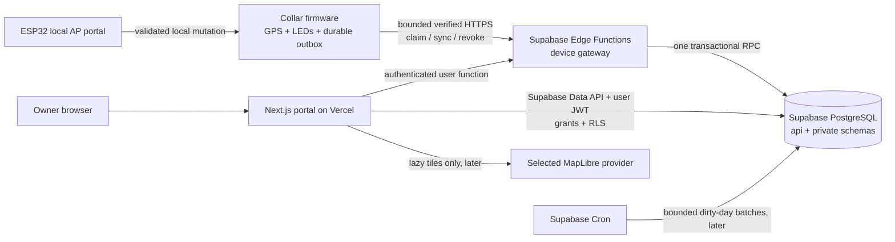

# Dog RGB web platform and collar synchronization — master execution plan

**Status:** Active implementation contract; M0 and M1.1 are complete on reviewed local and CI evidence, and M1.2 is the next pending subphase.

**Last senior review:** 2026-08-24 (America/Bogota).

**Reviewed repository commit:** `c91f1971f72281e7036ac69127dfa81e4ea6c826` (`main`; GitHub CI run [`32797754561`](https://github.com/bultodepapas/Dog-RGB/actions/runs/32797754561) passed every required job).

**Current milestone:** M1A — Auth and protected application shell; M1.1 is complete and M1.2 is next.

**Next executable task:** fill the required M1.2 ownership/evidence fields, then implement only `/signup`, `/login`, `/forgot-password`, `/auth/confirm`, and logout against local Supabase and Mailpit. M1.3–M1.4 remain blocked.

**Current blocker:** none. The workstation's global Node remains `24.12.0`; verification must continue to use the checksum-verified isolated Node `24.18.0` runtime required by M0.1.

**Implementation owner:** ____________________

**Reviewer:** ____________________

**Current release boundary:** no production website, hosted Supabase project, or firmware cloud client is authorized or claimed.

**Supersedes:** the cloud, web, authentication, mapping, and synchronization order in the 2026-08-01 cloud plan and earlier Supabase plans. Git history preserves the former long-form version of this file.

## 1. How to use and maintain this plan

This file is the execution control document. It deliberately does not repeat every SQL column, JSON field, failure code, or flash-layout detail already frozen elsewhere.

Authority order:

1. executable contracts, migrations, and tests for implemented behavior;
2. accepted ADRs for architectural decisions;
3. this plan for current execution state, order, scope, and release gates;
4. current reference documentation for delivered product behavior;
5. older dated plans and Git history, as design history only.

M0.8 is closed: the plan index, architecture, roadmap, testing guide, and ADR
index now agree with the reviewed implementation state. If those documents
drift again, stop the affected phase and reconcile them in the same change.

Primary normative sources:

- device protocol and fixtures: [`contracts/device-v1`](../../contracts/device-v1/README.md);
- architecture decisions: [`docs/adr`](../adr/README.md);
- cloud evidence and operational reports: [`docs/cloud`](../cloud/README.md);
- current product architecture and requirements: [architecture](../architecture.md) and [requirements](../requirements.md);
- current test commands: [testing](../testing.md) and root [`package.json`](../../package.json).

### 1.1 Completion notation

- `- [x] ✅` means complete and supported by committed evidence.
- `- [ ]` means incomplete. Pending work remains unmarked, including code that lacks its required evidence.
- A passing unit test does not close a physical, hosted, security, usability, or human-review gate.
- “Accepted ADR” means an architectural direction is accepted; it does not mean the corresponding product exists.

### 1.2 Required fields for every pending item

Before starting a pending item, fill these fields directly under it:

```text
Owner: ____________________
Target date/window: ____________________
Implementation commit/PR: ____________________
Evidence artifact or command: ____________________
Decision/result: ____________________
```

Rules for future edits:

1. Mark an item complete only in the same change that links its implementation and evidence.
2. Record exact commands, reviewed commit, environment, and pass/fail result. Do not write “tested” without a reproducible artifact.
3. Add only additive migrations. Never rewrite an applied migration to make history look clean.
4. Reopen a checked item if its contract, dependency, hardware, data ownership, or acceptance criterion changes incompatibly.
5. Keep detailed dated output in `docs/cloud` or `test-results`; keep this file focused on state, order, and gates.
6. Re-read the [Supabase breaking-change changelog](https://supabase.com/changelog?types=breaking-change) at the start of each implementation phase and before every hosted deployment.
7. Recheck prices, quotas, regions, and service terms before committing credentials or money.

## 2. Exact product being built

Dog RGB is a local-first ESP32-S3 dog collar with LEDs and GPS. The web platform is an optional extension that lets an owner review synchronized history and safely change a small allowlist of collar settings. It is not a dependency for the collar.

### 2.1 Foundation user journey

The first release is complete when one owner can:

1. create and verify a web account;
2. create one dog profile;
3. generate a short-lived claim code;
4. pair one collar without placing human credentials on the collar;
5. let the collar batch-upload sealed telemetry when known Wi-Fi is available;
6. see last synchronization, coverage, recordings, and an honest route;
7. change brightness on the website;
8. see **Pending** until the physical collar reports the exact version/hash applied;
9. continue using LEDs, GPS, local history, exports, and the AP portal during every cloud outage;
10. revoke/unlink the collar and delete/export private data before production use.

The local proof substitutes the deterministic device simulator for steps 4–8. The physical proof uses one development collar only after the local proof passes.

### 2.2 Foundation scope

- Vercel-hosted Next.js App Router portal.
- Supabase Auth, PostgreSQL, RLS, Edge Functions, and later a bounded Supabase Cron rollup worker.
- Outbound HTTPS request/response synchronization from the collar.
- At-least-once upload with idempotent database effects and acknowledgement only after commit.
- Desired/reported configuration state, initially brightness only.
- Track v3 observations with explicit time/fix quality and coverage gaps.
- Spanish-first UI, message-key ready for English.
- Metric units by default and `America/Bogota` as the initial per-dog IANA timezone.

### 2.3 Explicit non-goals

Do not add these to the critical path:

- live/cellular tracking, live-location language, geofence push alerts, or an always-connected device;
- MQTT, an IoT broker, inbound device sockets, or a Vercel/Supabase WebSocket server;
- Supabase Realtime for the foundation UI;
- public route sharing, social features, family/veterinarian sharing, or multi-tenant administration UI;
- medical, health, sleep, calorie, anxiety, bark, or behavior claims;
- road snapping, Google Roads/Directions, machine learning, or automatic “walk” truth;
- native mobile apps, OTA fleet rollout, multi-region databases, microservices, Kafka, a warehouse, or partitioning without measured need;
- Secure Boot/eFuse/flash-encryption production provisioning on development collars;
- HSM/KMS custody, SIEM, formal penetration tests, or cryptographically signed off-site deletion ledgers as a prerequisite for the private DIY proof.

## 3. Target architecture



### 3.1 Fixed component boundaries

| Component | Owns | Must not own |
| --- | --- | --- |
| Collar firmware | sensing, LEDs, local metrics/history, durable outbox, device credential, time quality, retry/ACK state, local config | account password, Supabase project secret, cloud history queries, analytics truth |
| Local AP portal | Wi-Fi setup, claim-code entry, local settings, local/cloud status and recovery | Internet account login, cloud administration, route sharing |
| Supabase device gateway | custom device authentication, request bounds, version negotiation, one transactional RPC, safe response | long jobs, web UI rendering, partial multi-call transactions |
| PostgreSQL | ownership, grants/RLS, idempotency, raw facts, desired/reported state, derived records | trusting caller-supplied ownership or device identity |
| Vercel portal | authenticated owner experience, server-rendered private data, user mutations | device ingestion, device secrets, durable background jobs |
| Map provider | basemap tiles/styles only | route GeoJSON, dog identity, account identity |

### 3.2 Deliberate transport decision

- [x] ✅ Device transport v1 is bounded HTTPS request/response to a Supabase Edge Function.
- [x] ✅ The ESP32 never writes PostgREST tables directly.
- [x] ✅ Vercel does not proxy device synchronization.
- [x] ✅ The collar remains outbound-only; no public AP endpoint or inbound socket exists.
- [x] ✅ MQTT is deferred. It requires a new ADR and measured evidence of sub-second downlink, fan-out, or battery/polling cost that HTTPS cannot meet.
- [x] ✅ Realtime/WebSockets are excluded from the foundation. Ordinary fetch/refetch is correct for known-Wi-Fi batch synchronization.

## 4. Non-negotiable invariants

| ID | Invariant | Required proof |
| --- | --- | --- |
| INV-01 | Cloud failure never blocks GPS, LEDs, AP recovery, local configuration, history, or export. | Cloud-disabled and outage firmware regressions. |
| INV-02 | Human credentials and Supabase secret keys never enter firmware. | Firmware/bundle/secret scans and pairing tests. |
| INV-03 | Device identity is derived from one unique revocable credential, not a body field, MAC, or project key. | Gateway auth and cross-device attack tests. |
| INV-04 | An upload is acknowledged only after the complete database transaction commits. | Lost-response replay test. |
| INV-05 | Identical replay has one logical effect; the same ID with different immutable content fails closed. | Unique constraints, receipts, concurrent replay tests. |
| INV-06 | Unacknowledged movement data is not silently reclaimed. | Host model plus target power-cut/full-storage evidence. |
| INV-07 | Missing observation is unknown time, never inactivity. | Analytics fixtures and UI copy tests. |
| INV-08 | Telemetry is append-only; LWW is used only for coherent configuration resources. | Schema privileges and conflict matrix. |
| INV-09 | Website “Applied” means the collar reported the exact desired version and body hash. | Simulator and physical desired/reported tests. |
| INV-10 | Precise routes are private by default and absent from normal logs, URLs, analytics, and map-provider requests. | RLS, logging, browser, and network assertions. |
| INV-11 | Track v2 data is not silently destroyed by the v3 upgrade. | Dual-read/export or explicit migration/reset evidence. |
| INV-12 | Every claim shown in the UI is supported by the current sensors and algorithm version. | Copy review and reference-route evidence. |

Any implementation that violates an invariant is rejected even if its happy-path demo works.

## 5. Audited repository state

This snapshot reconciles the plan with Git history and current code. The historical baseline at plan creation was `efc9329`; the reviewed implementation is now at `5fae988`.

### 5.1 Completed and preserved

- [x] ✅ Optional/local-first product boundary, field ownership, privacy vocabulary, and six cloud ADRs are committed.
  - Evidence: [Phase 0 report](../cloud/phase0-execution-report.md), [field matrix](../cloud/phase0-field-matrix.md), ADR-0005 through ADR-0010.
- [x] ✅ Device-v1 schemas, fixtures, problem catalog, HLC vectors, claim/sync/revoke envelopes, and Track v3 compatibility are frozen.
  - Evidence: [`contracts/device-v1`](../../contracts/device-v1/README.md); recorded result 48/48.
  - Source of truth: `contracts/device-v1/schemas`; `tools/sync_edge_contract_schemas.mjs` copies the eight Edge-consumed schemas. `packages/contracts` currently exposes only shared constants and is not the schema authority.
- [x] ✅ Corrected byte-image host outbox candidate and its seven historical destructive regressions exist.
  - Evidence: [storage feasibility](../cloud/phase0-storage-feasibility.md) and [independent-review packet](../cloud/phase0-outbox-review-packet.md); candidate result 51/51.
  - Boundary: implementation-author tests are not independent acceptance.
- [x] ✅ Local Supabase migration stack exists with explicit schemas/grants/RLS, ownership, claims, credentials, sync receipts, raw telemetry, configuration LWW, limits, deletion jobs, retention, and tombstone replay.
  - Evidence: 11 migrations and 12 pgTAP files, introduced across commits `4698f24` through `b48e345`.
- [x] ✅ Four Edge gateways exist: issue claim, device claim, device sync, and device revoke.
  - Evidence: `supabase/functions` and adversarial boundary tests.
  - Hardened Edge RPCs are `api.consume_device_claim_gateway_v1` and `api.device_sync_gateway_v1`; direct inner-function execution is revoked.
- [x] ✅ Deterministic simulator covers claim/upload replay, LWW cases, gateway boundaries, and failure seeds.
  - Evidence: `tools/device-simulator`.
- [x] ✅ Local capacity, deletion, retention, restore, and tombstone tooling has committed evidence.
  - Evidence: [`docs/cloud`](../cloud/README.md).
  - Boundary: this is local engineering evidence, not hosted production/KMS/PITR proof.
- [x] ✅ The Next.js workspace and visual shell are scaffolded with pinned dependencies.
  - Evidence: `apps/portal`.
  - Boundary: the current app has only `RootLayout` and an 18-line placeholder `Home`; it has no Auth flow, product routes, Supabase client usage, or product E2E tests.
- [x] ✅ GitHub CI run `32174453799` at `5fae988` passed all five existing jobs.
  - Boundary: the existing “Portal” CI job tests the embedded AP portal, not `apps/portal`; it does not run `portal:build`.

### 5.2 Incomplete or unproven

- [ ] Independent acceptance of the corrected host outbox candidate.
  - Owner: ____________________
  - Target date/window: ____________________
  - Evidence: `docs/cloud/phase0-outbox-independent-review.md`
- [ ] Target ESP32-S3 outbox/power-cut/timing/wear/energy proof.
  - Owner: ____________________
  - Hardware/harness: ____________________
  - Evidence: `docs/cloud/phase0-esp32-outbox-evidence.md`
- [ ] Product web application: Auth, onboarding, dog/collar routes, Today, History, recording detail, and brightness desired/reported.
  - Owner: ____________________
  - Target date/window: ____________________
  - Evidence: browser E2E artifact plus implementation PR/commit.
- [ ] Firmware Track v3, durable outbox, device identity, time service, common config mutation service, HTTPS sync, and `/cloud` AP page.
  - Owner: ____________________
  - Target hardware revision: ____________________
  - Evidence: host/Wokwi/physical artifacts.
- [ ] Hosted development Supabase/Vercel deployment and parity evidence.
  - Supabase project/region: ____________________
  - Vercel project/region: ____________________
  - Evidence: sanitized deployment manifest.
- [ ] Credentialed Colombia basemap comparison and final provider.
  - Owner/reviewers: ____________________
  - Temporary credential window: ____________________
  - Evidence: sanitized matrix, scorecard, amended ADR-0009.
- [ ] Product analytics and rollup worker.
  - Warning: the current `private.recompute_dirty_summaries_v1` is only a queue-claim/delete placeholder. It does not calculate `api.daily_summaries`.
  - Scheduling it is forbidden until M4 replaces it with a tested recomputation path.
- [ ] Production privacy, export/account deletion, retention activation, SMTP/domain, restore, monitoring, and cost gates.
  - Operational owner: ____________________
  - Production decision date: ____________________
  - Evidence: production-readiness packet.

### 5.3 Verification note from this review

`npm run phase1:check` was attempted on 2026-08-24 and stopped before the suite because the workstation had Node `24.12.0`, while `.node-version` requires `24.18.0`. The repository and successful current CI evidence remain intact, but the next developer must first restore the pinned toolchain and rerun the clean local gates. Environment mismatch is not a reason to weaken or bypass the version check.

M0 implementation resumed later on 2026-08-24 using a checksum-verified isolated Node `24.18.0`, npm `11.6.2`, and Supabase CLI `2.113.0`. On the candidate worktree based on `4ba6e06`:

- `npm run phase1:local -- --clean` passed after replaying all 11 migrations, checking generated `api` types, passing 250 pgTAP assertions, database lint/advisors, repository contracts/lint/types/unit/secret checks, 49 adversarial Edge scenarios, simulator replay/LWW cases, and restore/deletion drills;
- the CI-equivalent `npm ci --ignore-scripts` followed by `npm run portal:build` passed and produced the placeholder `/` plus `/_not-found` routes;
- the deterministic embedded portal assets were regenerated because `package.json` is part of their source fingerprint, then `npm run webui:check` passed.

This is valid local evidence, not GitHub CI evidence. The generated type artifact/checker is committed in `4ba6e06`; M0.6 and M0.8 remain unmarked until the remaining worktree is committed and the resulting workflow URL is recorded below.

## 6. Senior review: changes to the former order

The former plan mixed architecture specification, research, execution status, and production operations across 2,409 lines. It also allowed work to drift into deletion/retention/restore before the owner-facing portal or firmware client existed. This revision makes these corrections:

1. **Local web vertical slice moves before firmware Internet integration.** The existing simulator and local Supabase stack can validate Auth, ownership, claim, reads, and desired/reported UI now.
2. **Map selection no longer blocks device/cloud work.** It blocks only final map integration. MapLibre/provider-neutral route data remain accepted.
3. **Physical outbox evidence is a firmware-foundation exit gate, not a prerequisite to unrelated portal work.** The isolated harness may proceed after independent host review.
4. **Only the selected raw-ring candidate is implemented first on hardware.** LittleFS becomes the fallback if the selected candidate fails; do not build two production candidates in parallel.
5. **The local foundation closes on local reproducibility/security/simulator evidence.** Hosted capacity, PITR, SMTP, KMS custody, and public operations belong to hosted/production phases.
6. **Advanced deletion/tombstone work already committed is preserved but frozen.** Do not continue enterprise custody work before the end-to-end product slice.
7. **The first portal is narrow.** One owner, one dog, one collar, one setting, basic history, no map provider dependency, no Realtime.
8. **The minimal embedded `/cloud` page moves into the first physical slice.** Real claim/upload cannot precede its pairing/status surface.
9. **One gate has one scope.** Map aesthetics cannot block flash correctness; KMS cannot block local Auth; a simulator pass cannot close a physical TLS gate.

## 7. Master implementation order

Only one milestone is the primary critical path at a time. Clearly independent work may run in parallel but cannot silently expand the active milestone.

| Order | Milestone | State | Blocks |
| --- | --- | --- | --- |
| M0 | Reproduce and close the local baseline | Complete ✅ | all new product code |
| M1 | Simulator-driven local web vertical slice | **In progress — M1.2 next** | firmware Internet integration |
| M2 | Offline firmware data foundation and physical outbox proof | Pending; host review may run during M1 | physical cloud slice |
| M3 | Hosted-development deployment and one-collar vertical slice | Pending | analytics/product expansion |
| M4 | Truthful summaries, route UI, and map decision | Pending | product beta |
| M5 | Production opt-in, privacy, and operations | Pending | production use |
| M6 | Evidence-triggered later capabilities | Deferred | nothing in foundation |

## 8. Milestone execution plans

### M0 — Reproduce and close the local baseline

**Goal:** prove that a clean checkout recreates the currently implemented cloud foundation before adding features.

**Expected effort:** 0.5–2 focused days after the required runtime is available.

- [x] ✅ M0.1 Pin and reproduce the toolchain in CI.
  - Node: `24.18.0`
  - npm: `11.6.2`
  - Supabase CLI: `2.113.0`
  - Evidence: `.node-version`, root `package.json`, and GitHub CI run `32174453799`.
- [x] ✅ M0.2 Run `npm ci` from the current clean checkout.
  - Evidence: GitHub CI run `32174453799`.
- [x] ✅ M0.3 Run `npm run phase1:check` as part of the clean local gate.
  - Required: generated AP assets, contract-copy drift, 48/48 contracts, lint, types, unit/simulator/restore tests, secret scan.
  - Evidence: `tools/phase1_local.mjs` and GitHub CI run `32174453799`.
- [x] ✅ M0.4 Run `npm run phase1:local -- --clean`.
  - Required: fresh Supabase start/reset, all migrations, pgTAP, four Edge endpoints, simulator scenarios, restore/deletion/retention checks, localhost-only stack.
  - Evidence: GitHub CI run `32174453799` plus retained local artifacts documented in `docs/cloud`.
- [x] ✅ M0.5 Run `npm run phase1:capacity -- --clean`.
  - Evidence: GitHub CI run `32174453799` and [Phase 1 capacity report](../cloud/phase1-capacity-benchmark.md).
- [x] ✅ M0.6 Add `npm run portal:build` to CI and name the existing embedded-portal job unambiguously.
  - Owner: Codex (implementation); repository owner (merge/acceptance)
  - Target date/window: current M0 change
  - Implementation commit/PR: `1e9bc341890b5b5aa208237e3e1c904462419814`
  - Evidence artifact or command: `npm ci --ignore-scripts`; `npm run portal:build`; GitHub CI run [`32796265255`](https://github.com/bultodepapas/Dog-RGB/actions/runs/32796265255)
  - Decision/result: PASS on 2026-08-24 local evidence and 2026-08-25 CI; the Next.js production build and the separately named embedded AP smoke/visual jobs are green
- [x] ✅ M0.7 Generate/check committed Supabase TypeScript types for the `api` schema.
  - Generated types are a client artifact, not the schema authority; migrations remain authoritative.
  - Regenerate and run a drift check after every schema change.
  - Owner: Codex (implementation); repository owner (acceptance)
  - Target date/window: completed locally 2026-08-24
  - Implementation commit/PR: `4ba6e0615b0e776a3f28bb93319516cc4adbab85`
  - Evidence artifact or command: `npm run cloud:types:generate`; `npm run cloud:types:check`; clean `npm run phase1:local -- --clean`
  - Decision/result: PASS locally and in GitHub CI run [`32796265255`](https://github.com/bultodepapas/Dog-RGB/actions/runs/32796265255); generated artifact is `apps/portal/lib/database.generated.ts`; `.supabase-version` freezes CLI `2.113.0`
- [x] ✅ M0.8 Align `docs/PLANS/README.md`, `docs/architecture.md`, `docs/roadmap.md`, and the ADR index with the reviewed implementation state.
  - Owner: Codex (implementation); repository owner (merge/acceptance)
  - Target date/window: current M0 change
  - Implementation commit/PR: `1e9bc341890b5b5aa208237e3e1c904462419814`
  - Evidence artifact or command: relative-link verification plus `git diff --check`; `docs/testing.md` also documents the new split portal/cloud commands
  - Decision/result: PASS; reviewed documentation is committed on `main`, relative links and `git diff --check` passed, and GitHub CI run [`32796265255`](https://github.com/bultodepapas/Dog-RGB/actions/runs/32796265255) is green

**M0 exit gate:** M0.1–M0.8 are checked on the same reviewed commit; the clean local stack is not exposed beyond localhost; no secret or coordinate appears in logs/artifacts.

### M1 — Simulator-driven local web vertical slice

**Goal:** prove the full owner experience locally before touching firmware networking.

**Expected effort:** 1–2 engineering weeks.

**Hard scope:** simulator, local Supabase, and `apps/portal`; no map provider, Realtime, production SMTP, broad configuration, or firmware cloud code.

#### M1A — Auth and protected application shell

- [x] ✅ M1.1 Add separate browser/server Supabase clients using pinned `@supabase/ssr`.
  - Use publishable key in the browser; no secret key in Vercel/client code.
  - Use PKCE/cookies per current Supabase guidance.
  - Verify identity server-side; do not authorize from `user_metadata`.
  - Owner: Codex (implementation); repository owner (acceptance)
  - Target date/window: completed 2026-08-24 (America/Bogota)
  - Implementation commit/PR: `c91f1971f72281e7036ac69127dfa81e4ea6c826`
  - Evidence artifact or command: 9/9 portal boundary tests; `npm run phase1:check`; `npm run cloud:types:check`; `npm run portal:build`; browser-static secret/JWT scan; Next.js `/_next/mcp` compilation/runtime checks; isolated `agent-browser` smoke against local Supabase CLI `2.113.0`; GitHub CI run [`32797754561`](https://github.com/bultodepapas/Dog-RGB/actions/runs/32797754561)
  - Decision/result: PASS; browser/server clients use only the publishable key and `api` schema, request-scoped cookie refresh propagates non-cache headers, PKCE is supplied by pinned `@supabase/ssr`, and the server identity DTO accepts only signed `authenticated` subject/audience claims without forwarding `user_metadata`
- [ ] M1.2 Implement `/signup`, `/login`, `/forgot-password`, `/auth/confirm`, and logout.
  - Local email must be captured through Mailpit.
  - Test hostile/open redirects, expired links, refresh, logout, and unverified-email claim denial.
  - Evidence: ____________________
- [ ] M1.3 Add a server-only data access layer for authorization and minimal DTOs.
  - Every Server Action independently rechecks authentication and dog role.
  - Private routes/responses are dynamic/private/no-store; do not adopt experimental private caching.
  - Evidence: ____________________
- [ ] M1.4 Implement the signed-in shell and route guard.
  - Initial routes: `/onboarding`, `/app/[dogId]/today`, `/app/[dogId]/history`, `/app/[dogId]/recordings/[recordingId]`, `/app/[dogId]/collars`, `/app/[dogId]/configuration`.
  - Evidence: ____________________

#### M1B — Dog, collar, and claim flow

- [ ] M1.5 Create one dog with validated name, `America/Bogota` default timezone, and metric units.
  - UI fields/copy decision: ____________________
  - Evidence: owner/non-member RLS tests and browser E2E.
- [ ] M1.6 Generate a claim code through the existing authenticated user Edge Function.
  - Raw code shown once; 15-minute TTL; server stores digest only; verified email and owner/editor membership required.
  - Evidence: ____________________
- [ ] M1.7 Pair the simulator by exact replay-safe claim flow.
  - Lost claim response followed by exact retry must link one collar and one credential.
  - Evidence: ____________________

#### M1C — Minimal useful portal

- [ ] M1.8 Today shows dog/collar name, last synchronized time, freshness, coverage/unknown state, and latest recording.
  - If no derived summary exists, show processing/insufficient data; never invent inactivity.
  - Evidence: ____________________
- [ ] M1.9 History lists recordings with `(started_at,id)` keyset pagination; no large offset pagination.
  - Evidence: ____________________
- [ ] M1.10 Recording detail shows metadata plus an accessible point/segment table and provider-neutral plain route preview.
  - No paid basemap or final map styling in M1.
  - Never connect across gaps.
  - Evidence: ____________________
- [ ] M1.11 Configuration exposes brightness only.
  - Submit `base_server_version`.
  - States: `Saved to cloud — waiting for collar`, `Applied on collar`, `Rejected by collar`, `Superseded`, `Stale collar`.
  - Evidence: stale-form plus desired/reported E2E.
- [ ] M1.12 Collar page shows protocol/firmware/capability, last sync, simulator queue diagnostics, and website-side revoke.
  - Never render credentials, claim digests, raw request bodies, or coordinates in diagnostics.
  - Evidence: ____________________

#### M1D — Local end-to-end gate

- [ ] M1.13 Add Playwright coverage for signup/confirm/login, dog creation, claim, upload, history, brightness, report, revoke, and logout against local Supabase.
- [ ] M1.14 Add anonymous, user-B, forged dog/collar/recording ID, raw REST, and raw RPC denial tests.
- [ ] M1.15 Prove response loss after committed sync, exact resend, out-of-order chunks, revoked credential, stale desired version, unknown clock, and server restart.
- [ ] M1.16 Assert browser bundles, unauthenticated/static/cached HTML, console, errors, logs, URLs, analytics, and map-provider requests contain no secret key, device credential, claim code, unauthorized identity, or exact route payload.
  - Authorized, private, bounded recording-detail HTML may contain the owner's route table when required for accessibility; it must remain `private, no-store`.
- [ ] M1.17 Enforce keyboard operation, visible focus, labels, status beyond color, 44 px targets, reduced motion, 320/428/768/1280 px layouts, and no critical accessibility violation.
- [ ] M1.18 Establish the portal performance baseline.
  - No map bundle in M1.
  - Initial authenticated-page JS budget: `<= 180 KiB gzip`, measured and recorded.
  - LCP test profile and result: ____________________

**M1 exit gate:** one documented command starts the clean local stack and portal, then an automated browser plus simulator completes the whole owner journey with cross-user attacks denied and exact replay producing one logical result.

### M2 — Offline firmware data foundation and physical outbox proof

**Goal:** implement storage/time/config foundations without making normal collar behavior depend on the Internet.

**Expected effort:** 3–5 engineering weeks plus hardware-lab availability.

#### M2A — Independent host acceptance

- [ ] M2.1 A reviewer other than the storage-model author runs the clean-tree verifier and reviews all 12 invariants in the [review packet](../cloud/phase0-outbox-review-packet.md).
  - Reviewer: ____________________
  - Reviewed commit: ____________________
  - Commands/results: ____________________
  - Ledger: `docs/cloud/phase0-outbox-independent-review.md`
- [ ] M2.2 All seven destructive regressions remain permanent tests; any high-integrity finding is closed or ADR-0007 is reopened.

M2B cannot begin until M2.1–M2.2 pass. M1 is independent and may continue.

#### M2B — Firmware implementation with cloud disabled

- [ ] M2.3 Add persistent public device UUID, credential record state, boot sequence, point sequence, and chunk sequence.
  - Allocate the native-v3 boot sequence through CRC/generation-protected A/B storage, increment and read back before emitting any v3 record, and reserve zero for legacy data.
  - Never reuse a sequence after an ambiguous/corrupt allocation. Define fail-closed recovery and integer-exhaustion behavior.
- [ ] M2.4 Implement the frozen Track v3 codec and observation path.
  - Moving cadence nominally 5 seconds; trusted stationary heartbeat nominally 60 seconds.
  - Invalid/no-fix intervals become explicit gaps, never fake coordinates.
  - Preserve v2 read/export until acknowledged migration or explicit reset.
- [ ] M2.5 Implement the selected raw-partition sealed-chunk outbox.
  - Immutable sealed chunks; mutable tail only.
  - Exact manifest-bound ACK evidence; reclaim only fully acknowledged chunks.
  - Reserve loss marker/summary space under pressure.
  - LittleFS is implemented only if the selected candidate fails its gate.
- [ ] M2.6 Implement time quality and anchors.
  - `UNKNOWN < APPROXIMATE_PERSISTED < SERVER_ANCHORED < SNTP_SYNCED < GNSS_TRUSTED`.
  - Persist UTC only with source/quality; identity/order never depends only on wall-clock time.
  - Before first verified TLS, require a plausible GNSS time, bounded SNTP result, or still-valid persisted last-good date. `SERVER_ANCHORED` cannot bootstrap certificate validation because it is learned only after HTTPS succeeds.
  - Do not send claim codes or credentials until hostname, chain, and certificate-date validation can pass. `/cloud` must show `Waiting for valid time` rather than offering an insecure fallback.
- [ ] M2.7 Implement one common config mutation/validation/commit service.
  - AP and future cloud paths cannot call mutable config/save independently.
  - Persist value, HLC, mutation ID, desired/reported version/hash atomically.
- [ ] M2.8 Keep all cloud networking behind a disabled-by-default build/runtime boundary.
- [ ] M2.9 Preserve embedded portal, AP recovery, GPS, metrics, sessions, exports, scenes, LEDs, and loop timing.

#### M2C — Host/Wokwi/physical acceptance

- [ ] M2.10 Host tests cover codec, A/B recovery, exact ACK/reclaim, corruption, full storage, v2 preservation, HLC, config rollback, and cuts around boot-sequence allocation.
- [ ] M2.11 On the target XIAO ESP32-S3, run at least 10,000 seal/ACK/reclaim cycles and at least 1,000 asynchronous reset/power cuts across all write boundaries.
- [ ] M2.12 Measure p50/p95/p99 recovery, erase distribution, heap/largest block, watchdog margin, GPS gaps, LED jitter, energy, and full-storage behavior.
- [ ] M2.13 Retain sanitized machine-readable traces and hashes.
  - Hardware revision: ____________________
  - Harness/controller: ____________________
  - Firmware commit: ____________________
  - Evidence: `docs/cloud/phase0-esp32-outbox-evidence.md`

**M2 exit gate:** the chosen physical outbox passes without acknowledged loss or silent unacknowledged reclaim; legacy data remains usable; cloud-disabled firmware remains within accepted timing/storage/heap/power budgets.

### M3 — Hosted development and one physical collar

**Goal:** validate real TLS, hosted parity, and one-collar end-to-end behavior without production data or public launch.

**Expected effort:** 2–4 engineering weeks.

#### M3A — Environment and deployment decisions

- [ ] M3.1 Select hosted-development Supabase region from measured collar/browser latency.
  - Candidate regions: `sa-east-1` and nearest suitable North America region.
  - Selected region: ____________________
  - Test networks/p50/p95 evidence: ____________________
- [ ] M3.2 Configure a dedicated hosted-development Supabase project.
  - Project ref: ____________________
  - Data API exposed schemas: ____________________
  - Exact migration list/hash: ____________________
  - Security/performance advisor evidence: ____________________
- [ ] M3.3 Configure Vercel Preview to use hosted development only.
  - Vercel function region: ____________________
  - Preview → development isolation evidence: ____________________
  - Production secrets/data must be absent.
- [ ] M3.4 Deploy migrations and Edge Functions from committed artifacts; never edit hosted schema in the Dashboard.
- [ ] M3.5 Verify explicit grants separately from RLS for every intended REST/RPC call and denial.
- [ ] M3.6 Verify the API-key model.
  - Browser: `sb_publishable_...`
  - Controlled Edge/backend only: `sb_secret_...`
  - Postgres role `service_role` is not the name of a firmware/browser credential.
  - Evidence: ____________________

#### M3B — Firmware HTTPS client

- [ ] M3.7 Add claim/sync/revoke client using verified hostname/certificate chain and the ESP x509 certificate bundle; `setInsecure()` or common-name skipping is forbidden.
- [ ] M3.8 Bound DNS, connect, TLS, send, response, JSON, and total deadlines independently.
- [ ] M3.9 Only one request is in flight; use bounded batches, exponential backoff with full jitter, and exact retry instructions.
  - Freeze `Retry-After` to numeric delta-seconds only; require equality with bounded JSON `retry_after_seconds` (`1..86400`).
  - On missing, mismatched, invalid, HTTP-date, or out-of-range values, retain the exact batch and use normal bounded jitter.
  - Update the device-v1 contract/fixtures in the same change so server, simulator, and firmware cannot interpret this differently.
- [ ] M3.10 Persist selected request ID/body until matching schema-valid post-commit ACK is durable.
- [ ] M3.11 Add `/cloud` to the AP portal for claim, freshness, queue, safe error, retry, sync-now, and guarded unlink.
  - Add its own generated-asset gzip budget.
  - Never expose the device secret or Authorization value.

#### M3C — Physical vertical slice and fault gate

- [ ] M3.12 Pair one development collar through the hosted claim flow.
- [ ] M3.13 Upload one real sealed v3 fixture, lose the response, resend identically, and observe one database result.
- [ ] M3.14 Commit web brightness, sync it to the collar, apply atomically, and report the exact version/hash.
- [ ] M3.15 Use the relay/MOSFET harness for collar power cuts around local seal, request serialization/persistence, ACK write, config apply, and config report boundaries.
- [ ] M3.16 Use a controllable gateway/proxy failpoint to reset/drop the connection after RPC commit but before response delivery.
  - Retain receipt/log evidence that the server committed before the induced loss; the retry must return one logical result.
- [ ] M3.17 Exercise Wi-Fi loss, DNS failure, captive portal, wrong hostname/CA, unset/far-past/far-future/persisted-stale clocks, revoked credential, 429, 5xx, malformed/truncated response, full outbox, and AP edit during sync.
- [ ] M3.18 Repeat cross-account REST/RPC/URL attacks on the hosted-development project.
- [ ] M3.19 Record hosted p95 Edge/RPC latency, bytes/sync, database bytes/point, egress, logs, and estimated monthly cost for 1/5/10 collars.
- [ ] M3.20 Measure the physical network/resource coexistence gate.
  - Capture free/minimum heap and largest allocatable block through DNS, SNTP, TLS, request serialization, and response parsing.
  - Capture GNSS sentence loss/checksum/fix continuity, owner-loop maxima, LED jitter, AP-client coexistence, and sync energy/time.
  - Evidence/hardware profile: ____________________

**M3 exit gate:** one physical collar survives every fault point with no logical duplicate, acknowledged-data loss, false Applied state, credential leak, cross-user access, or local-feature regression. This is the go/no-go decision for product expansion.

### M4 — Truthful summaries, route product, and map decision

**Goal:** turn reliable data into a useful but honest dog-collar experience.

**Expected effort:** 3–5 engineering weeks.

#### M4A — Analytics and coverage

- [ ] M4.1 Replace the current queue-delete placeholder with versioned pure summary logic for observed, moving, stationary/inactive, unknown, distance, average moving speed, and filtered maximum.
- [ ] M4.2 Keep device-reported and cloud-derived metrics separate; show discrepancies diagnostically.
- [ ] M4.3 Process dirty days with bounded Supabase Cron batches.
  - Scheduling remains forbidden until M4.1 tests prove summary upsert and dirty-row removal occur in one transaction, so every failure preserves/retries the dirty row.
  - Cadence, recommended 5–15 minutes for DIY use: ____________________
  - Batch limit/statement timeout: ____________________
  - Evidence that jobs stay under platform limits: ____________________
- [ ] M4.4 Validate reference stationary, moving, poor-fix, gap, timezone, 23/25-hour day, recompute, and algorithm-upgrade fixtures.
- [ ] M4.5 Do not enable “estimated movement phases” until field validation passes; otherwise retain moving/stationary/unknown.

#### M4B — Provider decision, now on the correct dependency branch

- [ ] M4.6 Run the prepared identical credentialed Stadia/MapTiler Colombia matrix with temporary origin-restricted credentials.
- [ ] M4.7 Prove unauthorized origins fail and retained artifacts contain no key or route coordinates.
- [ ] M4.8 Complete two independent scorecards or one owner acceptance plus one technical review.
  - Reviewers: ____________________
  - Provider selected: ____________________
  - Current terms/cost snapshot: ____________________
  - Amended ADR-0009: ____________________

This gate blocks M4 map integration only. It never blocks M1, M2, or M3.

#### M4C — Product UI

- [ ] M4.9 Implement the route map lazily on recording detail using MapLibre and provider-neutral GeoJSON.
- [ ] M4.10 Render explicit segments/gaps, start/end, quality, speed, legend, chart/timeline linkage, and a keyboard/table alternative.
- [ ] M4.11 Never send route GeoJSON in tile-provider query parameters; disclose that the provider still sees viewport/IP.
- [ ] M4.12 Expand Today/History/detail only with metrics that pass M4A.
- [ ] M4.13 Run browser, responsive, visual, accessibility, privacy, WebGL/provider-failure, and cold-mobile performance suites.

**M4 exit gate:** every displayed metric names or implies the correct evidence/coverage; missing data is visible; route gaps are not connected; selected-provider evidence is committed; UI budgets and accessibility gates pass.

### M5 — Production opt-in, privacy, and operations

**Goal:** make an explicit, reversible decision to retain real private GPS data beyond a lab proof.

**Expected effort:** 2–4 engineering weeks plus external service setup.

- [ ] M5.1 Owner explicitly authorizes production operation.
  - Owner/date: ____________________
  - Intended users/collars: ____________________
  - Personal/noncommercial status: ____________________
- [ ] M5.2 Select production Supabase/Vercel/map tiers, regions, budgets, and alerts from measured M3/M4 data.
- [ ] M5.3 Configure stable website and device API domains before field firmware is treated as durable.
  - Website domain: ____________________
  - Device API domain: ____________________
- [ ] M5.4 Configure custom SMTP, exact redirect/origin allowlists, SPF/DKIM/DMARC, and recovery tests.
  - Provider/from domain: ____________________
- [ ] M5.5 Finalize opt-in and retention.
  - Raw route retention: ____________________
  - Summary retention: ____________________
  - Consent/copy reviewer: ____________________
- [ ] M5.6 Implement and test owner export, strong-confirmation dog/account deletion, active access closure, bounded purge, and documented backup lag.
- [ ] M5.7 Activate retention scheduling only after M5.5–M5.6 pass.
- [ ] M5.8 Restore a managed backup into a distinct hosted project.
  - Confirm paid-plan physical-backup eligibility; the feature is currently Beta.
  - Immediately disable copied `pg_cron`, `pg_net`, and other outbound jobs in the clone to prevent side effects.
  - Redeploy/reconfigure committed Edge Functions, Auth/API keys, Realtime/project settings, extensions, and any Storage settings/objects that the database-only restore does not copy.
  - Then verify Auth linkage, grants/RLS, functions, row/hash manifests, config heads, and deletion replay.
  - If restore-to-new-project is unavailable, execute and document the logical-restore fallback instead.
  - Evidence: [Supabase restore-to-new-project procedure](https://supabase.com/docs/guides/platform/clone-project) plus project-specific run artifact.
- [ ] M5.9 Run credential rotation/revocation, outage, rollback, quota, cost/load, DNS/certificate, and incident drills.
- [ ] M5.10 Publish privacy/terms/support/runbooks appropriate to actual private DIY use.

Optional hardening that does not block the private DIY release unless the owner changes the risk model:

- [ ] NVS/flash encryption and Secure Boot provisioning/recovery on dedicated hardware.
- [ ] Device request signatures, mTLS, or secure element.
- [ ] KMS/HSM-backed signed off-site deletion custody.
- [ ] SIEM/log drain, WAF, formal penetration test, or multi-region recovery.

**M5 exit gate:** production is not declared until every mandatory M5.1–M5.10 item is checked with a named operational owner and current evidence.

### M6 — Later capabilities with measured triggers

Each item requires a new ADR, privacy/cost/threat review, and independent acceptance gate.

- [ ] MQTT/broker: only after measured sub-second downlink, fan-out, or polling-energy need.
- [ ] Supabase Realtime: only after measured UX need; browser connects directly, fetches authoritative state after reconnect, and treats events as invalidation hints.
- [ ] Additional safe configuration resources: one resource at a time after brightness has stable physical evidence.
- [ ] Family/viewer sharing.
- [ ] Goals and weekly/monthly trends.
- [ ] Privacy-preserving heatmaps.
- [ ] Home/geofence cloud settings and alerts.
- [ ] Google Maps adapter or self-hosted PMTiles.
- [ ] Signed OTA with staged rollback.
- [ ] IMU hardware and validated classifier.
- [ ] Cellular/live architecture with new hardware and power plan.

## 9. Web implementation contract

### 9.1 Data access

- Server Components may read private data through the user's Supabase SSR client and RLS.
- Server Components must not call the portal's own Route Handlers for data.
- Server Actions/Route Handlers must verify authentication and authorization inside every action.
- Use a server-only data access layer and minimal DTOs; page visibility is not authorization.
- Browser code contains only publishable configuration. Secret keys and device credentials are forbidden from `NEXT_PUBLIC_*`.
- All exposed-schema tables have explicit grants and RLS in the same migration.
- Views exposed to users use `security_invoker = true`.
- User-visible lists use keyset pagination. Track points load only on one recording detail.
- Do not use Realtime to compensate for missing query/state design.

### 9.2 UI language and truth

Use:

- `Recording` or `session`, not automatic `walk`;
- `Last synchronized`, not `live` or `current location`;
- `Observed stationary`, not sleep/rest/health;
- `Unknown`, not inactive, for missing coverage;
- `Filtered maximum speed`, not raw maximum;
- `Estimated movement phase` only after an algorithm gate.

### 9.3 Initial routes

```text
/signup
/login
/forgot-password
/auth/confirm
/onboarding
/app/[dogId]/today
/app/[dogId]/history
/app/[dogId]/recordings/[recordingId]
/app/[dogId]/collars
/app/[dogId]/configuration
```

Account/privacy/export/delete routes are added in M5. Sharing/admin routes are not foundation work.

### 9.4 Visual and accessibility boundary

Keep the existing Dog RGB identity: black/near-black surfaces, phosphor green, gold warning, magenta destructive/failure, compact terminal labels, restrained glow, strong focus, and 3 px radii. The route is evidence, not decoration.

Mandatory:

- 320 px minimum width and 44 px touch targets;
- text/icon/pattern in addition to color;
- keyboard-complete flows and skip/landmark structure;
- reduced motion and no continuous CRT animation;
- semantic/table alternative for charts/maps;
- no card mosaic, glass UI, generic dashboard clutter, or map/scanline interference.

## 10. Device and database contract summary

The exact wire contract remains in `contracts/device-v1`. The following boundaries are reminders, not alternative schemas:

- stable observation identity: `(collar_id, boot_sequence, point_sequence)`;
- stable chunk identity: `(collar_id, boot_sequence, chunk_sequence)`;
- stable request identity plus content hash for exact replay;
- device/body IDs are compared but authority is derived from the credential;
- UTC may be null/unknown; `received_at` is server-generated;
- coordinates/speed remain exact bounded integers at the wire boundary;
- requests/responses remain bounded by the frozen protocol limits;
- one database function is the commit/ACK boundary;
- transaction work is short and contains no external network call;
- foreign keys and RLS predicate columns are indexed;
- exact ingest uses uniqueness/`ON CONFLICT` semantics, never check-then-insert;
- update policies have matching select policy and both `USING`/`WITH CHECK`;
- security-definer code is exceptional, schema-qualified, empty-search-path, and public-execute-revoked;
- execute is granted only to explicitly required roles: device gateway wrappers are `service_role`-only, while authenticated helpers/user RPCs must enforce `auth.uid()`/ownership internally and return the minimum data;
- direct browser writes to telemetry, config heads, credentials, receipts, and private tables are denied.

## 11. Test and release discipline

### 11.1 Required layers

| Layer | Minimum evidence |
| --- | --- |
| Contract | Schemas, positive/negative fixtures, byte/hash vectors, problem catalog, compatibility matrix |
| Database | Fresh migrations, pgTAP, grants/RLS, concurrent replay, ownership attacks, advisors |
| Edge | Bounds, custom auth, safe errors, one RPC, lost-response replay, logs |
| Simulator | Full owner/device flow, faults, clocks, revoke, desired/reported, deterministic seeds |
| Portal | Build, unit, Playwright against local Supabase, accessibility, privacy, responsive/performance |
| Firmware host/Wokwi | Storage/time/config/network state-machine behavior and local regression |
| Physical | Power cuts, TLS, heap, GNSS/LED timing, wear, energy, AP coexistence |
| Hosted development | Migration parity, real Auth/email boundary, RLS attacks, latency/cost |
| Production | Restore, export/delete/retention, rotation, outage, rollback, DNS/cert, quotas |

### 11.2 No substitute evidence

- Simulator evidence does not close physical hardware/TLS gates.
- Local Supabase does not prove hosted limits, TLS, backups, email, or network latency.
- Hosted happy paths do not replace clean migration/reset evidence.
- RLS UI tests do not replace raw REST/RPC attacks.
- Test counts do not replace independent review where explicitly required.
- A map screenshot does not prove key restriction, privacy, or accessibility.
- A signed tombstone does not prove account deletion UX or managed restore.

## 12. Research investigations applied in this revision

Research was refreshed on 2026-08-24 using primary/official sources. The implementation consequence is part of the plan; links must be revalidated when their phase begins.

| # | Investigation | Finding | Applied decision |
| --- | --- | --- | --- |
| R1 | ESP32 HTTP/TLS | ESP-IDF provides HTTPS, certificate-bundle verification, and optional connection reuse. | Keep outbound HTTPS; validate hostname/chain; connection reuse is an optimization only. [ESP HTTP Client](https://docs.espressif.com/projects/esp-idf/en/latest/esp32s3/api-reference/protocols/esp_http_client.html) |
| R2 | MQTT reliability | MQTT QoS 1 is also at least once; broker sessions/outboxes do not remove application idempotency. | Do not add MQTT to the MVP. [MQTT 5.0](https://docs.oasis-open.org/mqtt/mqtt/v5.0/mqtt-v5.0.html), [ESP-MQTT](https://docs.espressif.com/projects/esp-idf/en/v5.5.4/esp32/api-reference/protocols/mqtt.html) |
| R3 | Intermittent storage | NVS suits small stable values, not continuously growing logs; power-loss and wear behavior require a dedicated storage design. | Use NVS for identity/config metadata and the selected raw partition for the sealed outbox; physical cuts remain mandatory. [NVS](https://docs.espressif.com/projects/esp-idf/en/latest/esp32/api-reference/storage/nvs_flash.html), [wear levelling](https://docs.espressif.com/projects/esp-idf/en/stable/esp32/api-reference/storage/wear-levelling.html) |
| R4 | Idempotent ingest | PostgreSQL unique constraints and `INSERT ... ON CONFLICT` are the durable dedupe primitives; HTTP retries and `Retry-After` are normal semantics. | Keep exact request/chunk IDs, hashes, transactional receipts, and safe replay. [Unique indexes](https://www.postgresql.org/docs/current/indexes-unique.html), [INSERT](https://www.postgresql.org/docs/current/sql-insert.html), [RFC 9110](https://www.rfc-editor.org/rfc/rfc9110.html) |
| R5 | Device time | ESP monotonic time resets with boot/deep-sleep boundaries; wall time can be absent or drift. | Identity/order uses boot/sequence; UTC carries quality and may be unknown. [ESP timer](https://docs.espressif.com/projects/esp-idf/en/latest/esp32/api-reference/system/esp_timer.html), [system time](https://docs.espressif.com/projects/esp-idf/en/stable/esp32s3/api-reference/system/system_time.html) |
| R6 | Desired/reported state | Mature IoT designs separate desired from reported state and version updates for disconnected devices. | Preserve the small versioned desired/reported pattern; no generic command bus in the foundation. [AWS Device Shadow](https://docs.aws.amazon.com/iot/latest/developerguide/device-shadow-document.html) |
| R7 | Supabase local workflow | Official guidance commits config/migrations/seed, proves `db reset`, and combines pgTAP with client tests; the local stack is not production hardened. | Clean local stack and simulator/browser gate before hosted or firmware Internet work. [Local workflow](https://supabase.com/docs/guides/local-development/cli-workflows), [testing](https://supabase.com/docs/guides/database/testing) |
| R8 | Data API exposure change | New hosted projects no longer automatically expose new `public` tables by default; existing-project enforcement is scheduled for 2026-10-30. Custom exposed schemas still require an explicit exposure/grant audit, and grants remain separate from RLS. | Explicit exposed-schema inventory, grants, RLS, and hosted denial tests. [Breaking change](https://supabase.com/changelog/45329-breaking-change-tables-not-exposed-to-data-and-graphql-api-automatically), [Data API security](https://supabase.com/docs/guides/api/securing-your-api) |
| R9 | Supabase keys and custom Edge auth | Publishable keys are public identifiers; secret keys bypass RLS. Device credentials require custom handler auth when platform JWT verification is disabled. | Publishable browser key only; secret Edge/backend only; unique device bearer checked before privileged access. [API keys](https://supabase.com/docs/guides/getting-started/api-keys), [Edge auth headers](https://supabase.com/docs/guides/functions/auth-headers), [securing functions](https://supabase.com/docs/guides/functions/auth) |
| R10 | RLS performance/security | Exposed tables require RLS; predicate/FK indexes and stable helper patterns materially affect large telemetry queries. | Preserve explicit grants, indexed membership lookups, `(select auth.uid())`, advisor/query-plan gates, and keyset pagination. [RLS](https://supabase.com/docs/guides/database/postgres/row-level-security), [RLS performance](https://supabase.com/docs/guides/troubleshooting/rls-performance-and-best-practices-Z5Jjwv) |
| R11 | Edge/serverless limits | Supabase Edge Functions and Vercel Functions are bounded request runtimes, not durable socket/job hosts. | Thin Edge gateway, one short RPC, Supabase Cron for bounded DB work, no Vercel device ingress or WebSocket server. [Supabase limits](https://supabase.com/docs/guides/functions/limits), [Vercel Function limits](https://vercel.com/docs/functions/limitations), [Vercel WebSocket limits](https://vercel.com/docs/limits#websockets) |
| R12 | Realtime trade-off | Supabase documents Postgres Changes as simpler but less scalable than Broadcast. Realtime delivery is connection-based; Postgres Changes is not a durable queue, and Broadcast Replay retains only a bounded window. | Fetch/refetch foundation; add Realtime only on measured UX need and never as truth. [Realtime subscriptions](https://supabase.com/docs/guides/realtime/subscribing-to-database-changes), [Broadcast Replay](https://supabase.com/docs/guides/realtime/broadcast#broadcast-replay) |
| R13 | Next.js authorization | Current Next.js guidance recommends centralized server-side data access and authorization inside mutations. Supabase SSR remains version-sensitive. | Server-only DAL, per-action verification, pinned SSR packages, full auth regression on upgrades. [Next.js authentication](https://nextjs.org/docs/app/guides/authentication), [mutating data](https://nextjs.org/docs/app/getting-started/mutating-data), [Supabase SSR](https://supabase.com/docs/guides/auth/server-side) |
| R14 | Scheduling | Vercel Hobby Cron is too coarse for near-term rollups; Supabase Cron publishes concurrency/duration guidance. | Use a measured 5–15 minute Supabase Cron batch in M4, not one-minute work by assumption and not Vercel Cron. [Vercel Cron](https://vercel.com/docs/cron-jobs/usage-and-pricing), [Supabase Cron](https://supabase.com/docs/guides/cron) |
| R15 | Device hardening | Unique identity and controlled configuration are baseline; NVS/flash encryption and Secure Boot add provisioning/recovery constraints. | Unique revocable credential/TLS are mandatory; irreversible hardware hardening stays optional after the physical proof. [NISTIR 8259A](https://csrc.nist.gov/pubs/ir/8259/a/final), [ESP security](https://docs.espressif.com/projects/esp-idf/en/latest/esp32/security/security.html) |

## 13. Definition of foundational success

The web/collar foundation is complete only when all are checked:

- [ ] The clean local command recreates Supabase, runs migrations/tests/functions, starts the portal, and completes the simulator/browser owner journey.
- [ ] Anonymous and user B cannot read or mutate user A's dog, collar, telemetry, recording, or configuration through UI, REST, RPC, or crafted IDs.
- [ ] A one-time claim pairs one collar without any human or Supabase secret in firmware.
- [ ] A physical collar uploads sealed v3 data over verified TLS.
- [ ] Lost request/response and exact replay create no logical duplicate or acknowledged-data loss.
- [ ] Unacknowledged detail is never silently reclaimed; unavoidable loss is persisted and shown as unknown coverage.
- [ ] AP and website brightness mutations converge under the frozen resource/HLC/version rules.
- [ ] Website Applied status is based on exact physical reported version/hash.
- [ ] Power failure during config apply restores the last verified config.
- [ ] Local collar operation remains correct with cloud disabled and during every service outage.
- [ ] Today/history/detail distinguish observed, moving, stationary/inactive, and unknown truthfully.
- [ ] Route gaps, low quality, legacy limitations, and last synchronization are visible.
- [ ] Portal meets keyboard, mobile, reduced-motion, privacy, and performance gates.
- [ ] Production use, if authorized, passes export/delete/retention/restore/revocation/cost/domain/SMTP operations.
- [ ] Current reference docs describe delivered behavior and this plan links exact release evidence.

The governing rule remains: **the collar is useful alone; the cloud is a private, idempotent extension; and the portal may show only what the current hardware and retained observations can support.**
