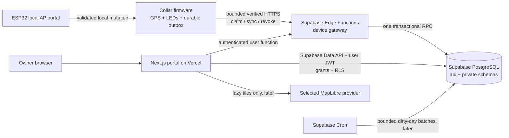

# Dog RGB web platform and collar synchronization — master execution plan

**Status:** Active implementation contract; M0 and M1.1–M1.10 are complete on reviewed local and CI evidence, M1.11–M1.12 are complete on reviewed local evidence, and M1.13 is next. Remote CI was intentionally not run or inspected for M1.11–M1.12.

**Last senior review:** 2026-08-25 (America/Bogota).

**Reviewed repository baseline:** `17f59a597a9725d1b450762ccba5f15eb4c6af86` (`main`; M1.12 is the local commit created with this plan update and its hash is recorded in Git history). The last inspected remote evidence remains M1.10 GitHub CI run [`32911228533`](https://github.com/bultodepapas/Dog-RGB/actions/runs/32911228533); no M1.11 or M1.12 CI claim is made.

**Current milestone:** M1D — Local end-to-end gate; M1.1–M1.12 are complete and M1.13 is next.

**Next executable task:** complete only M1.13: add one deterministic Playwright project that starts from a clean local Supabase reset, uses Mailpit and the existing device simulator, and proves the complete owner journey from signup through logout. Build reusable local setup/cleanup and evidence capture first; then automate signup/confirm/login, dog creation, one-time claim, simulated claim/upload, Today/History/detail, brightness desired→reported convergence, exact-collar revoke, and logout/back protection. The test must assert persisted checkpoints instead of sleeping, isolate its identifiers, redact ephemeral claim/device material, and leave the stack reusable after failure. Do not absorb M1.14 adversarial coverage, M1.15 fault injection, M1.16 privacy scan, M1.17 full accessibility matrix, M1.18 performance budgets, hosted deployment, or firmware work.

**Current blocker:** no external blocker. Before M1.13 implementation, inventory the repository's current browser tooling, local service readiness endpoints, Mailpit message API, simulator inputs/outputs, deterministic seed utilities, and teardown rules; record the exact Playwright version and browser installation path without adding a second browser framework. The workstation's global Node remains `24.12.0`; verification must continue to use the checksum-verified isolated Node `24.18.0` runtime required by M0.1.

**Implementation owner:** Codex

**Reviewer:** ____________________

**Current release boundary:** no production website, hosted Supabase project, or firmware cloud client is authorized or claimed.

**Supersedes:** the cloud, web, authentication, mapping, and synchronization order in the 2026-08-01 cloud plan and earlier Supabase plans. Git history preserves the former long-form version of this file.

## 1. How to use and maintain this plan

This file is the execution control document. It deliberately does not repeat every SQL column, JSON field, failure code, or flash-layout detail already frozen elsewhere.

Authority order:

1. executable contracts, migrations, and tests for implemented behavior;
2. accepted ADRs for architectural decisions;
3. this plan for current execution state, order, scope, and release gates;
4. current reference documentation for delivered product behavior;
5. older dated plans and Git history, as design history only.

M0.8 is closed: the plan index, architecture, roadmap, testing guide, and ADR
index now agree with the reviewed implementation state. If those documents
drift again, stop the affected phase and reconcile them in the same change.

Primary normative sources:

- device protocol and fixtures: [`contracts/device-v1`](../../contracts/device-v1/README.md);
- architecture decisions: [`docs/adr`](../adr/README.md);
- cloud evidence and operational reports: [`docs/cloud`](../cloud/README.md);
- current product architecture and requirements: [architecture](../architecture.md) and [requirements](../requirements.md);
- current test commands: [testing](../testing.md) and root [`package.json`](../../package.json).

### 1.1 Completion notation

- `- [x] ✅` means complete and supported by committed evidence.
- `- [ ]` means incomplete. Pending work remains unmarked, including code that lacks its required evidence.
- A passing unit test does not close a physical, hosted, security, usability, or human-review gate.
- “Accepted ADR” means an architectural direction is accepted; it does not mean the corresponding product exists.

### 1.2 Required fields for every pending item

Before starting a pending item, fill these fields directly under it:

```text
Owner: ____________________
Target date/window: ____________________
Implementation commit/PR: ____________________
Evidence artifact or command: ____________________
Decision/result: ____________________
```

Rules for future edits:

1. Mark an item complete only in the same change that links its implementation and evidence.
2. Record exact commands, reviewed commit, environment, and pass/fail result. Do not write “tested” without a reproducible artifact.
3. Add only additive migrations. Never rewrite an applied migration to make history look clean.
4. Reopen a checked item if its contract, dependency, hardware, data ownership, or acceptance criterion changes incompatibly.
5. Keep detailed dated output in `docs/cloud` or `test-results`; keep this file focused on state, order, and gates.
6. Re-read the [Supabase breaking-change changelog](https://supabase.com/changelog?types=breaking-change) at the start of each implementation phase and before every hosted deployment.
7. Recheck prices, quotas, regions, and service terms before committing credentials or money.

## 2. Exact product being built

Dog RGB is a local-first ESP32-S3 dog collar with LEDs and GPS. The web platform is an optional extension that lets an owner review synchronized history and safely change a small allowlist of collar settings. It is not a dependency for the collar.

### 2.1 Foundation user journey

The first release is complete when one owner can:

1. create and verify a web account;
2. create one dog profile;
3. generate a short-lived claim code;
4. pair one collar without placing human credentials on the collar;
5. let the collar batch-upload sealed telemetry when known Wi-Fi is available;
6. see last synchronization, coverage, recordings, and an honest route;
7. change brightness on the website;
8. see **Pending** until the physical collar reports the exact version/hash applied;
9. continue using LEDs, GPS, local history, exports, and the AP portal during every cloud outage;
10. revoke/unlink the collar and delete/export private data before production use.

The local proof substitutes the deterministic device simulator for steps 4–8. The physical proof uses one development collar only after the local proof passes.

### 2.2 Foundation scope

- Vercel-hosted Next.js App Router portal.
- Supabase Auth, PostgreSQL, RLS, Edge Functions, and later a bounded Supabase Cron rollup worker.
- Outbound HTTPS request/response synchronization from the collar.
- At-least-once upload with idempotent database effects and acknowledgement only after commit.
- Desired/reported configuration state, initially brightness only.
- Track v3 observations with explicit time/fix quality and coverage gaps.
- Spanish-first UI, message-key ready for English.
- Metric units by default and `America/Bogota` as the initial per-dog IANA timezone.

### 2.3 Explicit non-goals

Do not add these to the critical path:

- live/cellular tracking, live-location language, geofence push alerts, or an always-connected device;
- MQTT, an IoT broker, inbound device sockets, or a Vercel/Supabase WebSocket server;
- Supabase Realtime for the foundation UI;
- public route sharing, social features, family/veterinarian sharing, or multi-tenant administration UI;
- medical, health, sleep, calorie, anxiety, bark, or behavior claims;
- road snapping, Google Roads/Directions, machine learning, or automatic “walk” truth;
- native mobile apps, OTA fleet rollout, multi-region databases, microservices, Kafka, a warehouse, or partitioning without measured need;
- Secure Boot/eFuse/flash-encryption production provisioning on development collars;
- HSM/KMS custody, SIEM, formal penetration tests, or cryptographically signed off-site deletion ledgers as a prerequisite for the private DIY proof.

## 3. Target architecture



### 3.1 Fixed component boundaries

| Component | Owns | Must not own |
| --- | --- | --- |
| Collar firmware | sensing, LEDs, local metrics/history, durable outbox, device credential, time quality, retry/ACK state, local config | account password, Supabase project secret, cloud history queries, analytics truth |
| Local AP portal | Wi-Fi setup, claim-code entry, local settings, local/cloud status and recovery | Internet account login, cloud administration, route sharing |
| Supabase device gateway | custom device authentication, request bounds, version negotiation, one transactional RPC, safe response | long jobs, web UI rendering, partial multi-call transactions |
| PostgreSQL | ownership, grants/RLS, idempotency, raw facts, desired/reported state, derived records | trusting caller-supplied ownership or device identity |
| Vercel portal | authenticated owner experience, server-rendered private data, user mutations | device ingestion, device secrets, durable background jobs |
| Map provider | basemap tiles/styles only | route GeoJSON, dog identity, account identity |

### 3.2 Deliberate transport decision

- [x] ✅ Device transport v1 is bounded HTTPS request/response to a Supabase Edge Function.
- [x] ✅ The ESP32 never writes PostgREST tables directly.
- [x] ✅ Vercel does not proxy device synchronization.
- [x] ✅ The collar remains outbound-only; no public AP endpoint or inbound socket exists.
- [x] ✅ MQTT is deferred. It requires a new ADR and measured evidence of sub-second downlink, fan-out, or battery/polling cost that HTTPS cannot meet.
- [x] ✅ Realtime/WebSockets are excluded from the foundation. Ordinary fetch/refetch is correct for known-Wi-Fi batch synchronization.

## 4. Non-negotiable invariants

| ID | Invariant | Required proof |
| --- | --- | --- |
| INV-01 | Cloud failure never blocks GPS, LEDs, AP recovery, local configuration, history, or export. | Cloud-disabled and outage firmware regressions. |
| INV-02 | Human credentials and Supabase secret keys never enter firmware. | Firmware/bundle/secret scans and pairing tests. |
| INV-03 | Device identity is derived from one unique revocable credential, not a body field, MAC, or project key. | Gateway auth and cross-device attack tests. |
| INV-04 | An upload is acknowledged only after the complete database transaction commits. | Lost-response replay test. |
| INV-05 | Identical replay has one logical effect; the same ID with different immutable content fails closed. | Unique constraints, receipts, concurrent replay tests. |
| INV-06 | Unacknowledged movement data is not silently reclaimed. | Host model plus target power-cut/full-storage evidence. |
| INV-07 | Missing observation is unknown time, never inactivity. | Analytics fixtures and UI copy tests. |
| INV-08 | Telemetry is append-only; LWW is used only for coherent configuration resources. | Schema privileges and conflict matrix. |
| INV-09 | Website “Applied” means the collar reported the exact desired version and body hash. | Simulator and physical desired/reported tests. |
| INV-10 | Precise routes are private by default and absent from normal logs, URLs, analytics, and map-provider requests. | RLS, logging, browser, and network assertions. |
| INV-11 | Track v2 data is not silently destroyed by the v3 upgrade. | Dual-read/export or explicit migration/reset evidence. |
| INV-12 | Every claim shown in the UI is supported by the current sensors and algorithm version. | Copy review and reference-route evidence. |

Any implementation that violates an invariant is rejected even if its happy-path demo works.

## 5. Audited repository state

This snapshot reconciles the plan with Git history and current code. The historical baseline at plan creation was `efc9329`; the reviewed pre-M1.12 implementation baseline is `17f59a597a9725d1b450762ccba5f15eb4c6af86`, with M1.12 committed together with this review.

### 5.1 Completed and preserved

- [x] ✅ Optional/local-first product boundary, field ownership, privacy vocabulary, and six cloud ADRs are committed.
  - Evidence: [Phase 0 report](../cloud/phase0-execution-report.md), [field matrix](../cloud/phase0-field-matrix.md), ADR-0005 through ADR-0010.
- [x] ✅ Device-v1 schemas, fixtures, problem catalog, HLC vectors, claim/sync/revoke envelopes, and Track v3 compatibility are frozen.
  - Evidence: [`contracts/device-v1`](../../contracts/device-v1/README.md); recorded result 48/48.
  - Source of truth: `contracts/device-v1/schemas`; `tools/sync_edge_contract_schemas.mjs` copies the eight Edge-consumed schemas. `packages/contracts` currently exposes only shared constants and is not the schema authority.
- [x] ✅ Corrected byte-image host outbox candidate and its seven historical destructive regressions exist.
  - Evidence: [storage feasibility](../cloud/phase0-storage-feasibility.md) and [independent-review packet](../cloud/phase0-outbox-review-packet.md); candidate result 51/51.
  - Boundary: implementation-author tests are not independent acceptance.
- [x] ✅ Local Supabase migration stack exists with explicit schemas/grants/RLS, ownership, claims, credentials, sync receipts, raw telemetry, configuration LWW, limits, deletion jobs, retention, tombstone replay, the measured History ordering index, serialized web configuration mutation semantics, accepted capability persistence, bounded pre-ACK queue snapshots, and serialized sync/revoke semantics.
  - Evidence: 15 migrations and 20 database pgTAP files, introduced across commits `4698f24` through the local M1.12 commit recorded in Git history.
- [x] ✅ Four Edge gateways exist: issue claim, device claim, device sync, and device revoke.
  - Evidence: `supabase/functions` and adversarial boundary tests.
  - Hardened Edge RPCs are `api.consume_device_claim_gateway_v1` and `api.device_sync_gateway_v1`; direct inner-function execution is revoked.
- [x] ✅ Deterministic simulator covers claim/upload replay, LWW cases, gateway boundaries, changed full-capability persistence, accurate empty/nonempty pre-ACK queue snapshots, and failure seeds.
  - Evidence: `tools/device-simulator`.
- [x] ✅ Local capacity, deletion, retention, restore, and tombstone tooling has committed evidence.
  - Evidence: [`docs/cloud`](../cloud/README.md).
  - Boundary: this is local engineering evidence, not hosted production/KMS/PITR proof.
- [x] ✅ The Next.js workspace and visual shell are scaffolded with pinned dependencies.
  - Evidence: `apps/portal`.
  - Boundary: the current app completes M1.1–M1.12: Supabase/Auth boundaries, fresh server authorization, protected shell, transactional dog creation, ephemeral claim issuance, simulator pairing, Today, keyset-paginated History, recording detail/points, brightness desired/reported state, and bounded collar diagnostics/revoke. The full automated browser journey and M1D cross-cutting gates remain pending.
- [x] ✅ GitHub CI run [`32911228533`](https://github.com/bultodepapas/Dog-RGB/actions/runs/32911228533) at `0494fb29de8c1962b63ea65fe099dee5e69cb649` passed all six required jobs.
  - Evidence: CI includes a dedicated `apps/portal` Next.js production build in addition to the embedded AP portal, cloud foundation, and firmware jobs.

### 5.2 Incomplete or unproven

- [ ] Independent acceptance of the corrected host outbox candidate.
  - Owner: ____________________
  - Target date/window: ____________________
  - Evidence: `docs/cloud/phase0-outbox-independent-review.md`
- [ ] Target ESP32-S3 outbox/power-cut/timing/wear/energy proof.
  - Owner: ____________________
  - Hardware/harness: ____________________
  - Evidence: `docs/cloud/phase0-esp32-outbox-evidence.md`
- [x] ✅ Product web application vertical features: recording detail, brightness desired/reported, and collar diagnostics/revoke.
  - Evidence: [M1.10 recording detail](../cloud/m110-recording-detail-evidence.md), [M1.11 brightness configuration](../cloud/m111-brightness-configuration-evidence.md), and [M1.12 collar diagnostics/revoke](../cloud/m112-collar-diagnostics-revoke-evidence.md).
  - Boundary: the unified Playwright owner journey and M1D denial/privacy/accessibility/performance gates are still pending and must not be inferred from feature-specific browser evidence.
- [ ] Firmware Track v3, durable outbox, device identity, time service, common config mutation service, HTTPS sync, and `/cloud` AP page.
  - Owner: ____________________
  - Target hardware revision: ____________________
  - Evidence: host/Wokwi/physical artifacts.
- [ ] Hosted development Supabase/Vercel deployment and parity evidence.
  - Supabase project/region: ____________________
  - Vercel project/region: ____________________
  - Evidence: sanitized deployment manifest.
- [ ] Credentialed Colombia basemap comparison and final provider.
  - Owner/reviewers: ____________________
  - Temporary credential window: ____________________
  - Evidence: sanitized matrix, scorecard, amended ADR-0009.
- [ ] Product analytics and rollup worker.
  - Warning: the current `private.recompute_dirty_summaries_v1` is only a queue-claim/delete placeholder. It does not calculate `api.daily_summaries`.
  - Scheduling it is forbidden until M4 replaces it with a tested recomputation path.
- [ ] Production privacy, export/account deletion, retention activation, SMTP/domain, restore, monitoring, and cost gates.
  - Operational owner: ____________________
  - Production decision date: ____________________
  - Evidence: production-readiness packet.

### 5.3 Verification note from this review

`npm run phase1:check` was attempted on 2026-08-24 and stopped before the suite because the workstation had Node `24.12.0`, while `.node-version` requires `24.18.0`. The repository and successful current CI evidence remain intact, but the next developer must first restore the pinned toolchain and rerun the clean local gates. Environment mismatch is not a reason to weaken or bypass the version check.

M0 implementation resumed later on 2026-08-24 using a checksum-verified isolated Node `24.18.0`, npm `11.6.2`, and Supabase CLI `2.113.0`. On the candidate worktree based on `4ba6e06`:

- `npm run phase1:local -- --clean` passed after replaying all 11 migrations, checking generated `api` types, passing 250 pgTAP assertions, database lint/advisors, repository contracts/lint/types/unit/secret checks, 49 adversarial Edge scenarios, simulator replay/LWW cases, and restore/deletion drills;
- the CI-equivalent `npm ci --ignore-scripts` followed by `npm run portal:build` passed and produced the placeholder `/` plus `/_not-found` routes;
- the deterministic embedded portal assets were regenerated because `package.json` is part of their source fingerprint, then `npm run webui:check` passed.

The text above records the original M0 recovery sequence. Its former evidence gaps were subsequently closed. The latest local review, on 2026-08-25 with the same isolated Node `24.18.0`, replayed all 15 migrations from a clean reset, generated exact API types, passed 473/473 pgTAP assertions, database lint/advisors, repository checks, 49 adversarial Edge scenarios, the M1.11 concurrency/Data API proofs, the M1.12 four-race/Data API proof, simulator capability/configuration/replay scenarios, restore/tombstone checks, deletion drills, 121/121 portal tests, 23/23 gateway/simulator unit tests, and the production portal build. M0 and M1.1–M1.12 are complete on the evidence scopes stated in their ledger entries; remote CI was not run or inspected for M1.11–M1.12.

## 6. Senior review: changes to the former order

The former plan mixed architecture specification, research, execution status, and production operations across 2,409 lines. It also allowed work to drift into deletion/retention/restore before the owner-facing portal or firmware client existed. This revision makes these corrections:

1. **Local web vertical slice moves before firmware Internet integration.** The existing simulator and local Supabase stack can validate Auth, ownership, claim, reads, and desired/reported UI now.
2. **Map selection no longer blocks device/cloud work.** It blocks only final map integration. MapLibre/provider-neutral route data remain accepted.
3. **Physical outbox evidence is a firmware-foundation exit gate, not a prerequisite to unrelated portal work.** The isolated harness may proceed after independent host review.
4. **Only the selected raw-ring candidate is implemented first on hardware.** LittleFS becomes the fallback if the selected candidate fails; do not build two production candidates in parallel.
5. **The local foundation closes on local reproducibility/security/simulator evidence.** Hosted capacity, PITR, SMTP, KMS custody, and public operations belong to hosted/production phases.
6. **Advanced deletion/tombstone work already committed is preserved but frozen.** Do not continue enterprise custody work before the end-to-end product slice.
7. **The first portal is narrow.** One owner, one dog, one collar, one setting, basic history, no map provider dependency, no Realtime.
8. **The minimal embedded `/cloud` page moves into the first physical slice.** Real claim/upload cannot precede its pairing/status surface.
9. **One gate has one scope.** Map aesthetics cannot block flash correctness; KMS cannot block local Auth; a simulator pass cannot close a physical TLS gate.

## 7. Master implementation order

Only one milestone is the primary critical path at a time. Clearly independent work may run in parallel but cannot silently expand the active milestone.

| Order | Milestone | State | Blocks |
| --- | --- | --- | --- |
| M0 | Reproduce and close the local baseline | Complete ✅ | all new product code |
| M1 | Simulator-driven local web vertical slice | **In progress — M1.13 next** | firmware Internet integration |
| M2 | Offline firmware data foundation and physical outbox proof | Pending; host review may run during M1 | physical cloud slice |
| M3 | Hosted-development deployment and one-collar vertical slice | Pending | analytics/product expansion |
| M4 | Truthful summaries, route UI, and map decision | Pending | product beta |
| M5 | Production opt-in, privacy, and operations | Pending | production use |
| M6 | Evidence-triggered later capabilities | Deferred | nothing in foundation |

## 8. Milestone execution plans

### M0 — Reproduce and close the local baseline

**Goal:** prove that a clean checkout recreates the currently implemented cloud foundation before adding features.

**Expected effort:** 0.5–2 focused days after the required runtime is available.

- [x] ✅ M0.1 Pin and reproduce the toolchain in CI.
  - Node: `24.18.0`
  - npm: `11.6.2`
  - Supabase CLI: `2.113.0`
  - Evidence: `.node-version`, root `package.json`, and GitHub CI run `32174453799`.
- [x] ✅ M0.2 Run `npm ci` from the current clean checkout.
  - Evidence: GitHub CI run `32174453799`.
- [x] ✅ M0.3 Run `npm run phase1:check` as part of the clean local gate.
  - Required: generated AP assets, contract-copy drift, 48/48 contracts, lint, types, unit/simulator/restore tests, secret scan.
  - Evidence: `tools/phase1_local.mjs` and GitHub CI run `32174453799`.
- [x] ✅ M0.4 Run `npm run phase1:local -- --clean`.
  - Required: fresh Supabase start/reset, all migrations, pgTAP, four Edge endpoints, simulator scenarios, restore/deletion/retention checks, localhost-only stack.
  - Evidence: GitHub CI run `32174453799` plus retained local artifacts documented in `docs/cloud`.
- [x] ✅ M0.5 Run `npm run phase1:capacity -- --clean`.
  - Evidence: GitHub CI run `32174453799` and [Phase 1 capacity report](../cloud/phase1-capacity-benchmark.md).
- [x] ✅ M0.6 Add `npm run portal:build` to CI and name the existing embedded-portal job unambiguously.
  - Owner: Codex (implementation); repository owner (merge/acceptance)
  - Target date/window: current M0 change
  - Implementation commit/PR: `1e9bc341890b5b5aa208237e3e1c904462419814`
  - Evidence artifact or command: `npm ci --ignore-scripts`; `npm run portal:build`; GitHub CI run [`32796265255`](https://github.com/bultodepapas/Dog-RGB/actions/runs/32796265255)
  - Decision/result: PASS on 2026-08-24 local evidence and 2026-08-25 CI; the Next.js production build and the separately named embedded AP smoke/visual jobs are green
- [x] ✅ M0.7 Generate/check committed Supabase TypeScript types for the `api` schema.
  - Generated types are a client artifact, not the schema authority; migrations remain authoritative.
  - Regenerate and run a drift check after every schema change.
  - Owner: Codex (implementation); repository owner (acceptance)
  - Target date/window: completed locally 2026-08-24
  - Implementation commit/PR: `4ba6e0615b0e776a3f28bb93319516cc4adbab85`
  - Evidence artifact or command: `npm run cloud:types:generate`; `npm run cloud:types:check`; clean `npm run phase1:local -- --clean`
  - Decision/result: PASS locally and in GitHub CI run [`32796265255`](https://github.com/bultodepapas/Dog-RGB/actions/runs/32796265255); generated artifact is `apps/portal/lib/database.generated.ts`; `.supabase-version` freezes CLI `2.113.0`
- [x] ✅ M0.8 Align `docs/PLANS/README.md`, `docs/architecture.md`, `docs/roadmap.md`, and the ADR index with the reviewed implementation state.
  - Owner: Codex (implementation); repository owner (merge/acceptance)
  - Target date/window: current M0 change
  - Implementation commit/PR: `1e9bc341890b5b5aa208237e3e1c904462419814`
  - Evidence artifact or command: relative-link verification plus `git diff --check`; `docs/testing.md` also documents the new split portal/cloud commands
  - Decision/result: PASS; reviewed documentation is committed on `main`, relative links and `git diff --check` passed, and GitHub CI run [`32796265255`](https://github.com/bultodepapas/Dog-RGB/actions/runs/32796265255) is green

**M0 exit gate:** M0.1–M0.8 are checked on the same reviewed commit; the clean local stack is not exposed beyond localhost; no secret or coordinate appears in logs/artifacts.

### M1 — Simulator-driven local web vertical slice

**Goal:** prove the full owner experience locally before touching firmware networking.

**Expected effort:** 1–2 engineering weeks.

**Hard scope:** simulator, local Supabase, and `apps/portal`; no map provider, Realtime, production SMTP, broad configuration, or firmware cloud code.

#### M1A — Auth and protected application shell

- [x] ✅ M1.1 Add separate browser/server Supabase clients using pinned `@supabase/ssr`.
  - Use publishable key in the browser; no secret key in Vercel/client code.
  - Use PKCE/cookies per current Supabase guidance.
  - Verify identity server-side; do not authorize from `user_metadata`.
  - Owner: Codex (implementation); repository owner (acceptance)
  - Target date/window: completed 2026-08-24 (America/Bogota)
  - Implementation commit/PR: `c91f1971f72281e7036ac69127dfa81e4ea6c826`
  - Evidence artifact or command: 9/9 portal boundary tests; `npm run phase1:check`; `npm run cloud:types:check`; `npm run portal:build`; browser-static secret/JWT scan; Next.js `/_next/mcp` compilation/runtime checks; isolated `agent-browser` smoke against local Supabase CLI `2.113.0`; GitHub CI run [`32797754561`](https://github.com/bultodepapas/Dog-RGB/actions/runs/32797754561)
  - Decision/result: PASS; browser/server clients use only the publishable key and `api` schema, request-scoped cookie refresh propagates non-cache headers, PKCE is supplied by pinned `@supabase/ssr`, and the server identity DTO accepts only signed `authenticated` subject/audience claims without forwarding `user_metadata`
- [x] ✅ M1.2 Implement `/signup`, `/login`, `/forgot-password`, `/auth/confirm`, and logout.
  - Local email must be captured through Mailpit.
  - Test hostile/open redirects, expired links, refresh, logout, and unverified-email claim denial.
  - Owner: Codex (implementation); repository owner (acceptance)
  - Target date/window: completed 2026-08-24 (America/Bogota)
  - Implementation commit/PR: `99f76cc98e9b872d6c1cf895c62786c4f57d641a`
  - Evidence artifact or command: 18/18 portal boundary tests; `npm run phase1:check`; clean `npm run phase1:local -- --clean` (250 pgTAP assertions and 49 adversarial Edge scenarios); `npm run portal:build`; `npm run cloud:types:check`; Next.js `/_next/mcp` compilation/runtime checks; isolated `agent-browser` signup/confirmation/recovery/login/refresh/logout flows through local Mailpit; live `403 email_not_verified` Edge denial; GitHub CI run [`32801270594`](https://github.com/bultodepapas/Dog-RGB/actions/runs/32801270594)
  - Decision/result: PASS; Auth uses local PKCE token-hash email links, exact allowlisted callback origins and destinations, enumeration-safe responses, expired-link rejection, fresh identity verification before password changes, and current-session-only logout
- [x] ✅ M1.3 Add a server-only data access layer for authorization and minimal DTOs.
  - Every Server Action independently rechecks authentication and dog role.
  - Private routes/responses are dynamic/private/no-store; do not adopt experimental private caching.
  - Owner: Codex (implementation); repository owner (acceptance)
  - Target date/window: completed 2026-08-25 (America/Bogota)
  - Implementation commit/PR: `ccbaf74027ad0fa57184c61e43eb7361043b9b24`
  - Evidence artifact or command: 28/28 portal tests, including 10 focused DAL tests; `npm run phase1:check`; clean `node tools/phase1_local.mjs --clean` with pinned Node `24.18.0`, npm `11.6.2`, and Supabase CLI `2.113.0` (250 pgTAP assertions and 49 adversarial Edge scenarios); `npm run cloud:types:check`; `npm run portal:build`; Next.js `/_next/mcp` compilation/runtime checks; isolated browser/runtime matrix against local Supabase for owner, viewer, non-member, wrong-role, and Auth-deleted stale sessions; GitHub CI run [`32862978925`](https://github.com/bultodepapas/Dog-RGB/actions/runs/32862978925)
  - Decision/result: PASS; each public DAL entry creates a request-scoped client, performs a fresh Auth-server `getUser()` check, applies explicit user/dog membership lookup plus RLS, enforces the exact read/write/admin role matrix, returns the same generic denial for non-members and insufficient roles, exposes only frozen minimal DTO fields, and adds no cache, secret, schema, dependency, route, or UI surface
- [x] ✅ M1.4 Implement the signed-in shell and route guard.
  - Initial routes: `/onboarding`, `/app/[dogId]/today`, `/app/[dogId]/history`, `/app/[dogId]/recordings/[recordingId]`, `/app/[dogId]/collars`, `/app/[dogId]/configuration`.
  - `/onboarding` requires fresh signed-in identity; every `/app/[dogId]/**` page additionally requires M1.3 `read` access to that exact dog.
  - Enforce the boundary in server code before private data/rendering. Navigation visibility, client state, and proxy/middleware checks are not authorization.
  - Every leaf page must await its guard before returning shell/content. Do not add segment `loading.tsx` above the guard; any future loading fallback belongs inside the authorized page after the guard resolves.
  - Keep every protected response dynamic and `private, no-store`; accept only same-origin allowlisted return paths and do not reveal whether an inaccessible dog ID exists.
  - Render shell/navigation and explicit empty/error/denied states only. Defer a loading fallback until an authorized post-guard async child exists; Dog creation and every M1.5+ data mutation or product feature remain out of scope.
  - Owner: Codex (implementation); repository owner (acceptance)
  - Target date/window: completed 2026-08-25 (America/Bogota)
  - Implementation commit/PR: `65852dfbe77df6562477c64eb049e4ee477bbfec`; clean-state route-prop type fix `c8fad951b0b76a7d58256a2eb1f6d37095ea981a`
  - Evidence artifact or command: 40/40 portal tests; `npm run phase1:check`; clean `npm run phase1:local -- --clean` with pinned Node `24.18.0`, npm `11.6.2`, and Supabase CLI `2.113.0` (250 pgTAP assertions and 49 adversarial Edge scenarios); clean-state `tsc --noEmit` with `.next` absent; `npm run portal:build`; Next.js `/_next/mcp`; production HTML and RSC cache-header probes; local browser/RLS owner, viewer, non-member, malformed/nonexistent ID, membership-removal, stale/Auth-deleted session, hostile-return-path, refresh, logout/back, and responsive keyboard/accessibility matrix; desktop/mobile Lighthouse accessibility 100; GitHub CI run [`32868184137`](https://github.com/bultodepapas/Dog-RGB/actions/runs/32868184137)
  - Decision/result: PASS; every protected leaf awaits a fresh server guard before rendering, every dog route reuses the M1.3 `read` boundary, anonymous access redirects only to an allowlisted local return path, inaccessible dog IDs fail with the same generic 404, private HTML/RSC responses are dynamic and `private, no-store`, and the shell exposes no dog data or M1.5 behavior beyond the authorized minimal dog DTO

#### M1B — Dog, collar, and claim flow

- [x] ✅ M1.5 Create one dog with validated name, `America/Bogota` default timezone, and metric units.
  - Hard scope: replace the `/onboarding` placeholder with one Spanish-first name form. The only editable product field is `name`; trim once and require 1–80 Unicode characters after trimming. The server always passes `America/Bogota` to the existing RPC. Metric units remain the existing `api.profiles.units = 'metric'` signup default; do not add a units column to `api.dogs` or a settings selector in this subphase.
  - Mutation boundary: implement a Server Action that performs a fresh Auth-server identity check, parses `FormData` as untrusted input, and calls only `api.create_dog_v1(p_name, p_timezone)`. Do not insert into `api.dogs` or `api.dog_memberships` directly and do not add a migration unless a failing contract test proves the existing transactional RPC is insufficient.
  - Success behavior: accept the returned UUID only after canonical validation, then redirect to `/app/{dogId}/today`. Prevent accidental double submission in the UI, but rely on the action/RPC result rather than client state as truth. A second intentional dog is permitted by the current foundation contract; “one dog” is the proof scope, not a database singleton rule.
  - Failure behavior: expose a bounded field error for empty/over-80 names; an invalid, expired, or Auth-rejected session follows the protected login boundary; RPC or malformed-result failures expose only the generic retry message. Never echo database errors, user IDs, JWTs, or SQL details. A failed mutation creates neither a dog nor an orphan membership.
  - Explicit non-goals: breed, birth date, weight, photo/storage, timezone or units selector, dog editing/deletion, invitations/sharing, collar records, claim codes, optimistic dog rows, analytics, Realtime, or M1.6+ navigation behavior.
  - Owner: Codex (implementation); repository owner (acceptance)
  - Target date/window: completed 2026-08-25 (America/Bogota)
  - UI fields/copy decision: label `Nombre de tu perro`; helper `Entre 1 y 80 caracteres. Usaremos America/Bogota y unidades métricas por ahora.`; field error `Escribe un nombre de hasta 80 caracteres.`; submit/pending `Crear perfil` / `Creando perfil…`; generic failure `No pudimos crear el perfil. Inténtalo de nuevo.`; success redirects without an intermediate success message
  - Implementation commit/PR: `548d5d4ebdc3e42b614c39ced8c950ebd8e5e2d1`
  - Evidence artifact or command: 48/48 portal tests; 23 focused create-dog pgTAP assertions and 273/273 total assertions; `npm run phase1:check`; clean `npm run phase1:local -- --clean` with pinned Node `24.18.0`, npm `11.6.2`, and Supabase CLI `2.113.0`; `npm run cloud:types:check`; `npm run portal:build`; Next.js `/_next/mcp` runtime/compilation checks; browser proof for direct onboarding, keyboard validation, real double-click yielding exactly one dog/owner pair, protected Today redirect and refresh, logout/back, stale-session fail-closed login with no row, and forced-RPC-failure generic message with no row; desktop, mobile, and error-state Lighthouse accessibility 100 plus manual keyboard/focus/label/target/overflow checks; GitHub CI run [`32872298597`](https://github.com/bultodepapas/Dog-RGB/actions/runs/32872298597)
  - Decision/result: PASS; one authenticated account created exactly one tested dog and owner-membership pair through the sole transactional RPC, with a normalized 1–80-code-point name, fixed `America/Bogota` timezone, unchanged metric profile default, fresh Auth verification on the same request-scoped client, canonical returned UUID, and no browser table inserts; denial, invalid input, stale Auth, malformed/RPC failure, forced membership rollback, and rapid double submission create no partial or duplicate tested row
- [x] ✅ M1.6 Generate a claim code through the existing authenticated user Edge Function.
  - Hard scope: replace only the Collares placeholder with a Spanish-first issuance surface. Owners and editors may generate; viewers see a truthful read-only boundary. Do not add claim-code input, simulator/device pairing, collar rows, diagnostics, revocation, Realtime, or M1.7 behavior.
  - Mutation boundary: treat the hidden `dogId` and Edge response as untrusted. The Server Action validates the identifier, independently requires M1.3 `write` access, creates a request UUID, then invokes only `user-v1-issue-claim` with the request-scoped SSR client/user token. The Edge Function performs a fresh Auth `getUser()` check, requires verified email, and calls only the service-role `api.issue_device_claim_v1` RPC; no service key enters Next.js or the browser.
  - Secret boundary: return the raw 16-character Crockford code only in successful Server Action state. Never put it in a URL, cookie, local/session storage, cache, analytics, console/server log, retained screenshot, or test artifact. Render it once until refresh/navigation; persist only its 32-byte HMAC digest. Do not add a recovery/read-back endpoint.
  - Database boundary: retain the existing 900-second maximum TTL, five-attempt maximum, database-owned hourly limit, one-active-claim-per-dog invariant, owner/editor membership check, private table, and service-role-only RPC grant. Add a migration only if a failing contract test proves one of these invariants is absent.
  - Failure behavior: invalid/stale Auth follows the protected login boundary where applicable; viewer/non-member/forged IDs fail closed; unverified email, active claim, rate limit, malformed response, and Edge/RPC failure expose only bounded Spanish guidance and never internal identifiers or database details. A failed issue attempt does not persist a raw code or create a claim row unless the RPC committed successfully.
  - UI copy decision: title `Genera un código temporal.`; boundary `UN SOLO USO · 15 MINUTOS`; submit/pending `Generar código` / `Generando…`; success label `CÓDIGO TEMPORAL`; generic failure `No pudimos generar el código. Inténtalo de nuevo.`; viewer boundary `SOLO PROPIETARIO O EDITOR`; warn before issuance that only one code may remain active and, after success, that leaving or refreshing permanently removes the visible code.
  - Owner: Codex (implementation); repository owner (acceptance)
  - Target date/window: completed 2026-08-25 (America/Bogota)
  - Implementation commit/PR: `da9027aeecce34bef442d9ada063fa5a329b8429`
  - Evidence artifact or command: 58/58 portal tests; 13/13 shared gateway/simulator unit tests; 25 focused claim-issuance pgTAP assertions and 298/298 total database assertions; `npm run phase1:check`; clean `npm run phase1:local -- --clean` with pinned Node `24.18.0`, npm `11.6.2`, and Supabase CLI `2.113.0`; `npm run cloud:types:check`; `npm run portal:build`; Next.js `/_next/mcp` route, compilation, runtime-error, and page-metadata checks; raw Edge proof for non-member 403 and deleted-session 401 with `dog-rgb-user` realm; browser proof for owner success, editor enablement, viewer read-only boundary, unverified-email denial, active-claim guidance, synchronous double submission yielding one row, one-time display, focus/live status, refresh removal, and absence from URL/cookies/local storage/session storage; SQL proof of one 32-byte digest and zero collar/credential rows; desktop/mobile Lighthouse accessibility 100 plus manual language/title/label/target/overflow checks; GitHub CI run [`32878021186`](https://github.com/bultodepapas/Dog-RGB/actions/runs/32878021186)
  - Decision/result: PASS; one owner saw one exact-contract 16-character code once, derived from the same server instant as its exact 900-second response TTL, while only a 32-byte HMAC digest persisted. Owner/editor, viewer/non-member, unverified/stale Auth, duplicate/active/rate/expiry, malformed response, and privacy boundaries fail closed; issuance creates neither a collar nor a device credential and introduces no M1.7 pairing behavior.
- [x] ✅ M1.7 Pair the simulator by exact replay-safe claim flow.
  - Hard scope: add only the missing handoff from one M1.6-issued raw code to a pair-only simulator path that calls the existing `device-v1-claim` Edge Function with the frozen request schema. Reuse the current claim gateway, RPC, fixtures, and simulator primitives; add no portal fields, database objects, protocol variants, or production-device provisioning.
  - Secret boundary: the raw claim code may cross the browser/test boundary only in process memory. Do not pass it in command-line arguments or environment variables, and do not write it to stdout/stderr, URL, storage, screenshots, traces, HAR, CI artifacts, or fixtures. Pairing returns the device credential only to simulator memory; redact it from every assertion and artifact.
  - Replay boundary: the first accepted request and an exact retry after a deliberately discarded response must return the same sanitized response and refer to exactly one collar and one credential. Concurrent exact requests must converge. Reusing the code with a different request identity or device identity must not create a second effect.
  - Failure/persistence boundary: prove invalid, expired, exhausted, already-consumed non-replay, malformed, and rate-limited requests expose only stable problem codes. After success, assert one consumed claim, one collar, one private credential digest, and no telemetry/configuration side effects; anonymous users still cannot read any private pairing state.
  - Explicit non-goals: collar list/status UI, manual collar creation, rename/delete/revoke/diagnostics, telemetry upload/sync, desired/reported configuration, Realtime, hosted deployment, firmware HTTPS/NVS, or M1.8+ behavior.
  - Owner: Codex (implementation); repository owner (acceptance)
  - Target date/window: completed 2026-08-25 (America/Bogota)
  - Implementation commit/PR: `4738b4f4e38b624bb94ce4645fa49cc9d39cc6d0`; cross-platform Supabase container discovery fix `c64dac83496ad5ad0aa5816d90cf6aca6d6ffc65`
  - Evidence artifact or command: 7/7 focused pair-only unit tests and 20/20 total simulator/gateway/model tests; 37 focused pair-only pgTAP assertions and 335/335 total database assertions; `npm run phase1:check`; clean `npm run phase1:local -- --clean` with pinned Node `24.18.0`, npm `11.6.2`, and Supabase CLI `2.113.0`; 49 adversarial Edge scenarios; production Next.js build plus one-process Playwright handoff of the browser-rendered code directly into simulator memory; live discarded-response, concurrent-first-use, exact-replay, changed-byte, changed-request, and changed-device proof; dynamic SQL proof tied to the browser-created pairing; anonymous REST denial; scans of more than 1,100 workspace artifact files and all 10 labeled local Supabase container logs; GitHub CI run [`32886108225`](https://github.com/bultodepapas/Dog-RGB/actions/runs/32886108225)
  - Decision/result: PASS; one browser-issued code produced exactly one consumed claim, active collar, and private 32-byte credential digest. Three concurrent first-use requests and a later exact retry returned the same sanitized result after one response was discarded; changed bytes, request identity, and device identity created no second effect. Invalid, expired, exhausted, consumed, malformed, conflicting, and rate-limited paths remained bounded; no raw code, credential identifier/secret/bearer, private pairing row, telemetry, summary, recording, synchronization, or configuration side effect escaped the proof boundary.

#### M1C — Minimal useful portal

- [x] ✅ M1.8 Today shows dog/collar name, last synchronized time, freshness, coverage/unknown state, and latest recording.
  - Hard scope: replace only the `/app/[dogId]/today` placeholder with a Spanish-first read-only snapshot. Reuse the protected shell and existing `api.dogs`, `api.collars`, `api.daily_summaries`, `api.recordings`, and `api.recording_summaries`; add no mutation, Edge Function, RPC, view, migration, dependency, or client-side fetch.
  - Authorization/data boundary: the leaf must perform fresh Auth-server verification and exact M1.3 `read` authorization before any product query, through one request-scoped server-only DAL path. Query explicit columns under the user's RLS session, return one frozen minimal DTO, remain dynamic and `private, no-store`, and preserve the same generic inaccessible-dog behavior. No service key, `select('*')`, browser Supabase query, or internal/private table is permitted.
  - Selection boundary: capture one server instant. Select only active collars for the dog and choose one deterministically by `last_sync_at DESC NULLS LAST, linked_at DESC NULLS LAST, id ASC`; render `Collar sin nombre` when its nullable `display_name` is absent. Derive the dog-local calendar date from that instant and the authorized dog's IANA timezone; select only that date's highest `algorithm_version` daily summary. Select the chosen collar's latest recording by `started_at DESC NULLS LAST, created_at DESC, id DESC`. Treat malformed, future, cross-dog, or ambiguous rows as unavailable rather than guessing.
  - Truth/copy boundary: `last_sync_at IS NULL` is `NUNCA SINCRONIZADO`; age `<= 24 h` is `ACTUALIZADO EN LAS ÚLTIMAS 24 H`; older is `SIN CONEXIÓN RECIENTE`. Always show the exact localized timestamp when present and never say live/current. Show stored `coverage_ratio` and `unknown_s` only from the selected summary; do not derive inactivity from missing time. With no current-day summary, show `PROCESANDO O DATOS INSUFICIENTES`. Latest recording may expose only bounded metadata (time/state/point count and summary coverage if present), never route points, coordinates, or a `walk` label.
  - State boundary: cover no collar, never synchronized, recent, not recent, summary available, summary absent, no recording, recording with trusted time, and recording with unknown time. Infrastructure/malformed-data failure gets one bounded retry state and no database/error detail. The page does not auto-refresh; navigation/explicit reload is the refresh mechanism in M1.8.
  - Explicit non-goals: history/detail links or pagination, charts, maps, coordinates, telemetry-point reads, aggregate computation/recomputation, collar rename/status management, claim issuance changes, configuration, diagnostics/revoke, Realtime, client polling, simulator upload, firmware work, or M1.9+ behavior.
  - Owner: Codex (implementation); repository owner (acceptance)
  - Target date/window: completed 2026-08-25 (America/Bogota)
  - Implementation commit/PR: `9c882d0226a6f6a625fef499d320885bc9a0e666`
  - Evidence artifact or command: 71/71 portal tests, including 12 focused Today DAL/DTO tests; 16 focused Today pgTAP assertions and 351/351 total database assertions; raw REST proof of four exact owner projections, four exact viewer projections, zero non-member rows, and anonymous denial; timezone/DST, exact 24-hour, malformed-calendar, future, cross-dog, and clock-quality tests; `npm run phase1:check`; clean `npm run phase1:local -- --clean` with pinned Node `24.18.0`, npm `11.6.2`, and Supabase CLI `2.113.0`; production `npm run portal:build`; Next.js `/_next/mcp` compilation/runtime checks and production `private, no-store` response probe; browser state matrix for populated, never-synchronized, stale, no-summary, unknown-time recording, no active collar, and malformed/future data; zero requests after a three-second idle interval; keyboard/skip-link and 320/428/768/1280 px overflow/target/layout checks; Lighthouse Accessibility, Best Practices, SEO, and Agentic scores of 100; GitHub CI run [`32892001603`](https://github.com/bultodepapas/Dog-RGB/actions/runs/32892001603)
  - Decision/result: PASS; one freshly authorized, request-scoped server DAL returns a deeply frozen minimal DTO from explicit RLS-scoped projections and deterministic selections. The Spanish-first semantic ledger reports exact stored timestamps, freshness, coverage/unknown seconds, and bounded recording metadata without points, coordinates, client data access, polling, Realtime, writes, dependencies, or schema changes. Current device sync does not yet populate `recordings.started_at`/`ended_at` or produce public daily/recording summaries, so M1.8 intentionally renders unknown-time and processing/insufficient-data states; a later data-producing phase must close those upstream gaps before any populated-state product claim.
- [x] ✅ M1.9 History lists recordings with `(started_at,id)` keyset pagination; no large offset pagination.
  - Hard scope: replace only the `/app/[dogId]/history` placeholder with a Spanish-first read-only recording ledger. Include recordings from every collar whose `dog_id` is the authorized dog, including revoked collars so historical records do not disappear. Reuse the protected shell, server-only DAL, `api.collars`, and `api.recordings`; render no detail link until M1.10 exists.
  - Authorization/data boundary: the leaf performs one fresh Auth-server verification and exact M1.3 `read` authorization before product queries. Use one request-scoped user/RLS client, explicit columns, frozen minimal DTOs, dynamic `private, no-store` rendering, and the existing generic inaccessible-dog behavior. No service key, `select('*')`, browser Supabase query, internal/private table, or client-side fetch is permitted.
  - Page/order boundary: page size is 20 and every query fetches at most 21 rows to decide whether a next page exists; do not request an exact/estimated total. Order globally by `started_at DESC NULLS LAST, id DESC`. Display the dog-local start time when present, an explicit unavailable-time label when absent, bounded clock-quality/state/point-count metadata, and the collar display name or `Collar sin nombre`; do not infer a walk, duration, route, or activity from missing data.
  - Cursor boundary: accept at most one versioned base64url cursor of no more than 256 characters. After strict decode, its only values are a known-time RFC 3339 timestamp plus canonical recording UUID, or an unknown-time marker plus canonical recording UUID. A known-time page predicate includes earlier known timestamps, lower IDs at the same timestamp, and the later null bucket; an unknown-time predicate includes only null timestamps with lower IDs. The 21st validated row proves that another page exists, but encode the next cursor from the 20th (last rendered) row so the extra row is not skipped. Never accept SQL/PostgREST syntax from the cursor, and reject malformed, future-version, cross-bucket, or oversized cursors before any recording query. No `OFFSET`, page number, arbitrary sort, backward cursor, or infinite scroll.
  - State/test boundary: cover zero rows, fewer/exactly/more than 20 rows, equal timestamps, known-to-null transition, all-null timestamps, multiple active/revoked collars, nullable collar names, invalid/future start times, malformed cursors, and a row inserted between page requests; prove stable order, no duplicates, no skipped fixture rows, bounded query count/limit, semantic list or table markup, keyboard operation, responsive overflow, and generic infrastructure failure.
  - Index/schema boundary: the representative gate is an authenticated/RLS-scoped fixture with 10,000 authorized target-dog recordings, 10,000 unauthorized other-dog recordings, and target collars in active and revoked states. After `ANALYZE`, the exact PostgREST first, deep known-time, and deep null-time plans must each return at most 21 rows in no more than 100 ms without a temporary-disk spill. The index must remain below 64 bytes per fixture row and add no more than 10 microseconds per recording in the rollback-only 5,000-row write sample. The existing `recordings_collar_started_idx` missed the read gate, so M1.9 adds only the measured `recordings_history_started_id_idx (started_at DESC NULLS LAST, id DESC)` after clean-reset, size/write-cost, and transactional rollback proof.
  - Explicit non-goals: recording detail content/navigation, telemetry-point or summary reads, coverage, duration derivation, search/filter/date picker, export, charts, maps, coordinates, mutations, collar management, Realtime, polling, simulator upload, firmware work, or M1.10+ behavior.
  - Owner: Codex (implementation); repository owner (acceptance)
  - Target date/window: completed 2026-08-25 (America/Bogota)
  - Implementation commit/PR: `c43313747d154f91b49f888f772b9f924f6e6e2c`
  - Evidence artifact or command: 80/80 portal tests, including 8 focused History DTO/cursor/query tests; 18/18 focused History pgTAP assertions and 369/369 total database assertions; raw REST proof `owner=21`, `viewer=21`, `outsider=0`, `known-page=21`, `null-page=3`, and anonymous `401` with the exact bounded projection; exact PostgREST baseline first/known/null plans of 7275.000/3114.923/319.983 ms versus measured-index plans of 14.222/15.137/5.845 ms with no temporary spill; 808 KiB/41.37 bytes per fixture row, worst observed write delta 2.72 microseconds per row, and transactional rollback proof in [M1.9 History query/index evidence](../cloud/m19-history-query-plan.md); `npm run phase1:check`; clean `npm run phase1:local -- --clean` using pinned Node `24.18.0`, npm `11.6.2`, and Supabase CLI `2.113.0`; production build and `private, no-store` response probe; Next.js `/_next/mcp` compilation/runtime checks; browser 20/20/3 traversal across known/null buckets, malformed-cursor recovery, zero record-detail links, and zero fetch/XHR after three idle seconds; skip-link/keyboard and 320/428/768/1280 px layout/overflow/target checks; axe WCAG 2 A/AA with zero violations; Lighthouse Accessibility, Best Practices, SEO, and Agentic scores of 100; GitHub CI run [`32904026991`](https://github.com/bultodepapas/Dog-RGB/actions/runs/32904026991)
  - Decision/result: PASS; one freshly authorized server DAL returns only frozen, explicit recording metadata from all of the dog's collars. Strict canonical cursors and a 21-row lookahead produce stable 20-row forward pages across known and null start times without offsets, counts, duplicates, skipped fixture rows, client data access, polling, points, summaries, or premature detail links. The pre-existing collar-leading index could not support the required global order under RLS; the single narrow measured index meets the explicit gate with bounded size and acceptable fixture write cost.
- [x] ✅ M1.10 Recording detail shows metadata plus an accessible point/segment table and provider-neutral plain route preview.
  - Hard scope: replace only the existing `/app/[dogId]/recordings/[recordingId]` placeholder, enable exactly one descriptive recording-detail link per History row with `prefetch={false}`, and render a Spanish-first read-only detail. Reuse the protected shell, one composite `requireRecordingPage(...)` server DAL/guard, `api.collars`, `api.recordings`, and `api.telemetry_points`; include recordings from active, revoked, retired, or pending collars when they belong to the authorized dog. Do not retain the placeholder's `requireDogPage` call and then create a second client/auth/data path.
  - Authorization/data boundary: validate dog and recording IDs with the existing accepted UUID route format before data access; tightening the shared format is out of scope. The composite DAL performs one fresh Auth-server verification and exact M1.3 `read` authorization before product queries, then fetches the recording through its collar with explicit `collar.dog_id = dogId` under the same user/RLS client. Cross-dog, missing, and unauthorized recording IDs converge on the existing generic inaccessible-resource behavior. No service key, `select('*')`, browser Supabase query, internal/private table, or client-side fetch is permitted.
  - Recording boundary: expose only exact stored metadata needed by the page: collar name fallback, start/end times, timezone at start, state, boot sequence, first/last point sequence, point count, clock quality, telemetry schema, and firmware version. Validate identity, ranges, timestamps, IANA timezone, and nullable pairs; render recording and point times in the stored `timezone_at_start`, not the dog's current timezone. `point_count` and sequence bounds are historical metadata, not proof that raw points remain after retention: a nonzero count with both bounds null is valid retained truth, performs no point query, and renders unavailable point evidence. Never compare a fetched page count with stored `point_count` to manufacture loss, duration, distance, activity, coverage, or a `walk` label. Return deeply frozen DTOs and keep the dynamic response `private, no-store`.
  - Point/page boundary: query only rows matching the exact recording `collar_id` and `boot_sequence`, bounded inclusively by its validated first/last point sequences. Select only `point_sequence`, `recorded_at`, `lat_e7`, `lon_e7`, `reported_speed_cmps`, `satellites`, `flags`, and `time_quality`; order by `point_sequence ASC`. Page size is 100 and the query fetches at most 101 rows. Accept at most one nonrepeated `after` matching canonical decimal `0|[1-9][0-9]{0,9}`, require exact string round-trip and unsigned 32-bit range, and—after validating the recording—require `first_point_sequence <= after < last_point_sequence`; reject any `after` when bounds are null. Malformed/out-of-range input gets bounded first-detail-page recovery after metadata validation and no point query. The 101st validated row proves another page, and the next link uses the 100th row's sequence. Each page is a fresh RLS read, not a frozen whole-recording snapshot: fixed-fixture traversal must not duplicate or skip fixture rows, but a later backfill at or below an already-consumed cursor is outside that guarantee. No offset, total count, arbitrary order, backward pagination, or unbounded point load.
  - Preview/gap boundary: render a dependency-free, server-generated SVG preview of only the current point page, labelled as a plain orientation aid rather than a map. Source coordinates stay inside the private `no-store` response and are never sent to a third party. A valid drawable point requires `FIX_VALID (flags & 0x01)`, valid E7 coordinates, and no explicit `GAP (flags & 0x20)`. Start a new numbered segment after every invalid fix, explicit gap, nonconsecutive point sequence, trusted/untrusted time transition, interval above the approved time-gap threshold, or page boundary; never connect across one. Equal known timestamps and consecutive unknown timestamps may connect by sequence; malformed, future, or regressing known timestamps fail the page closed. A single/zero-span position renders a centered marker, while zero drawable positions renders an explicit no-preview state. The accessible table—with `<caption>`, column headers, exact `<time>` values, segment/gap labels, exact E7-derived coordinates, exact stored flags plus human-readable meanings, metric speed, satellites, and time-quality labels/unavailable copy—is authoritative; raw numeric flags alone are insufficient. At narrow widths, contain the full table in a labelled keyboard-scrollable region without causing page-level overflow or dropping columns. Make no tile, geocoding, analytics, or other third-party route request.
  - Gap-threshold prerequisite: **approved for the local M1.10 preview** — `plain-preview time-gap threshold: 65 seconds` with the exact boundary `delta <= 65 s` eligible to connect and `delta > 65 s` starting a new segment; `decision owner: M1.10 senior implementation owner, ratified by repository-owner merge`; `fixture/rationale evidence: frozen Track v3 reference cadences are 5 s while moving and 60 s while stationary, the reference manifest's explicit poor-fix gap is already broken by the GAP/invalid-fix rules, and the measured Wokwi loop maximum is 77.712 ms, so one full 5 s movement cadence supplies conservative simulator jitter headroom without connecting a 70 s unmarked outage`. This threshold must be revalidated against physical adaptive-cadence jitter in M2 before connected preview lines are accepted for hardware evidence. Do not borrow the unrelated current-firmware three-second activity threshold.
  - State/test boundary: cover invalid route IDs, inaccessible/cross-dog IDs, active/pending/retired/revoked-collar history, malformed recording bounds/timezone, retained nonzero count with null bounds, sparse/empty retained pages, zero/fewer/exactly/more than 100 points, single/zero-span/all-null positions, invalid-fix and `GAP` flags, sequence/time/trust gaps, equal/null/regressing/future/malformed times, repeated/noncanonical/out-of-range `after`, a later higher sequence between page requests, point/read failure, and a preview that cannot be drawn. Validate the stored-time/time-quality/`TIME_TRUSTED` relationship without converting unknown time to ingestion time. Prove stable order, bounded query count/limit, no duplicates/skips in the fixed fixture, no false segment connection, exact table semantics, keyboard navigation, reduced-motion compatibility, contained table scrolling with no page overflow at 320/428/768/1280 px, and zero external route/network requests.
  - Index/schema boundary: start with the existing telemetry primary key `(collar_id, boot_sequence, point_sequence)`, whose prefix and order match the bounded query. Extend the existing authenticated/RLS one-million-point capacity gate with the exact 101-row first and deep queries. Both must complete within 100 ms using a `telemetry_points_pkey` index scan, with no Sort, temporary spill, or scan proportional to unrelated rows. If that gate fails, stop M1.10, diagnose the exact PK/RLS plan, and propose a separately approved measured change; M1.10 itself authorizes no migration, RPC, view, or dependency.
  - Explicit non-goals: recording/daily summaries, duration/distance/activity derivation, search/filter/export, whole-recording preload, client canvas/WebGL, external basemap/tiles/geocoding, MapLibre or final map styling, charts/timeline linkage, mutations, Realtime, polling, simulator upload, firmware work, or M1.11+ behavior. Full-recording route UI and the provider decision remain M4 work.
  - Owner: Codex (implementation); repository owner (acceptance)
  - Target date/window: completed 2026-08-25 (America/Bogota)
  - Implementation commit/PR: `0494fb29de8c1962b63ea65fe099dee5e69cb649`
  - Evidence artifact or command: 90/90 portal tests, including 10 focused recording-detail DAL/DTO/pagination/segmentation tests; 25/25 focused recording-detail pgTAP assertions and 394/394 total database assertions; raw REST proof `owner=1/101/5`, `viewer=1/101/5`, `non-member=0/0/0`, and anonymous `401`; exact authenticated/RLS one-million-point first/deep plans of 0.465/0.426 ms through `telemetry_points_pkey` with no Sort, spill, or unrelated point scan; 323.79 bytes per point; [M1.10 recording-detail evidence](../cloud/m110-recording-detail-evidence.md); `npm run phase1:check`; clean `npm run phase1:local -- --clean` using pinned Node `24.18.0`, npm `11.6.2`, Supabase CLI `2.113.0`, and PostgreSQL `17.6`; production build and `private, no-store` response probe; Next.js compilation/runtime/metadata checks; browser 100/5-row traversal, malformed-cursor recovery, seven explicit continuity segments, one descriptive non-prefetched History detail link per row, no polling/external request, keyboard-scroll and 320/428/768/1280 px containment; desktop/mobile Lighthouse Accessibility, Best Practices, SEO, and Agentic scores of 100; GitHub CI run [`32911228533`](https://github.com/bultodepapas/Dog-RGB/actions/runs/32911228533)
  - Decision/result: PASS; one freshly authorized composite server DAL exposes exact stored recording truth and bounded current-page observations from every collar state. Strict 100+1 keyset pagination, deeply frozen fail-closed DTOs, explicit retention/time-quality semantics, and page-local server SVG segmentation provide useful detail without false continuity, snapshot claims, summaries, external maps, client data access, polling, schema changes, or firmware work. The 65-second connection threshold is accepted only for local simulator evidence and remains subject to M2 physical revalidation.
- [x] ✅ M1.11 Configuration exposes brightness only.
  - Hard scope: replace only `/app/[dogId]/configuration` with a Spanish-first brightness surface for resource key `brightness`, resource schema `1`, and exact integer body `{"brightness": 1..255}`. Reuse the protected shell, one composite read DAL/guard, the existing M1.3 authorization boundary, and `api.mutate_config_resource_v1`; add no table, new RPC, Edge Function, dependency, or protocol variant. The failed prerequisite authorized one additive migration that replaced only the existing RPC function body under the same signature/grants.
  - Collar-selection boundary: use the exact M1.8 active-collar rule `last_sync_at DESC NULLS LAST, linked_at DESC NULLS LAST, id ASC`; do not add a collar picker before M1.12. With no active collar, render a non-actionable honest state and make no configuration query. Never write a pending, retired, revoked, missing, or cross-dog collar.
  - Read boundary: after fresh Auth and dog `read` authorization, fetch only the selected collar's bounded public metadata, `brightness` head, and `brightness` report through one request-scoped user/RLS client with explicit columns. Validate collar/dog identity, active state, resource key/schema, server version, exact one-key brightness body, 32-byte hashes, report status/version/hash, timestamps, firmware/config schema, and future/malformed evidence before producing one deeply frozen DTO. A missing head means no cloud brightness is known; render a blank required input instead of inventing the firmware default or claiming a reported value that the schema does not store.
  - Mutation boundary: the Server Action treats dog ID, collar ID, brightness, mutation ID, and `base_server_version` as untrusted. Require canonical IDs, fresh `write` authorization, and reselect the same active collar before one RPC call. Accept brightness only as canonical decimal integer `1..255`; submit resource key `brightness`, schema `1`, a server-generated per-render mutation UUID that an exact retry reuses, explicit base version (`0` only when no head), the exact one-key body, and SHA-256 of its canonical UTF-8 bytes. Rotate the mutation ID before any different body; same ID/different body must fail closed. The RPC remains the transaction/authorization authority. Disable accidental resubmission in the UI, while proving two concurrent submissions from the same base create at most one new winner and one bounded stale result.
  - RPC prerequisite/schema boundary: before portal code, add focused rollback-only database tests plus a true multi-connection harness for concurrent first-head writes, concurrent existing-head writes, exact mutation replay, same ID/different body, and same canonical value under a new ID. Exactly one concurrent mutation may advance the head; versions remain monotonic; exact replay returns its original result; an identical value is a no-op that does not manufacture a new winning revision/version, advance HLC, or update the head. One non-winning `superseded` receipt is permitted under the existing table solely to preserve durable replay and same-ID/different-body conflict identity. The original RPC failed missing-head serialization and same-value behavior, so one additive migration replaced only its function body under the same signature/grants. Do not work around a transaction race in Next.js and do not add a table, lock service, queue, or second RPC.
  - Concurrency/failure boundary: never silently retry `stale_base_server_version` against a newer value. Return it as bounded HTTP 409 (`PT409`), because PostgreSQL `40001` is retryable transport state rather than a stable user-visible conflict. Preserve the user's attempted brightness in the form and label it `CAMBIO SUPERADO · RECARGA NECESARIA`; explicit refresh supplies the new base. Invalid/stale Auth follows the protected boundary; viewer, non-member, inactive/cross-dog collar, malformed response, hash/version drift, RPC/database failure, and stale form expose only bounded Spanish guidance with no SQL, identity, hash, or internal row details. Do not optimistically update desired or applied state before the validated RPC result and fresh render agree.
  - Truth/state boundary: `GUARDADO EN LA NUBE · ESPERANDO AL COLLAR` means a validated desired head exists without an exact applied/rejected report for the same `server_version` and body hash. `APLICADO EN EL COLLAR` requires report status `applied` plus exact desired version/hash equality. `RECHAZADO POR EL COLLAR` requires an exact-version/hash report with `rejected_unsupported`, `rejected_invalid`, or `storage_failed` and bounded safe copy; an older/mismatched report remains pending, never applied/rejected for the current desired value. `COLLAR SIN SINCRONIZACIÓN RECIENTE` means `last_sync_at` is absent or its captured-server age is greater than 24 hours; show it alongside, not instead of, desired/reported truth. A downloaded/returned value is never called applied.
  - Role/UI boundary: owners and editors may edit; viewers see the same desired/reported evidence with no enabled form or mutation action. Use an explicitly labelled number/range control whose visible numeric value remains keyboard-editable, instructions/errors connected programmatically, focus moved to the bounded result summary, and status text independent of color. No auto-refresh: explicit navigation/reload is the only M1.11 status refresh.
  - State/test boundary: cover no active collar, never-synchronized/stale/recent collar, no head, desired without report, exact applied, each exact rejection status, stale/mismatched report, malformed body/hash/version/timestamp, owner/editor/viewer/non-member, inactive/cross-dog forged collar, limits 1/255 and 0/256/fraction/noncanonical input, same-value no-op, response loss/exact replay, same-ID/different-body conflict, concurrent initial/existing-head submissions, stale form after a simulator/AP winner, reload, and generic failure. Prove one fresh client per read/action, exact RPC arguments/hash, monotonic versions, stale-base non-overwrite, desired/reported convergence through the existing simulator/database path, semantic labels/live result, keyboard/touch/mobile behavior, no secrets, no browser table/RPC access, and no polling/Realtime.
  - Explicit non-goals: visual mode, Day Mode, effects/profiles, GPS quality, geofence, Home, power/current calibration, Wi-Fi/AP credentials, mDNS, PIN/device credentials, configuration history/editor, collar picker/management, diagnostics, revoke, Realtime, polling, simulator protocol changes, firmware cloud/A-B persistence, or M1.12+ behavior.
  - Owner: Codex (implementation); repository owner (acceptance)
  - Target date/window: completed 2026-08-25 (America/Bogota)
  - Implementation commit/PR: local commit created with this plan update; hash recorded in Git history; not pushed
  - Evidence artifact or command: 107/107 portal tests; 41 focused and 435/435 total pgTAP assertions; true multi-connection first/existing-head, replay, and no-op proof; raw Data API owner/editor/viewer/non-member/anonymous RLS/RPC matrix; existing desired/reported simulator E2E; `npm run phase1:check`; clean `npm run phase1:local -- --clean` with pinned Node `24.18.0`; production build; Next.js runtime checks; owner/viewer/stale/applied browser matrix; keyboard and 320/428/768/1280 px containment; axe WCAG 2 A/AA zero violations plus manual contrast; [M1.11 brightness-configuration evidence](../cloud/m111-brightness-configuration-evidence.md); CI intentionally not run or inspected per task instruction
  - Decision/result: PASS; the portal exposes one deterministic active collar's exact desired/reported brightness truth through fresh server/RLS boundaries. Owners/editors receive one canonical RPC mutation path; viewers remain read-only; missing-head and existing-head races serialize; exact replay is durable; same-value writes preserve head/HLC/version; stale forms cannot overwrite a newer winner; no browser data path, polling, Realtime, simulator protocol change, firmware work, table, new RPC, or extra resource was added.
- [x] ✅ M1.12 Collar page shows accepted protocol/firmware/capability, last sync, a bounded simulator queue snapshot, and website-side revoke.
  - Hard scope: replace only `/app/[dogId]/collars` product content while preserving the M1.6 one-time claim surface. Reuse one composite `requireCollarsPage(...)` server DAL/guard, the existing RLS `api.collars` projection, the M1.8 deterministic active-collar rule, and the existing `api.revoke_collar_v1` signature. One additive migration may add only the bounded diagnostic snapshot columns and replace the existing sync/revoke function bodies when prerequisite tests prove the old transaction is insufficient. Add no table, history, picker, dependency, Edge endpoint, or second device model.
  - Selection/read boundary: after fresh Auth and exact dog `read` authorization, select only one `active` collar by `last_sync_at DESC NULLS LAST, linked_at DESC NULLS LAST, id ASC` through the same request-scoped user/RLS client. Use explicit columns and a deeply frozen DTO. Owners, editors, and viewers see the same bounded accepted hardware/firmware/protocol/schema/capability, last-sync, and diagnostic truth; with no active collar, render an honest empty state and keep claim issuance governed by its existing owner/editor rule. Never fall back to pending/revoked/retired state and never follow a changed active selection during revoke.
  - Capability/protocol prerequisite: a changed capability hash is accepted only with a complete manifest that passes schema plus duplicate/semantic/resource validation and whose canonical SHA-256 matches; persist the manifest/hash and the validated root `protocol_version` atomically with the new successful sync. A null manifest is continuation only when its supplied hash matches the stored accepted manifest. Exact replay returns its durable receipt without rewriting mutable current truth. Invalid or rolled-back sync must preserve the previous accepted capability/protocol snapshot.
  - Diagnostic truth boundary: persist only the latest successful request's pre-ACK `observed_at`, sealed-chunk count, pending-point count, used/capacity bytes, oldest unacknowledged observation, cumulative dropped-point count, and safe error-present boolean. All fields are nullable as one unavailable snapshot; integers are bounded unsigned values; used bytes cannot exceed capacity. Exact zero counts represent a reported empty queue. The UI must say this is a historical pre-response snapshot, not live storage, and must not infer cause, post-ACK state, movement, data recovery, or physical health.
  - Revoke transaction boundary: owner-only web revocation reauthorizes, reselects the exact active collar, then calls one existing authenticated RPC. The RPC derives `auth.uid()`, locks every active credential in deterministic order before the collar, and moves collar plus credentials to `revoked` in one transaction/timestamp. Exact retry may confirm the same already-revoked target; it must not revoke a new selected collar. Editor/viewer/non-member/anonymous, cross-dog, pending/retired, selection-drift, malformed, RPC-error, and uncertain-confirmation outcomes fail closed with bounded copy. Sync and revoke use the same credential-before-collar order so the terminal outcome has no active credential for a revoked collar.
  - UI/privacy boundary: owner revoke uses an explicit review disclosure, consequence text, required acknowledgement checkbox, cancel/Escape, duplicate-submit lock, and focused live result. Success says retained recordings remain and local collar features are unaffected; it does not claim credential erasure, device wipe, or reactivation. Never render device credentials, public device identity, capability hashes, claim digests, request IDs/bodies, coordinates, internal errors, SQL, or service-role data. No browser database client, polling, Realtime, WebSocket, or optimistic active-state rewrite.
  - State/test boundary: cover active/none, deterministic ties, never-synced/stale/recent, accepted/missing/malformed capability, diagnostics unavailable/empty/pending/capacity-invalid/future, owner/editor/viewer/non-member/anonymous, exact revoke retry, selection drift, response uncertainty, same-request replay, changed full-manifest acceptance, hash-only continuation, invalid-manifest rollback, empty/nonempty simulator queue, and multiple concurrent sync/revoke races. Prove exact projections/grants/RLS, root protocol persistence, atomic collar/credential state, no deadlock, no external browser request, private cache headers, keyboard/focus/touch behavior, and semantic non-live copy.
  - Explicit non-goals: collar list/picker/reactivation/re-pair UI, credential rotation, diagnostic history/charts, raw machine errors, GPS/route data, storage repair, live status, polling, Realtime, firmware cloud code, physical proof, hosted deployment, or M1.13+ behavior.
  - Owner: Codex (implementation); repository owner (acceptance)
  - Target date/window: completed 2026-08-25 (America/Bogota)
  - Implementation commit/PR: local commit created with this plan update; hash recorded in Git history; not pushed
  - Evidence artifact or command: 121/121 portal tests; 23/23 shared gateway/simulator unit tests; 38 focused and 473/473 total pgTAP assertions across 20 files; four true multi-connection sync/revoke races; raw Data API owner/editor/viewer/non-member/anonymous read/revoke matrix; changed full-capability plus hash-only simulator proof; `npm run phase1:check`; clean `npm run phase1:local -- --clean` with 15 replayed migrations and pinned Node `24.18.0`; `npm run portal:build`; Next.js runtime checks; owner/viewer/revoke browser proof; private response header; zero console errors/external requests; desktop/mobile Lighthouse four-category 100; [M1.12 collar diagnostics/revoke evidence](../cloud/m112-collar-diagnostics-revoke-evidence.md); CI intentionally not run or inspected per task instruction
  - Decision/result: PASS; one freshly authorized composite server DAL exposes only accepted capability and latest pre-ACK queue truth for the deterministic active collar. Changed manifests validate and persist atomically, empty queue truth is no longer stale, and owner-only exact-target revocation serializes with sync so collar and credentials reach one coherent terminal state. No picker, history, raw secret/error/route data, browser data path, polling, Realtime, firmware, hosted, or physical work was added.

#### M1D — Local end-to-end gate

M1D is deliberately sequential. M1.13 first establishes one reliable owner journey and its orchestration primitives; M1.14–M1.17 then attack that same harness; M1.18 measures the stable result. A feature-specific unit/browser proof may be reused, but no item closes merely because an earlier subphase covered a subset.

- [ ] M1.13 Add one deterministic Playwright owner journey against a clean local Supabase stack.
  - Hard scope: signup, Mailpit confirmation, login, dog creation, one-time claim issuance, simulator claim plus upload, Today, History, recording detail, website brightness desired state, simulator exact reported convergence, collar diagnostics, exact-collar revoke, logout, and protected back/refresh denial. Use the existing simulator and protocol fixtures; do not implement a browser mock of the collar.
  - Harness boundary: one documented command owns readiness checks, isolated fixture identifiers, mailbox cleanup, simulator invocation, persisted-state polling with bounded deadlines, failure artifacts, redaction, and teardown. No fixed sleeps as correctness gates, shared developer accounts, order dependence, hosted endpoint, retained raw claim/device secret, or automatic retry that hides a product failure.
  - Acceptance: every UI transition is paired with a database/protocol checkpoint; exact desired version/hash reaches the simulator and returns as applied; revoke targets the collar shown before the action; logout plus browser back cannot reveal private content. The complete journey must pass from a clean reset twice consecutively.
  - Owner: ____________________
  - Target date/window: ____________________
  - Implementation commit/PR: ____________________
  - Evidence artifact or command: ____________________
  - Decision/result: ____________________
- [ ] M1.14 Add adversarial identity and object-authorization coverage using the M1.13 harness.
  - Cover anonymous, second account, viewer/editor role boundaries, forged/malformed/cross-dog dog/collar/recording IDs, stale/deleted Auth, raw Data API projections, and every authenticated user RPC. Assert the same bounded denial for missing versus inaccessible objects and zero cross-owner row/mutation effects.
  - Owner: ____________________
  - Target date/window: ____________________
  - Implementation commit/PR: ____________________
  - Evidence artifact or command: ____________________
  - Decision/result: ____________________
- [ ] M1.15 Add deterministic transport/fault coverage at the existing Edge/RPC/simulator boundary.
  - Prove response loss after committed sync, exact resend, same-ID/different-body rejection, out-of-order or overlapping chunks, revoked credential, sync/revoke interleaving, stale desired version, unknown clock, and local service restart. Every case must assert receipt/data/config state, ACK behavior, retained retry identity, and absence of a logical duplicate; no arbitrary network-flakiness test is accepted.
  - Owner: ____________________
  - Target date/window: ____________________
  - Implementation commit/PR: ____________________
  - Evidence artifact or command: ____________________
  - Decision/result: ____________________
- [ ] M1.16 Run the cross-surface privacy and cache leak gate.
  - Assert browser bundles, unauthenticated/static/cached HTML and RSC, action payloads, console, server/Edge/database logs, errors, URLs, cookies/storage, Playwright traces/screenshots/HAR, analytics, and external requests contain no secret key, device credential, raw claim code after its one permitted display, unauthorized identity, internal error, or exact route payload.
  - Authorized, private, bounded recording-detail HTML may contain the owner's route table when required for accessibility; it must remain `private, no-store`.
  - Owner: ____________________
  - Target date/window: ____________________
  - Implementation commit/PR: ____________________
  - Evidence artifact or command: ____________________
  - Decision/result: ____________________
- [ ] M1.17 Run the complete accessibility and responsive state matrix.
  - Enforce semantic landmarks/headings/tables, keyboard-only operation, deterministic focus after navigation/errors/disclosures, visible focus, programmatic labels/descriptions, polite/assertive status as appropriate, status beyond color, 44 px minimum targets, 200% zoom, reduced motion, and no page overflow/lost action at exact 320/428/768/1280 CSS-pixel viewports. Audit owner, editor/viewer read-only, empty, validation, pending, applied, rejected/stale, paginated detail, and revoke-confirmation states; zero automated A/AA violations is necessary but not sufficient for manual acceptance.
  - Owner: ____________________
  - Target date/window: ____________________
  - Implementation commit/PR: ____________________
  - Evidence artifact or command: ____________________
  - Decision/result: ____________________
- [ ] M1.18 Establish the portal performance baseline.
  - No map bundle in M1.
  - Measure production builds only, on a documented desktop and throttled-mobile profile, for login, Today, History, recording detail, configuration, and collars. Record route JS gzip, request count/bytes, TTFB, LCP, CLS, and long tasks; run at least five cold and five warm samples and report median plus p95.
  - Initial authenticated-page JS budget: `<= 180 KiB gzip` per route. LCP/TTFB budgets require recorded baseline values and repository-owner acceptance before this item can close; do not invent pass thresholds after seeing a regression.
  - Owner: ____________________
  - Target date/window: ____________________
  - Implementation commit/PR: ____________________
  - Evidence artifact or command/profile/results: ____________________
  - Decision/result: ____________________

**M1 exit gate:** one documented command starts the clean local stack and portal, then an automated browser plus simulator completes the whole owner journey with cross-user attacks denied and exact replay producing one logical result.

### M2 — Offline firmware data foundation and physical outbox proof

**Goal:** implement storage/time/config foundations without making normal collar behavior depend on the Internet.

**Expected effort:** 3–5 engineering weeks plus hardware-lab availability.

#### M2A — Independent host acceptance

- [ ] M2.1 A reviewer other than the storage-model author runs the clean-tree verifier and reviews all 12 invariants in the [review packet](../cloud/phase0-outbox-review-packet.md).
  - Reviewer: ____________________
  - Reviewed commit: ____________________
  - Commands/results: ____________________
  - Ledger: `docs/cloud/phase0-outbox-independent-review.md`
- [ ] M2.2 All seven destructive regressions remain permanent tests; any high-integrity finding is closed or ADR-0007 is reopened.

M2B cannot begin until M2.1–M2.2 pass. M1 is independent and may continue.

#### M2B — Firmware implementation with cloud disabled

- [ ] M2.3 Add persistent public device UUID, credential record state, boot sequence, point sequence, and chunk sequence.
  - Allocate the native-v3 boot sequence through CRC/generation-protected A/B storage, increment and read back before emitting any v3 record, and reserve zero for legacy data.
  - Never reuse a sequence after an ambiguous/corrupt allocation. Define fail-closed recovery and integer-exhaustion behavior.
- [ ] M2.4 Implement the frozen Track v3 codec and observation path.
  - Moving cadence nominally 5 seconds; trusted stationary heartbeat nominally 60 seconds.
  - Invalid/no-fix intervals become explicit gaps, never fake coordinates.
  - Preserve v2 read/export until acknowledged migration or explicit reset.
- [ ] M2.5 Implement the selected raw-partition sealed-chunk outbox.
  - Immutable sealed chunks; mutable tail only.
  - Exact manifest-bound ACK evidence; reclaim only fully acknowledged chunks.
  - Reserve loss marker/summary space under pressure.
  - LittleFS is implemented only if the selected candidate fails its gate.
- [ ] M2.6 Implement time quality and anchors.
  - `UNKNOWN < APPROXIMATE_PERSISTED < SERVER_ANCHORED < SNTP_SYNCED < GNSS_TRUSTED`.
  - Persist UTC only with source/quality; identity/order never depends only on wall-clock time.
  - Before first verified TLS, require a plausible GNSS time, bounded SNTP result, or still-valid persisted last-good date. `SERVER_ANCHORED` cannot bootstrap certificate validation because it is learned only after HTTPS succeeds.
  - Do not send claim codes or credentials until hostname, chain, and certificate-date validation can pass. `/cloud` must show `Waiting for valid time` rather than offering an insecure fallback.
- [ ] M2.7 Implement one common config mutation/validation/commit service.
  - AP and future cloud paths cannot call mutable config/save independently.
  - Persist value, HLC, mutation ID, desired/reported version/hash atomically.
- [ ] M2.8 Keep all cloud networking behind a disabled-by-default build/runtime boundary.
- [ ] M2.9 Preserve embedded portal, AP recovery, GPS, metrics, sessions, exports, scenes, LEDs, and loop timing.

#### M2C — Host/Wokwi/physical acceptance

- [ ] M2.10 Host tests cover codec, A/B recovery, exact ACK/reclaim, corruption, full storage, v2 preservation, HLC, config rollback, and cuts around boot-sequence allocation.
- [ ] M2.11 On the target XIAO ESP32-S3, run at least 10,000 seal/ACK/reclaim cycles and at least 1,000 asynchronous reset/power cuts across all write boundaries.
- [ ] M2.12 Measure p50/p95/p99 recovery, erase distribution, heap/largest block, watchdog margin, GPS gaps, LED jitter, energy, and full-storage behavior.
- [ ] M2.13 Retain sanitized machine-readable traces and hashes.
  - Hardware revision: ____________________
  - Harness/controller: ____________________
  - Firmware commit: ____________________
  - Evidence: `docs/cloud/phase0-esp32-outbox-evidence.md`

**M2 exit gate:** the chosen physical outbox passes without acknowledged loss or silent unacknowledged reclaim; legacy data remains usable; cloud-disabled firmware remains within accepted timing/storage/heap/power budgets.

### M3 — Hosted development and one physical collar

**Goal:** validate real TLS, hosted parity, and one-collar end-to-end behavior without production data or public launch.

**Expected effort:** 2–4 engineering weeks.

#### M3A — Environment and deployment decisions

- [ ] M3.1 Select hosted-development Supabase region from measured collar/browser latency.
  - Candidate regions: `sa-east-1` and nearest suitable North America region.
  - Selected region: ____________________
  - Test networks/p50/p95 evidence: ____________________
- [ ] M3.2 Configure a dedicated hosted-development Supabase project.
  - Project ref: ____________________
  - Data API exposed schemas: ____________________
  - Exact migration list/hash: ____________________
  - Security/performance advisor evidence: ____________________
- [ ] M3.3 Configure Vercel Preview to use hosted development only.
  - Vercel function region: ____________________
  - Preview → development isolation evidence: ____________________
  - Production secrets/data must be absent.
- [ ] M3.4 Deploy migrations and Edge Functions from committed artifacts; never edit hosted schema in the Dashboard.
- [ ] M3.5 Verify explicit grants separately from RLS for every intended REST/RPC call and denial.
- [ ] M3.6 Verify the API-key model.
  - Browser: `sb_publishable_...`
  - Controlled Edge/backend only: `sb_secret_...`
  - Postgres role `service_role` is not the name of a firmware/browser credential.
  - Evidence: ____________________

#### M3B — Firmware HTTPS client

- [ ] M3.7 Add claim/sync/revoke client using verified hostname/certificate chain and the ESP x509 certificate bundle; `setInsecure()` or common-name skipping is forbidden.
- [ ] M3.8 Bound DNS, connect, TLS, send, response, JSON, and total deadlines independently.
- [ ] M3.9 Only one request is in flight; use bounded batches, exponential backoff with full jitter, and exact retry instructions.
  - Freeze `Retry-After` to numeric delta-seconds only; require equality with bounded JSON `retry_after_seconds` (`1..86400`).
  - On missing, mismatched, invalid, HTTP-date, or out-of-range values, retain the exact batch and use normal bounded jitter.
  - Update the device-v1 contract/fixtures in the same change so server, simulator, and firmware cannot interpret this differently.
- [ ] M3.10 Persist selected request ID/body until matching schema-valid post-commit ACK is durable.
- [ ] M3.11 Add `/cloud` to the AP portal for claim, freshness, queue, safe error, retry, sync-now, and guarded unlink.
  - Add its own generated-asset gzip budget.
  - Never expose the device secret or Authorization value.

#### M3C — Physical vertical slice and fault gate

- [ ] M3.12 Pair one development collar through the hosted claim flow.
- [ ] M3.13 Upload one real sealed v3 fixture, lose the response, resend identically, and observe one database result.
- [ ] M3.14 Commit web brightness, sync it to the collar, apply atomically, and report the exact version/hash.
- [ ] M3.15 Use the relay/MOSFET harness for collar power cuts around local seal, request serialization/persistence, ACK write, config apply, and config report boundaries.
- [ ] M3.16 Use a controllable gateway/proxy failpoint to reset/drop the connection after RPC commit but before response delivery.
  - Retain receipt/log evidence that the server committed before the induced loss; the retry must return one logical result.
- [ ] M3.17 Exercise Wi-Fi loss, DNS failure, captive portal, wrong hostname/CA, unset/far-past/far-future/persisted-stale clocks, revoked credential, 429, 5xx, malformed/truncated response, full outbox, and AP edit during sync.
- [ ] M3.18 Repeat cross-account REST/RPC/URL attacks on the hosted-development project.
- [ ] M3.19 Record hosted p95 Edge/RPC latency, bytes/sync, database bytes/point, egress, logs, and estimated monthly cost for 1/5/10 collars.
- [ ] M3.20 Measure the physical network/resource coexistence gate.
  - Capture free/minimum heap and largest allocatable block through DNS, SNTP, TLS, request serialization, and response parsing.
  - Capture GNSS sentence loss/checksum/fix continuity, owner-loop maxima, LED jitter, AP-client coexistence, and sync energy/time.
  - Evidence/hardware profile: ____________________

**M3 exit gate:** one physical collar survives every fault point with no logical duplicate, acknowledged-data loss, false Applied state, credential leak, cross-user access, or local-feature regression. This is the go/no-go decision for product expansion.

### M4 — Truthful summaries, route product, and map decision

**Goal:** turn reliable data into a useful but honest dog-collar experience.

**Expected effort:** 3–5 engineering weeks.

#### M4A — Analytics and coverage

- [ ] M4.1 Replace the current queue-delete placeholder with versioned pure summary logic for observed, moving, stationary/inactive, unknown, distance, average moving speed, and filtered maximum.
- [ ] M4.2 Keep device-reported and cloud-derived metrics separate; show discrepancies diagnostically.
- [ ] M4.3 Process dirty days with bounded Supabase Cron batches.
  - Scheduling remains forbidden until M4.1 tests prove summary upsert and dirty-row removal occur in one transaction, so every failure preserves/retries the dirty row.
  - Cadence, recommended 5–15 minutes for DIY use: ____________________
  - Batch limit/statement timeout: ____________________
  - Evidence that jobs stay under platform limits: ____________________
- [ ] M4.4 Validate reference stationary, moving, poor-fix, gap, timezone, 23/25-hour day, recompute, and algorithm-upgrade fixtures.
- [ ] M4.5 Do not enable “estimated movement phases” until field validation passes; otherwise retain moving/stationary/unknown.

#### M4B — Provider decision, now on the correct dependency branch

- [ ] M4.6 Run the prepared identical credentialed Stadia/MapTiler Colombia matrix with temporary origin-restricted credentials.
- [ ] M4.7 Prove unauthorized origins fail and retained artifacts contain no key or route coordinates.
- [ ] M4.8 Complete two independent scorecards or one owner acceptance plus one technical review.
  - Reviewers: ____________________
  - Provider selected: ____________________
  - Current terms/cost snapshot: ____________________
  - Amended ADR-0009: ____________________

This gate blocks M4 map integration only. It never blocks M1, M2, or M3.

#### M4C — Product UI

- [ ] M4.9 Implement the route map lazily on recording detail using MapLibre and provider-neutral GeoJSON.
- [ ] M4.10 Render explicit segments/gaps, start/end, quality, speed, legend, chart/timeline linkage, and a keyboard/table alternative.
- [ ] M4.11 Never send route GeoJSON in tile-provider query parameters; disclose that the provider still sees viewport/IP.
- [ ] M4.12 Expand Today/History/detail only with metrics that pass M4A.
- [ ] M4.13 Run browser, responsive, visual, accessibility, privacy, WebGL/provider-failure, and cold-mobile performance suites.

**M4 exit gate:** every displayed metric names or implies the correct evidence/coverage; missing data is visible; route gaps are not connected; selected-provider evidence is committed; UI budgets and accessibility gates pass.

### M5 — Production opt-in, privacy, and operations

**Goal:** make an explicit, reversible decision to retain real private GPS data beyond a lab proof.

**Expected effort:** 2–4 engineering weeks plus external service setup.

- [ ] M5.1 Owner explicitly authorizes production operation.
  - Owner/date: ____________________
  - Intended users/collars: ____________________
  - Personal/noncommercial status: ____________________
- [ ] M5.2 Select production Supabase/Vercel/map tiers, regions, budgets, and alerts from measured M3/M4 data.
- [ ] M5.3 Configure stable website and device API domains before field firmware is treated as durable.
  - Website domain: ____________________
  - Device API domain: ____________________
- [ ] M5.4 Configure custom SMTP, exact redirect/origin allowlists, SPF/DKIM/DMARC, and recovery tests.
  - Provider/from domain: ____________________
- [ ] M5.5 Finalize opt-in and retention.
  - Raw route retention: ____________________
  - Summary retention: ____________________
  - Consent/copy reviewer: ____________________
- [ ] M5.6 Implement and test owner export, strong-confirmation dog/account deletion, active access closure, bounded purge, and documented backup lag.
- [ ] M5.7 Activate retention scheduling only after M5.5–M5.6 pass.
- [ ] M5.8 Restore a managed backup into a distinct hosted project.
  - Confirm paid-plan physical-backup eligibility; the feature is currently Beta.
  - Immediately disable copied `pg_cron`, `pg_net`, and other outbound jobs in the clone to prevent side effects.
  - Redeploy/reconfigure committed Edge Functions, Auth/API keys, Realtime/project settings, extensions, and any Storage settings/objects that the database-only restore does not copy.
  - Then verify Auth linkage, grants/RLS, functions, row/hash manifests, config heads, and deletion replay.
  - If restore-to-new-project is unavailable, execute and document the logical-restore fallback instead.
  - Evidence: [Supabase restore-to-new-project procedure](https://supabase.com/docs/guides/platform/clone-project) plus project-specific run artifact.
- [ ] M5.9 Run credential rotation/revocation, outage, rollback, quota, cost/load, DNS/certificate, and incident drills.
- [ ] M5.10 Publish privacy/terms/support/runbooks appropriate to actual private DIY use.

Optional hardening that does not block the private DIY release unless the owner changes the risk model:

- [ ] NVS/flash encryption and Secure Boot provisioning/recovery on dedicated hardware.
- [ ] Device request signatures, mTLS, or secure element.
- [ ] KMS/HSM-backed signed off-site deletion custody.
- [ ] SIEM/log drain, WAF, formal penetration test, or multi-region recovery.

**M5 exit gate:** production is not declared until every mandatory M5.1–M5.10 item is checked with a named operational owner and current evidence.

### M6 — Later capabilities with measured triggers

Each item requires a new ADR, privacy/cost/threat review, and independent acceptance gate.

- [ ] MQTT/broker: only after measured sub-second downlink, fan-out, or polling-energy need.
- [ ] Supabase Realtime: only after measured UX need; browser connects directly, fetches authoritative state after reconnect, and treats events as invalidation hints.
- [ ] Additional safe configuration resources: one resource at a time after brightness has stable physical evidence.
- [ ] Family/viewer sharing.
- [ ] Goals and weekly/monthly trends.
- [ ] Privacy-preserving heatmaps.
- [ ] Home/geofence cloud settings and alerts.
- [ ] Google Maps adapter or self-hosted PMTiles.
- [ ] Signed OTA with staged rollback.
- [ ] IMU hardware and validated classifier.
- [ ] Cellular/live architecture with new hardware and power plan.

## 9. Web implementation contract

### 9.1 Data access

- Server Components may read private data through the user's Supabase SSR client and RLS.
- Server Components must not call the portal's own Route Handlers for data.
- Server Actions/Route Handlers must verify authentication and authorization inside every action.
- Use a server-only data access layer and minimal DTOs; page visibility is not authorization.
- Browser code contains only publishable configuration. Secret keys and device credentials are forbidden from `NEXT_PUBLIC_*`.
- All exposed-schema tables have explicit grants and RLS in the same migration.
- Views exposed to users use `security_invoker = true`.
- User-visible lists use keyset pagination. Track points load only on one recording detail.
- Do not use Realtime to compensate for missing query/state design.

### 9.2 UI language and truth

Use:

- `Recording` or `session`, not automatic `walk`;
- `Last synchronized`, not `live` or `current location`;
- `Observed stationary`, not sleep/rest/health;
- `Unknown`, not inactive, for missing coverage;
- `Filtered maximum speed`, not raw maximum;
- `Estimated movement phase` only after an algorithm gate.

### 9.3 Initial routes

```text
/signup
/login
/forgot-password
/auth/confirm
/onboarding
/app/[dogId]/today
/app/[dogId]/history
/app/[dogId]/recordings/[recordingId]
/app/[dogId]/collars
/app/[dogId]/configuration
```

Account/privacy/export/delete routes are added in M5. Sharing/admin routes are not foundation work.

### 9.4 Visual and accessibility boundary

Keep the existing Dog RGB identity: black/near-black surfaces, phosphor green, gold warning, magenta destructive/failure, compact terminal labels, restrained glow, strong focus, and 3 px radii. The route is evidence, not decoration.

Mandatory:

- 320 px minimum width and 44 px touch targets;
- text/icon/pattern in addition to color;
- keyboard-complete flows and skip/landmark structure;
- reduced motion and no continuous CRT animation;
- semantic/table alternative for charts/maps;
- no card mosaic, glass UI, generic dashboard clutter, or map/scanline interference.

## 10. Device and database contract summary

The exact wire contract remains in `contracts/device-v1`. The following boundaries are reminders, not alternative schemas:

- stable observation identity: `(collar_id, boot_sequence, point_sequence)`;
- stable chunk identity: `(collar_id, boot_sequence, chunk_sequence)`;
- stable request identity plus content hash for exact replay;
- device/body IDs are compared but authority is derived from the credential;
- UTC may be null/unknown; `received_at` is server-generated;
- coordinates/speed remain exact bounded integers at the wire boundary;
- requests/responses remain bounded by the frozen protocol limits;
- one database function is the commit/ACK boundary;
- transaction work is short and contains no external network call;
- foreign keys and RLS predicate columns are indexed;
- exact ingest uses uniqueness/`ON CONFLICT` semantics, never check-then-insert;
- update policies have matching select policy and both `USING`/`WITH CHECK`;
- security-definer code is exceptional, schema-qualified, empty-search-path, and public-execute-revoked;
- execute is granted only to explicitly required roles: device gateway wrappers are `service_role`-only, while authenticated helpers/user RPCs must enforce `auth.uid()`/ownership internally and return the minimum data;
- direct browser writes to telemetry, config heads, credentials, receipts, and private tables are denied.

## 11. Test and release discipline

### 11.1 Required layers

| Layer | Minimum evidence |
| --- | --- |
| Contract | Schemas, positive/negative fixtures, byte/hash vectors, problem catalog, compatibility matrix |
| Database | Fresh migrations, pgTAP, grants/RLS, concurrent replay, ownership attacks, advisors |
| Edge | Bounds, custom auth, safe errors, one RPC, lost-response replay, logs |
| Simulator | Full owner/device flow, faults, clocks, revoke, desired/reported, deterministic seeds |
| Portal | Build, unit, Playwright against local Supabase, accessibility, privacy, responsive/performance |
| Firmware host/Wokwi | Storage/time/config/network state-machine behavior and local regression |
| Physical | Power cuts, TLS, heap, GNSS/LED timing, wear, energy, AP coexistence |
| Hosted development | Migration parity, real Auth/email boundary, RLS attacks, latency/cost |
| Production | Restore, export/delete/retention, rotation, outage, rollback, DNS/cert, quotas |

### 11.2 No substitute evidence

- Simulator evidence does not close physical hardware/TLS gates.
- Local Supabase does not prove hosted limits, TLS, backups, email, or network latency.
- Hosted happy paths do not replace clean migration/reset evidence.
- RLS UI tests do not replace raw REST/RPC attacks.
- Test counts do not replace independent review where explicitly required.
- A map screenshot does not prove key restriction, privacy, or accessibility.
- A signed tombstone does not prove account deletion UX or managed restore.

## 12. Research investigations applied in this revision

Research was refreshed on 2026-08-24 using primary/official sources and rechecked on 2026-08-25 through the M1.12 boundary. The implementation consequence is part of the plan; links must be revalidated when their phase begins.

| # | Investigation | Finding | Applied decision |
| --- | --- | --- | --- |
| R1 | ESP32 HTTP/TLS | ESP-IDF provides HTTPS, certificate-bundle verification, and optional connection reuse. | Keep outbound HTTPS; validate hostname/chain; connection reuse is an optimization only. [ESP HTTP Client](https://docs.espressif.com/projects/esp-idf/en/latest/esp32s3/api-reference/protocols/esp_http_client.html) |
| R2 | MQTT reliability | MQTT QoS 1 is also at least once; broker sessions/outboxes do not remove application idempotency. | Do not add MQTT to the MVP. [MQTT 5.0](https://docs.oasis-open.org/mqtt/mqtt/v5.0/mqtt-v5.0.html), [ESP-MQTT](https://docs.espressif.com/projects/esp-idf/en/v5.5.4/esp32/api-reference/protocols/mqtt.html) |
| R3 | Intermittent storage | NVS suits small stable values, not continuously growing logs; power-loss and wear behavior require a dedicated storage design. | Use NVS for identity/config metadata and the selected raw partition for the sealed outbox; physical cuts remain mandatory. [NVS](https://docs.espressif.com/projects/esp-idf/en/latest/esp32/api-reference/storage/nvs_flash.html), [wear levelling](https://docs.espressif.com/projects/esp-idf/en/stable/esp32/api-reference/storage/wear-levelling.html) |
| R4 | Idempotent ingest | PostgreSQL unique constraints and `INSERT ... ON CONFLICT` are the durable dedupe primitives; HTTP retries and `Retry-After` are normal semantics. | Keep exact request/chunk IDs, hashes, transactional receipts, and safe replay. [Unique indexes](https://www.postgresql.org/docs/current/indexes-unique.html), [INSERT](https://www.postgresql.org/docs/current/sql-insert.html), [RFC 9110](https://www.rfc-editor.org/rfc/rfc9110.html) |
| R5 | Device time | ESP monotonic time resets with boot/deep-sleep boundaries; wall time can be absent or drift. | Identity/order uses boot/sequence; UTC carries quality and may be unknown. [ESP timer](https://docs.espressif.com/projects/esp-idf/en/latest/esp32/api-reference/system/esp_timer.html), [system time](https://docs.espressif.com/projects/esp-idf/en/stable/esp32s3/api-reference/system/system_time.html) |
| R6 | Desired/reported state | Mature IoT designs separate desired from reported state and version updates for disconnected devices. | Preserve the small versioned desired/reported pattern; no generic command bus in the foundation. [AWS Device Shadow](https://docs.aws.amazon.com/iot/latest/developerguide/device-shadow-document.html) |
| R7 | Supabase local workflow | Official guidance commits config/migrations/seed, proves `db reset`, and combines pgTAP with client tests; the local stack is not production hardened. | Clean local stack and simulator/browser gate before hosted or firmware Internet work. [Local workflow](https://supabase.com/docs/guides/local-development/cli-workflows), [testing](https://supabase.com/docs/guides/database/testing) |
| R8 | Data API exposure change | New hosted projects no longer automatically expose new `public` tables by default; existing-project enforcement is scheduled for 2026-10-30. Custom exposed schemas still require an explicit exposure/grant audit, and grants remain separate from RLS. | Explicit exposed-schema inventory, grants, RLS, and hosted denial tests. [Breaking change](https://supabase.com/changelog/45329-breaking-change-tables-not-exposed-to-data-and-graphql-api-automatically), [Data API security](https://supabase.com/docs/guides/api/securing-your-api) |
| R9 | Supabase keys and custom Edge auth | Publishable keys are public identifiers; secret keys bypass RLS. Device credentials require custom handler auth when platform JWT verification is disabled. | Publishable browser key only; secret Edge/backend only; unique device bearer checked before privileged access. [API keys](https://supabase.com/docs/guides/getting-started/api-keys), [Edge auth headers](https://supabase.com/docs/guides/functions/auth-headers), [securing functions](https://supabase.com/docs/guides/functions/auth) |
| R10 | RLS performance/security | Exposed tables require RLS; predicate/FK indexes and stable helper patterns materially affect large telemetry queries. | Preserve explicit grants, indexed membership lookups, `(select auth.uid())`, advisor/query-plan gates, and keyset pagination. [RLS](https://supabase.com/docs/guides/database/postgres/row-level-security), [RLS performance](https://supabase.com/docs/guides/troubleshooting/rls-performance-and-best-practices-Z5Jjwv) |
| R11 | Edge/serverless limits | Supabase Edge Functions and Vercel Functions are bounded request runtimes, not durable socket/job hosts. | Thin Edge gateway, one short RPC, Supabase Cron for bounded DB work, no Vercel device ingress or WebSocket server. [Supabase limits](https://supabase.com/docs/guides/functions/limits), [Vercel Function limits](https://vercel.com/docs/functions/limitations), [Vercel WebSocket limits](https://vercel.com/docs/limits#websockets) |
| R12 | Realtime trade-off | Supabase documents Postgres Changes as simpler but less scalable than Broadcast. Realtime delivery is connection-based; Postgres Changes is not a durable queue, and Broadcast Replay retains only a bounded window. | Fetch/refetch foundation; add Realtime only on measured UX need and never as truth. [Realtime subscriptions](https://supabase.com/docs/guides/realtime/subscribing-to-database-changes), [Broadcast Replay](https://supabase.com/docs/guides/realtime/broadcast#broadcast-replay) |
| R13 | Next.js authorization | Current Next.js guidance recommends centralized server-side data access and authorization inside mutations. Supabase SSR remains version-sensitive. | Server-only DAL, per-action verification, pinned SSR packages, full auth regression on upgrades. [Next.js authentication](https://nextjs.org/docs/app/guides/authentication), [mutating data](https://nextjs.org/docs/app/getting-started/mutating-data), [Supabase SSR](https://supabase.com/docs/guides/auth/server-side) |
| R14 | Scheduling | Vercel Hobby Cron is too coarse for near-term rollups; Supabase Cron publishes concurrency/duration guidance. | Use a measured 5–15 minute Supabase Cron batch in M4, not one-minute work by assumption and not Vercel Cron. [Vercel Cron](https://vercel.com/docs/cron-jobs/usage-and-pricing), [Supabase Cron](https://supabase.com/docs/guides/cron) |
| R15 | Device hardening | Unique identity and controlled configuration are baseline; NVS/flash encryption and Secure Boot add provisioning/recovery constraints. | Unique revocable credential/TLS are mandatory; irreversible hardware hardening stays optional after the physical proof. [NISTIR 8259A](https://csrc.nist.gov/pubs/ir/8259/a/final), [ESP security](https://docs.espressif.com/projects/esp-idf/en/latest/esp32/security/security.html) |
| R16 | Supabase session freshness | Local JWT claim verification can validate a signed token without proving that the Auth server still considers its user/session valid; Supabase requires `getUser()` when server freshness is required. | The M1.3 authorization boundary performs a fresh Auth-server `getUser()` call on every public DAL entry; claim-only identity remains insufficient for authorization-sensitive reads or mutations. [Supabase SSR advanced guide](https://supabase.com/docs/guides/auth/server-side/advanced-guide), [JavaScript Auth reference](https://supabase.com/docs/reference/javascript/auth-getuser) |
| R17 | Next.js partial rendering and authorization | Layouts do not necessarily rerender on navigation, Proxy runs for prefetched routes, and UI visibility cannot secure nested entry points or Server Actions. Secure checks belong close to the data/page/action. | M1.4 guards every protected leaf before shell/content, keeps Proxy limited to optimistic session refresh/cache headers, omits a pre-authorization segment loading boundary, and requires every later mutation to reauthorize independently. [Next.js authentication](https://nextjs.org/docs/app/guides/authentication) |
| R18 | Next.js route-aware type generation | Global `PageProps`, `LayoutProps`, and `RouteContext` helpers are generated by `next dev`, `next build`, or `next typegen`; a standalone clean `tsc` can run before those artifacts exist. | Route source used by the repository's pre-build typecheck declares explicit async `params` props. Do not make `npm run portal:typecheck` depend on a stale `.next` directory unless CI first runs and verifies `next typegen`. [Next.js TypeScript configuration](https://nextjs.org/docs/app/api-reference/config/typescript#route-aware-type-helpers), [page convention](https://nextjs.org/docs/app/api-reference/file-conventions/page#page-props-helper) |
| R19 | Supabase transactional RPC boundary | Data-intensive atomic mutations fit PostgreSQL functions; `security definer` functions require an empty/pinned `search_path`, schema-qualified references, and explicit execution grants. | M1.5 must reuse the existing `api.create_dog_v1` transaction, which already pins `search_path`, derives `auth.uid()`, validates input, creates dog plus owner membership, revokes anonymous/public execution, and grants only `authenticated`; do not replace it with two browser inserts. [Supabase database functions](https://supabase.com/docs/guides/database/functions), [Data API security](https://supabase.com/docs/guides/api/securing-your-api) |
| R20 | Edge user-auth header chain | A signed-in `supabase-js` invocation sends the user JWT in `Authorization` and the publishable key in `apikey`; `verify_jwt` rejects missing or invalid user JWTs before handler code. | Keep `verify_jwt = true` for `user-v1-issue-claim`; invoke it through the signed-in SSR client and never substitute the publishable key as bearer identity. [Authorization headers](https://supabase.com/docs/guides/functions/auth-headers) |
| R21 | Auth freshness inside the Edge handler | A validly signed JWT is not the same as a currently accepted Auth user; `getUser()` performs the server-backed identity check. | After the platform gate, call `getUser()` again, derive `requested_by` only from that returned user, distinguish stale/missing Auth as 401 from unverified email as 403, and never trust the earlier JWT subject for the mutation. [JavaScript `getUser`](https://supabase.com/docs/reference/javascript/auth-getuser), [securing Edge Functions](https://supabase.com/docs/guides/functions/auth) |
| R22 | Edge invocation and failure taxonomy | `functions.invoke` separates relay, HTTP, and fetch failures; non-2xx function responses carry handler-selected status/body and must still be treated as untrusted input. | Parse the exact success envelope before revealing the code; allowlist only actionable `active_claim_exists`, `email_not_verified`, and `rate_limited` guidance, while every other response converges on one generic message. [Invoke an Edge Function](https://supabase.com/docs/reference/javascript/functions-invoke), [error handling](https://supabase.com/docs/guides/functions/error-handling), [status codes](https://supabase.com/docs/guides/functions/status-codes) |
| R23 | Browser CORS surface | Direct browser-to-Edge calls require an explicit CORS/preflight policy and expose another client networking boundary. | M1.6 invokes the user Edge Function only from a Server Action; do not add browser CORS handling or direct client invocation until a later requirement proves it necessary. [Edge Function CORS](https://supabase.com/docs/guides/functions/cors) |
| R24 | Claim secret lifetime and caching | Edge environment variables are the server-side home for the HMAC pepper, while HTTP `no-store` prevents caches from storing a response; neither mechanism makes application logs or browser persistence safe for raw secrets. | Keep the pepper only in Edge secrets, persist only the 32-byte digest, return `Cache-Control: no-store`, retain the raw code only in successful action state, and prohibit logs, URLs, storage, screenshots, traces, HAR, and recovery endpoints. [Edge environment variables](https://supabase.com/docs/guides/functions/secrets), [RFC 9111 `no-store`](https://www.rfc-editor.org/rfc/rfc9111.html#name-no-store) |
| R25 | Next.js read authorization and DTO boundary | Current Next.js guidance places secure authorization close to the data source in a server-only DAL and recommends returning only necessary DTO fields. | M1.8 authorizes once inside the composite server DAL before product reads, returns one frozen minimal DTO, and keeps database rows out of the render boundary. [Next.js authentication](https://nextjs.org/docs/app/guides/authentication), [data security](https://nextjs.org/docs/15/app/guides/data-security) |
| R26 | Dynamic private response caching | Current Next.js documentation identifies dynamic user-specific pages as private/no-store responses; cache configuration differs when Cache Components is enabled. | Keep the protected page explicitly dynamic under the repository's current configuration, introduce no React/framework cache, and verify the production response header rather than assuming development headers match production. [CDN caching](https://nextjs.org/docs/app/guides/cdn-caching), [Cache Components migration](https://nextjs.org/docs/app/guides/migrating-to-cache-components) |
| R27 | Bounded optional-row reads | Supabase `maybeSingle()` requires a result constrained to zero or one row; ordering and a limit must establish which optional row is selected. | Every M1.8 optional product read uses a complete deterministic order where needed, `limit(1)`, and `maybeSingle()`, then validates identity and values before producing the DTO. [JavaScript `maybeSingle`](https://supabase.com/docs/reference/javascript/using-modifiers-maybesingle), [JavaScript `order`](https://supabase.com/docs/reference/javascript/using-modifiers-order) |
| R28 | Data API grants and RLS are separate controls | Supabase documents object grants and row policies as distinct layers and recommends policy tests because over- and under-permissive policies can otherwise fail quietly. | Preserve authenticated `SELECT`, anonymous denial, and existing per-dog RLS; prove owner/viewer/non-member/anonymous behavior through pgTAP and raw REST instead of treating an application filter as authorization. [Securing the Data API](https://supabase.com/docs/guides/api/securing-your-api), [Row Level Security](https://supabase.com/docs/guides/database/postgres/row-level-security) |
| R29 | Deterministic `ORDER BY` and null placement | PostgreSQL applies later sort expressions as tie-breakers and lets each expression specify its own direction and null placement; a limited query without a complete order can return unstable subsets. | M1.8 uses explicit null placement and final UUID tie-breakers; M1.9 retains `started_at DESC NULLS LAST, id DESC` and models the null bucket explicitly in its cursor predicate. [PostgreSQL sorting rows](https://www.postgresql.org/docs/current/queries-order.html) |
| R30 | Dog-local calendar derivation | ECMA-402 `Intl.DateTimeFormat` accepts an explicit named time zone and exposes structured date parts, avoiding host-zone and UTC-slice assumptions. | Capture one server instant, derive the dog-local ISO calendar date with explicit IANA timezone plus `formatToParts`, and test UTC-midnight and DST boundaries. [ECMA-402](https://402.ecma-international.org/) |
| R31 | Referenced-table filtering | Supabase embedded relations are left joins by default; `!inner` is required when a referenced-table filter must remove nonmatching parent rows. | History selects the collar through its named foreign key with `!inner` and also filters `collar.dog_id`; RLS remains the authorization control. [Supabase joins and nested tables](https://supabase.com/docs/guides/database/joins-and-nesting) |
| R32 | Raw PostgREST filter syntax | Supabase documents `.or()` as raw PostgREST syntax whose values must be sanitized. | M1.9 constructs the known-time `.or()` predicate only from a parsed RFC 3339 instant and canonical UUID; no cursor text is interpolated directly. Prefer typed filter methods wherever they can express the predicate. [Supabase JavaScript `or()`](https://supabase.com/docs/reference/javascript/using-filters-or) |
| R33 | B-tree ordering with `LIMIT` | PostgreSQL can satisfy `ORDER BY ... LIMIT` directly only when an index matches the requested direction and null placement; indexes also impose write/storage cost. | Measure before adding an index. The existing collar-leading index failed the global History order, while the narrow `(started_at DESC NULLS LAST, id DESC)` candidate passed the explicit first/known/null gate and bounded overhead checks. [PostgreSQL indexes and `ORDER BY`](https://www.postgresql.org/docs/current/indexes-ordering.html), [index overview](https://www.postgresql.org/docs/current/indexes.html) |
| R34 | Query-plan evidence | `EXPLAIN ANALYZE` executes the query, and `BUFFERS` exposes I/O work; results depend on statistics, data, cache state, and PostgreSQL version. | M1.9 uses transactional representative fixtures, `ANALYZE`, a warm-up, authenticated RLS, three cursor shapes, settings/buffers, and separately measured size/write/rollback evidence rather than accepting estimated cost alone. [PostgreSQL `EXPLAIN`](https://www.postgresql.org/docs/current/using-explain.html) |
| R35 | Canonical URL-safe cursors | RFC 4648 distinguishes base64url, permits omitted padding when length is implicit, and warns that multiple text encodings can otherwise decode to the same bytes. | History accepts only one unpadded base64url alphabet and rejects any decoded payload whose canonical re-encoding differs, as well as padding, oversized input, extra keys, unknown versions, and noncanonical JSON. [RFC 4648](https://www.rfc-editor.org/rfc/rfc4648.html) |
| R36 | Accessible data-table identity | W3C guidance identifies `<caption>` as the programmatic table title used by screen-reader table navigation. | M1.10's point table must use a real caption and header cells; the table is the authoritative route alternative, while the SVG remains a labelled orientation aid. [W3C WAI table captions](https://www.w3.org/WAI/tutorials/tables/caption-summary/) |
| R37 | PostgreSQL row locks and deadlocks | Row locks block conflicting writers until transaction end; PostgreSQL recommends acquiring multiple objects in one consistent order as the primary deadlock defense. | Sync and revoke lock all active credentials deterministically before the collar; the M1.12 gate includes true multi-connection races and rejects deadlock/timeout output. [PostgreSQL explicit locking](https://www.postgresql.org/docs/17/explicit-locking.html) |
| R38 | Read Committed lock recheck | At PostgreSQL's default Read Committed level, a waiting `SELECT FOR UPDATE` locks and returns the updated row version after the prior writer finishes. | Revocation rechecks locked mutable state and allows only coherent active or exact already-revoked outcomes; it does not decide from a pre-lock snapshot or follow a new selection. [PostgreSQL transaction isolation](https://www.postgresql.org/docs/current/transaction-iso.html) |
| R39 | Transaction commit atomicity | PostgreSQL `COMMIT` makes all transaction changes visible together; failure before commit leaves none of them visible. | A new successful sync persists receipt/data plus accepted capability/protocol/diagnostic truth in the same RPC transaction, and revoke changes collar plus credentials in one transaction/timestamp. [PostgreSQL `COMMIT`](https://www.postgresql.org/docs/current/sql-commit.html) |
| R40 | Security-definer function hygiene | Supabase recommends an empty or explicitly pinned `search_path` for `security definer` functions and explicit execute-grant control. | Replaced gateway/revoke bodies retain fully qualified names, pinned search paths, and least-privilege service-role/authenticated grants; no direct inner function is exposed. [Supabase database functions](https://supabase.com/docs/guides/database/functions) |
| R41 | Data API grants versus row policy | Supabase treats API exposure/object privileges and RLS as separate controls and supports a dedicated exposed schema. | M1.12 keeps only bounded diagnostics on existing RLS `api.collars`, keeps credentials/receipts in `private`, and proves raw owner/editor/viewer/non-member/anonymous behavior. [Securing the Data API](https://supabase.com/docs/guides/api/securing-your-api), [Row Level Security](https://supabase.com/docs/guides/database/postgres/row-level-security) |
| R42 | Next.js mutation authorization | Next.js treats Server Actions as public HTTP endpoints and recommends checking authorization inside each action while returning only necessary DTO data from the DAL. | The collar page uses one composite server DAL; revoke revalidates untrusted fields, fresh identity, owner role, and exact active selection inside the action path before one RPC. [Next.js authentication](https://nextjs.org/docs/app/guides/authentication), [mutating data](https://nextjs.org/docs/app/getting-started/mutating-data) |
| R43 | Private dynamic response caching | Current Next.js guidance distinguishes user-specific dynamic content from public cached output and documents CDN cache directives separately. | Keep protected collar HTML/RSC dynamic and non-cacheable; M1.12 verifies authenticated response headers and M1.16 must scan every cache/static surface. [Caching without Cache Components](https://nextjs.org/docs/app/guides/caching-without-cache-components), [CDN caching](https://nextjs.org/docs/app/guides/cdn-caching) |
| R44 | Destructive-action confirmation | W3C technique G168 calls for confirmation before continuing an action whose consequence may be difficult or impossible to reverse. | Owner revoke has a review stage, explicit consequence/retention copy, required acknowledgement, and a cancel/Escape path; a single immediate destructive button is rejected. [W3C technique G168](https://www.w3.org/WAI/WCAG21/Techniques/general/G168) |
| R45 | Accessible status and target size | W3C requires important status changes to be programmatically available without moving focus, while WCAG 2.2 defines a 24 CSS-pixel minimum target with spacing exceptions and WCAG 2.1 documents a stricter 44-pixel enhanced target. | M1.12 uses a focused semantic result plus live status and 48-pixel primary controls; M1.17 retains the project's stricter 44-pixel minimum across the complete state matrix. [Status messages](https://www.w3.org/WAI/WCAG21/Understanding/status-messages.html), [target size minimum](https://www.w3.org/WAI/WCAG22/Understanding/target-size-minimum.html), [target size enhanced](https://www.w3.org/WAI/WCAG21/Understanding/target-size.html) |

## 13. Definition of foundational success

The web/collar foundation is complete only when all are checked:

- [ ] The clean local command recreates Supabase, runs migrations/tests/functions, starts the portal, and completes the simulator/browser owner journey.
- [ ] Anonymous and user B cannot read or mutate user A's dog, collar, telemetry, recording, or configuration through UI, REST, RPC, or crafted IDs.
- [ ] A one-time claim pairs one collar without any human or Supabase secret in firmware.
- [ ] A physical collar uploads sealed v3 data over verified TLS.
- [ ] Lost request/response and exact replay create no logical duplicate or acknowledged-data loss.
- [ ] Unacknowledged detail is never silently reclaimed; unavoidable loss is persisted and shown as unknown coverage.
- [ ] AP and website brightness mutations converge under the frozen resource/HLC/version rules.
- [ ] Website Applied status is based on exact physical reported version/hash.
- [ ] Power failure during config apply restores the last verified config.
- [ ] Local collar operation remains correct with cloud disabled and during every service outage.
- [ ] Today/history/detail distinguish observed, moving, stationary/inactive, and unknown truthfully.
- [ ] Route gaps, low quality, legacy limitations, and last synchronization are visible.
- [ ] Portal meets keyboard, mobile, reduced-motion, privacy, and performance gates.
- [ ] Production use, if authorized, passes export/delete/retention/restore/revocation/cost/domain/SMTP operations.
- [ ] Current reference docs describe delivered behavior and this plan links exact release evidence.

The governing rule remains: **the collar is useful alone; the cloud is a private, idempotent extension; and the portal may show only what the current hardware and retained observations can support.**
