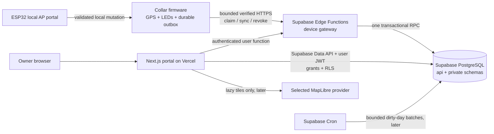
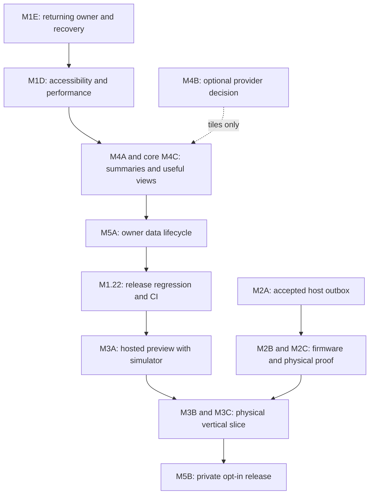

# Dog RGB web platform — master execution plan

**Status / review:** active; reconciled against repository `971fdb313954e37012dc2178f740238fd2670fa8` on **2026-10-02 (America/Bogota)**. M0 and M1.1–M1.16 have recorded local acceptance. The website is **not finished or deployed**. M2A is host-accepted; physical sync remains open.

**Next task: M1.19, returning-owner navigation.** Login without a saved deep link and the home/private-brand links lead to `/onboarding`, which always renders dog creation. Reuse the existing authorized dog-list DAL to route zero/one/multiple memberships correctly; prove returning login does not create another dog. Then M1.20–M1.21 and M1.23, followed by the existing M1.17–M1.18 gates. This deliberately replaces the previous “M1.17 only” next step: first complete the user paths being audited.

**Scope of this revision:** repository/code/test review and documentation reconciliation. No deployment, remote project inspection, DB reset, firmware change, or physical acceptance. No delivery percentage: checked engineering tasks are not a measure of usable product completion.

## 1. Authority and maintenance

One active plan: this file. [The August 1 proposal](2026-08-01_cloud-portal-master-plan.md) and February cloud plans are historical; they do not define a second backlog. The complete previous milestone ledger/research is preserved in Git at the reviewed baseline above. Existing M0–M6 and task IDs remain stable; numeric order is not a dependency graph.

Authority: executable contracts/migrations/tests for implemented behavior → accepted [ADRs](../adr/README.md) → this plan for scope/order/closure → current references → historical plans. An ADR accepts a decision, not a deployed feature. A checked task closes only its named evidence boundary.

- Keep status/order here, test commands in [testing](../testing.md), protocol in [device-v1](../../contracts/device-v1/README.md), and dated results in [cloud evidence](../cloud/README.md). Indexes link here; do not reproduce the task ledger.
- Each started task records **owner, implementation commit, environment, exact command/artifact, result, remaining limits**. Assign a delivery window after its dependencies are available; remove speculative multi-week estimates.
- Mark complete only with evidence; reopen affected acceptance when behavior changes. Use additive migrations. Do not rewrite historical acceptance/rejection or regenerate frozen outbox evidence to match a documentation revision.
- Before provider/API changes, verify current official docs; before service selection, verify actual region, cost, quota and terms. Do not upgrade dependencies as part of this review.
- Repository owner decides service accounts, spending, operational responsibility and production opt-in. Missing provider credentials block their branch only. No hardware/map dependency blocks local web work.

## 2. Exact product being built

Dog RGB is a local-first ESP32-S3 dog collar with LEDs and GPS. The web platform is an optional extension that lets an owner review synchronized history and safely change a small allowlist of collar settings. It is not a dependency for the collar.

### 2.1 Foundation user journey

The first release is complete when one owner can:

1. create and verify a web account;
2. create one dog profile;
3. generate a short-lived claim code;
4. pair one collar without placing human credentials on the collar;
5. let the collar batch-upload sealed telemetry when known Wi-Fi is available;
6. see last synchronization, coverage, recordings, and an honest route;
7. change brightness on the website;
8. see **Pending** until the physical collar reports the exact version/hash applied;
9. continue using LEDs, GPS, local history, exports, and the AP portal during every cloud outage;
10. revoke/unlink the collar and delete/export private data before production use.

The local proof substitutes the deterministic device simulator for steps 4–8. The physical proof uses one development collar only after the local proof passes.

### 2.2 Foundation scope

- Vercel-hosted Next.js App Router portal.
- Supabase Auth, PostgreSQL, RLS, Edge Functions, and later a bounded Supabase Cron rollup worker.
- Outbound HTTPS request/response synchronization from the collar.
- At-least-once upload with idempotent database effects and acknowledgement only after commit.
- Desired/reported configuration state, initially brightness only.
- Track v3 observations with explicit time/fix quality and coverage gaps.
- Spanish-first UI, message-key ready for English.
- Metric units by default and `America/Bogota` as the initial per-dog IANA timezone.

### 2.3 Explicit non-goals

Do not add these to the critical path:

- live/cellular tracking, live-location language, geofence push alerts, or an always-connected device;
- MQTT, an IoT broker, inbound device sockets, or a Vercel/Supabase WebSocket server;
- Supabase Realtime for the foundation UI;
- public route sharing, social features, family/veterinarian sharing, or multi-tenant administration UI;
- medical, health, sleep, calorie, anxiety, bark, or behavior claims;
- road snapping, Google Roads/Directions, machine learning, or automatic “walk” truth;
- native mobile apps, OTA fleet rollout, multi-region databases, microservices, Kafka, a warehouse, or partitioning without measured need;
- Secure Boot/eFuse/flash-encryption production provisioning on development collars;
- HSM/KMS custody, SIEM, formal penetration tests, or cryptographically signed off-site deletion ledgers as a prerequisite for the private DIY proof.

## 3. Target architecture


```mermaid
flowchart LR
  AP[ESP32 local AP portal] -->|validated local mutation| FW[Collar firmware\nGPS + LEDs + durable outbox]
  FW -->|bounded verified HTTPS\nclaim / sync / revoke| EDGE[Supabase Edge Functions\ndevice gateway]
  EDGE -->|one transactional RPC| DB[(Supabase PostgreSQL\napi + private schemas)]
  OWNER[Owner browser] --> WEB[Next.js portal on Vercel]
  WEB -->|Supabase Data API + user JWT\ngrants + RLS| DB
  WEB -->|authenticated user function| EDGE
  CRON[Supabase Cron] -->|bounded dirty-day batches, later| DB
  WEB -->|lazy tiles only, later| MAP[Selected MapLibre provider]
```

### 3.1 Fixed component boundaries

| Component | Owns | Must not own |
| --- | --- | --- |
| Collar firmware | sensing, LEDs, local metrics/history, durable outbox, device credential, time quality, retry/ACK state, local config | account password, Supabase project secret, cloud history queries, analytics truth |
| Local AP portal | Wi-Fi setup, claim-code entry, local settings, local/cloud status and recovery | Internet account login, cloud administration, route sharing |
| Supabase device gateway | custom device authentication, request bounds, version negotiation, one transactional RPC, safe response | long jobs, web UI rendering, partial multi-call transactions |
| PostgreSQL | ownership, grants/RLS, idempotency, raw facts, desired/reported state, derived records | trusting caller-supplied ownership or device identity |
| Vercel portal | authenticated owner experience, server-rendered private data, user mutations | device ingestion, device secrets, durable background jobs |
| Map provider | basemap tiles/styles only | route GeoJSON, dog identity, account identity |

### 3.2 Deliberate transport decision

- [x] ✅ Device transport v1 is bounded HTTPS request/response to a Supabase Edge Function.
- [x] ✅ The ESP32 never writes PostgREST tables directly.
- [x] ✅ Vercel does not proxy device synchronization.
- [x] ✅ The collar remains outbound-only; no public AP endpoint or inbound socket exists.
- [x] ✅ MQTT is deferred. It requires a new ADR and measured evidence of sub-second downlink, fan-out, or battery/polling cost that HTTPS cannot meet.
- [x] ✅ Realtime/WebSockets are excluded from the foundation. Ordinary fetch/refetch is correct for known-Wi-Fi batch synchronization.

## 4. Non-negotiable invariants

| ID | Invariant | Required proof |
| --- | --- | --- |
| INV-01 | Cloud failure never blocks GPS, LEDs, AP recovery, local configuration, history, or export. | Cloud-disabled and outage firmware regressions. |
| INV-02 | Human credentials and Supabase secret keys never enter firmware. | Firmware/bundle/secret scans and pairing tests. |
| INV-03 | Device identity is derived from one unique revocable credential, not a body field, MAC, or project key. | Gateway auth and cross-device attack tests. |
| INV-04 | An upload is acknowledged only after the complete database transaction commits. | Lost-response replay test. |
| INV-05 | Identical replay has one logical effect; the same ID with different immutable content fails closed. | Unique constraints, receipts, concurrent replay tests. |
| INV-06 | Unacknowledged movement data is not silently reclaimed. | Host model plus target power-cut/full-storage evidence. |
| INV-07 | Missing observation is unknown time, never inactivity. | Analytics fixtures and UI copy tests. |
| INV-08 | Telemetry is append-only; LWW is used only for coherent configuration resources. | Schema privileges and conflict matrix. |
| INV-09 | Website “Applied” means the collar reported the exact desired version and body hash. | Simulator and physical desired/reported tests. |
| INV-10 | Precise routes are private by default and absent from normal logs, URLs, analytics, and map-provider requests. | RLS, logging, browser, and network assertions. |
| INV-11 | Track v2 data is not silently destroyed by the v3 upgrade. | Dual-read/export or explicit migration/reset evidence. |
| INV-12 | Every claim shown in the UI is supported by the current sensors and algorithm version. | Copy review and reference-route evidence. |

Any implementation that violates an invariant is rejected even if its happy-path demo works.

## 5. Verified state and critical findings

### 5.1 Delivered scope

| Area | Repository evidence | Exact limit |
| --- | --- | --- |
| M0; M1.1–M1.7 | Pinned Next.js/Supabase environment, Auth signup/login/confirmation/recovery actions, protected DAL, dog creation, ephemeral claim, simulator pairing; `apps/portal`, `tools/phase1_local.mjs` | Local development; recovery code exists but the maintained M1.13 journey is not a complete recovery/returning-user test |
| M1.8–M1.10 | Today reads, bounded/keyset History, detail table and segmented SVG; [History](../cloud/m19-history-query-plan.md), [detail](../cloud/m110-recording-detail-evidence.md) | Reading seeded summaries is not computing them; SVG is not a basemap |
| M1.11–M1.12 | [Brightness](../cloud/m111-brightness-configuration-evidence.md), [collar diagnostics/revoke](../cloud/m112-collar-diagnostics-revoke-evidence.md) | Desired/reported convergence with simulator; no physical Applied proof |
| M1.13–M1.16 | [Owner journey](../cloud/m113-playwright-owner-journey-evidence.md), [authorization](../cloud/m114-identity-object-authorization-evidence.md), [faults](../cloud/m115-deterministic-fault-evidence.md), [privacy/cache](../cloud/m116-privacy-cache-evidence.md) | Recorded twice-clean local evidence; not rerun in this review; no current remote CI claim |
| Local backend | 16 migrations, 21 pgTAP files, four Edge gateways; explicit grants/RLS, replay, configuration, deletion/retention/restore tooling | Local schema/tooling; no deployed project or complete owner data lifecycle |
| M2A | [Independent AI host acceptance](../cloud/phase0-outbox-remediation-review-2026-10-02.md), candidate `fb6dbef`, 67/67 | Host fault model only; not human or ESP32 acceptance |
| M2B increments | [Codec](../cloud/m24a-track-v3-codec-evidence.md) `d244221`, [identity](../cloud/m23a-device-identity-evidence.md) `f148bec`, [assembler](../cloud/m24b-chunk-assembly-evidence.md) `971fdb3` | Isolated C++ components; no runtime observation/outbox/cloud integration |

### 5.2 Gaps that determine the next work

| Priority / finding | Source checked | Required closure |
| --- | --- | --- |
| P1 — Returning owners cannot reach their existing dog through normal entry navigation | `lib/auth/protected-route.ts` defaults to `/onboarding`; home/private brand link there; `app/onboarding/page.tsx` always shows creation | M1.19: zero/one/multiple authorized dogs, safe deep links and return after logout |
| P1 — Summary producer is absent | `packages/analytics/index.js` only computes a ratio; `private.recompute_dirty_summaries_v1` deletes dirty rows without upserting a summary | M4A: transactionally recompute before consuming work; no schedule until proved |
| P1 — Hosted Auth cannot work unchanged | `lib/auth/redirect.ts` resolves unknown hosts to `http://127.0.0.1:3000`; local Auth config/templates and Mailpit copy | M3A: configured trusted origin, hosted confirmation/recovery, exact redirects; do not trust arbitrary Host headers |
| P1 — Export/account/dog deletion has no product UI | Current App Router routes; local deletion worker/drill is not an account workflow | M5A: authorized bounded export, strong confirmation, immediate access closure, observable purge and retry |
| P1 — Revoked physical identity cannot be claimed again | `api.consume_device_claim_v1` rejects every existing `device_public_id`, including revoked collars; UUID is unique | M1.23: same-owner re-enrollment with a fresh credential; guidance alone cannot fix it |
| P1 — No real collar-to-web completion | Firmware evidence above | M2B/C + M3B/C; does not block simulator-driven web completion |
| P1 — One active collar is not enforced | Claim inserts allow several active collars per dog; `lib/data-access/collars.ts` selects only one | M1.23: serialized claim/constraint and non-destructive duplicate preflight; UI must not hide ambiguous active state |
| P2 — Auth and product recovery paths are incomplete as a release contract | No confirmation-resend UI; maintained owner journey covers first signup/claim, not returning selection or full password recovery | M1.20–M1.21; preserve existing auth code and add missing paths/evidence |
| P2 — Whole-portal a11y/performance and browser release coverage remain open | `playwright.portal.config.ts`, M1.17–M1.18; tests/audit and AP screenshots are not this portal's acceptance | M1D on completed local paths, then focused regressions on new screens |
| P2 — CI does not execute the maintained M1.13–M1.16 orchestrator | `.github/workflows/ci.yml` calls `phase1:local`; that script does not call `tools/portal-e2e/run.mjs` | M1.22: connect the existing runner to CI; production build alone is insufficient |
| P2 — Documentation overstated absence and readiness at once | README/requirements/ADR index said accounts, reads or brightness were absent; older plan still presented a Vercel device API and Google Maps | Reconciled here and at entry points; preserve historical files as historical |

P1/P2 are delivery priorities, not security severity ratings. No unobserved runtime vulnerability is asserted by this review.

### 5.3 Validation performed on 2026-10-02

Darwin arm64, Node **24.18.0**, npm **11.6.2**, Next.js **16.3.1**:

- `npm run phase1:check` — **PASS**: generated AP/Edge consistency, contracts, lint, workspace typecheck, unit suites and secret scan. Distinct test cases: contracts 48, portal 122, analytics 1, simulator 23, capacity/restore tooling 10 (**204**); contracts run twice in the composed command.
- `npm run portal:build` — **PASS**, current public/Auth/onboarding and five dog routes compile. This does not establish runtime Auth, accessibility or speed.
- Documentation checks: `git diff --check 971fdb3` and local Markdown target/heading validation pass; all changes against the reviewed baseline are documentation only.
- Local DB/Edge/browser reset suites, hosted endpoints, current GitHub runs and hardware were **not run or inspected**. Earlier evidence retains its original date/commit and scope. No real data was reset for this documentation review.

## 6. Scope to finish

| Delivery boundary | Must be true | Does not establish |
| --- | --- | --- |
| Local web complete | M1D/E, M4A/C core and M5A: existing and returning owner paths, useful summaries/history/detail, brightness/collar recovery, data lifecycle, accessibility/performance and repeatable tests using simulator | Physical telemetry accuracy, hosted email/TLS or operations |
| Hosted web preview accepted | Local web complete + M3A with synthetic simulator data, real trusted origins/Auth and isolated development services | Production launch or physical collar sync |
| Collar integration accepted | M2B/C + M3B/C: real pairing/upload/replay/config, resource measurements and cloud-disabled regression | External-user operation |
| Private DIY v1 released | Above + M5B, named operator and production opt-in | Live tracking, health claims, fleet service or public sharing |

Core web v1 includes Spanish UI, one-owner/one-dog/one-active-collar primary journey, existing-membership selection, Today, History, recording detail, brightness only, collar diagnostics/revoke/same-owner/same-dog relink, recovery and export/delete. Existing editor/viewer permissions still receive denial/read-only tests; invitation management is deferred.

**Route scope decision:** segmented SVG + paginated accessible points are the core route view. A tiled MapLibre basemap is an optional M4B/C enhancement; absent credentials cannot delay core web completion. Rich synchronized charts/timelines, heatmaps, trends, goals and additional settings are deferred. Preserve ADR-0009 and complete its provider gate before enabling tiles.

**Profile scope:** support correcting dog display name; keep the chosen IANA timezone visible and read-only in v1. Timezone editing/historical regrouping, dog photos and profile enrichment are deferred. Do not build a general profile editor.

## 7. Dependency order


```mermaid
flowchart TD
  ENTRY[M1E: returning owner and recovery] --> QUALITY[M1D: accessibility and performance]
  QUALITY --> DATA[M4A and core M4C: summaries and useful views]
  DATA --> PRIVACY[M5A: owner data lifecycle]
  PRIVACY --> CI[M1.22: release regression and CI]
  CI --> PREVIEW[M3A: hosted preview with simulator]
  HOST[M2A: accepted host outbox] --> FW[M2B and M2C: firmware and physical proof]
  PREVIEW --> COLLAR[M3B and M3C: physical vertical slice]
  FW --> COLLAR
  COLLAR --> RELEASE[M5B: private opt-in release]
  MAP[M4B: optional provider decision] -. tiles only .-> DATA
```

Default web queue: **M1.19 → M1.20 → M1.21 → M1.23 → M1.17 → M1.18 → M4A/core M4C → M5A → M1.22 → M3A**. Run relevant regression gates with every delivery; repeat a11y/performance on new surfaces before declaring local completion. M2 may continue independently; hosted physical work requires both branches. Do not postpone analytics/export/UI work until hardware or buy services to close local tests.

## 8. Executable milestones

### M0 — Local baseline: complete

Preserve pinned toolchain, contracts, clean migrations, generated assets/types, CI production build and local operations evidence. Detailed completed M0/M1.1–M1.16 entries remain in Git history; section 5 links retained evidence. Reopen only the affected contract, not the entire foundation.

### M1 — Complete the local owner experience

#### M1E — Product completion, next

| Task | Deliverable | Acceptance |
| --- | --- | --- |
| [ ] M1.19 | Returning-user entry using existing authorized dog-list DAL | Zero memberships → creation; one → Today; multiple existing memberships → simple selector. Home, login and brand links never force duplicate creation. Valid authorized deep links survive login; inaccessible/deleted dog remains generic denial. Prove logout/login with the same dog, zero-dog, multi-dog and lost-membership cases |
| [ ] M1.20 | Complete account recovery and confirmation resend | Existing `/forgot-password?mode=update` flow tested with real local email; valid, expired, reused, malformed links; old password rejected/new accepted after reset; documented session scope. Add bounded resend without email enumeration. Provider failure leaves a recoverable generic message; no token in retained artifacts |
| [ ] M1.21 | Finish product states and concise copy | Owner-only dog-name correction with fresh authorization and validation; timezone visible/read-only. Claim expiry/refresh/consumed code, unpaired/revoked/relink guidance, offline/stale, read-only roles, failed/retried mutations and unsupported brightness are navigable. Refresh is explicit, no Realtime. Remove milestone IDs, Mailpit and protocol internals from normal product copy; use environment-specific development hints only. No new settings catalog |
| [ ] M1.23 | Same-owner/same-dog collar re-enrollment after revoke | “Same-owner” means any current `owner` member of the same dog, not the historical claim issuer; editors/viewers cannot re-enroll. Freeze the existing-identity/new-claim transaction before implementation; fresh one-use owner-authorized claim and new device credential, prior credential remains denied for sync/config, history/UUID/boot identity and retention/deletion fences preserved. Test revoke → fresh claim → sync, lost-response replay, concurrent reclaims and denial to another owner. Old-credential revoke replay or a new revoke request must not revoke the new enrollment; preserve only its bounded revoke-only receipt behavior. Define pending old-outbox handling explicitly; never delete history or silently rotate UUID to bypass the uniqueness check. Enforce at most one active collar per dog in serialized claims and an additive DB constraint; preflight existing duplicates and resolve with the owner without erasing history. Update the current irreversible-revoke copy only when this recovery works. Cross-owner/dog transfer is deferred. Database/gateway/simulator first; physical credential replacement is verified in M3C |

M1.19 is one bounded change: do not bundle account deletion, analytics, firmware or a design-system replacement into it.

#### M1D — Accessibility, performance and release regression

- [ ] **M1.17** Freeze page/state/input matrix after M1E. Cover home, Auth/recovery, selection/onboarding, Today, History, paginated detail, brightness and collars, including owner/editor/viewer, empty/error/loading, stale/rejected/pending/applied and revoke confirmation. Test keyboard navigation/focus return, labels/status, landmarks/tables, visible focus, 200% zoom, reduced motion, **44 px** targets and no lost controls/page overflow at **320/428/768/1280 CSS px**. Zero automated A/AA findings plus named manual assertions; automation is not manual acceptance. Use risk-based coverage, not the full page × role × state × viewport product: test each meaningful state once, run core journeys at 320/1280 and layout containment at 428/768; reuse M1.14 role denials. Add M5A and optional-map surfaces when delivered.
- [ ] **M1.18** Measure production build: login, Today, History, detail, configuration and collars; add selection/privacy/export when present. Freeze Chromium version/hardware, desktop 1280×800 unthrottled and mobile 428×844 with 4× CPU slowdown, 1.6 Mbps down/750 kbps up and 150 ms latency. Five cold + five warm samples per route/profile; report median/p95, JS gzip, requests/bytes, TTFB, LCP, CLS and long tasks. Initial project gates: **≤180 KiB gzip initial route JS**, **median LCP ≤2.5 s**, **median TTFB ≤800 ms** for each cold/warm group, **CLS ≤0.1 in every sample**; no eager map bundle. These are targets fixed by this review, not measured results. Record failures/remediation; change a budget only with an explicit rationale. Sample p95 is diagnostic, not a field SLO. Repeat against hosted preview and after material page changes.
- [ ] **M1.22** Extend the existing owner journey for return/recovery/re-enrollment/summaries/export/delete; wire `tools/portal-e2e/run.mjs` into repository CI for relevant portal/schema/contract/runner changes and releases, with a disposable local stack and sanitized reports. Measure duration; avoid the full reset matrix for unrelated documentation/hardware-only edits. Keep authorization/fault/privacy gates. Add a focused WebKit mobile smoke for entry, History/detail, brightness and revoke; Chromium remains the full deterministic matrix. Record browser/platform and any unsupported path. No duplicate orchestration framework, new device farm or claim of unexecuted browser coverage.

**Exit:** complete first-use and returning-user workflows, accepted a11y/performance, no cross-owner disclosure, exact simulator replay/config truth, and a current clean release run. M1.13 success alone no longer defines M1 completion.

### M2 — Offline firmware foundation; independent web dependency

#### M2A — Host acceptance: complete, physical gate open

M2.1–M2.2 accepted by independent AI review on `fb6dbef` (2026-10-02): all 12 invariants, 67/67 host tests and 10/10 verifier tests. [Ledger](../cloud/phase0-outbox-remediation-review-2026-10-02.md) preserves scope, fault-model limits and original rejection. Do not infer physical flash behavior or reopen this accepted model to finish portal documentation.

#### M2B — Firmware implementation with cloud disabled

- [ ] M2.3 Add persistent public device UUID, credential record state and boot sequence; allocate point/chunk sequences within each durably reserved boot.
  - M2.3a identity/sequence increment: **implemented and validated — 2026-10-02 (America/Bogota)**; owner Codex with Luna/max implementation and independent review. Implementation commit: `f148bec`, based on `d244221`.
  - Scope: portable UUID/boot A/B store, explicit NVS adapter and bounded per-boot sequence reservations. No automatic provisioning or runtime emission. Credential lifecycle and observation startup integration remain open.
  - Evidence: [identity/sequence report](../cloud/m23a-device-identity-evidence.md); focused native suite 2/2, also under ASan/UBSan, with 987 core checks. Firmware host suite 156/156, outbox 67/67, protocol 48/48; Classic/Display builds pass. No runtime caller, source-pin change or physical acceptance.
  - Allocate the native-v3 boot sequence through CRC/generation-protected A/B storage, increment and read back before emitting any v3 record, and reserve zero for legacy data.
  - Never reuse a published or durably reserved boot; a failed allocation locks that instance. Fresh recovery may retry an unissued candidate only if the complete prior image remains intact. Corrupt pairs block allocation; integer exhaustion never wraps.
- [ ] M2.4 Implement the frozen Track v3 codec and observation path.
  - M2.4b native chunk assembly: **implemented and validated — 2026-10-02 (America/Bogota)**; owner Codex with Luna/max implementation, tests and independent review. Implementation commit: `971fdb3`, based on `f148bec`. Bounded identity/codec bridge; one reservation per batch, exact encoding/handoff retries, terminal final acceptance. Runtime cadence/GNSS, durable outbox and cloud transport remain separate work.
  - M2.4b evidence: [assembly report](../cloud/m24b-chunk-assembly-evidence.md); focused suite 1/1, 376 C++ checks and 7 exact Python-oracle frames, also under ASan/UBSan. Full firmware suite 157/157; protocol 48/48; Classic/Display builds pass. Independent Luna/max review found no remaining defect in this scope. No production runtime caller or physical acceptance.
  - M2.4a codec-only increment: **implemented and validated — 2026-10-02 (America/Bogota)**; owner Codex, Luna/max implementation and independent review. Implementation commit: `d244221`, based on `0230227`.
  - Scope: bounded native C++ point/chunk codec and Python interoperability tests; no observation emission before M2.3 allocates durable identities. M2.4 remains open for observation scheduling, explicit gaps, and v2 preservation in the integrated path.
  - Evidence: [native codec report](../cloud/m24a-track-v3-codec-evidence.md); `python3 -m unittest discover -s Platformio/Dog-RGB/test -p 'test_track_v3_native.py' -v` passes 7/7, also under ASan/UBSan; 576 size/quality combinations, four canonical fixtures and eleven alias cases. Full firmware host suite 154/154; Classic/Display builds pass. Python source pins, v2 storage and runtime capture remain unchanged.
  - Moving cadence nominally 5 seconds; trusted stationary heartbeat nominally 60 seconds.
  - Invalid/no-fix intervals become explicit gaps, never fake coordinates.
  - Preserve v2 read/export until acknowledged migration or explicit reset.
- [ ] M2.5 Implement the selected raw-partition sealed-chunk outbox.
  - Immutable sealed chunks; mutable tail only.
  - Exact manifest-bound ACK evidence; reclaim only fully acknowledged chunks.
  - Reserve loss marker/summary space under pressure.
  - LittleFS is implemented only if the selected candidate fails its gate.
- [ ] M2.6 Implement time quality and anchors.
  - `UNKNOWN < APPROXIMATE_PERSISTED < SERVER_ANCHORED < SNTP_SYNCED < GNSS_TRUSTED`.
  - Persist UTC only with source/quality; identity/order never depends only on wall-clock time.
  - Before first verified TLS, require a plausible GNSS time, bounded SNTP result, or still-valid persisted last-good date. `SERVER_ANCHORED` cannot bootstrap certificate validation because it is learned only after HTTPS succeeds.
  - Do not send claim codes or credentials until hostname, chain, and certificate-date validation can pass. `/cloud` must show `Waiting for valid time` rather than offering an insecure fallback.
- [ ] M2.7 Implement one common config mutation/validation/commit service.
  - AP and future cloud paths cannot call mutable config/save independently.
  - Persist value, HLC, mutation ID, desired/reported version/hash atomically.
- [ ] M2.8 Keep all cloud networking behind a disabled-by-default build/runtime boundary.
- [ ] M2.9 Preserve embedded portal, AP recovery, GPS, metrics, sessions, exports, scenes, LEDs, and loop timing.

#### M2C — Host/Wokwi/physical acceptance

- [ ] M2.10 Host tests cover codec, A/B recovery, exact ACK/reclaim, corruption, full storage, v2 preservation, HLC, config rollback, and cuts around boot-sequence allocation.
- [ ] M2.11 On the target XIAO ESP32-S3, run at least 10,000 seal/ACK/reclaim cycles and at least 1,000 asynchronous reset/power cuts across all write boundaries.
- [ ] M2.12 Measure p50/p95/p99 recovery, erase distribution, heap/largest block, watchdog margin, GPS gaps, LED jitter, energy, and full-storage behavior.
- [ ] M2.13 Retain sanitized machine-readable traces and hashes.
  - Hardware revision: ____________________
  - Harness/controller: ____________________
  - Firmware commit: ____________________
  - Evidence: `docs/cloud/phase0-esp32-outbox-evidence.md`

**M2 exit gate:** the chosen physical outbox passes without acknowledged loss or silent unacknowledged reclaim; legacy data remains usable; cloud-disabled firmware remains within accepted timing/storage/heap/power budgets.

### M3 — Hosted preview, then physical integration

#### M3A — Website preview with simulator; independent of M2

| Task | Deliverable and acceptance |
| --- | --- |
| [ ] M3.1–M3.2 | Select region from measured target-network latency and create an isolated development project after service setup is authorized. Record project/region, cost limit, migration hashes, exposed schemas and operator; synthetic data only |
| [ ] M3.3 | Vercel Preview points only to development. Replace local-only Auth origin with validated environment configuration; exact redirect allowlist, real confirmation/reset delivery, correct cookie/cache behavior, clean session refresh and logout. Unknown Host never chooses destination; no localhost callback in hosted email. Do not expose arbitrary preview origins to production |
| [ ] M3.4–M3.6 | Apply committed migrations/functions, check grants separately from RLS and run hosted cross-owner denial/replay/config proof with simulator. Verify actual project key/JWT/Edge configuration; browser gets publishable config only, privileged credentials stay server-side. Record rollback and deployment artifact |

**M3A exit:** accessible private preview, synthetic owner journey including return/recovery, no cross-environment data/secrets, real email/TLS/cache checks and measured cost/latency. Physical proof is not required to close this web-only boundary.

#### M3B — Firmware HTTPS client

- [ ] M3.7 Add claim/sync/revoke client using verified hostname/certificate chain and the ESP x509 certificate bundle; `setInsecure()` or common-name skipping is forbidden.
- [ ] M3.8 Bound DNS, connect, TLS, send, response, JSON, and total deadlines independently.
- [ ] M3.9 Only one request is in flight; use bounded batches, exponential backoff with full jitter, and exact retry instructions.
  - Freeze `Retry-After` to numeric delta-seconds only; require equality with bounded JSON `retry_after_seconds` (`1..86400`).
  - On missing, mismatched, invalid, HTTP-date, or out-of-range values, retain the exact batch and use normal bounded jitter.
  - Update the device-v1 contract/fixtures in the same change so server, simulator, and firmware cannot interpret this differently.
- [ ] M3.10 Persist selected request ID/body until matching schema-valid post-commit ACK is durable.
- [ ] M3.11 Add `/cloud` to the AP portal for claim, freshness, queue, safe error, retry, sync-now, and guarded unlink.
  - Add its own generated-asset gzip budget.
  - Never expose the device secret or Authorization value.

#### M3C — Physical vertical slice and fault gate

- [ ] M3.12 Pair one development collar through the hosted claim flow; then prove same-owner revoke/re-enrollment with durable new credentials, old-credential sync denial, harmless old revoke retries and preserved identity/history under M1.23.
- [ ] M3.13 Upload one real sealed v3 fixture, lose the response, resend identically, and observe one database result.
- [ ] M3.14 Commit web brightness, sync it to the collar, apply atomically, and report the exact version/hash.
- [ ] M3.15 Use the relay/MOSFET harness for collar power cuts around local seal, request serialization/persistence, ACK write, config apply, and config report boundaries.
- [ ] M3.16 Use a controllable gateway/proxy failpoint to reset/drop the connection after RPC commit but before response delivery.
  - Retain receipt/log evidence that the server committed before the induced loss; the retry must return one logical result.
- [ ] M3.17 Exercise Wi-Fi loss, DNS failure, captive portal, wrong hostname/CA, unset/far-past/far-future/persisted-stale clocks, revoked credential, 429, 5xx, malformed/truncated response, full outbox, and AP edit during sync.
- [ ] M3.18 Repeat cross-account REST/RPC/URL attacks on the hosted-development project.
- [ ] M3.19 Record hosted p95 Edge/RPC latency, bytes/sync, database bytes/point, egress, logs, and estimated monthly cost for 1/5/10 collars.
- [ ] M3.20 Measure the physical network/resource coexistence gate.
  - Capture free/minimum heap and largest allocatable block through DNS, SNTP, TLS, request serialization, and response parsing.
  - Capture GNSS sentence loss/checksum/fix continuity, owner-loop maxima, LED jitter, AP-client coexistence, and sync energy/time.
  - Evidence/hardware profile: ____________________

**M3 exit gate:** one physical collar survives every fault point with no logical duplicate, acknowledged-data loss, false Applied state, credential leak, cross-user access, or local-feature regression. This closes physical integration; local web/analytics/privacy work need not wait for it.

### M4 — Useful summaries and routes

#### M4A — Required analytics; simulator first

| Task | Deliverable and acceptance |
| --- | --- |
| [ ] M4.1–M4.2 | Versioned pure computation for observed/moving/stationary/unknown, distance, mean moving speed and filtered maximum. Separate device and derived values. Freeze units, thresholds, quality/exclusion/gap rules and examples before implementation; absent evidence → unavailable, never zero activity. Replace the current `coverageRatio(0, 0) === 0` invalid-window fallback with typed absence and update its test |
| [ ] M4.3 | Replace queue-delete placeholder by bounded recomputation. Both daily and per-recording summaries need a bounded producer and source/algorithm version: the existing queue names dog/day/timezone only, so define affected-recording invalidation for late uploads. Summary upserts and dirty-row removal are atomic; crash, concurrent ingest and retry cannot lose a dirty update. Replaying identical inputs gives identical results. Commit batch size/timeout; no schedule until tests pass. Manual local runner first; activate hosted scheduling with M5B |
| [ ] M4.4–M4.5 | Stationary/moving/poor-fix/gap/unknown-clock/overlap/duplicate/late-upload fixtures; timezone midnight and 23/25-hour days; current-day window ends now, not tomorrow. Test algorithm upgrade and retention cutoff; insufficient retained detail cannot recreate a “complete” summary. Field validation is required for physical accuracy or estimated movement claims; no movement-phase classifier in core v1 |

#### M4C — Required core UI

- [ ] **M4.12** Connect computed summaries to Today/History/detail. Show data timestamp, coverage, algorithm provenance and pending/stale/unavailable state; newer raw data invalidates stale derived claims for both daily and recording coverage. Carry `computed_at`/algorithm/source freshness through the DTO; receipt time alone is not observation freshness. Add bounded date-range History filtering in dog timezone with keyset pagination; null-time recordings remain discoverable. Link Today to latest detail. Keep segmented SVG and paginated point table, explicit gaps/quality/legacy limits; never connect across unknown data or point-page boundaries.
- [ ] **M4.13 core** Test ingestion → recompute → visible result end to end, including retry/late arrival, date/cursor validation and cross-owner denial; run affected responsive/a11y/privacy/performance checks. UI cannot stay permanently “processing” because the producer is missing.

#### M4B / M4C tiles — Optional enhancement

- [ ] **M4.6–M4.8** Complete the existing identical credentialed Stadia/MapTiler Colombia comparison, denied-origin/key-leak checks, two independent scorecards or owner acceptance + technical review, current cost/terms and ADR-0009 provider decision. Credentials are an external blocker only here.
- [ ] **M4.9–M4.11** Lazy MapLibre detail map with provider-neutral route data, gap segments, start/end and quality legend. No route GeoJSON in provider URLs; disclose viewport/IP exposure. Keyboard/table alternative remains usable when offline, tiles fail or WebGL is absent. Speed-chart/timeline synchronization is deferred beyond core v1.
- [ ] **M4.13 tiles** Extend browser, a11y, privacy, provider-failure and cold-mobile checks when tiles are enabled; update measured bundle budgets without silently weakening them.

**Core exit:** real versioned summaries and honest History/detail work with simulator data and no external map service. Physical interpretation is revalidated in M3C. Tiled-map completion has a separate acceptance flag.

### M5 — Data lifecycle first; production activation later

#### M5A — Required web features, implement locally before preview

| Task | Deliverable and acceptance |
| --- | --- |
| [ ] M5.5a | `/privacy` explains actual data, purposes, providers, raw retention (initial 12 months), unlink versus delete and backup lag. Pairing obtains affirmative per-collar opt-in. Do not claim the proposed policy is already enforced |
| [ ] M5.6a | Owner export from `/app/[dogId]/data` and `/account`: versioned JSON plus per-recording GeoJSON, units, timezone, quality/gaps, config and available summaries; exclude secrets/internal receipts. Bound pagination/memory and execution time, define export cutoff/completeness for concurrent uploads, authorize every request and download, no public cache/URL. Prefer direct downloads; only add private expiring jobs/artifacts if measured size requires them. Test completeness, expired session, cross-owner denial and failure/retry |
| [ ] M5.6b | Reauthenticated, strong-confirmation dog deletion reuses existing job/RPC. Block access/ingest immediately; show pending/failed/retry/completed from durable state; reuse `private.process_dog_deletion_batch_v1` to remove actual records. For local acceptance, use the existing `npm run phase1:deletion` fixture drill and invoke that worker from the owner-journey harness for its own jobs; the fixture drill is not a general job-drain CLI. Hosted schedules remain M5B; no new worker service. Revocation alone preserves history. Verify concurrent upload, duplicate request, other-dog survival, logout/relogin and export absence after purge |
| [ ] M5.6c | Account deletion orchestration: authenticated owner, explicit inventory of owned dogs and memberships, reauthentication and explicit confirmation, close access, revoke devices, enqueue/purge owned data and keep Auth until every purge job completes, then remove Auth/profile/memberships last in recoverable order. While pending, deny ordinary reads/new dog/claim/config writes but retain authenticated status/retry access through logout/login; `get_deletion_job_v1` requires a live caller. Failed jobs must not orphan the owner's recovery path. Explicit confirmation covers all dogs the account owns, including impact on other members; reader/editor memberships only detach. Preflight `dogs.created_by` (Auth FK `ON DELETE RESTRICT`): if a surviving creator reference cannot be removed through the authorized deletion set, block before any destructive action and require ownership resolution; no automatic transfer. Test sole owner, co-owner, viewer/editor and creator-without-ownership cases. Preserve sanitized deletion receipt/status across interrupted processing; no “complete” on partial failure |

Routes above are **planned**, not present. Reuse existing auth/DAL/RLS/jobs; do not create a separate admin service. Extend route guards, return-path allowlists, cache/privacy scanner and a11y matrix in the same implementation. Recording-only delete, email change, sharing and retention customization are deferred; dog/account export/delete are the v1 boundary.

#### M5B — Private production release

| Task | Required evidence before activation |
| --- | --- |
| [ ] M5.1–M5.2 | Explicit owner opt-in, intended users/collars, named operator/contact, actual service tiers/regions, monthly ceiling and alerts from measured preview/collar use. Free/paid chosen from verified requirements; no assumed prices or mandatory enterprise tier |
| [ ] M5.3–M5.4 | Stable site/device API origins, verified TLS and exact redirects; configured production SMTP, delivery/recovery tests and sender-domain setup. Preserve ADR-0005: an owned stable device API domain is required before durable field use; a custom website vanity domain is optional |
| [ ] M5.5b / M5.7 | Reviewed privacy copy and actual retention per data class; enable bounded retention/deletion/summary schedules only after M5.5a–b, M5.6a–c and worker tests pass. M5.5 closes only when both its product-copy and operational-policy subdeliverables pass. Verify oldest overdue item, purge completion, retries, alerts and job behavior under limits; no infinite dormant queues |
| [ ] M5.8 | Restore into an isolated environment; disable outbound jobs first, reapply secrets/Auth/functions/settings, verify hashes/RLS and replay post-backup deletions before traffic. Use managed backup or documented encrypted logical-export fallback with measured restore/expiry; no mandatory paid clone/PITR. Fix RPO/RTO and backup lag from demonstrated operation |
| [ ] M5.9–M5.10 | Short runbook: failed login/sync, revoke/rotation, stalled jobs, outage, quota/cost, DNS/cert, rollback and restore; explicit signals/thresholds and responsible person. Publish concise privacy/support/terms appropriate to intended use and verify an actual release/rollback smoke |

**Exit:** local web complete + hosted preview + physical integration + M5A/B evidence. No open data-loss, cross-owner access, false Applied or core-workflow defect. Advanced hardening (Secure Boot, flash encryption, mTLS, KMS/HSM, signed off-site custody, SIEM/WAF, formal pentest, multi-region) stays optional. Preserved signed-tombstone tooling may support restore; it does not mandate a new custody service.

### M6 — Deferred, only with demonstrated need

Realtime/MQTT, native apps, cellular/live tracking, public/family sharing UI, goals/trends/heatmaps, advanced charts, profile enrichment/timezone editing, additional remote settings, geofence alerts, Google Maps/self-hosted tiles, OTA and IMU classifiers. Reassess only after v1; architectural/privacy changes require the relevant ADR, small UI refinements do not require a new architecture process.

## 9. Web implementation contract

### 9.1 Data access

- Server Components may read private data through the user's Supabase SSR client and RLS.
- Server Components must not call the portal's own Route Handlers for data.
- Server Actions/Route Handlers must verify authentication and authorization inside every action.
- Use a server-only data access layer and minimal DTOs; page visibility is not authorization.
- Browser code contains only publishable configuration. Secret keys and device credentials are forbidden from `NEXT_PUBLIC_*`.
- All exposed-schema tables have explicit grants and RLS in the same migration.
- Views exposed to users use `security_invoker = true`.
- User-visible lists use keyset pagination. Track points load only on one recording detail.
- Do not use Realtime to compensate for missing query/state design.

### 9.2 UI language and truth

Use:

- `Recording` or `session`, not automatic `walk`;
- `Last synchronized`, not `live` or `current location`;
- `Observed stationary`, not sleep/rest/health;
- `Unknown`, not inactive, for missing coverage;
- `Filtered maximum speed`, not raw maximum;
- `Estimated movement phase` only after an algorithm gate.

### 9.3 Initial routes

```text
/signup
/login
/forgot-password
/auth/confirm
/onboarding
/app/[dogId]/today
/app/[dogId]/history
/app/[dogId]/recordings/[recordingId]
/app/[dogId]/collars
/app/[dogId]/configuration
```

M1.19 makes `/onboarding` an authorized entry/selection flow. M5A adds `/account`, `/privacy` and `/app/[dogId]/data` before hosted web completion. Sharing/admin routes remain deferred.

### 9.4 Visual and accessibility boundary

Keep the existing Dog RGB identity: black/near-black surfaces, phosphor green, gold warning, magenta destructive/failure, compact terminal labels, restrained glow, strong focus, and 3 px radii. The route is evidence, not decoration.

Mandatory:

- 320 px minimum width and 44 px touch targets;
- text/icon/pattern in addition to color;
- keyboard-complete flows and skip/landmark structure;
- reduced motion and no continuous CRT animation;
- semantic/table alternative for charts/maps;
- no card mosaic, glass UI, generic dashboard clutter, or map/scanline interference.

## 10. Device and database contract summary

The exact wire contract remains in `contracts/device-v1`. The following boundaries are reminders, not alternative schemas:

- stable observation identity: `(collar_id, boot_sequence, point_sequence)`;
- stable chunk identity: `(collar_id, boot_sequence, chunk_sequence)`;
- stable request identity plus content hash for exact replay;
- device/body IDs are compared but authority is derived from the credential;
- UTC may be null/unknown; `received_at` is server-generated;
- coordinates/speed remain exact bounded integers at the wire boundary;
- requests/responses remain bounded by the frozen protocol limits;
- one database function is the commit/ACK boundary;
- transaction work is short and contains no external network call;
- foreign keys and RLS predicate columns are indexed;
- exact ingest uses uniqueness/`ON CONFLICT` semantics, never check-then-insert;
- update policies have matching select policy and both `USING`/`WITH CHECK`;
- security-definer code is exceptional, schema-qualified, empty-search-path, and public-execute-revoked;
- execute is granted only to explicitly required roles: device gateway wrappers are `service_role`-only, while authenticated helpers/user RPCs must enforce `auth.uid()`/ownership internally and return the minimum data;
- direct browser writes to telemetry, config heads, credentials, receipts, and private tables are denied.

## 11. Test and release discipline

### 11.1 Required layers

| Layer | Minimum evidence |
| --- | --- |
| Contract | Schemas, positive/negative fixtures, byte/hash vectors, problem catalog, compatibility matrix |
| Database | Fresh migrations, pgTAP, grants/RLS, concurrent replay, ownership attacks, advisors |
| Edge | Bounds, custom auth, safe errors, one RPC, lost-response replay, logs |
| Simulator | Full owner/device flow, faults, clocks, revoke, desired/reported, deterministic seeds |
| Portal | Build, unit, Playwright against local Supabase, accessibility, privacy, responsive/performance |
| Firmware host/Wokwi | Storage/time/config/network state-machine behavior and local regression |
| Physical | Power cuts, TLS, heap, GNSS/LED timing, wear, energy, AP coexistence |
| Hosted development | Migration parity, real Auth/email boundary, RLS attacks, latency/cost |
| Production | Restore, export/delete/retention, rotation, outage, rollback, DNS/cert, quotas |

### 11.2 No substitute evidence

- Simulator evidence does not close physical hardware/TLS gates.
- Local Supabase does not prove hosted limits, TLS, backups, email, or network latency.
- Hosted happy paths do not replace clean migration/reset evidence.
- RLS UI tests do not replace raw REST/RPC attacks.
- Test counts do not replace independent review where explicitly required.
- A map screenshot does not prove key restriction, privacy, or accessibility.
- A signed tombstone does not prove account deletion UX or managed restore.

## 12. External checks and release record

This review fetched the [Supabase changelog](https://supabase.com/changelog.md) and verified the hosted Auth transition against [official redirect guidance](https://supabase.com/docs/guides/auth/redirect-urls): Site URL and allowed redirects must match the actual environment. The local-only origin finding comes from repository code. Scheduling capability in [Supabase documentation](https://supabase.com/docs/guides/functions/schedule-functions) does not make the placeholder summary function a valid worker. No provider pricing, current hosted setup or paid backup eligibility is assumed.

For each release record the commit, environment, enabled features (including tiles), applicable task IDs, exact commands/results, browser/profile matrix, unresolved limits and operator. Detailed logs belong in dated evidence, not this plan. A local green build, an accepted host outbox and a production-ready website remain three distinct claims.
