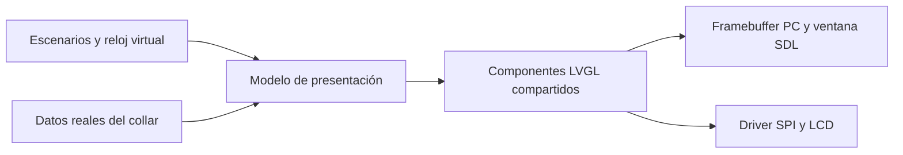

# Flujo de diseño de interfaces con IA para RGB Dog Display

Estado: **I5 implementado; evolución I6 propuesta**, 2026-09-12. Vista compartida
LVGL 8.4.0, renderer CMake sin ventana, capturas y comandos de comparación ya
existen; ver [baseline I5](../baselines/display-i5-2026-09-12.md). Las secciones
siguientes conservan el flujo de diseño y propuestas posteriores. Complementa el
[plan Waveshare](2026-09-12_waveshare-display-variant.md).

Revisión de producto: la [especificación de uso del collar](2026-09-12_display-use-and-screens.md)
propone Actividad y Conexión como primeras páginas, con distancia registrada
prioritaria, velocidad secundaria y pausa futura solo con evidencia válida.
Esta jerarquía sustituye la dirección inicial centrada en velocidad como objetivo
de la próxima revisión; la página I5 cargada mantiene su diseño hasta implementarla.

**Prioridad revisada:** este flujo se aplica desde I5 del [plan incremental acordado](2026-09-12_display-incremental-delivery.md), después de LEDs, GPS, pantalla de texto y consolidación. Sus herramientas se incorporan por necesidad; no son prerrequisitos del collar básico. En I5 comenzar con una vista estática y tres escenarios; navegación, capturas temporales y animaciones pertenecen a I6.

Referencias de implementación seleccionadas: [investigación de bibliotecas y repositorios](../display-library-research.md). Port CMake/SDL para simulación, actualización por cambios, fuentes LVGL y animaciones nativas; sprites y GIF son opcionales posteriores. Toda referencia API debe concordar con la versión fijada, tanto en PC como en placa.

## Resultado que buscamos

Un ciclo reproducible que permita describir una mejora, implementarla en LVGL, verla con datos representativos, corregirla y llevar el mismo código al ESP32. La primera entrega visual, I5, será Paseo estática con estados GNSS. La navegación mediante botón se agrega en I6. Classic sigue sin depender de LVGL.

Decisión de base: C/C++ LVGL y simulador propio, sin dependencia obligatoria de un editor de pago. LVGL 8.4.0 ya está fijado y verificado en PC/placa. CMake sin ventana cubre las primeras capturas; SDL sigue opcional para interacción. Una eventual migración de versión deberá abarcar ambos backends y sus referencias API.

## 1. Referencia visual: convertir gusto en requisitos verificables

Primero preparar dos o tres propuestas de una sola vista, con los mismos datos. Evaluar jerarquía, contraste, identidad y lectura a 240 × 280. Las imágenes conceptuales, incluidas las generadas por IA, sirven como dirección artística: su tipografía y efectos deben traducirse a componentes ejecutables.

El brief debe contener resolución, esquinas, uso sin táctil, información principal/secundaria, estados, textos, colores, fuentes y espacios; desde I6 incluye movimiento. La dirección inicial es instrumento deportivo: velocidad grande, distancia diaria y modo secundarios, estado GNSS discreto pero inequívoco. Conservar la semántica de I3; tiempo activo y distancia de sesión no se agregan implícitamente por adoptar el nombre `WalkScreen`. No decidir una estética solo con una imagen de datos ideales.

Entregable mínimo I5: un brief breve con dirección elegida y referencias, un tema C/C++ compartido y tres capturas. Evitar duplicar decisiones en varios archivos. Si el material crece, usar esta organización opcional:

- `docs/display/brief.md`: objetivos de uso y restricciones.
- `docs/display/design-decisions.md`: dirección elegida, alternativas descartadas y motivo cuando afecte al desarrollo.
- `design/display/references/`: referencias con origen y permiso de reutilización cuando aplique.
- `design/display/theme.json`: solo si un generador aporta valor; entonces es la fuente del header generado, sin editar ambos manualmente. Inicialmente basta un header de tema escrito a mano.

Contratos iniciales: márgenes de 16 px por ajustar a la placa; velocidad 40–48 px, secundarios 20–24 px y etiquetas 16 px. Son valores de partida. Usar números de ancho estable, incluir glifos españoles y dimensionar con la cadena máxima esperada. Determinar qué se abrevia y qué pasa a otra línea.

La aceptación estética puede expresarse con comentarios sobre una captura: “conserva composición, aumenta la distancia y reduce el encabezado”. No requiere aprobar cada compilación; una vez elegida la dirección, Codex itera dentro de ella y documenta cambios relevantes.

## 2. Componentes: separar datos, comportamiento y dibujo

La UI comparte código fuente, fuentes y recursos entre PC y ESP32. Solo cambian reloj, entradas, transporte de píxeles y alimentación. No implementar una réplica HTML como prueba de aceptación LVGL.



Componentes I5: `StatusBar`, `PrimaryMetric`, `MetricPair` y `GpsStateNotice`, según la composición elegida. Una sola pantalla coordinadora, `WalkScreen`, crea y actualiza esos objetos. `PageIndicator` entra en I6 junto con la segunda página. Evitar un sistema genérico de plugins o widgets antes de necesitarlo.

Contratos propuestos, sin compromiso todavía sobre nombres de API:

- `DisplaySnapshot`, I3/I5: reutiliza el contrato mínimo del plan incremental, sin ampliar dominio por razones estéticas. El adaptador real conserva las reglas de confianza y vencimiento GPS.
- `UiEvent`, I6: pulsación corta y solicitud de despertar; la interpretación eléctrica del botón queda en el backend.
- `UiController`, I6: página seleccionada, transición activa y política ante pulsaciones repetidas. No es dueño del GPS ni de NVS; no hace falta una máquina de navegación en I5.
- `UiView`: presenta el modelo y actualiza solo valores visuales modificados.

Los fixtures estáticos pueden ser estructuras C++ inicialmente. Si después se usan JSON, se convierten al mismo contrato; no exigen añadir un parser de fixtures al firmware. Velocidad inválida se representa con `--` y aviso de estado, nunca como cero válido. La distancia diaria registrada puede seguir visible durante la pérdida de fix y mantiene su fecha/período. Caducidad proviene del dominio GPS; el simulador inyecta ese estado o ejercita el mismo adaptador con reloj controlado. La vista no crea otro umbral de vencimiento ni cuenta frames para decidir validez.

Desde I6, una transición interrumpida termina en un estado coherente. Despertar no avanza también la página por accidente. Para navegación simple, las pulsaciones repetidas pueden sustituir la transición hacia la página destino más reciente; esa regla se debe probar. Alertas adicionales entran junto con la función que las produzca.

## 3. Simulador mínimo y evolución a dos modos

**I5 mínimo:** un ejecutable CMake/SDL con los mismos archivos UI, que selecciona uno de tres fixtures, dibuja hasta completar el frame y guarda un PNG 240 × 280. Fijar versión LVGL, compilador/entorno, fuentes y configuración visual. Se puede capturar desde el framebuffer de ese mismo ejecutable; no exigir todavía dos backends, editor de escenarios, CI visual complejo ni runner temporal. Desde un checkout limpio debe poder compilarse y producir las tres imágenes siguiendo comandos documentados.

**I6 y herramientas posteriores:** extender ese ejecutable cuando las pruebas de navegación/movimiento lo requieran:

**Interactivo:** ventana SDL a resolución lógica 240 × 280, zoom entero 1×/2×/3× sin alterar layout, botón mediante teclado, selector de escenarios y métricas de desarrollo fuera del área del panel. En un monitor, 1× significa correspondencia de píxeles, no tamaño físico de 1,69 pulgadas; la legibilidad física se confirma en dispositivo.

**Reproducible:** backend de memoria sin ventana, tiempo virtual, eventos fechados y salida PNG. Avanza en pasos fijos, inyecta eventos en orden definido, ejecuta temporizadores y completa el refresco antes de capturar. No usa el reloj de Windows, Wi-Fi real ni números aleatorios sin semilla.

LVGL necesita una fuente de tiempo y ejecución periódica de su handler. En capturas estáticas I5 fijar el instante y completar los refrescos pendientes; en las secuencias I6 el runner controla el tiempo. En placa se alimenta del tiempo monotónico real. No incrementar ficticiamente siempre 5 ms si el loop real tarda más. [Tick v8.4](https://lvgl.io/docs/open/8.4/porting/tick.html), [Timer handler](https://lvgl.io/docs/open/8.4/porting/timer-handler.html).

Propuesta de carpetas adicionales:

```text
tools/display-simulator/
  CMakeLists.txt
  host_main.cpp
  framebuffer_backend.cpp
  scenario_runner.cpp             # desde I6, si requiere eventos temporales
tests/display/scenarios/
tests/display/baselines/
output/display/<run-id>/
```

El ejecutable host enlaza las fuentes `src/display/ui/` del firmware; no las copia. Compartir configuración visual relevante de LVGL, RGB565, fuentes y assets. Las diferencias de plataforma se mantienen explícitas y pequeñas.

## 4. Capturas: obtener evidencia de lo que realmente dibujamos

El backend copiará cada región enviada por LVGL a un framebuffer completo RGB565 de 240 × 280. Al finalizar un refresco, convertirá sus píxeles a RGB888 y codificará PNG. Debe respetar offsets, límites, stride y orden de bytes. En PC puede guardar muchas imágenes sin cargar de trabajo al collar.

LVGL también ofrece snapshots de objetos. Son útiles para componentes aislados; no prueban por sí solos el montaje de regiones en el backend ni equivalen automáticamente a un archivo PNG. [Snapshot v8.4](https://lvgl.io/docs/open/8.4/others/snapshot.html).

En I5 producir un PNG nativo por escenario, revisar ampliación sin suavizado y registrar commit/versiones en la nota de ejecución. Desde I6, según necesidad, ampliar con:

- PNG nativo y ampliación sin suavizado.
- Hoja de contacto de momentos significativos de animación.
- Imagen de diferencia contra baseline y reporte de geometría/estados.
- `manifest.json`: commit, versión LVGL, hash de tema/fuentes, escenario, instante y configuración relevante.

Una máscara de esquinas será una previsualización complementaria basada en medición; guardar también el frame completo. No esconder recortes con la máscara. Para automatización visual estable, fijar entorno de compilación y renderizado; una diferencia de antialiasing no debe confundirse con un cambio semántico.

La documentación de OpenAI permite usar imágenes como contexto y comparar estados con Codex. Nuestra propuesta es entregarle capturas más brief y cambios esperados; la imagen sola no define el comportamiento correcto. [Entradas de imagen](https://learn.chatgpt.com/docs/image-inputs).

## 5. Correcciones: cerrar el ciclo sin perder el diseño

Codex revisa primero errores de contenido, luego recortes/alineación, después jerarquía visual y finalmente movimiento. Cada observación debe indicar escenario, zona, problema y corrección concreta. Ejemplo: “En `speed-width`, a 1.000 ms, `10.0` desplaza la unidad; reservar una columna fija para unidad”.

Aplicar una familia de cambios por iteración: espaciado, tipografía o transición. Recompilar y capturar los escenarios afectados; correr la matriz completa antes de consolidar. Las nuevas capturas van a `actual/`; las baselines no se sobrescriben para silenciar diferencias. Actualizarlas en un cambio explícito después de revisar que representan el resultado deseado.

La comparación de píxeles detecta cambios, no decide calidad. Acompañarla de verificaciones sobre texto esperado, visibilidad, bounds y estado del controlador. Evitar reglas rígidas que rechacen solapamientos deliberados; identificar regiones de layout y overlays permitidos.

Matriz escalonada; solo se exige una fila cuando existe la función correspondiente:

| Escenario | Incremento | Qué comprueba |
| --- | --- | --- |
| Arranque y búsqueda GNSS | I5, fixture sin fix | Sin velocidad inventada, aviso legible |
| Muestra válida | I5, fixture fix | Dato principal y unidades; fecha/período correcto de distancia |
| GNSS caducado | I5, fixture stale | Velocidad inválida; distancia registrada no se borra |
| Velocidad 9,9 → 10,0 | I6, secuencia | Ancho estable y unidad alineada |
| Botón repetido durante transición | I6 | Destino coherente, sin cola de animaciones |
| Apagar/despertar | I6 | No avanza página involuntariamente ni muestra frame incompleto |
| Batería desconocida/baja | I7, después del adaptador batería | Semántica explícita, sin porcentaje inventado |
| Nombre largo | Solo si se añade nombre | Abreviación/límites; glifos españoles de los textos existentes se revisan ya en I5 |

Ejemplo temporal propuesto: estado inicial a 0 ms, muestra GPS a 1.000 ms, botón a 2.000 ms; capturas a 2.000, 2.050, 2.100 y 2.200 ms. Añadir una segunda pulsación a 2.075 ms en otro escenario. La caducidad GNSS se toma del contrato del producto, no de estos instantes ilustrativos.

Las secuencias virtuales demuestran la forma prevista del movimiento. Los FPS del PC o de un vídeo exportado no son mediciones del ESP32.

## 6. Prueba en placa: trasladar diseño y medir la ejecución

Primero ejecutar la misma vista con fixtures locales de diagnóstico y sin periféricos externos; después conectar los snapshots reales. Los fixtures de placa quedan solo en el target de bring-up. Verificar colores, orientación, bordes y glifos antes de atribuir diferencias a la UI.

Comparar fotografía de LCD con captura host para encontrar discrepancias de color/recorte; no exigir igualdad de píxeles a una foto, afectada por cámara, exposición y backlight. Medir pulsación→primer cambio visible y regularidad de frames con vídeo o instrumentación adecuada. El final de DMA es fin del envío, no necesariamente el instante exacto en que el usuario ve el píxel.

En I5 comparar recursos y datos con I4; una pantalla estática no tiene requisito de FPS. Desde I6 proponer una transición de 200 ms con objetivo de 20 FPS estables y respuesta p95 menor de 100 ms, sujeto a medición y los presupuestos del plan incremental. Registrar periodos entre actualizaciones, tiempo SPI, duración UI, heap mínimo y bloqueo del loop bajo carga. Comprobar GNSS continuo, ambas tiras y portal activo. No usar promedio FPS como único criterio: puede ocultar pausas largas.

Repetir cambio de páginas/apagado durante un periodo definido, buscando crecimiento de memoria y fallos. Medir consumo con backlight apagado y en varios niveles; documentar condiciones. Reducir área animada, assets o cadencia si el resultado compromete tareas del collar.

## Evolución completa del flujo visual (I5–I6)

1. Brief y tema inicial de Paseo, con referencia identificable.
2. Smoke test de versión LVGL y backend mínimo de placa cuando esté disponible.
3. I5: `WalkScreen` compartida y un ejecutable mínimo capaz de dibujar/capturar tres fixtures.
4. I6: navegación y runner temporal; modos interactivo/headless según necesidad, solo escenarios de funciones implementadas.
5. Revisión visual con correcciones focalizadas y baseline explícita.
6. Compilación Classic y Display; informe separado de validación física pendiente o realizada.

Esta lista es el destino del flujo, no una tarea indivisible: I5 toma una vista y tres escenarios estáticos; I6 añade eventos y secuencias temporales. Batería y otros datos no forman parte de I6 por aparecer en una tabla. Generadores, manifest detallado y reportes avanzados son mejoras de herramientas cuando se justifiquen. No ampliar a todas las vistas hasta poder repetir el ciclo básico desde un checkout limpio.

Encargo sugerido para la futura implementación:

```text
Aplica este encargo solo al llegar a I5 del plan incremental.
Empieza por WalkScreen estática y conserva Classic sin dependencia LVGL.
Comparte componentes entre firmware y simulador con tres escenarios:
sin fix, fix válido y dato caducado. Genera capturas reales de LVGL.
Verifica estados, recortes y unidades. Deja navegación y animaciones para I6.
Entrega diferencias visuales, builds y limitaciones físicas explícitas.
No declares rendimiento del ESP32 a partir de mediciones del PC.
```

Estado reconciliado con I5: ya hay componentes ejecutables, tres capturas reales
y baseline USB. Navegación, pausa estimada, política automática de backlight y
las páginas adicionales descritas para la evolución siguen propuestas.
