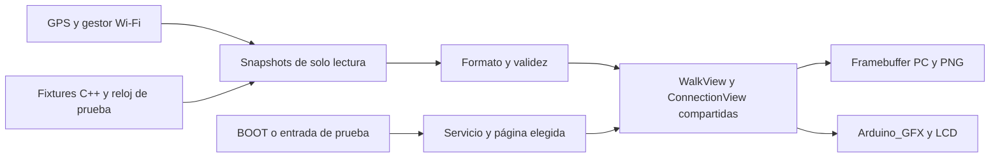

# Flujo de diseño de interfaces con IA para RGB Dog Display

Estado: **Flujo ejecutable hasta I6a; desarrollo pausado por el propietario**,
2026-09-12. El [plan incremental](2026-09-12_display-incremental-delivery.md)
decide orden, dependencias y aceptación; el [contrato de uso](2026-09-12_display-use-and-screens.md)
decide qué significa la información mostrada. Este documento explica cómo
trabajar sobre lo existente, sin mantener otra cola de implementación.

## Base disponible

`Referencia visual → componentes LVGL → simulador → capturas → correcciones → prueba en placa`

Ya recorrimos el ciclo en I5 e I6a. La base actual es Actividad y Wi-Fi,
distancia registrada como dato principal, negro `#000000` y BOOT para navegar.
Classic conserva su aislamiento gráfico. Evidencia: [baseline I6a](../baselines/display-i6-2026-09-12.md).

| Capa | Implementado | Evolución condicionada |
| --- | --- | --- |
| Datos | `DisplaySnapshot`, `ConnectionSnapshot` y formateadores C++ acotados | Ampliar solo por una función que necesite el dato y su validez |
| Componentes | `WalkView` (título Actividad), `ConnectionView`, raíz negra compartida | Una vista o transición por cambio |
| Entrada | `ReleaseButton`, BOOT GPIO0, debounce 30 ms y evento al soltar | Timeout separado; pulsación larga no tiene acción |
| Renderer | LVGL 8.4.0 y configuración compartida PC/ESP32 | No migrar a v9 para añadir una animación |
| Transporte | Arduino_GFX 1.6.7, SPI 40 MHz, RGB565/swap 0, buffer de 9.600 bytes | DMA/PSRAM/segundo buffer solo ante cuello de botella medido |
| PC | CMake sin ventana, framebuffer y empaquetado PNG con Python | Capturas temporales para I6b si hacen falta; SDL opcional |
| Verificación | Cuatro CTest, nueve PNG y manifest con hashes | Casos nuevos ligados al cambio |

No hay editor comercial ni runtime de IA obligatorio en el collar. Las
[referencias de bibliotecas y repositorios](../display-library-research.md)
son apoyo, no dependencias para instalar. El simulador interactivo no es un
prerrequisito de una vista verificable mediante el renderer existente.

## 1. Referencia: un brief por cambio

Registrar en la tarea o baseline:

- Momento de uso y pregunta concreta del propietario.
- Vista/estado afectados, datos disponibles, validez y resultado esperado.
- Referencia: captura I6a existente o material externo con procedencia.
- Restricciones: 240×280, esquinas redondeadas, sin táctil, negro puro, una
  métrica principal, unidades/fecha visibles y color acompañado de texto.
- Casos adversos: dato inválido/caducado, ancho máximo, nombre largo y función
  no disponible. No diseñar únicamente con valores ideales.
- Criterio de salida y comparación física necesaria.

La geometría I6a reserva contenido de 192×244 en (24,20). Distancia usa 48 px;
títulos/datos secundarios 20 px y etiquetas 12/14 px. Son medidas implementadas,
con legibilidad física final pendiente. Ampliarlas exige revisar colisiones y
recorte real. La dirección antigua de velocidad principal/fondo verde quedó
sustituida por Actividad y negro.

Los SSID admiten hasta 32 bytes ASCII imprimibles con salto de línea. Otros
bytes producen `Nombre no compatible`, conservando la IP útil. Una referencia
bonita no prueba cobertura Unicode: ampliar glifos exige receta reproducible,
licencia y presupuesto de flash.

Las imágenes conceptuales orientan estilo, sin acreditar comportamiento o
rendimiento. No hace falta generar varias propuestas para una corrección de
espaciado sobre una composición elegida.

## 2. Componentes: reutilizar las fronteras reales



La UI no recalcula distancia, no interpreta NMEA ni consume JSON del propio
portal. El adaptador Wi-Fi consulta estado sin scan, reconexión o escritura de
credenciales. Mostrar STA conectada no demuestra Internet.

Página e iluminación son independientes: despertar conserva página y el
siguiente clic navega. Los objetos se crean una vez; actualizar solo el texto
cuya representación cambió. Mantener un único dueño de LVGL y SPI.

Para una función nueva: contrato de dato → adaptador → formato → vista → entrada
si hace falta. No introducir clases `UiController`, `StatusBar` o generadores
porque figuraban como nombres posibles en la investigación. Extraer componentes
cuando compartan comportamiento real entre vistas.

## 3. Simulador: ejecutar el mismo código

Preparar dependencias desde `Platformio/Dog-RGB`:

```powershell
pio pkg install -e waveshare_lcd169_displaycheck
```

Desde la raíz, con los requisitos del [README del simulador](../../tools/display-simulator/README.md):

```powershell
python tools/display-simulator/render.py
```

El runner compila, ejecuta cuatro contratos y exporta a
`tools/display-simulator/output/`. Cubre composición/semántica, servicio real
con SPI falso, fallo de inicialización y adaptador Wi-Fi real con stubs.
Las pruebas ya controlan eventos/reloj; para animación falta capturar instantes
intermedios, no reconstruir la navegación. El transporte falso no mide el ESP32.

Configuración y fuentes LVGL se comparten. El PC usa memoria de 64 bits; su
consumo no es idéntico al de ESP32. Una maqueta HTML no sustituye esta evidencia.

## 4. Capturas: base actual y casos futuros

Baselines actuales en [docs/assets/display-i6](../assets/display-i6/manifest.json):

| Archivos | Qué comprobar |
| --- | --- |
| `searching.png`, `fix.png`, `stale.png` | Jerarquía, velocidad válida/desconocida, distancia retenida y fecha |
| `connection-ap.png`, `connection-both.png` | Acceso local y coexistencia AP/STA |
| `connection-trying.png`, `connection-idle.png`, `connection-off.png` | Conectando, desconectado y radio apagada distintos |
| `connection-long.png` | SSID de 32 bytes, salto de línea, IP y ausencia de colisiones |

Guardar frame nativo 240×280. Ampliar sin suavizado ayuda a revisar; no cambia
la resolución de diseño. El framebuffer reconstruye las regiones emitidas por
LVGL; Python empaqueta esos píxeles, no redibuja widgets.

En I6b añadir una secuencia determinista con capturas inicial, intermedias y
final; incluir una pulsación que cambie destino antes del final. Los instantes
0/50/100/200 ms son casos de prueba, no una promesa de FPS físicos. Fijar tiempo
y orden de eventos; evitar reloj de pared o azar sin semilla.

Generar resultados actuales, revisar y actualizar imágenes versionadas junto
con el manifest en un cambio explícito. No sobrescribir baselines para ocultar
una diferencia. Conservar I5 como evidencia histórica; sus tres imágenes ya
no representan el catálogo vigente.

## 5. Corrección: contenido, geometría y después movimiento

Revisar datos/unidades → estados/validez → recorte/solapamiento → jerarquía y
contraste → movimiento. Registrar escenario, zona y corrección comprobable;
por ejemplo, el tercer renglón de SSID invade la IP. Aplicar una familia de
cambios por iteración.

Los tests comprueban bounds, texto esperado, validez, página final y memoria
cuando corresponda. Diferencias de píxeles detectan cambios, no deciden calidad.
I6a ya corrigió colisiones de distancia/unidad y nombres/IP con layout LVGL
real; conservar esa protección.

| Cambio futuro | Casos adicionales |
| --- | --- |
| I6b transición | Evento intermedio, destino sustituido, fin coherente, memoria tras ciclos |
| I6c timeout | Límite/rollover, ambas páginas, dato caducado en oscuro |
| I6d Estado | Fuentes válidas/desconocidas/fallidas, tres páginas, modo efectivo de luces |
| I6e pausa | Quietud observada, hueco GPS, ruido, reanudación y reinicio |

Ejecutar las comprobaciones afectadas según el plan incremental. Documentación
sola requiere coherencia/enlaces, no nuevas compilaciones ni flasheos.

## 6. Placa: verificar lo que el PC no demuestra

Identificar placa y binario antes del ensayo. En stage 3, `f` simula únicamente
datos GPS de presentación; Wi-Fi y política LED siguen siendo reales. `v`
vuelve a datos reales. Producto no habilita estos comandos ni fixtures.
Consultar [controles I6a](../../Platformio/Dog-RGB/docs/display-i6.md).

Separar observación visual, entrada física, tiempos de servicio y carga conjunta.
Una captura host no confirma negro del panel; un clic USB no verifica BOOT;
el fin de envío SPI no es necesariamente el instante de píxel visible.

I6a tiene máximo por llamada de 44,768 ms en la ventana USB final de 120,078 s,
tras reducir el repintado a 51.308 píxeles por cambio. Actualización normal final:
máximo 14,522 ms y p95 con cota superior de 20 ms. No mide 20 FPS, botón→píxel
ni GNSS/LED/HTTP conjuntos.

I6b medirá intervalos entre frames y respuesta física; objetivos propuestos:
20 FPS durante movimiento y respuesta p95 <100 ms. Comparar con igual carga,
incluyendo máximos. Si falla, reducir movimiento/área o conservar cambio
instantáneo antes de cambiar stack.

I6c comparará backlight encendido/apagado y continuidad del collar. Consumo solo
se declara si se mide con condiciones registradas. Fotografías ayudan a detectar
diferencias, sin exigir igualdad de píxeles por exposición/cámara/backlight.
El cierre conjunto sigue V3/I4 del plan incremental.

## Encargo reutilizable al reanudar

```text
Retoma el paquete seleccionado del plan incremental desde la base I6a.
Verifica condiciones de entrada y limita el alcance a ese paquete.
Reutiliza vistas, snapshots, LVGL 8.4.0 y renderer actuales.
Conserva negro, distancia registrada/fecha, validez GPS y Wi-Fi de solo lectura.
Añade únicamente fixtures/eventos que la función necesita.
Genera capturas LVGL, revisa contenido/recorte y ejecuta los checks afectados.
Compila Classic y los targets Display afectados si cambia firmware.
Separa pruebas PC, eventos USB y observación física; registra binario y límites.
No cierres GPS/LED/HTTP por una demo sin periféricos.
```

Este encargo no inicia trabajo durante la pausa. Tampoco convierte animaciones,
SDL, batería o nueva persistencia en requisitos de la siguiente entrega.
