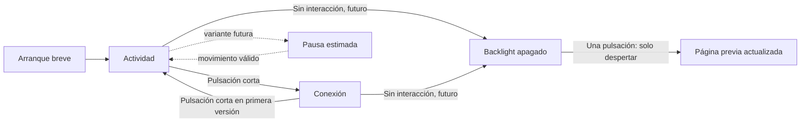

# RGB Dog: uso del collar y contrato de pantallas

Estado: **I6a implementa Actividad y Conexión; evolución posterior propuesta**, 2026-09-12.
Las dos páginas y la navegación BOOT se incorporaron según la [guía I6a](../../Platformio/Dog-RGB/docs/display-i6.md).
Se conserva el resto de este documento como contrato de producto; descanso,
apagado automático y cambios de radio/LEDs siguen sin implementarse.
Complementa el [plan incremental](2026-09-12_display-incremental-delivery.md),
que conserva autoridad sobre el orden y las pruebas de aceptación.

## 1. Diseñar para quien consulta el collar

Hipótesis de uso: el propietario lo mira al colocarlo, durante una parada y al
retirarlo. La pantalla va en el cuello del perro; la lectura continua mientras
camina no debe ser el flujo principal. Validaremos orientación y acceso al botón
con el montaje real. El portal conserva mapas, historial y configuración extensa.

La pantalla debe resolver una pregunta breve: «¿está funcionando?», «¿cuánto lleva
registrado?» o «¿cómo abro el portal?». Proponemos un dato principal y dos o tres
secundarios por vista. Se conserva negro puro, tipografía blanca, colores de estado
acotados y márgenes amplios para las esquinas. No se alternan páginas automáticamente
mientras se leen ni se utiliza una animación continua como indicador de actividad.

La primera UI priorizó velocidad como prueba del renderer. I6a da prioridad a
distancia registrada y estado; velocidad pasa a segundo plano. El título visible
de la segunda página es `Wi-Fi`, y muestra los dos tipos de conexión.

## 2. Momentos de uso

| Momento | Pregunta del propietario | Contenido principal | Comportamiento propuesto |
| --- | --- | --- | --- |
| Encendido / colocación | ¿Arrancó y qué falta? | `Iniciando`, después estado GPS, modo de luces y acceso local | Arranque breve; no bloquear la página esperando indefinidamente un fix |
| Antes de salir | ¿Hay posición fiable? | `GPS listo` o `Buscando GPS`; distancia del período y luces configuradas | La búsqueda es un estado normal; no afirmar `Todo listo` solo porque hay fix |
| Paseo, consulta en una parada | ¿Cuánto lleva registrado? | Distancia, velocidad válida, estado GPS | Actualizar datos en su sitio, sin mover la composición |
| Parada breve | ¿Seguimos registrando? | Mismos datos; cero únicamente si es válido | No finalizar una sesión ni anunciar descanso al detenerse unos segundos |
| Pausa sostenida | ¿Está quieto y cuánto dura esta pausa? | En una fase posterior, `Pausa estimada` y duración observada | Solo con evidencia suficiente; si falta señal, mostrar incertidumbre |
| En casa | ¿Cómo consulto el recorrido o ajusto luces? | Actividad registrada y página Conexión | La conexión a una red no basta para afirmar `En casa` ni terminar un paseo |
| Retirada / fin de paseo | ¿Qué registró? | Primero total del día; después resumen de paseo si existe esa entidad | No confundir un reinicio con un fin de paseo voluntario |
| Consulta de un problema | ¿Qué función necesita atención? | Aviso concreto y página Estado | Prioridad a información accionable, sin panel permanente de depuración |

## 3. Dos páginas primero, una tercera después

### A. Actividad: principal y contextual

Pregunta: «¿Qué lleva registrado el collar y qué está pasando ahora?».

Propuesta de distribución 240×280:

- Encabezado discreto `RGB DOG`, indicador de página y texto corto de estado GPS.
- Dato central de mayor tamaño: distancia con unidad y período explícitos.
- Una línea de velocidad, que cambia a `--` si no es utilizable.
- Una línea de modo de luces; los detalles del efecto y brillo van en Estado.
- Un indicador compacto de conexión, cuyo detalle se consulta en Conexión.

Ejemplo de contenido, no captura LVGL: `Actividad / GPS listo / 1,84 km / Día
12 sep / 4,2 km/h / Luces: Velocidad`. Si no puede comprobarse que el registro
corresponde a hoy, usar `Registrado` y su fecha; no etiquetar un dato conservado
como `Hoy`. Una fecha no disponible se presenta como desconocida.

Los estados GPS cambian el aviso y la validez de la velocidad, no borran la
distancia acumulada. El nombre `Paseo` puede mantenerse como título de uso, pero
no convierte la distancia diaria en distancia de una salida. Por claridad,
proponemos `Actividad` hasta disponer de una sesión de paseo definida.

`Pausa estimada` será una variante contextual de esta misma página. Conserva el
acumulado y sustituye el énfasis de movimiento por la duración observada de la
pausa; no crea otra página que deba recorrerse con el botón. Al recuperar
movimiento vuelve al contenido normal, sin cerrar ni reiniciar contadores.

### B. Conexión: segunda página de I6

Pregunta: «¿Cómo entro al portal desde el teléfono?».

Mostrar dos estados separados cuando coexistan: **red a la que se conecta el
collar** y **red que ofrece el collar al teléfono**. ESP32 distingue STA y AP;
estar asociado a una red no demuestra acceso a Internet, sincronización ni
alcance remoto. [Documentación oficial Wi-Fi de Espressif](https://docs.espressif.com/projects/arduino-esp32/en/latest/api/wifi.html).

| Estado observado | Texto propuesto | Información útil |
| --- | --- | --- |
| AP activo, sin clientes | `Portal disponible` | SSID real y dirección AP actual |
| AP con clientes | `1 dispositivo conectado` o plural | Dirección del portal; asociación no equivale a portal abierto |
| STA intentando conectar | `Conectando a…` | SSID configurado; AP disponible si también está activo |
| STA conectada | `Red conectada` | SSID e IP local; nombre mDNS como alternativa si está configurado |
| STA falló, AP disponible | `Red no conectada` / `Portal disponible` | Mostrar la alternativa local, sin pantalla roja global |
| AP inactivo, sin STA | `Sin conexión Wi-Fi` | `Portal no disponible`; no afirmar radio apagada |
| Radio explícitamente apagada | `Wi-Fi apagado` | Solo cuando lo indica el estado real del gestor |

La pantalla lee estos estados; abrir esta página no ejecuta scan, no fuerza
reconexión y no mantiene el AP activo indefinidamente. Si posteriormente hace
falta «Abrir portal», será una acción explícita y acotada del gestor Wi-Fi,
con resultado confirmado antes de mostrar una dirección como accesible.

El SSID de ejemplo `DogRGB` y la IP habitual `192.168.4.1` no se fijan en la vista:
se leen de configuración/estado. Un SSID largo debe caber con distribución
comprobada, sin marquesina obligatoria ni truncado que impida identificarlo.
No mostrar contraseñas en el ciclo de navegación normal. QR de acceso queda
opcional para una iteración posterior y se prueba con el teléfono sobre el LCD.

### C. Estado: tercera página posterior

Pregunta: «¿Qué está funcionando y qué debo revisar?».

Máximo tres grupos legibles: GPS, luces y registro. GPS puede dar una causa
entendible y satélites cuando estén disponibles. Luces muestra el modo efectivo
o `Modo día: efectos apagados`, según el estado del dominio; un valor configurado
no verifica físicamente que la tira encienda. Registro muestra fallos presentes
solo si hay señal fiable de salud; un contador histórico distinto de cero no
significa que la operación actual haya fallado.

Contadores UART, heap, SPI, versiones y códigos internos siguen en `/dev`.
Podrían añadirse a diagnóstico de banco, sin ocupar la navegación diaria.
Batería/USB/carga se incorporan cuando exista telemetría fiable. Hoy no tenemos
un porcentaje calibrado ni detección de carga validada para dibujar esos estados.

## 4. Qué significa descanso

Separar tres conceptos evita decisiones equivocadas:

| Concepto | Evidencia necesaria | Efecto permitido |
| --- | --- | --- |
| Perro quieto / pausa estimada | Observaciones recientes y válidas, política de movimiento y persistencia temporal | Cambiar contenido de Actividad; conservar registro y luces |
| Modo tranquilo elegido por el propietario | Acción explícita | En una extensión posterior, aplicar una preferencia de iluminación definida |
| Pantalla sin consultar | Tiempo desde la última interacción | Apagar backlight cuando el despertar esté validado; no detener las otras funciones |

**Sin GPS no significa reposo.** Tampoco lo significan Wi-Fi conectado, ausencia
de movimiento aceptado durante una pérdida de datos o collar retirado. En esta
fase no mostrar `Durmiendo`, horas de sueño, calorías o salud del perro.

Para un detector futuro de pausa, proponer inicialmente 60 s de observaciones
continuas clasificadas como quietas y 5 s de movimiento para abandonar el estado.
Son parámetros de UX para experimentar, no umbrales validados ni nuevas reglas
para integrar distancia. Reutilizar la política de movimiento del dominio;
primero habrá que exponer una observación tipada de movimiento/quietud/desconocido.
La vista no interpreta directamente NMEA ni inventa otra velocidad mínima.

Si se pierde validez, se interrumpe la evidencia de quietud: detener y marcar
desconocido el intervalo, sin rellenar el hueco como descanso. Al recuperar
señal hay que reunir evidencia nueva. El contador de pausa debe representar
solo el intervalo observado; no descontar `tiempo activo` de `tiempo encendido`
para calcular reposo, porque esa resta también incluye huecos de señal.

Para apagar pantalla, ensayar **30 s sin interacción**, con override de banco.
Activarlo solo después de comprobar un botón de despertar accesible y compatible
con la revisión. Una pulsación despierta; la siguiente cambia de página. Evitar
despertar con cada paso del perro. Política inicial: apagar únicamente backlight;
posponer suspensión del renderer, deep sleep y cambios automáticos de luces/radio
hasta medirlos por separado. Apagar LCD no debe cortar GPS ni escritura pendiente.

## 5. Avisos y prioridades

Los avisos son una capa breve sobre la página seleccionada; no un carrusel de
pantallas de error. No se afirma que todas estas fuentes estén ya adaptadas al LCD.

1. Evento de prioridad alta ya confirmado por el dominio, por ejemplo geofence
   válido o un fallo actual de registro: texto específico y acceso al detalle.
2. Pérdida de datos útiles: `GPS sin señal reciente`, velocidad `--`, acumulado
   conservado. Al arrancar, `Buscando GPS` es informativo.
3. Cambios de conexión y modo: aviso discreto; no interrumpir la lectura repetidamente.

No mostrar `Fuera de zona` con posición caducada, ni `Guardado` porque se haya
solicitado escribir. Los avisos se deduplican y salen al resolverse su causa.
La UI no modifica prioridades o efectos de los LEDs. La política LED existente
incluye una alerta combinada GNSS/STA: si se refleja en pantalla, nombrar las
funciones afectadas; no convertir la falta habitual de Wi-Fi exterior en `Collar averiado`.

## 6. Modelo de estado y navegación

Mantener dimensiones independientes: página elegida, estado de datos/actividad,
conectividad, aviso y backlight. Un único enum con combinaciones como
`PASEO_WIFI_OFF_GPS_LOST` multiplicaría innecesariamente los estados.

La tercera página Estado se insertará más adelante en el ciclo. No hay pulsación
larga de software hasta comprobar su interacción con el circuito de alimentación.
Las alertas no cambian la página recordada; despertar no avanza otra página.
Al apagarse el backlight, la página lógica y los contadores del dominio permanecen.

## 7. Datos actuales y trabajo necesario

Revisión de código realizada en este turno mediante grafo y fuentes actuales.
El índice tenía offsets antiguos en algunas funciones GPS; se contrastaron las
definiciones directamente antes de concluir sobre sesiones.

| Información | Disponible en firmware | Frontera de implementación |
| --- | --- | --- |
| GPS, velocidad con validez, distancia/fecha y modo LED | Ya están en `DisplaySnapshot` | Se pueden reorganizar en Actividad sin cambiar dominio |
| STA/AP, conexión en curso, clientes, AP IP | Getters existentes en `wifi_mgr` | Añadir snapshot de presentación de solo lectura para Conexión; STA IP/SSID deben resolverse en el adaptador |
| Tiempo activo diario, satélites/calidad, historial | Existen en GPS | Adaptar con validez y período explícitos; no parsear JSON del portal en cada frame |
| Descanso/quietud confiable | No hay contrato dedicado en el snapshot LCD | Clasificador y pruebas separados antes de presentar duración |
| Paseo iniciado/finalizado por el usuario | No hay contrato equivalente en la UI | Definir ciclo de vida antes de resumen por paseo |
| Batería %, cargando, salud del animal | No están disponibles como telemetría validada LCD | Omitir hasta implementar y validar cada fuente |

Punto relevante: `gps::begin()` recupera/cierra la sesión anterior y llama a
`session_begin()`. La sesión técnica vigente sigue el arranque; no identifica
necesariamente una salida del perro. No cerrar un paseo por volver a Wi-Fi ni
presentar la sesión técnica como una salida detectada. La primera entrega seguirá
usando **distancia del día registrado**. El resumen por paseo requiere decidir
inicio, fin, pausas, reinicios y persistencia como una función propia.

Fuentes locales: [snapshot actual](../../Platformio/Dog-RGB/include/display/snapshot.h),
[adaptador](../../Platformio/Dog-RGB/src/display/snapshot.cpp),
[contrato Wi-Fi](../../Platformio/Dog-RGB/include/wifi/wifi_mgr.h),
[GPS](../../Platformio/Dog-RGB/src/gps/gps.cpp) y [uso actual](../user-guide.md).

## 8. Desarrollo gradual y aceptación

1. Cerrar contraste/borde y presupuesto de repintado I5. Preparar fixtures de la
   nueva jerarquía de Actividad con los datos actuales; no añadir métricas ficticias.
2. I6 inicial: adaptar Wi-Fi y construir Conexión estática; validar navegación y
   despertar por separado, primero en simulador y luego con botón confirmado.
3. Una vez estable, transición breve y apagado por inactividad de consulta;
   comprobar eventos repetidos y que GPS/LED/portal siguen funcionando.
4. Añadir Estado si el uso demuestra que aporta información que no cabe en las
   dos páginas anteriores. Después evaluar pausa estimada y su contrato propio.
5. Resumen de paseo, modo tranquilo, batería e IMU son extensiones independientes.

Escenarios mínimos: arranque sin receptor; búsqueda al aire libre; fix válido;
cero válido; pérdida/recuperación de señal; registro de otra fecha; AP sin/con
clientes; STA+AP simultáneos; STA fallida con AP disponible; AP inactivo con radio
aún activa; SSID largo; apagado/despertar desde cada página; botón repetido;
aviso resuelto sin cambiar página. Para pausa futura: parada corta, quietud
sostenida, GPS perdido mientras estaba quieto, ruido cerca del umbral y reinicio.

El criterio de producto es reconocer estado, acumulado y acceso al portal en una
consulta breve. Se comprobarán fuentes/glifos españoles, márgenes, legibilidad
física, fotos de la placa y escenarios adversos con el mismo renderer LVGL.
No atribuir a la placa los tiempos del PC. Classic conserva sus dependencias y
políticas; este plan no añade automáticamente ahorro, radio o sesiones al núcleo.
