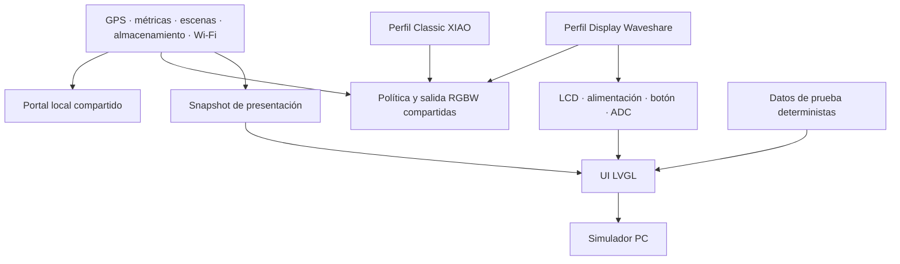

# RGB Dog: variante con Waveshare ESP32-S3-LCD-1.69

Fecha: 2026-09-12. Estado: **Proposed / investigación y plan; firmware no implementado**.

**Orden de ejecución actualizado por el propietario:** [Desarrollo incremental I0–I7](2026-09-12_display-incremental-delivery.md). Primero placa y LEDs, después GPS, pantalla sencilla y consolidación. LVGL, simulador y refinamiento visual se incorporan posteriormente. Este documento conserva la investigación técnica y la arquitectura objetivo.

La versión XIAO sin pantalla continúa activa. Se propone una segunda variante con pantalla y un único núcleo de firmware compartido. Los nombres Classic y Display son provisionales. Este documento está en español por solicitud del propietario.

## Decisión recomendada

Desarrollo del ciclo de diseño y verificación: [Flujo de interfaces con IA](2026-09-12_display-ai-workflow.md), con componentes compartidos, simulador determinista, capturas temporales y aceptación en placa.

Usar la Waveshare como MCU principal de la variante Display. Mantener XIAO en Classic. Ambas conservan GNSS externo, dos tiras RGBW y portal local. Desarrollarlas en el mismo repositorio, con dos targets de compilación y controladores de placa separados. No hace falta instalar IA en el collar: Codex sirve para diseñar, programar y verificar la UI durante el desarrollo.

La fotografía muestra “No Touch” y un título compatible con **ESP32-S3-LCD-1.69**. La identificación es probable; no confirma SKU, autenticidad ni revisión PCB. La wiki mezcla algunas referencias táctiles en texto genérico. Para este plan se asume **sin táctil**; no se configura CST816T ni navegación por gestos sobre el cristal.

## Hardware investigado

| Característica | Especificación publicada |
| --- | --- |
| Pantalla | IPS de 1,69 pulgadas, 240 × 280, esquinas redondeadas |
| Controlador | ST7789V2, SPI de cuatro hilos; RGB565 utilizable |
| Procesador | ESP32-S3, doble núcleo LX7, hasta 240 MHz |
| Memoria | SRAM 512 KB, PSRAM 8 MB, flash 16 MB |
| Radio | Wi-Fi 2,4 GHz y Bluetooth 5 LE |
| Periféricos | IMU QMI8658, RTC PCF85063, buzzer, botones y USB-C |
| Batería | Cargador ETA6098, conector de batería y lectura ADC |

Fuentes: [ficha oficial](https://www.waveshare.com/product/esp32-s3-lcd-1.69.htm) y [wiki del modelo sin táctil](https://www.waveshare.com/wiki/ESP32-S3-LCD-1.69). No incorpora GNSS ni módem celular. El E108-GN02 actual sigue siendo necesario. Brillo en nits, consumo real, masa, dimensiones exteriores exactas, estanqueidad y autonomía quedan sin confirmar; 1,69 pulgadas es la diagonal del panel, no la dimensión de la carcasa.

### Pines: evidencia V2 y propuesta de cableado

Se extrajo y revisó visualmente la única página del [esquema oficial V2](https://files.waveshare.com/wiki/ESP32-S3-LCD-1.69/ESP32-S3-LCD-1.69_V2.pdf). La siguiente asignación describe ese esquema, no una placa física ya identificada.

| Función integrada V2 | GPIO |
| --- | --- |
| LCD DC / CS / SCLK / MOSI / RESET | 4 / 5 / 6 / 7 / 8 |
| Backlight | 15 |
| I²C SCL / SDA | 10 / 11 |
| ADC batería | 1 |
| IMU INT / RTC INT | 38 / 39 |
| SYS_OUT, lectura de botón / SYS_EN, control de alimentación | 40 / 41 |
| Buzzer | 42 |
| USB D− / D+ | 19 / 20 |

Propuesta de asignación externa, condicionada a identificar PCB y verificar continuidad del cable:

| Señal RGB Dog | Classic actual | Display candidato V2 |
| --- | ---: | ---: |
| Datos tira A | GPIO1 | GPIO17 |
| Datos tira B | GPIO2 | GPIO18 |
| GNSS TX → ESP RX | GPIO44 | GPIO44 |
| ESP TX → GNSS RX | GPIO43 | GPIO43 |
| LED externo de estado | GPIO3 | Ausente; representar estado en LCD y píxeles de estado |

GPIO17/18 y UART43/44 están expuestos en P2 del esquema V2. No usar colores del mazo como autoridad. Mantener GNSS en UART1 remapeado y consola por USB CDC. Desactivar correctamente el heartbeat físico cuando el perfil no tenga LED: nunca ejecutar `pinMode(-1)` o `digitalWrite(-1)`.

El conflicto GPIO1 es real: [pins.h](../../Platformio/Dog-RGB/include/pins.h) lo dedica a tira A, mientras la placa lo conecta al divisor de batería. Cargar el firmware XIAO sin adaptar pines no constituye un bring-up válido. Los nombres `SYS_OUT` y `SYS_EN` tampoco se deben interpretar como dos botones independientes. Confirmar polaridad y secuencia con el demo correspondiente a la revisión recibida.

## Encaje con el código existente

Revisión de configuración y código local, apoyada en el grafo del proyecto:

- [platformio.ini](../../Platformio/Dog-RGB/platformio.ini): producción `seeed_xiao_esp32s3` y simulación `wokwi`; Arduino sobre pioarduino 55.03.311, ArduinoJson 7.4.3 y NeoPixel 1.15.5.
- [main.cpp](../../Platformio/Dog-RGB/src/main.cpp): `setup()` inicializa almacenamiento/configuración, escenas, GPS, geofence, LEDs y radio/portal. `loop()` usa ticks cooperativos y mide duración por fase. La pantalla debe respetar ese modelo.
- [config.h](../../Platformio/Dog-RGB/include/config.h): GNSS a 9.600 baud, muestreo 1 Hz y buffer RX de 16 KB. No reducir ese margen para alojar la UI.
- [tabla de particiones](../../Platformio/Dog-RGB/partitions_dog_rgb.csv): ocupa 8 MiB e incluye `tracknvs`. Mantenerla inicialmente en Display si el binario cabe; disponer de flash adicional no obliga a migrar almacenamiento.
- GPS, escenas, LED policy/bus, Wi-Fi y persistencia ya están separados. Aprovechar sus lecturas de estado; la LCD no debe recalcular distancia, geofence, fechas o escenas.

## Arquitectura para dos variantes en paralelo



Estructura propuesta dentro del firmware activo:

```text
include/board/board_profile.h
include/board/xiao_s3.h
include/board/waveshare_lcd169_v2.h
include/display/display_service.h
include/display/display_snapshot.h
src/board/waveshare_lcd169.cpp
src/display/display_service.cpp
src/display/ui/screens.cpp
src/display/ui/theme.cpp
tools/display-simulator/            # en la raíz del repositorio
```

Un perfil de compilación selecciona pines y capacidades físicas; configuración de usuario selecciona brillo, tiempo de apagado o página. Separar `has_display`, `has_touch`, `has_battery_adc`, `has_imu` de `display_ready` y `battery_valid`: que exista el chip no prueba que el driver esté implementado ni que la lectura sea válida.

Añadir un entorno `waveshare_lcd169` y un entorno de diagnóstico `waveshare_lcd169_bringup`. Conservar `seeed_xiao_esp32s3` y su derivación Wokwi. Compartir dependencias comunes; incluir LVGL y driver LCD únicamente en Display, con exclusión real de fuentes y dependencias en Classic. Fijar modelo de flash/PSRAM y USB con una definición de board verificada; no heredar a ciegas el manifest XIAO.

Mantener una rama principal común y ramas cortas por tarea. Cada cambio compartido se compila para ambos dispositivos. Publicar binarios con nombre de placa, revisión, versión y commit. La disponibilidad de dos particiones OTA no significa que exista actualización OTA: esa función sigue fuera del primer alcance.

Un `DisplaySnapshot` de tamaño acotado copiará valores y flags de validez del dominio: velocidad, distancia diaria/sesión, tiempo activo, calidad y antigüedad GNSS, modo/escena, estado AP/STA y voltaje de batería. Sin HTTP contra el propio ESP32, punteros a estado mutable o escrituras NVS desde callbacks de dibujo. Las acciones futuras de UI entrarán por comandos comunes al portal y al dispositivo.

## Stack de interfaz y rendimiento

Para I3 usar **Arduino y un driver LCD mínimo validado**, con texto directo y una sola página. LVGL no es requisito de esa entrega. Para I5, Arduino_GFX + LVGL 8.4.0 es candidato de reproducción: la wiki referencia Arduino_GFX 1.4.9 y LVGL 8.4.0, sin garantizar compatibilidad con el core actual. Resolver la combinación en un smoke test antes de multiplicar vistas; evaluar v9 solo si existe una razón concreta. No mezclar API v8 y v9.

Para una pantalla de estado simple Arduino_GFX solo sería suficiente. LVGL aporta valor aquí por el crecimiento previsto: varias vistas, estilos, navegación y simulación reutilizable. Un editor visual queda opcional; no hace falta una suscripción de diseño para empezar.

El [simulador oficial LVGL 8.4](https://docs.lvgl.io/8.4/get-started/platforms/pc-simulator.html) permite ejecutar UI real en PC. Usar la misma versión de LVGL y los mismos archivos `ui/` que el firmware, con backend SDL/Windows y entradas de teclado equivalentes al botón físico. Una maqueta HTML puede ayudar a elegir estética, pero no valida memoria, SPI ni el resultado LVGL.

Presupuesto calculado de diseño, todavía sin medición:

- Un frame RGB565: `240 × 280 × 2 = 134.400 bytes` (131,25 KiB).
- Dos buffers parciales de 20 filas: `2 × 240 × 20 × 2 = 19.200 bytes` (18,75 KiB).
- A SPI hipotético de 40 MHz, un frame completo necesita al menos 26,88 ms solo de datos. No prometer 60 FPS; comandos y software agregan tiempo.
- Objetivo inicial: datos a 2–5 Hz, animaciones breves hasta 15–20 FPS, refresco por regiones, sin repintado continuo cuando nada cambia. Son objetivos de ingeniería, no especificaciones del panel.

Usar buffers parciales en memoria compatible con el transporte elegido y PSRAM para recursos cuando corresponda. Medir heap interno libre/mínimo, bloque máximo, PSRAM, latencia de UI y máximos del loop. LVGL tiene soporte de [renderizado parcial](https://lvgl.io/docs/open/9.1/porting/display); ese enlace describe API v9 y no debe copiarse literalmente al target v8.

Empezar con un único dueño de LVGL en el loop y transferencias acotadas. Si las mediciones exigen una tarea dedicada, comunicar snapshots por cola y mantener todas las operaciones LVGL en esa tarea. No compartir objetos LVGL entre callbacks Wi-Fi y renderizado.

## Inicialización propuesta en dispositivo

Esta secuencia describe el destino ampliado: I3 incorpora solo alimentación, LCD y texto; pasos LVGL corresponden a I5, y RTC/IMU permanecen opcionales en I7. No activar todos los periféricos desde el primer arranque.

1. Seleccionar perfil al compilar. Establecer enseguida control de alimentación según revisión y demo; mantener apagadas las salidas LED y backlight durante preparación.
2. Inicializar consola, comprobar flash/PSRAM y registrar board ID/revisión. Sin esperas indefinidas a un monitor USB.
3. Cargar NVS, configuración y escenas; iniciar GNSS y geofence, conservando la secuencia funcional actual.
4. Configurar bus SPI, reset ST7789 y ventana visible 240 × 280. Verificar offsets, rotación, orden RGB/BGR e inversión con barras de color y marco de un píxel. No asumir que la memoria 240 × 320 del controlador es toda visible.
5. Crear buffers, LVGL, tema y primera vista. Encender backlight gradualmente tras el primer frame válido.
6. Iniciar I²C y sondear RTC/IMU con timeout. Un fallo de sensor o LCD debe generar diagnóstico y permitir GPS/LEDs/portal; no bloquear el arranque esperando periféricos opcionales.
7. Iniciar el resto del sistema y mantener el orden BLE/Wi-Fi actual si BLE está habilitado. Muestrear botón sin bloquear y publicar snapshots con cadencia limitada.
8. Al vencer el tiempo de pantalla, apagar backlight y suspender refresco. Seguir recibiendo GNSS y ejecutando el collar. Deep sleep del MCU es una función distinta y no debe activarse durante tracking continuo.

El RTC puede mantener hora entre arranques, pero no se convierte automáticamente en fecha GNSS confiable. Conservar las reglas existentes de rollover y validez. Un fallo de PSRAM debe tener salida explícita: degradación si caben buffers mínimos o UI deshabilitada y diagnóstico.

## Diseño de producto y trabajo con Codex

La pantalla sirve para consultar el collar al ponerlo, retirarlo o detenerse. I3 entrega únicamente una página de texto. El catálogo siguiente es una evolución posible desde I5/I6, una vista por incremento:

| Vista | Contenido y estados |
| --- | --- |
| Paseo | Velocidad grande, distancia, tiempo; “Buscando GPS” o dato caducado en vez de 0 falso |
| Luces | Modo, escena y brillo; indicación comprensible si actúa el límite de corriente |
| Conexión | AP disponible, SSID/IP y estado STA; no anunciar enlace activo si está apagado |
| Resumen | Distancia diaria, tiempo activo y batería con validez |

Fondo oscuro, números de 36–48 px, etiquetas de 16–20 px, márgenes iniciales de 16 px ajustados al recorte real, unidades visibles y color acompañado de texto/icono. No reutilizar el portal completo en 240 × 280. El fondo negro mejora contraste; el ahorro principal del LCD se obtiene regulando backlight.

Botón corto: despertar si está apagada; avanzar página si está encendida. Primera iteración solo lectura, sin acciones de borrado o cambios accidentales. Reservar pulsación larga para la política real de alimentación una vez ensayada. No asignar una función incompatible con el circuito de apagado.

Batería: comenzar mostrando voltaje calibrado. Un porcentaje basado en tensión bajo carga puede ser engañoso; si se incorpora, etiquetarlo como estimado y probar reposo/carga. IMU y buzzer son extensiones posteriores. Despertar por movimiento en un collar puede mantenerlo encendido todo el paseo; debe ser opcional y medido. IMU no equivale a diagnóstico de salud ni reemplaza GPS.

Flujo de diseño con IA:

1. Escribir un brief con 240 × 280, no táctil, estados, tipografía, colores y límites de memoria. Elegir una propuesta visual con capturas a escala 1:1 y ampliadas.
2. Pedir a Codex componentes C/C++ LVGL y un tema central; recursos compactos y tipografía con `áéíóúñ`, sin texto incrustado en imágenes decorativas.
3. Alimentar el simulador con fixtures deterministas: arranque, sin fix, paseo, dato viejo, batería desconocida/baja, AP apagado y nombres largos.
4. Exportar PNG de cada estado desde el renderizador real. Codex compara referencia/resultado y corrige recorte, jerarquía y navegación. Guardar baselines revisados, sin aceptarlos automáticamente.
5. Compilar para ambos targets y verificar en placa lectura exterior, colores, consumo, botón y continuidad GNSS. El simulador no sustituye esas mediciones.

La [documentación oficial de entradas de imagen](https://learn.chatgpt.com/docs/image-inputs) confirma capturas/referencias como contexto y el uso de `codex --image`. Ejemplo de encargo futuro:

```text
Implementa la vista Paseo para RGB Dog Display en LVGL 8.4.0.
Resolución 240x280 RGB565, sin táctil, con botón corto para avanzar.
Usa DisplaySnapshot; no recalcules métricas ni accedas a Wi-Fi/NVS desde UI.
Comparte ui/ entre simulador PC y firmware. Incluye estados sin fix,
dato caducado y batería desconocida. Genera capturas reproducibles.
Verifica márgenes de esquinas y texto español. Compila también Classic.
```

## Alimentación y montaje

La propuesta conserva una celda 1S protegida y una rama boost 5 V dimensionada para LEDs. La placa y GNSS tendrán su alimentación adecuada; mantener masa común y adaptador de nivel lógico para las tiras. No alimentar las tiras desde un GPIO o desde la salida 3,3 V de la Waveshare.

El cargador integrado cambia la topología: elegir un único camino de carga de la celda. No conectar en paralelo cargador externo e integrado sin diseñar explícitamente reparto y aislamiento. Comprobar polaridad y paso del conector físico, corriente de carga configurada, protección de la celda, comportamiento USB+batería y corriente admisible de conector/pistas. La corriente anunciada de un chip no determina la capacidad térmica de la placa montada.

Actualizar el presupuesto de corriente del collar por perfil y medir pantalla apagada, brillo mínimo/medio/máximo, Wi-Fi transmitiendo y LEDs limitados. El limitador LED actual estima consumo; no mide toda la batería. Autonomía se calcula con energía útil y potencia media medidas, incluyendo eficiencia del boost, no sumando directamente corrientes de rieles a distintas tensiones.

Enclosure independiente para Display: medir PCB/pantalla, altura de conectores y radio de cables; ventana protegida, acceso al botón/USB, alivio de tensión y espacio de antena. Evaluar masa y balance sobre el collar. La ilustración comercial no acredita resistencia al agua. Ensayar primero en banco temperatura, consumo y mecánica.

## Ejecución por incrementos y criterios de aceptación

| Incremento | Entregable | Aceptación resumida |
| --- | --- | --- |
| I0 | Baseline Classic y perfil Waveshare | Builds registrados, placa identificada y arranque verificable |
| I1 | Dos tiras LED | RGBW, independencia y apagado probados en banco |
| I2 | GPS junto a LEDs | NMEA, fix, pérdida/recuperación y convivencia verificados |
| I3 | Una página de texto | Datos reales, validez y funcionamiento con LEDs/GPS |
| I4 | Base funcional consolidada | Portal, persistencia y carga conjunta comprobados |
| I5 | Paseo con IA/LVGL | Una vista mejorada y simulación mínima, sin regresión |
| I6 | Navegación y animación gradual | Botón, segunda vista y después transición medida |
| I7 | Extensiones opcionales | Una función y aceptación específica por entrega |

Los criterios detallados y dependencias están en el [plan incremental](2026-09-12_display-incremental-delivery.md). Un incremento funcional activo; si falta placa, avanzar trabajo independiente sin declarar cerrada su validación física. No mantener dos copias divergentes de GPS, escenas o portal.

Pruebas específicas futuras: selección de perfiles sin pines duplicados, rutas de LED de estado ausente, transiciones del botón y timeout con rollover de `millis()`, snapshots inválidos, ADC fallido, OOM de UI, largas respuestas HTTP con GNSS continuo, cambios de escena durante animación y apagado/despertar repetido. Ejecutar la suite host existente y Wokwi Classic; no anunciar simulación de la placa Waveshare sin verificar soporte de sus periféricos.

## Alcance y pendientes de esta investigación

### Ampliación: interfaces bonitas y fluidas (investigación web, 2026-09-12)

Investigación aplicable desde I5: UI propia con LVGL y simulador reproducible; editor visual opcional. Diseñar una sola vista Paseo y medirla en la Waveshare antes de extender el catálogo. Estas herramientas no son requisitos de I0–I4 y no han sido instaladas ni probadas en este repositorio.

| Camino | Evidencia y aplicación propuesta |
| --- | --- |
| LVGL C/C++ + Codex + simulador | Máximo control del código y las pruebas; mantener tema, vistas y fixtures separados. Es la ruta base sin editor propietario. |
| EEZ Studio | Editor gratuito y abierto con soporte LVGL 8.x/9.x. Buena opción para ajustar composición visual; mantener lógica del collar en C++ y una única fuente editable para lo generado. [Repositorio oficial](https://github.com/eez-open/studio) |
| SquareLine Studio | Edición visual y exportación de UI a C. Alternativa si resulta más cómodo su flujo; comprobar versión exacta del exportador y condiciones antes de adoptarlo. [Documentación del editor](https://docs.squareline.io/docs/layout/) |
| LVGL Pro Editor | XML, edición visual, previsualización LVGL y generación C; adecuado para que una IA edite componentes declarativos. La versión LVGL del proyecto debe concordar con el exportador, sin asumir compatibilidad con el demo v8. [Editor oficial](https://lvgl.io/docs/pro/editor/overview) |

Distinción de licencia relevante para automatización: el **Editor** LVGL Pro permite uso personal/no comercial gratuito, según su [licencia publicada](https://lvgl.io/docs/pro/editor/license). Su **CLI**, que valida, compila, genera C y captura PNG sin GUI, exige licencia Professional/Product/Platform y no está disponible con Community/Evaluation. Por tanto, no presupuestar automatización gratuita con `lvglpro screenshot`. [Documentación CLI](https://lvgl.io/docs/pro/cli)

LVGL publica un flujo de IA basado en documentación MCP, ejemplos XML y validación/capturas. Esto respalda un ciclo concreto de editar → compilar → renderizar → comparar, pero no prueba que el MCP esté configurado aquí. La alternativa gratuita sigue siendo un pequeño ejecutable de simulación propio que guarde PNG. [Integración de IA oficial](https://lvgl.io/docs/pro/ai)

#### Dirección visual específica

Propuesta de diseño, no especificación del fabricante: estética de instrumento deportivo compacto. Fondo casi negro, texto marfil, acento verde lima o cian, y ámbar/rojo reservados para estados. Un dato principal por vista, dos secundarios y una barra pequeña de estado. Usar ancho estable para números y unidades; evitar saltos de alineación entre `9.9` y `10.0`. Los estados “sin fix” y “dato antiguo” deben tener composición deliberada, no parecer errores de layout.

Paseo: encabezado corto; velocidad en el centro; distancia y tiempo debajo; puntos de página al pie. Luces: nombre de escena y una muestra pequeña de paleta. Conexión: estado e IP legibles. Resumen: distancia diaria y tiempo activo. Diseñar pensando en consulta breve y en movimiento: Google recomienda información interpretable de un vistazo y pruebas con distracción para wearables. Aquí se toman esos principios visuales, no el runtime Android ni sus gestos táctiles. [Guía de wearables](https://developer.android.com/design/ui/wear/guides/get-started/design-for-wearables?hl=en)

Referencia de implementación: el [demo smartwatch de LVGL](https://github.com/lvgl/lv_demos/blob/master/src/smartwatch/lv_demo_smartwatch.c) permite estudiar composición y transiciones. Su código recomienda 384 × 384; no es un ejemplo listo para 240 × 280 ni un benchmark de esta placa. Adaptar jerarquía y densidad en vez de reducir toda la pantalla proporcionalmente.

#### Movimiento deliberado

Valores iniciales propuestos para experimentar:

| Interacción | Tratamiento |
| --- | --- |
| Pulsar botón | Respuesta visual inmediata; objetivo inicial de latencia p95 menor de 100 ms |
| Cambiar página | Desplazamiento corto de elementos centrales, 160–220 ms, desaceleración suave |
| Cambio de estado | Transición breve de icono/color, 100–160 ms, texto explícito |
| Despertar | Rampa de backlight de 150–250 ms tras preparar el frame |
| GPS esperando | Indicador discreto de área pequeña; detener animación al apagar pantalla |

Evitar animaciones que persigan datos falsos: mostrar la velocidad válida recibida; una transición decorativa no modifica métricas ni predice movimiento. Las alertas no esperan a que termine una animación. Pulsaciones repetidas interrumpen o sustituyen una transición; no se acumulan en una cola larga. LVGL dispone de animaciones y curvas temporales para implementarlo sin bucles bloqueantes. [Animaciones v8.4](https://lvgl.io/docs/open/8.4/overview/animation.html)

#### Fluidez en esta pantalla SPI

1. Reutilizar widgets; actualizar etiquetas únicamente cuando cambia su representación visible. Mantener fondo y barra de estado quietos durante transiciones centrales.
2. Refrescar regiones modificadas. Ensayar dos buffers de 20, 40 y 70 filas y comparar tiempo de transferencia, frame time y heap. Los dos buffers solapan dibujo y envío solamente con transporte realmente asíncrono, por ejemplo DMA. Notificar `lv_disp_flush_ready` cuando el buffer pueda reutilizarse, nunca antes de terminar el envío. [Interfaz de display v8.4](https://lvgl.io/docs/open/8.4/porting/display.html)
3. Evitar zoom/rotación de contenedores grandes, transparencias de pantalla completa y sombras animadas extensas. LVGL documenta capas intermedias y asignaciones adicionales para algunas transformaciones y opacidades. [Estilos v8.4](https://lvgl.io/docs/open/8.4/overview/style.html)
4. Preconvertir recursos y limitar glifos necesarios; conservar antialiasing del texto. Empezar con geometría simple y un icono de mascota pequeño. Fondos animados y GIF de pantalla completa quedan fuera del MVP por su área de refresco y decodificación.
5. Considerar `esp_lcd`/adaptadores Espressif si el driver inicial resulta bloqueante. No asumir que una migración o PSRAM adicional elimina el cuello de botella SPI. Los modos antitearing RGB/MIPI del adaptador no están soportados para su ruta SPI. Dos buffers de dibujo no garantizan ausencia de tearing en el panel. [ESP LVGL Adapter](https://docs.espressif.com/projects/esp-iot-solution/en/latest/display/tools/esp_lvgl_adapter.html)

Objetivo base: 20 FPS estables durante movimiento; explorar 30 FPS para regiones pequeñas si las mediciones lo permiten. Esto afina el objetivo previo de 15–20 FPS sin convertirlo en rendimiento garantizado. A 40 MHz hipotéticos, 30 frames completos consumen 32,256 Mbit/s antes de overhead; 60 requieren 64,512 Mbit/s. La frecuencia soportada y estable debe verificarse en el panel concreto.

Medir frame times p50/p95/máximo, tiempo SPI, área actualizada, latencia botón→frame, heap mínimo y continuidad GNSS. Repetir con Wi-Fi y ambas tiras activas. Capturas sirven para composición; usar una secuencia temporal o vídeo y medición en dispositivo para juzgar fluidez. Criterio de elección de herramienta: producir la misma vista, exportarla, compilarla y capturar sus estados; elegir la que mantenga mejor el ciclo reproducible con menos trabajo manual.

Se revisaron fuentes oficiales, el esquema V2 y puntos de integración del repositorio. Se creó este plan y se enlazó en índices. No se agregó target, driver, UI, cableado o firmware validado; no se compilaron binarios por tratarse de cambios documentales.

Pendientes físicos decisivos: SKU/revisión real, polaridad del cable de batería, demo correcto de encendido, corriente de carga, dimensiones/masa y consumo. Ninguno se deduce con certeza de la captura de compra. Próximo incremento: I0, baseline Classic y perfil mínimo de placa; después I1, LEDs. El simulador visual corresponde a I5.
