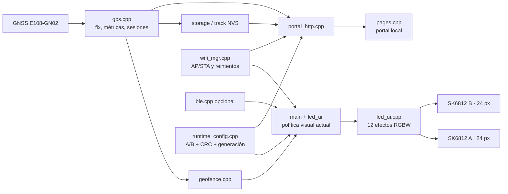
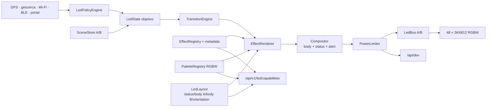
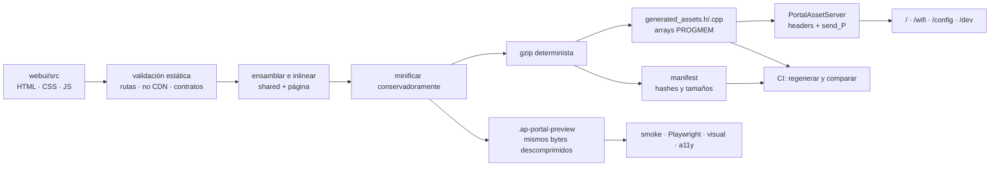

# RGB Dog × WLED: análisis técnico y plan de implementación

> Fecha del análisis: 2026-08-12
>
> RGB Dog analizado en: `eb8ab3e622a142422baeaaf32bf8cb5fcb4a0e30` (`main`)
>
> WLED analizado en: [`v16.0.1`](https://github.com/wled/WLED/releases/tag/v16.0.1), commit `29b389df1c1aaec6ff53aea742d17063b985906c`
>
> Alcance: firmware activo, portal local, persistencia, pruebas, CI y patrones transferibles desde WLED.

## Resumen ejecutivo

RGB Dog ya tiene una base mucho más seria de lo que aparenta un proyecto DIY: separa GPS, geocerca, sesiones, almacenamiento, Wi-Fi, BLE, portal y UI LED; mantiene configuración crítica con dos slots, CRC y generaciones; tiene telemetría de desarrollo; y prueba tanto lógica host como el portal y Wokwi.

La recomendación no es reemplazar el firmware por WLED ni copiar su arquitectura. WLED es excelente como laboratorio de iluminación, compatibilidad y operación en ESP, pero su núcleo también acumula archivos gigantes, estado global y funciones muy complejas. RGB Dog debe aprender sus conceptos, no heredar su tamaño.

Las ideas de mayor retorno para este collar son, en este orden:

1. **Límite de corriente estimada por frame**, para proteger batería, regulador, pistas y LEDs.
2. **Registro estable de efectos con metadatos**, para que firmware y portal compartan capacidades reales.
3. **Estado LED separado de la política del producto**, evitando que GPS, Wi-Fi, geocerca y renderizado sigan creciendo dentro de una sola función.
4. **Segmentos semánticos pequeños**, no el editor arbitrario de WLED: estado, cuerpo A, cuerpo B y alerta.
5. **Paletas RGBW y transiciones cruzadas**, para producir cambios más bonitos sin agregar docenas de efectos casi iguales.
6. **Escenas/presets seguros y pocos**, almacenados con la misma disciplina transaccional que ya usa RGB Dog.
7. **UI web editable y compilada a assets comprimidos**, en vez de continuar ampliando grandes strings HTML dentro de C++.

No recomiendo priorizar MQTT, Alexa, DMX, Art-Net, 250 presets, cientos de paletas, segmentos arbitrarios, un sistema completo de plugins o compatibilidad con el JSON de WLED. Son buenas capacidades para WLED, pero distraen del producto y aumentan superficie de prueba, consumo y mantenimiento.

## Cómo se hizo el análisis

- Se indexaron ambos repositorios como grafos de código y se siguieron llamadas, módulos, complejidad y dependencias.
- Para WLED se usó el tag estable exacto `v16.0.1`; no se tomaron decisiones desde `main` ni desde builds nocturnos.
- Se contrastó el código con la documentación y las páginas de release oficiales.
- Se ejecutó la suite host disponible de RGB Dog y el smoke test de las páginas.
- En el análisis inicial PlatformIO no estaba disponible localmente. Durante la Fase 0 se instaló el entorno fijado, se reparó una extracción parcial del framework y se completaron un build limpio y otro incremental con `SUCCESS`.

Este documento distingue entre hechos observados, propuestas y trabajo opcional. Las estimaciones son rangos de esfuerzo de ingeniería, no fechas prometidas.

## 1. Estado actual de RGB Dog

### 1.1 Arquitectura recuperada

El firmware activo está en [`Platformio/Dog-RGB`](../Platformio/Dog-RGB). La secuencia real de arranque y el bucle principal viven en [`src/main.cpp`](../Platformio/Dog-RGB/src/main.cpp).



Características confirmadas:

- XIAO ESP32-S3, GNSS, dos tiras SK6812 RGBW de 24 LEDs y batería 21700.
- Portal local en AP/STA, con BLE opcional y lógica de coexistencia.
- Doce efectos actuales: sólido, pulso, respiración, chase, comet, sinelon, confetti, juggle, BPM, rainbow, fire y gradient wave.
- Los dos primeros píxeles se usan como estado; los restantes funcionan como cuerpo.
- El modo show baraja efectos, evita repeticiones inmediatas e interpola colores.
- Endpoints para resumen, estado, desarrollo, configuración, Wi-Fi, home/geocerca, tracks CSV/GeoJSON y portal cautivo.
- Configuración persistente versionada con dos registros, CRC, generación y migraciones.
- Particiones OTA A/B ya reservadas, aunque no se encontró un flujo OTA implementado.

### 1.2 Lo que el repositorio ya hace especialmente bien

#### Persistencia resistente

[`runtime_config.cpp`](../Platformio/Dog-RGB/src/config/runtime_config.cpp) valida dos copias, selecciona la generación válida más reciente y contempla migraciones. La actualización HTTP intenta persistir y restaura el estado anterior si falla. Para un dispositivo que puede perder alimentación en cualquier momento, esto es mejor fundamento que guardar JSON de configuración con escrituras aleatorias.

Esta propiedad debe conservarse al agregar escenas, calibración eléctrica o nuevos parámetros. WLED usa archivos para varias de estas tareas; en RGB Dog no hay razón para abandonar el mecanismo robusto que ya existe.

#### Dominio propio, no firmware LED genérico

GPS, calidad del fix, geocerca, sesiones, almacenamiento de recorrido y exportación son capacidades de producto reales. La política de AP sensible al estado del dispositivo también es más apropiada que una política Wi-Fi genérica. WLED no reemplaza ninguna de estas piezas.

#### Observabilidad útil

`/api/dev` expone heap, uptime, build, slots y fallos de almacenamiento, estado y eventos Wi-Fi, métricas GPS, edades de datos, geocerca, efecto actual y modo diurno. Es una base excelente para sumar corriente estimada, factor del limitador, tiempo de frame y memoria del motor visual.

#### Pruebas variadas

Hay pruebas host de contratos y lógica, smoke test HTML, Playwright, regresión visual, escenarios Wokwi y compilación de firmware en CI. El proyecto ya posee los lugares correctos para verificar una refactorización incremental.

### 1.3 Deuda y riesgos observados

| Hallazgo | Evidencia | Riesgo | Decisión sugerida |
|---|---|---|---|
| La política y el render LED están mezclados | `update_led_ui()` consulta GPS, Wi-Fi, geocerca y modo, selecciona efecto, renderiza y aplica estado | Cada nueva regla multiplica combinaciones y regresiones | Separar `LedPolicyEngine`, `LedState`, transición y renderer |
| Un switch concentra los 12 efectos | `apply_effect()` recibe 9 parámetros y conoce todos los modos | Difícil describir capacidades en la UI o probar efectos aisladamente | Registro de efectos con ID estable, función y metadatos |
| No se limita corriente por frame | `show_leds()` convierte RGB a RGBW y escribe; brillo acepta 1–255 | Picos de corriente, caída de tensión, calor, resets o menor autonomía | Estimador y limitador global/per-bus calibrado en banco |
| Segmentación implícita | Dos píxeles de estado y cuerpo se deducen dentro del código | Orientación, simetría y overlays terminan hardcodeados | Layout semántico fijo y pequeño |
| Transición show en dos tiempos | Fade-out y luego fade-in | Se ve como apagado entre escenas; no preserva continuidad | Crossfade entre frame anterior y nuevo |
| HTML/JS grande incrustado en C++ | `pages.cpp` tiene unas 2.387 líneas; la página de configuración ronda 879 | Edición frágil, builds ruidosos y crecimiento de `String` | Fuente web separada, minificada y comprimida al compilar |
| Archivos centrales muy grandes | `gps.cpp` ~2.944, `pages.cpp` ~2.387, `portal_http.cpp` ~1.293, `wifi_mgr.cpp` ~1.127, `led_ui.cpp` ~1.056 líneas | Alta carga cognitiva y más conflictos de edición | Cortes por responsabilidad, sin reescritura total |
| Contrato documentado desalineado | `architecture.md` describe BLE después del portal; el código inicia BLE antes de Wi-Fi por coexistencia | Un mantenedor puede cambiar el orden y reintroducir un fallo | Corregir documentación en la primera fase |
| Suite host no está en CI | Los jobs cubren portal, visuales y firmware, pero no ejecutan `unittest discover` | Una regresión lógica puede entrar aunque el build pase | Añadir job obligatorio y rápido |
| OTA particionado, pero no implementado | `app0`/`app1` existen; no se encontró updater | Capacidad tentadora pero seguridad/rollback sin cerrar | Mantener como fase opcional, local y con desbloqueo físico |
| Licencia del proyecto resuelta después de este análisis | Se añadió la licencia [MIT](../LICENSE), documentada en [ADR-0002](adr/0002-project-license-mit.md) | La licencia propia no concede derechos sobre material externo | Mantener trazabilidad y revisar compatibilidad antes de copiar código de WLED |

Los cinco archivos C++ activos más grandes concentran aproximadamente 8.807 de 11.205 líneas, cerca del 79 %. Esto no exige partir todo de inmediato: sí indica dónde evitar agregar la próxima capa de comportamiento.

### 1.4 Línea base de verificación

Se ejecutó desde `Platformio/Dog-RGB`:

```text
python -m unittest discover -s test -p "test_*.py" -v
```

Resultado: **114 pruebas, 112 pasan y 2 fallan**.

Las dos fallas parecen contratos estáticos desactualizados que deben revisarse, no una conclusión automática de que el firmware esté roto:

1. Una prueba espera cuatro apariciones de `persist_config_or_restore(previous)` y el código actual contiene tres.
2. Una prueba de credenciales espera `{"ok":false,"reason":"storage"}`, mientras el handler actual responde `{"status":"error","reason":"storage"}`.

También se ejecutó `python tools/web_pages_smoke.py` con resultado satisfactorio. La Fase 0 produjo después la línea base local: 56.644 bytes de RAM (17,3 %) y 1.171.295 bytes de flash de aplicación (35,0 %); CI repetirá y archivará la medición por commit.

## 2. Qué hace bien WLED y por qué importa aquí

WLED es un firmware maduro para control de iluminación en ESP8266/ESP32. La release estable usada en este análisis, [`v16.0.1`](https://github.com/wled/WLED/releases/tag/v16.0.1), ofrece segmentos, efectos, paletas, presets, playlists, límites de corriente, JSON/HTTP, actualizaciones OTA, múltiples tipos de salida y una UI embebida. Su repositorio oficial es [Aircoookie/WLED](https://github.com/wled/WLED).

Su mayor lección no es la cantidad de efectos. Es que modela la iluminación como un pequeño sistema:

```text
estado deseado
  → segmento/layout
  → efecto + paleta + parámetros
  → transición/composición
  → bus físico y orden de color
  → estimación de potencia
  → frame mostrado
```

### 2.0 Matriz de transferencia

| Idea de WLED | Estado en RGB Dog | Decisión | Fase |
|---|---|---|---|
| Límite automático de brillo/corriente | No existe por frame | Adoptar y calibrar para dos buses RGBW | 1 |
| Registro + metadatos de efectos | Enum/switch y formulario acoplado | Adaptar en una tabla estática con IDs existentes | 2 |
| Estado declarativo/capabilities JSON | APIs parciales y catálogo duplicable | Adaptar con endpoints propios versionados | 2 |
| Segmentos, reverse y mirror | Dos regiones implícitas | Reducir a layout semántico fijo | 3 |
| Paletas independientes del efecto | Colores A/B por rango | Adoptar un catálogo curado RGBW | 3 |
| Transición que mezcla efecto viejo/nuevo | Fade-out seguido de fade-in | Adoptar crossfade por buffers | 3 |
| Presets y playlists | Show aleatorio; perfiles diseñados pero pendientes | Adaptar a 4 built-ins + 4 slots A/B | 4 |
| Assets web generados y comprimidos | HTML/JS como strings C++ | Adoptar pipeline fuente → gzip → header | 5 |
| Usermods | BLE opcional, futuros sensores | Reducir a hooks estáticos mínimos | 6, opcional |
| OTA con particiones A/B | Particiones existen, updater no | Adaptar solo local, protegido y con rollback | 7, opcional |
| WebSocket/live preview | No existe | Posponer; preview cliente primero | Backlog |
| Protocolos e integraciones masivas | No son parte del producto | No adoptar sin caso de uso | Fuera |

### 2.1 Servicio no bloqueante y estado por segmento

[`WS2812FX::service()`](https://github.com/wled/WLED/blob/v16.0.1/wled00/FX_fcn.cpp#L1318-L1386) recorre segmentos activos, respeta el tiempo de siguiente frame y mantiene runtime por segmento. Durante una transición puede renderizar el efecto viejo y el nuevo y mezclarlos antes de mostrar.

Aplicación en RGB Dog:

- Mantener `loop()` no bloqueante.
- Dar a cada efecto un runtime explícito en vez de depender de estado disperso.
- Renderizar hacia buffers, no directamente a los LEDs.
- Hacer crossfade real al cambiar de escena, modo o efecto.

Con 48 píxeles, dos buffers RGBW son pequeños; el costo de memoria es razonable y debe medirse, no suponerse.

### 2.2 Registro de efectos y metadatos

WLED relaciona un ID, una función de render y metadatos que describen sliders, colores, paleta y valores por defecto. El endpoint `fxdata` permite que la UI muestre controles relevantes en lugar de un formulario genérico para todo. Véanse [`FX.h`](https://github.com/wled/WLED/blob/v16.0.1/wled00/FX.h) y la [documentación de efectos](https://kno.wled.ge/features/effects/).

Aplicación en RGB Dog:

- Mantener IDs numéricos estables porque ya se persisten.
- Añadir una clave textual estable, por ejemplo `breath` o `gradient_wave`.
- Declarar si un efecto usa colores A/B, paleta, velocidad o intensidad.
- Declarar defaults y rango útil, no solo 0–255.
- Etiquetar efectos de alto parpadeo como `advanced`/`strobe-risk`; nunca hacerlos default en un wearable para un animal.

Un registro mínimo puede ser estático, sin `std::function`, RTTI ni asignación dinámica:

```cpp
struct EffectDescriptor {
  uint8_t id;
  const char* key;
  const char* label;
  EffectRenderFn render;
  uint8_t controls;
  EffectDefaults defaults;
  EffectSafetyClass safety;
};
```

### 2.3 Segmentos como layout, no como editor infinito

Los [segmentos de WLED](https://kno.wled.ge/features/segments/) soportan inicio/fin, grouping, spacing, offset, reverse, mirror y, en v16, composición de capas. Es potentísimo, pero trasladarlo completo sería excesivo.

RGB Dog necesita una versión semántica:

- `status`: los LEDs reservados para estado operativo.
- `body_left` y `body_right`: las dos ramas físicas, cada una con orientación declarada.
- `body_all`: vista virtual continua para un efecto simétrico.
- `alert`: overlay lógico de máxima prioridad, no un tercer cable físico.

Esto resuelve una necesidad concreta: mantener visible una advertencia de geocerca o GPS sin destruir por completo el efecto del cuerpo, y representar correctamente una tira instalada en sentido inverso.

No se propone permitir al usuario crear segmentos arbitrarios en el portal.

### 2.4 Límite automático de brillo/corriente

[`BusManager::applyABL()`](https://github.com/wled/WLED/blob/v16.0.1/wled00/bus_manager.cpp#L1483-L1524) estima el consumo y reduce el brillo cuando el frame superaría el presupuesto configurado. WLED expone límites globales y por salida; su [documentación de ajustes](https://kno.wled.ge/features/settings/) explica el presupuesto de corriente y la estimación por píxel.

Esta es la idea más importante para RGB Dog porque es un dispositivo de batería y va puesto sobre un animal. El objetivo no es prometer una medición eléctrica exacta desde software, sino impedir que un frame blanco o un efecto denso solicite más corriente de la que el sistema fue diseñado para entregar.

Propuesta:

1. Estimar corriente desde R, G, B, W y corriente base por píxel.
2. Sumar ambos buses y el consumo fijo configurable del dispositivo.
3. Calcular `scale = min(1, budget / estimate)`.
4. Aplicar el factor al frame final, después de overlays y antes de escribir.
5. Filtrar cambios bruscos del factor para evitar bombeo visible.
6. Exponer estimado, presupuesto, factor y contador de frames limitados en `/api/dev`.
7. Calibrar los coeficientes con una fuente/medidor en banco y guardar un perfil conservador por defecto.

El límite de software complementa fusible, cableado, regulador, ventilación y protección de batería; no los sustituye.

### 2.5 Paletas separadas del movimiento

Las [paletas de WLED](https://kno.wled.ge/features/palettes/) desacoplan la geometría temporal del efecto y la selección de color. Esto multiplica variedad sin multiplicar el código.

RGB Dog no necesita el catálogo enorme de WLED. Una primera biblioteca de seis a ocho paletas RGBW pensadas para el collar sería suficiente:

- `Safety Amber`: ámbar/blanco cálido, alta legibilidad.
- `Night Red`: rojo tenue, baja perturbación nocturna.
- `Ocean`: azul/cian/blanco.
- `Forest`: verde/menta/blanco.
- `Pride`: arcoíris curado.
- `Heat`: rojo/naranja/amarillo.
- `Ice`: blanco frío/azul.
- `Custom A-B`: gradiente desde los colores actuales del usuario.

El canal blanco debe tratarse intencionalmente. La conversión actual `W = min(R,G,B)` es una buena primera extracción RGBW, pero paletas y estimador eléctrico deben compartir exactamente la misma transformación para que la vista previa y el cálculo sean coherentes.

### 2.6 Presets y playlists

Los [presets de WLED](https://kno.wled.ge/features/presets/) guardan estados nombrados y pueden encadenarse en playlists. Es una gran idea de producto, con una adaptación importante: la propia documentación advierte que escrituras aleatorias de LittleFS pueden bloquear temporalmente el dispositivo. RGB Dog ya posee un patrón A/B con CRC que encaja mejor.

Propuesta inicial:

- Cuatro escenas integradas, no editables: `Seguridad`, `Calmado`, `Activo`, `Fiesta`.
- Hasta cuatro escenas del usuario.
- Una escena contiene efecto, paleta, brillo objetivo, velocidad, intensidad, transición y política de estado.
- Nunca contiene Wi-Fi, PIN, home/geocerca ni secretos.
- Guardado transaccional A/B y esquema versionado.
- Export/import JSON validado como comodidad, no como almacenamiento primario.

Una playlist compleja no es necesaria al principio. El modo show existente puede migrar para consumir escenas y mantener su bolsa barajada.

### 2.7 API de estado y capacidades

La [JSON API de WLED](https://kno.wled.ge/interfaces/json-api/) separa estado mutable, información del dispositivo y catálogos de efectos/paletas. No conviene copiar su esquema, pero sí el principio de descubrimiento de capacidades.

Agregar endpoints versionados y aditivos:

```text
GET   /api/v1/led/state
PATCH /api/v1/led/state
GET   /api/v1/led/capabilities
GET   /api/v1/scenes
POST  /api/v1/scenes/:slot/apply
PUT   /api/v1/scenes/:slot
```

`/api/v1/led/capabilities` debería publicar:

- versión del esquema;
- layout y orientación;
- efectos con ID, clave, nombre, controles, defaults y clase de seguridad;
- paletas disponibles;
- límites válidos y soporte de transición;
- presupuesto eléctrico configurado, sin información sensible.

Los endpoints actuales deben mantenerse durante una ventana de compatibilidad. El portal puede migrar primero; clientes externos después.

### 2.8 UI fuente → bundle comprimido

WLED mantiene HTML/CSS/JS como fuentes editables y usa herramientas de build para minificar, comprimir e incrustar assets, por ejemplo [`tools/cdata.js`](https://github.com/wled/WLED/blob/v16.0.1/tools/cdata.js) y [`pio-scripts/build_ui.py`](https://github.com/wled/WLED/blob/v16.0.1/pio-scripts/build_ui.py).

RGB Dog ya usa Node y Playwright, así que puede adoptar un pipeline sencillo sin framework:

```text
webui/src/*.html, *.css, *.js
  → lint/test
  → minify
  → gzip determinista
  → include/web/generated_assets.h
  → Async/HTTP response con Content-Encoding: gzip
```

El archivo generado debe verificarse en CI o generarse dentro del build de forma reproducible. El portal debe seguir funcionando sin internet y conservar las pruebas visuales actuales.

### 2.9 Extensiones opcionales pequeñas

Los [usermods de WLED](https://kno.wled.ge/advanced/custom-features/) ofrecen hooks amplios para setup, loop, JSON, configuración, red y eventos. Copiar esa interfaz sería prematuro. Sí resulta útil una interfaz estática mínima para futuras capacidades como IMU o sensor cardiaco:

```cpp
struct OptionalModule {
  void (*setup)();
  void (*tick)(uint32_t now_ms);
  void (*append_dev_json)(JsonObject out);
};
```

Debe compilarse por flags, sin carga dinámica ni gestor de plugins. La funcionalidad avanzada seguirá siendo opcional, coherente con el carácter DIY del proyecto.

## 3. Qué no copiar de WLED

### 3.1 No copiar su forma monolítica

En el tag analizado, `FX.cpp` supera 11.000 líneas y otros archivos centrales también son muy grandes. Funciones de deserialización y el loop coordinan numerosas responsabilidades y dependen de mucho estado global. Es deuda asumible para un proyecto con años de compatibilidad, pero no una plantilla deseable para RGB Dog.

### 3.2 No copiar código externo sin resolver procedencia y compatibilidad

WLED se distribuye bajo [EUPL-1.2](https://github.com/wled/WLED/blob/v16.0.1/LICENSE). RGB Dog adoptó posteriormente la licencia [MIT](../LICENSE), pero esa decisión no concede permiso para relicenciar material de WLED. Se mantiene una implementación **clean-room de los patrones**, apoyada en comportamiento y documentación, sin copiar y pegar `FX.cpp`, `bus_manager.cpp`, assets o efectos.

Antes de reutilizar código literal se deben revisar procedencia, compatibilidad, atribución y obligaciones de distribución. Este punto es una alerta de ingeniería, no asesoría legal.

### 3.3 No adoptar toda su superficie de integraciones

Por ahora quedan fuera:

- MQTT, Alexa, Hue, Home Assistant y automatizaciones externas.
- DMX, Art-Net, DDP y protocolos de live streaming.
- Múltiples redes Wi-Fi y un editor de red avanzado.
- Cientos de paletas y efectos.
- Editor arbitrario de segmentos/capas.
- 250 presets y playlists recursivas.
- Sistema completo de usermods.
- Compatibilidad binaria o de API con WLED.

Cada una puede reabrirse si aparece un caso de uso real. No debe entrar solo porque WLED la tenga.

## 4. Arquitectura objetivo propuesta



### Responsabilidades

| Pieza | Responsabilidad | No debe conocer |
|---|---|---|
| `LedPolicyEngine` | Traducir GPS/Wi-Fi/geocerca/modo a intención visual y prioridad | Buffers, pines o protocolo SK6812 |
| `LedState` | Estado serializable: escena, efecto, paleta, parámetros, brillo, transición | Reglas de GPS |
| `EffectRegistry` | Descriptor estático y lookup por ID/clave | HTTP o NVS |
| `EffectRenderer` | Generar colores virtuales determinísticamente desde tiempo/runtime | Estado Wi-Fi |
| `LedLayout` | Mapear índices virtuales a buses, reverse y regiones semánticas | Efectos concretos |
| `Compositor` | Mezclar cuerpo, estado y alerta según prioridad | GPIO |
| `PowerLimiter` | Estimar y escalar el frame final | Motivo semántico del color |
| `LedBus` | Conversión RGB→RGBW, orden de color y escritura física | Geocerca, escenas o portal |
| `SceneStore` | Validar/versionar/persistir escenas A/B | Render en tiempo real |

### Reglas de diseño

- Cero asignaciones dinámicas en el hot path LED.
- IDs persistidos nunca cambian de significado; un efecto eliminado deja un slot reservado.
- El estado operativo crítico siempre gana sobre decoración.
- Las transiciones nunca ocultan una alerta nueva esperando terminar un fade.
- El renderer recibe tiempo explícito para permitir pruebas deterministas.
- API, UI y firmware leen el mismo registro de capacidades.
- La configuración simple sigue siendo simple; calibración y tuning quedan detrás de “Avanzado”.

## 5. Plan de implementación

### Fase 0 — Recuperar una línea base confiable

**Esfuerzo:** 1–2 días. **Prioridad:** inmediata.

**Estado 2026-08-12:** ejecutada en software. La suite host queda en 114/114; el build local de producción termina con `SUCCESS`, 17,3 % de RAM y 35,0 % de flash; y CI captura tests, entorno, tamaño y artefactos. Las mediciones eléctricas siguen pendientes de hardware/BOM/instrumentos; véanse el [registro de baseline](baselines/fase-0-2026-08-12.md) y la [ADR de procedencia/licencia](adr/0001-wled-clean-room-y-licencia-del-proyecto.md).

Trabajo:

- Revisar las dos pruebas host fallidas y decidir cuál contrato es correcto en cada caso.
- Dejar las 114 pruebas verdes.
- Agregar `python -m unittest discover ...` como job requerido de CI.
- Capturar desde PlatformIO/CI tamaño de firmware, RAM estática y entorno exacto.
- Documentar el orden real BLE → Wi-Fi y la razón de coexistencia.
- Crear un ADR de licencia antes de importar cualquier fuente de WLED.
- Registrar mediciones físicas actuales: corriente en idle, blanco máximo, efecto típico y temperatura del regulador/batería.

Criterio de salida:

- Suite host, smoke web, Playwright, visuales, Wokwi y build verdes.
- Métricas de flash/RAM archivadas como baseline.
- Presupuesto eléctrico provisional documentado.

### Fase 1 — Seguridad eléctrica y bus medible

**Esfuerzo:** 3–5 días. **Prioridad:** alta.

**Estado 2026-08-12:** implementación de software completa. `LedFrame`, `LedBus`, conversión RGBW única, `PowerLimiter` global, esquema 6 con migración v5, controles avanzados, telemetría y pruebas están integrados. Los builds de producción/Wokwi, 121 pruebas host, smoke y 75 pruebas Playwright quedan verdes; los 17 baselines visuales se regeneraron y compararon en el contenedor fijado. La calibración de corriente/temperatura en el collar físico sigue pendiente; véase el [registro de Fase 1](baselines/fase-1-2026-08-12.md).

Trabajo:

- Introducir `LedFrame` y una frontera `LedBus` alrededor de Adafruit NeoPixel sin cambiar el aspecto visual.
- Centralizar la conversión RGB→RGBW.
- Implementar `PowerLimiter` global para los dos buses.
- Añadir configuración avanzada: presupuesto mA, corriente base y perfil de píxel.
- Aplicar defaults conservadores si la calibración no existe.
- Publicar corriente estimada, factor, pico y frames limitados en `/api/dev`.
- Añadir prueba determinista para negro, primarios, blanco, saturación del presupuesto y dos buses.

Archivos probables:

```text
include/led/led_frame.h
include/led/led_bus.h
src/led/led_bus.cpp
include/led/power_limiter.h
src/led/power_limiter.cpp
```

Criterio de salida:

- Ningún frame supera el presupuesto estimado configurado.
- La comparación en banco cae dentro de una tolerancia acordada y conservadora.
- Sin parpadeo visible por oscilación del factor.
- Sin regresión funcional en estados GPS/Wi-Fi/geocerca.

### Fase 2 — Registro de efectos, metadatos y separación de política

**Esfuerzo:** 4–7 días. **Prioridad:** alta.

**Estado 2026-08-13:** implementación de software completa. Los 12 IDs persistidos se conservan en un `EffectRegistry` versionado; el renderer puro recibe tiempo y PRNG explícitos; `LedPolicyEngine` produce un `LedState` serializable con prioridades caracterizadas; `/api/v1/led/state` y `/api/v1/led/capabilities` son aditivos; y el portal construye opciones/controles desde capabilities. El esquema NVS permanece en 6 y el registro binario en 2. Build de producción, 124 pruebas host, smoke y 76 pruebas Playwright quedan verdes; véase el [registro de Fase 2](baselines/fase-2-2026-08-13.md).

Trabajo:

- Crear pruebas de caracterización de los 12 efectos actuales con tiempo y semilla fijos.
- Extraer `EffectRegistry` conservando los IDs existentes.
- Declarar controles, defaults, uso de color/paleta y clase de seguridad.
- Introducir `LedState` y mover la selección de prioridad a `LedPolicyEngine`.
- Mantener un adaptador temporal desde `config::RangeEffect` para no migrar NVS todavía.
- Añadir `/api/v1/led/state` y `/api/v1/led/capabilities`.
- Mantener `/api/config` compatible.

Archivos probables:

```text
include/led/led_state.h
include/led/effect_registry.h
src/led/effect_registry.cpp
include/led/led_policy.h
src/led/led_policy.cpp
src/led/effects/*.cpp
```

Criterio de salida:

- Los 12 efectos producen el mismo resultado caracterizado antes y después.
- El portal puede construir controles desde capabilities.
- GPS, Wi-Fi y geocerca no son dependencias del renderer.
- No cambia el significado de datos persistidos existentes.

### Fase 3 — Layout semántico, paletas y transiciones bonitas

**Esfuerzo:** 4–7 días. **Prioridad:** media-alta.

**Estado 2026-08-13:** implementación de software completa; aceptación física pendiente. `LedLayout` declara cinco regiones, orientación A-forward/B-reverse y mirror; `PaletteRegistry` publica ocho paletas RGBW; cinco efectos consumen paletas sin alterar sus goldens cuando se usa `PALETTE_NONE`; y `LedCompositor` hace crossfade de cuerpo preservando status e interrumpiéndose para alertas System/Geofence. `/api/v1/led/state`, capabilities y `/api/dev` se ampliaron aditivamente, sin migrar NVS. Builds de producción/Wokwi, 127 pruebas host, smoke y 76 pruebas Playwright quedan verdes. Falta confirmar orientación y tiempo máximo sobre hardware o Wokwi runtime; véase el [registro de Fase 3](baselines/fase-3-2026-08-13.md).

Trabajo:

- Declarar orientación y mapeo de los dos buses en `LedLayout`.
- Implementar regiones `status`, `body_left`, `body_right`, `body_all` y overlay `alert`.
- Crear seis a ocho paletas RGBW curadas.
- Adaptar primero breath, chase, comet, gradient wave y rainbow a paletas; el resto puede mantener A/B.
- Implementar crossfade por buffers con interrupción inmediata para alertas.
- Preservar los LEDs de estado durante cualquier transición.
- Añadir modo simétrico/mirror como propiedad del layout, no como duplicación dentro de cada efecto.

Criterio de salida:

- No hay flash negro entre efectos normales.
- Una alerta de geocerca aparece en el siguiente frame y conserva prioridad.
- Ambas ramas se ven orientadas correctamente sobre el collar real.
- El tiempo máximo de fase LED no empeora de forma material frente al baseline.

### Fase 4 — Escenas/presets pequeños y resistentes

**Esfuerzo:** 3–6 días. **Prioridad:** media.

Trabajo:

- Definir esquema `SceneV1` con IDs estables y validación estricta.
- Implementar cuatro escenas integradas y cuatro slots de usuario.
- Persistir slots de usuario con A/B, CRC y generación.
- Migrar el modo show para operar sobre escenas o descriptores, manteniendo bolsa barajada.
- Agregar listar, aplicar, guardar, borrar, exportar e importar.
- Excluir secretos y configuración de geocerca de cualquier export.
- Recuperar siempre el registro válido anterior ante corte o corrupción.

Criterio de salida:

- Aplicar una escena no bloquea el loop.
- Corte de alimentación simulado durante guardado conserva la generación previa.
- Firmware nuevo puede leer `SceneV1`; versiones futuras tienen ruta explícita de migración.
- El modo por defecto continúa siendo seguro y no usa efectos de alto parpadeo.

### Fase 5 — Portal generado desde fuentes web

**Esfuerzo revisado:** 9–15 días en dos entregas: 5A, infraestructura y paridad, 5–8 días; 5B, UX de paletas/escenas/preview, 4–7 días. **Prioridad:** media, pero conviene ejecutar 5A antes de seguir agrandando `pages.cpp`.

**Revisión de planificación 2026-08-13:** la dirección es correcta y tiene retorno real. Lo que no es realista es tratar extracción, toolchain reproducible, cambio de transporte HTTP, migración de cuatro páginas, nuevas funciones visuales, accesibilidad y validación física como una sola tarea de 4–7 días. La fase se divide para que pueda entregar valor y detenerse de forma segura después de 5A, sin exigir que la Fase 4 esté lista.

#### 5.1 Veredicto: sí conviene, con un alcance más disciplinado

Esta fase no es solo “ordenar el frontend”. Resuelve cuatro problemas distintos:

1. **Mantenibilidad:** HTML, CSS y JavaScript dejan de editarse como literales C++ de miles de líneas.
2. **Memoria de ejecución:** el servidor deja de reservar y ensamblar un `String` del tamaño de la página cada vez que alguien navega.
3. **Flash y transferencia:** el navegador recibe bytes precomprimidos; el ESP32 no minifica, comprime ni descomprime nada en runtime.
4. **Calidad:** preview local, Playwright y firmware consumen el mismo bundle, en vez de reconstruir una aproximación parseando `pages.cpp`.

La idea deja de ser buena si se usa como excusa para introducir React/Vue, un servidor de desarrollo obligatorio para compilar firmware, un filesystem web mutable, un service worker, una dependencia de CDN o una segunda definición de efectos/paletas en JavaScript. El portal es una interfaz embebida para un collar, no una SPA de nube.

#### 5.2 Línea base específica del portal actual

El estado recuperado al planear esta fase es:

- `pages.cpp` contiene `BASE_CSS` y cuatro builders que devuelven `String`: `/`, `/wifi`, `/config` y `/dev`.
- Los handlers usan `server.send(..., web_pages::html_*())`, por lo que la página completa existe temporalmente en heap.
- Los `reserve()` actuales son 36.000, 39.000, 62.000 y 36.000 bytes, respectivamente.
- La única interpolación servidor → HTML encontrada es el SSID guardado en `/wifi`; `/api/config` ya publica `wifi.sta_ssid`, de modo que puede hidratarse desde la API sin inventar un endpoint ni exponer la contraseña.
- `tools/ap_portal_preview/extract_pages.py` hace hoy el camino inverso: parsea C++ para volver a obtener HTML. Después de 5A debe desaparecer esa inversión y servir directamente el resultado del build web.
- El smoke test actual inspecciona texto en `pages.cpp`; sus contratos útiles deben migrar a la fuente web o al bundle descomprimido.

Medición local con SSID vacío, UTF-8/LF canónico y `gzip` nivel 9, **sin minificación**:

| Ruta | HTML actual aproximado | `String.reserve()` | Gzip sin minificar | Relación gzip/raw |
|---|---:|---:|---:|---:|
| `/` | 31.672 B | 36.000 B | 8.821 B | 27,8 % |
| `/wifi` | 35.508 B | 39.000 B | 9.653 B | 27,2 % |
| `/config` | 59.863 B | 62.000 B | 15.520 B | 25,9 % |
| `/dev` | 33.481 B | 36.000 B | 7.455 B | 22,3 % |
| **Total** | **160.524 B** | — | **41.449 B** | **25,8 %** |

La cifra no sustituye la medición del binario: los literales comparten `BASE_CSS` y el linker también influye. Sí demuestra que la compresión previa merece la pena aun antes de minificar. El delta de flash y el mínimo de heap deben medirse en un commit aislado de 5A para no mezclarlos con Fases 3–4.

#### 5.3 Objetivos y no objetivos

| En alcance obligatorio | Fuera de alcance de 5A/5B |
|---|---|
| Fuente web legible y única | Framework SPA o component runtime |
| Build reproducible y verificable | CDN, fuentes remotas o analytics |
| Assets gzip en flash y respuesta sin `String` grande | Comprimir o descomprimir en el ESP32 |
| Paridad funcional de las cuatro rutas | Rediseño simultáneo de todas las APIs |
| Controles derivados de capabilities | Catálogos duplicados en JavaScript |
| Escenas/paletas si sus APIs existen | Implementar `SceneStore`, que pertenece a Fase 4 |
| Preview local aproximado y explícito | Streaming pixel a pixel/WebSocket en esta fase |
| Responsive, teclado, contraste y movimiento reducido | PWA, service worker o instalación como app |
| Preservar CSRF, PIN y escaping | Sistema avanzado de autenticación obligatorio |

#### 5.4 Dependencias reales y forma de no bloquearse

La Fase 5 original mezcla piezas con dependencias distintas. Se planifican así:

| Entrega | Dependencia | Comportamiento si aún no existe |
|---|---|---|
| Pipeline, gzip, manifest y transporte estático | Línea base verde de Fase 0 | No tiene dependencia de Fases 3–4 |
| Selector de efectos desde capabilities | Fase 2, ya disponible | Falla cerrado y ofrece reintentar; nunca inventa una lista local |
| Paletas, layout y transición | Contratos aditivos de Fase 3 | Oculta el control concreto si capability no está presente |
| Selector/CRUD de escenas | Endpoints de Fase 4 | No se muestra hasta que el firmware lo anuncie |
| Preview físico orientado | Layout de Fase 3 | Usa el layout publicado; no hardcodea A/B reverse en JS |
| Aceptación de captive portal | Collar real y teléfonos objetivo | No se sustituye con preview local |

Por ello, **5A puede comenzar después de Fase 2 y en paralelo con Fase 4**. La parte de escenas de 5B sí espera el contrato de Fase 4. Esto permite retirar deuda de `pages.cpp` sin adelantar almacenamiento ni APIs.

#### 5.5 Decisiones propuestas antes de programar

| Tema | Decisión recomendada | Razón |
|---|---|---|
| Fuente de verdad | `webui/src` | El firmware y las pruebas consumen el resultado; C++ deja de ser plantilla HTML |
| Stack | HTML semántico + CSS + JavaScript clásico, sin framework | El portal actual no necesita virtual DOM, router ni runtime adicional |
| Toolchain web | `html-minifier-terser` fijado por lockfile + `node:zlib` del Node fijado en `.node-version`; sin bundler | Resuelve minificación y gzip con pocas piezas, configuración auditable y cero runtime web en el ESP32 |
| Forma de entrega inicial | Cuatro HTML autocontenidos: CSS y JS compartidos como fuentes, inlining al compilar | Una solicitud por página es simple y resistente en AP/captive portal |
| Assets separados | Posponer; reevaluar si el ahorro medido justifica más solicitudes | Separar solo el CSS bajaría la estimación actual de 41,4 a ~31,7 KB, pero agrega rutas, caché y fallos parciales; hay flash suficiente |
| Artefactos generados | Versionar declaraciones/arrays y un manifest pequeño | `pio run` sigue funcionando offline y sin Node instalado |
| Integración PlatformIO | Un pre-script solo verifica hash/staleness; nunca ejecuta `npm ci` ni accede a red | Un build de firmware no debe instalar toolchains web silenciosamente |
| Reproducibilidad | Node exacto desde `.node-version`, `package-lock.json`, orden y saltos canónicos, gzip sin timestamp, hash de contenido | Evita diffs causados por hora, ruta, SO u orden del filesystem |
| Datos dinámicos | HTML estático + hidratación por API | Elimina interpolación, escaping servidor y ensamblaje de páginas |
| Caché | `Cache-Control: no-cache` + ETag derivado del contenido; `no-store` solo en preview/debug | Reutiliza bytes pero obliga a validar después de cambiar firmware |
| Preview | Simulación local aproximada, no live stream | Da feedback útil sin añadir WebSocket, CPU ni tráfico periódico |

WLED demuestra el patrón útil en [`tools/cdata.js`](https://github.com/wled/WLED/blob/v16.0.1/tools/cdata.js): inline, minificación, gzip y arrays `PROGMEM`; y sirve el resultado con longitud, `Content-Encoding` y caché en [`wled_server.cpp`](https://github.com/wled/WLED/blob/v16.0.1/wled00/wled_server.cpp). RGB Dog debe copiar el **patrón**, no el script: el build de WLED invoca `npm ci` desde PlatformIO y genera un timestamp para caché. Aquí se recomienda que el build de firmware sea offline y que el ETag proceda del contenido, no del reloj.

#### 5.6 Arquitectura objetivo del pipeline



Estructura probable:

```text
webui/
  src/
    pages/
      index.html
      wifi.html
      config.html
      dev.html
    styles/app.css
    js/common.js
    js/index.js
    js/wifi.js
    js/config.js
    js/dev.js
  build.mjs
  README.md
  generated/
    manifest.json                        # generado y versionado; hashes, rutas y tamaños

Platformio/Dog-RGB/
  include/web/generated_assets.h       # generado, declaraciones + source hash
  include/web/portal_assets.h          # escrito a mano, interfaz estable
  src/web/generated_assets.cpp         # generado, una sola definición de arrays
  src/web/portal_assets.cpp             # escrito a mano, headers/ETag/send_P

.ap-portal-preview/                     # efímero, ignorado por git
  index.html
  wifi.html
  config.html
  dev.html
```

Separar declaración y definición evita un header gigante incluido por varios translation units y deja a `portal_http.cpp` conocer solo descriptores, no bytes generados.

#### 5.7 Contrato del asset y de la respuesta HTTP

La interfaz conceptual debe ser pequeña y agnóstica de páginas concretas:

```cpp
struct WebAsset {
  const uint8_t *gzip_data;
  uint32_t gzip_size;
  uint32_t decoded_size;
  const char *content_type;
  const char *etag;
};
```

Reglas del contrato:

- `gzip_size` es la longitud HTTP; no usar `strlen()` sobre datos binarios.
- Usar `uint32_t`/`size_t`, no `uint16_t`: una futura página mayor a 65.535 bytes no debe truncarse silenciosamente.
- El array vive una sola vez en flash y el handler lo entrega con `WebServer::send_P(..., contentLength)`, API presente en el Arduino-ESP32 3.3.11 fijado por el proyecto.
- `Content-Length` describe los bytes comprimidos; `decoded_size` solo sirve para manifest, pruebas y telemetría de build.
- La respuesta declara `Content-Type: text/html; charset=utf-8` y `Content-Encoding: gzip`.
- Si `Accept-Encoding` no está presente, gzip es aceptable según HTTP. Si el cliente lo rechaza explícitamente (`gzip;q=0` o valor vacío), responder `406` con un diagnóstico pequeño en texto plano; no conservar una segunda copia completa sin comprimir.
- Añadir `Vary: Accept-Encoding`, aunque solo exista una representación útil, para no dejar una respuesta comprimida en una caché compartida incorrecta.
- ETag fuerte a partir del hash de los bytes comprimidos. Con `If-None-Match` idéntico, responder `304` sin cuerpo.
- `Cache-Control: no-cache` significa almacenar con revalidación; no es equivalente a `no-store`. Para el portal conviene revalidar, evitando UI vieja después de reflashear.
- Añadir `X-Content-Type-Options: nosniff`; una CSP estricta queda como endurecimiento opcional después de eliminar handlers inline.
- Los redirects y probes de captive portal siguen siendo respuestas pequeñas sin gzip; no deben pasar por el asset server.

El [`WebServer.h` oficial de Arduino-ESP32 3.3.11](https://github.com/espressif/arduino-esp32/blob/3.3.11/libraries/WebServer/src/WebServer.h) confirma las variantes de `send_P` y `sendContent_P` con longitud conocida. Los significados de [`Content-Encoding` y `Accept-Encoding`](https://www.rfc-editor.org/rfc/rfc9110.html#section-12.5.3), y de [`no-cache`/`no-store`](https://www.rfc-editor.org/rfc/rfc9111.html#section-5.2.2), deben guiar las pruebas, no suposiciones del navegador de escritorio.

#### 5.8 Reproducibilidad y experiencia de desarrollo

El generador debe cumplir, en este orden:

1. Descubrir entradas desde una lista explícita y ordenada, nunca desde el orden accidental de `readdir`.
2. Leer UTF-8, rechazar BOM inesperado y normalizar CRLF/CR a LF antes de procesar.
3. Insertar CSS/JS mediante marcadores explícitos; no resolver recursos arbitrarios ni hacer requests de red.
4. Minificar con opciones conservadoras. Al inicio: sin mangling de nombres globales, sin reordenamientos agresivos y preservando espacios significativos en texto español, `pre`, `textarea` y templates.
5. Producir gzip nivel 9 con timestamp cero, sin filename/ruta del host en el header.
6. Emitir arrays con formato estable, ancho fijo por línea y newline final.
7. Emitir manifest con: versión de esquema, hash de fuentes+generador+config+lockfile, hash comprimido, tamaño raw/gzip y ruta HTTP. No incluir fecha actual.
8. Escribir solo si cambian los bytes, para no recompilar firmware por tocar timestamps.
9. Descomprimir cada asset recién creado y comparar con el bundle minificado antes de aceptar el output.
10. Ejecutar el generador dos veces en CI y exigir hashes idénticos.

La versión de Node no debe quedar como una recomendación blanda: `webui:build` y `webui:check` comparan `process.version` con `.node-version` y fallan **antes de escribir** si no coincide, mostrando la versión esperada y la detectada. Así, un entorno local desactualizado no puede regenerar artefactos distintos por accidente. La minificación parte de un preset conservador versionado —sin mangling de nombres globales— y cada relajación posterior exige prueba de paridad. `node:zlib` genera el gzip con opciones fijadas y una prueba inspecciona su header para impedir timestamp, nombre de archivo u otros metadatos variables.

Comandos objetivo:

```text
npm run webui:build       # actualiza preview, manifest y C++ generado
npm run webui:check       # genera en temporal y falla si el tracked está stale
npm run webui:serve       # preview local con APIs mock existentes
npm run webui:test        # smoke + Playwright + a11y
pio run -e seeed_xiao_esp32s3
```

`npm ci` usa el lockfile como instalación congelada y debe vivir en preparación/CI, no dentro de `pio run`. PlatformIO sí admite pre-scripts, pero aquí el hook solo calcula el digest de fuentes con librería estándar y falla con un mensaje accionable: “ejecuta `npm run webui:build`”. Así, quien solo quiera compilar/flashear el collar puede hacerlo con los assets ya versionados y sin internet.

#### 5.9 Plan incremental de ejecución

##### 5A.0 — Congelar paridad y baseline (0,5–1 día)

- Archivar tamaño raw, gzip, firmware, heap libre/mínimo y tiempo de respuesta por ruta.
- Capturar las cuatro páginas actuales en móvil y desktop con las fixtures existentes.
- Inventariar flujos: lectura, escritura, error HTTP, desconexión, PIN, CSRF, scan Wi-Fi y route preview.
- Definir una fixture “capabilities mínima” y otra “completa Fase 3/4”.

Gate: el baseline es repetible y cualquier cambio posterior puede compararse contra él.

##### 5A.1 — Fuente web y generador determinista (1,5–2,5 días)

- Crear la estructura `webui/src`, mover primero CSS y JavaScript compartido sin cambiar comportamiento.
- Implementar ensamblado, minificación conservadora, gzip, manifest y arrays.
- Mantener una salida de desarrollo no minificada para depuración, pero probar siempre también la salida de producción.
- Añadir `webui:check` y el gate de CI que regenera y exige working tree limpio.
- Reemplazar el extractor C++ por preview desde el bundle real.

Gate: dos builds con el entorno fijado producen SHA-256 y C++ idénticos; todos los gzip descomprimen al contenido esperado.

##### 5A.2 — Adaptador HTTP y piloto `/dev` (1–1,5 días)

- Implementar `PortalAssetServer` y sus headers con una sola ruta de código.
- Migrar `/dev` primero: es read-only, no cambia Wi-Fi y es la página de menor riesgo operativo.
- Verificar `Content-Length`, gzip, ETag/304, cliente sin header y rechazo explícito de gzip.
- Medir heap y cadencia LED mientras se solicita repetidamente.

Gate: `/dev` ya no crea un `String` proporcional a la página y conserva paridad funcional/visual.

##### 5A.3 — Migración ruta por ruta (2–3 días)

Orden recomendado:

1. `/`: principalmente lectura, track canvas y acciones ya cubiertas por mocks.
2. `/config`: la más grande y la que prueba mejor el beneficio de heap/capabilities.
3. `/wifi`: última porque un error aquí puede dejar al usuario sin el camino de recuperación del dispositivo.

Para cada ruta:

- mover markup y script sin rediseño simultáneo;
- retirar interpolaciones del servidor;
- cambiar handlers inline por `addEventListener` durante la extracción, conservando nombres/roles accesibles;
- ejecutar smoke, Playwright, visuales y prueba de XSS/CSRF;
- conmutar esa ruta al asset nuevo;
- eliminar su builder legado solo cuando el gate queda verde.

En `/wifi`, llenar `ssid` desde `GET /api/config`, nunca desde markup generado; si la API falla, dejar el campo vacío y mostrar reintento. No renderizar SSIDs escaneados con HTML no escapado.

Gate: ninguna ruta de producción llama a `web_pages::html_*`; `pages.cpp` puede retirarse y el portal de recuperación Wi-Fi sigue operativo.

##### 5B.1 — UX basada en capacidades (2,5–4 días)

Esta parte comienza después de conseguir paridad, no mezclada con la extracción:

- Construir effect controls exclusivamente desde `controls`, defaults, rangos y safety metadata publicados.
- Mostrar paletas como swatches con nombre visible/accessible, ID estable y estado seleccionado; el color nunca es la única señal.
- Mostrar transición solo cuando capability indique soporte y usar límites/defaults del firmware.
- Mostrar escenas integradas/de usuario solo cuando existan endpoints de Fase 4; aplicar, guardar o borrar conserva estados pending/success/error independientes.
- Mantener “uso normal” corto: modo, escena/efecto, paleta y brillo. Presupuesto, perfil eléctrico, corriente estimada y tuning viven en `details` Avanzado.
- Añadir preview aproximado de dos ramas de 24 píxeles usando layout/paleta/estado, con etiqueta explícita de que no representa el limitador ni el frame físico exacto.
- Si el schema de capabilities es desconocido, bloquear solo el editor LED con explicación; dashboard, Wi-Fi y diagnóstico deben seguir utilizables.

Gate: cambiar el registro del firmware cambia la UI sin editar un catálogo JavaScript; una capability ausente degrada la interfaz, no rompe toda la página.

##### 5B.2 — Aceptación, cutover y limpieza (1,5–3 días)

- Ejecutar la matriz AP/STA en Chrome/Edge de escritorio, Android Chrome e iOS Safari/captive view disponibles.
- Probar probes cautivos, PIN on/off, credenciales válidas/inválidas, pérdida de señal y reconexión.
- Navegar repetidamente por la página grande y observar mínimo de heap, resets, watchdog y cadencia LED.
- Comparar binarios/manifest/flash/RAM y archivar un baseline de Fase 5.
- Eliminar extractor, builders, reserves y pruebas que inspeccionaban C++; reorientar sus contratos al source/bundle.
- Retirar el flag temporal de portal legado de la build de producción.

Gate: el collar físico conserva su vía de recuperación aunque JavaScript o una API falle parcialmente; la build solo contiene el portal nuevo.

#### 5.10 Diseño funcional y estados de la UI

La UI debe arrancar con un flujo explícito, no con controles vacíos que aparentan estar listos:

```text
HTML estático
  → cargar capabilities y validar schema
  → construir controles admitidos
  → cargar config/state/scenes en paralelo donde sea seguro
  → hidratar valores y habilitar acciones
  → editar localmente
  → validar en cliente para feedback
  → enviar al firmware, que vuelve a validar
  → reconciliar con la respuesta/estado real
```

Estados que deben tener presentación y prueba propias:

| Estado | Comportamiento esperado |
|---|---|
| Loading | Skeleton/texto breve; acciones de escritura deshabilitadas |
| Ready | Controles coherentes con capabilities y valores del dispositivo |
| Dirty | Indicador de cambios y confirmación antes de abandonar |
| Saving | Una sola escritura en curso; no doble submit |
| Saved | Confirmación humana temporal, no el literal `ok` de la API |
| Validation error | Foco en el primer campo, mensaje asociado y valor preservado |
| API unavailable | Explicación + reintento; navegación y Wi-Fi no desaparecen |
| Locked | Solicita PIN al escribir, no al consultar estado público permitido |
| Schema incompatible | Deshabilita el panel afectado y muestra versiones esperada/recibida |
| Reconnecting | En cambios Wi-Fi explica que la página puede perder conexión y dónde reabrirla |

#### 5.11 Alcance exacto del preview del collar

“Preview simple” necesita una definición para no terminar replicando el motor LED en JavaScript:

- Representa dos ramas y regiones semánticas con orientación publicada.
- Usa colores/paleta/brightness objetivo y una animación genérica de baja fidelidad para comunicar dirección y transición.
- No promete reproducir PRNG, timing, compositor, RGB→RGBW ni `PowerLimiter` del firmware.
- Se etiqueta como **vista aproximada** y muestra una alternativa textual de escena, efecto y paleta seleccionados.
- Se pausa con `document.visibilityState`, se limita a una cadencia baja y se inmoviliza con `prefers-reduced-motion`.
- No abre WebSocket ni hace polling de frames. Un live preview real queda como experimento posterior con presupuesto de CPU/red y caso de uso propio.

#### 5.12 Seguridad básica y accesibilidad

La migración no puede perder protecciones que el portal actual ya tiene:

- Toda escritura conserva `X-Dog-Portal` y el flujo opcional `X-Dog-Pin`.
- Ningún `<form>` hace POST nativo a `/api`; el wrapper común añade headers y maneja `401`.
- Datos de APIs o redes vecinas entran por `textContent`, atributos seguros o escaping centralizado; reducir `innerHTML` dinámico al mínimo.
- Los assets generados no contienen SSID, contraseña, home GPS, PIN ni valores de runtime.
- El generador falla si encuentra `script`, stylesheet, font o imagen remotos no allowlisted.
- CSP con hashes puede agregarse después de retirar `onclick`/styles inline; es endurecimiento opcional, no condición para que un usuario DIY compile el collar.

Objetivo de accesibilidad: WCAG 2.2 AA en lo aplicable, sin afirmar conformidad solo por una herramienta. Como mínimo:

- navegación completa por teclado y foco visible/no oculto por `sticky-actions`;
- contraste de texto normal ≥ 4,5:1 y controles/estado no dependientes solo de color;
- targets táctiles diseñados a 44×44 CSS px cuando sea razonable, nunca por debajo del mínimo AA sin separación/equivalente;
- `label` y nombre accesible para inputs, swatches y scene chips; `aria-pressed`/`aria-selected` actualizados;
- mensajes async en una región `aria-live` moderada;
- reflow a 320 CSS px, zoom 200 % y movimiento reducido;
- preview decorativo con `aria-hidden` o alternativa textual equivalente, no una cuadrícula de 48 elementos anunciada al lector.

Las [WCAG 2.2](https://www.w3.org/TR/WCAG22/) fijan contraste, foco y target mínimo. La [guía de accesibilidad de Playwright](https://playwright.dev/docs/accessibility-testing) recomienda combinar análisis automatizado con evaluación manual; por eso ambos son gates.

#### 5.13 Estrategia de pruebas

| Capa | Qué verifica | Gate |
|---|---|---|
| Unit del generador | orden, LF, escaping de arrays, tamaños, hashes, mtime y build doble | Obligatorio |
| Integridad | magic gzip, CRC/trailer, descompresión y equivalencia bundle↔array | Obligatorio |
| Manifest | rutas únicas, MIME, raw/gzip, hash fuente y límites | Obligatorio |
| Smoke HTML/JS | IDs/roles/rutas críticos, funciones/event listeners, cero recursos remotos | Obligatorio |
| Contrato C++ host | `send_P`, longitud binaria, headers, 304/406 y ausencia de builder `String` | Obligatorio |
| Playwright funcional | happy path, APIs fallidas, schema mínimo/completo, PIN, CSRF, XSS, dirty/save/retry | Obligatorio |
| Playwright a11y | axe A/AA automatizable, roles/nombres, teclado, foco, reduced motion | Obligatorio, más revisión manual |
| Visual | cuatro rutas, móvil/desktop y estados clave | Obligatorio en renderer fijado |
| Firmware | producción + Wokwi, tamaño y stale-asset check | Obligatorio |
| Hardware | AP/STA, captive views, heap mínimo, latencia y cadencia LED | Obligatorio para cerrar la fase |

Las pruebas del portal deben abrir **el mismo HTML que está comprimido en los arrays**. Una prueba de equivalencia extrae o descomprime los bytes generados; no reconstruye la página desde una fuente paralela.

#### 5.14 Presupuestos y métricas de aceptación

Los límites iniciales parten de la medición anterior y dejan espacio para Fases 3–4:

| Métrica | Baseline | Objetivo/gate de Fase 5 |
|---|---:|---|
| Gzip `/` | 8.821 B sin minificar | ≤ 12 KB |
| Gzip `/wifi` | 9.653 B sin minificar | ≤ 13 KB |
| Gzip `/config` | 15.520 B sin minificar | ≤ 20 KB |
| Gzip `/dev` | 7.455 B sin minificar | ≤ 10 KB |
| Total cuatro páginas | 41.449 B sin minificar | ≤ 55 KB con features 5B |
| Reproducibilidad | No existe pipeline | Dos builds canónicos, mismos SHA-256 y bytes |
| Heap temporal por página | Hasta `reserve(62.000)` más overhead | Cero asignación proporcional al HTML raw; objetivo de mejorar mínimo ≥ 30 KB en `/config` |
| Flash de aplicación | Baseline del commit anterior a 5A | Objetivo de reducir ≥ 50 KB en commit aislado; cualquier incumplimiento se explica con map/manifest |
| Integridad HTTP | `String` sin gzip | Longitud exacta, MIME+charset, gzip válido, ETag/304 y caso 406 probados |
| Estabilidad | Sin prueba de navegación prolongada específica | 20 ciclos por las cuatro rutas sin reboot, watchdog ni caída progresiva de heap |
| Cadencia LED durante portal | Baseline por capturar en 5A.0 | Sin regresión material; alertas conservan latencia de un frame |
| Accesibilidad | Contratos parciales existentes | Cero violaciones A/AA automatizables sin justificar + checklist manual verde |

Los presupuestos gzip son **soft budgets con gate explícito**: pueden cambiar mediante una decisión documentada, no subiendo silenciosamente el número cada vez que una página crece.

#### 5.15 Riesgos y mitigaciones

| Riesgo | Consecuencia | Mitigación planificada |
|---|---|---|
| Generated C++ stale | Firmware sirve UI distinta a la fuente | Source hash en header + `webui:check` + pre-script offline |
| Minificador cambia semántica | Fallo solo en producción | Opciones conservadoras, bundle dev/prod y misma suite sobre ambos |
| Timestamp/ruta entra al gzip | Diffs perpetuos | mtime 0, filename vacío, sin fecha, contenido ordenado |
| Dependencia Node invade PlatformIO | Build deja de ser DIY/offline | Artefactos tracked; PlatformIO solo verifica hash |
| `/wifi` pierde interpolación SSID | Campo aparece vacío o inseguro | Hidratar desde `/api/config`, test de API fallida y XSS |
| Cliente cautivo no maneja gzip/caché | Portal no abre | Casos HTTP explícitos + teléfonos reales + rollback de ruta |
| ETag deja UI vieja | Incompatibilidad después de flash | Hash de contenido, `no-cache`, sin service worker |
| Assets separados fallan parcialmente | HTML sin estilo/script | HTML autocontenido en primera versión |
| UI supone Fase 4 | Config completa deja de cargar | Feature detection y paneles independientes |
| Preview promete demasiado | Usuario confunde simulación con salida real | Etiqueta aproximada y alcance limitado |
| Hex arrays inflan repositorio | Diffs grandes y revisión difícil | `.cpp` generado aislado, manifest legible y review sobre `webui/src` |
| Doble portal queda permanente | Flash y caminos de prueba duplicados | Fallback solo durante migración; gate exige retirarlo |

#### 5.16 Rollout y rollback

- Cada ruta migra en un cambio independiente y reversible.
- Durante desarrollo puede existir `DOG_RGB_LEGACY_PORTAL`, deshabilitado por defecto; no debe llegar como coste permanente a producción.
- El handler viejo de una ruta se elimina solo después de que esa ruta pase pruebas y collar físico.
- `/wifi` se conmuta al final y conserva un camino de reflasheo USB documentado; OTA todavía no es una dependencia.
- Si falla una ruta nueva, se revierte su tabla de routing/asset, no las APIs LED ni la persistencia.
- Al cerrar 5A se etiqueta/archiva firmware anterior y posterior con tamaños, hashes y capturas para rollback verificable.

#### 5.17 Entregables

1. `webui/src` como fuente única y un README con flujo de edición.
2. Generador fijado y tests de determinismo/integridad.
3. `generated_assets.h/.cpp` y manifest reproducibles.
4. `PortalAssetServer` con contrato HTTP probado.
5. Cuatro rutas migradas sin builders `String`.
6. Preview local alimentado por los mismos bundles del firmware.
7. Smoke/Playwright/visual/a11y adaptados.
8. UI de effects/palettes/transitions y escenas condicionada por capabilities.
9. Baseline Fase 5 de flash, RAM/heap, tamaños web, respuesta AP y matriz física.
10. ADR corto que registre toolchain, artefactos tracked, autocontenido, caché y divergencias conscientes respecto a WLED.

Criterio de salida:

- `webui/src` es la única fuente editable; ningún catálogo LED se duplica en el frontend.
- Un checkout limpio con las versiones fijadas reproduce byte por byte manifest y arrays; CI detecta staleness.
- `pio run` funciona offline usando los assets versionados y nunca dispara una instalación npm.
- Las cuatro páginas se sirven desde flash con longitud conocida, gzip válido y sin construir un `String` del tamaño del HTML.
- El portal no necesita CDN, DNS público, WebSocket, service worker ni conexión externa.
- `/wifi` y probes cautivos funcionan en el collar real; el cambio de credenciales conserva una vía de recuperación.
- Capabilities mínimas/completas y schema incompatible tienen comportamientos probados.
- Smoke, Playwright, visuales, build, auditoría automatizada y checklist manual de accesibilidad pasan.
- Flash, heap mínimo, latencia y cadencia LED antes/después quedan archivados; las excepciones a budgets tienen justificación explícita.
- No queda portal legado en la build de producción.

### Fase 6 — Extensibilidad DIY opcional

**Esfuerzo:** 2–4 días para la infraestructura; cada módulo se estima aparte. **Prioridad:** opcional.

Trabajo:

- Crear registro estático mínimo de módulos opcionales.
- Mantener IMU, pulsómetro u otros sensores detrás de flags de compilación.
- Compilar en CI al menos producción, BLE y Wokwi para detectar roturas de combinación.
- Permitir que cada módulo agregue telemetría a `/api/dev` sin conocer el servidor HTTP.

Criterio de salida:

- La build base no paga RAM ni flash por módulos deshabilitados.
- No hay carga dinámica, ABI de plugins ni configuración avanzada obligatoria.

### Fase 7 — OTA local con rollback

**Esfuerzo:** 4–8 días más revisión de amenaza. **Prioridad:** opcional y posterior.

La tabla de particiones ya reserva dos aplicaciones. Si se implementa OTA:

- Solo local por defecto.
- Requiere PIN y, preferiblemente, ventana habilitada por botón físico.
- Valida chip, tamaño, versión, hash y firma si se adopta distribución pública.
- Marca la imagen como válida solo después de un arranque saludable.
- Mantiene rollback y feedback visible en el collar.
- Nunca expone un updater abierto en AP por comodidad.

No debe bloquear las mejoras LED ni convertirse en requisito para usar el collar.

## 6. Orden recomendado y dependencias

```text
Fase 0: baseline verde
  ├─ Fase 1: bus + límite de potencia
  └─ Fase 2: estado + registro + política
       ├─ Fase 3: layout + paletas + crossfade
       │    └─ Fase 4: escenas
       └─ Fase 5A: pipeline web + migración con paridad

 Fases 3 + 4 + 5A
       └─ Fase 5B: UI de paletas/transiciones/escenas + preview
            └─ Fase 6: módulos opcionales

Fase 7 (OTA) puede hacerse después de Fase 0, pero se recomienda al final.
```

Fase 5A no necesita esperar escenas: puede retirar `pages.cpp` después de Fase 2. Fase 5B habilita cada panel según capabilities y solo cierra su flujo de escenas cuando Fase 4 entregue los endpoints. Una entrega útil tampoco necesita esperar todas las fases: 0–3 ya dan un collar más seguro, modular y visualmente pulido; 5A puede entregarse por separado como reducción de deuda y memoria.

## 7. Criterios transversales de aceptación

### Firmware

- Loop no bloqueante; ninguna animación usa delays de render.
- Sin asignaciones dinámicas dentro del tick LED.
- IDs de efectos y escenas persistidos son estables.
- Alertas críticas tienen prioridad y latencia acotada a un frame.
- Configuración inválida se rechaza completa; no deja estado parcial.
- Pérdida de energía durante persistencia recupera la última generación válida.
- Presupuesto de flash/RAM definido desde la línea base y verificado en CI.

### Eléctrico y wearable

- Presupuesto de corriente conservador por defecto.
- Pruebas de blanco máximo, patrón de peor caso y batería baja.
- Temperatura medida en regulador, batería, conector y tiras.
- Efectos de parpadeo agresivo no aparecen en presets default y viven en modo avanzado.
- La UI explica que el límite de software no reemplaza protección física.

### Portal y API

- API versionada para lo nuevo y compatibilidad temporal con lo actual.
- UI generada exclusivamente desde capabilities; no duplica catálogos de efectos.
- Sin secretos en status, capabilities, escenas exportadas o logs.
- Portal completamente offline.
- Flujo principal usable con pantalla pequeña y teclado.

### Pruebas

- Suite host completa como gate de CI.
- Characterization/golden vectors para los 12 efectos.
- Tests del limitador con frames sintéticos.
- Wokwi para cambios de GPS/geocerca/estado.
- Playwright y regresión visual para portal.
- Banco físico para corriente y temperatura: esto no puede sustituirse con emulación.

## 8. Ideas “chéveres” para después del núcleo

Estas ideas explotan la nueva arquitectura sin convertirla en requisito:

- **Vista previa del collar:** dos tiras reflejadas en el portal, animadas localmente a baja fidelidad desde los mismos metadatos.
- **Modo paseo nocturno:** cuerpo rojo tenue y status blanco/ámbar; alerta aumenta contraste sin llevar todo a brillo máximo.
- **Geofence pulse:** overlay que viaja hacia afuera en ambas ramas cuando se acerca al límite y cambia a rojo al cruzarlo.
- **Battery-aware show:** el presupuesto visual baja gradualmente con batería, sin saltos de brillo.
- **Scene chips:** cuatro botones grandes —Seguridad, Calmado, Activo, Fiesta— en la portada.
- **Paleta desde el perro:** dos colores personalizados y una paleta derivada, sin editor profesional de gradientes.
- **Sync de varios collares por ESP-NOW:** laboratorio opcional para una caminata/evento, local y sin nube.
- **Replay de ruta + luz:** correlacionar una sesión GPS con los cambios de escena para depuración o una demo.

Las primeras cinco aprovechan piezas ya propuestas. ESP-NOW y replay son experimentos posteriores, no parte del roadmap base.

## 9. Decisiones que deben quedar explícitas antes de programar

1. Presupuesto eléctrico real del hardware: corriente continua/pico admisible del regulador, batería, pistas, cables y conectores.
2. Orientación física de cada tira en el collar.
3. Política exacta de prioridad: geocerca, sin fix, Wi-Fi, BLE, batería y escena manual.
4. Compatibilidad prometida para `/api/config` y valores numéricos de efectos.
5. Número máximo de escenas de usuario y tamaño NVS asignado.
6. Política de compatibilidad y atribución para material de terceros; RGB Dog ya adoptó MIT mediante ADR-0002.
7. Si OTA es una necesidad real o solo una posibilidad futura.

Ninguna de estas decisiones impide comenzar la Fase 0. Las tres primeras sí deben cerrarse antes de terminar las fases 1–3.

**Resolución provisional de Fase 3:** la política de software queda en A `forward`, B `reverse`, derivada de la bienvenida histórica, y las alertas System/Geofence usan prioridad 90 sobre la región status sin destruir el cuerpo. La orientación continúa abierta únicamente como validación física; los flags compile-time permiten corregirla sin reescribir efectos.

## 10. Conclusión

El mejor resultado no es “RGB Dog con WLED adentro”. Es **RGB Dog con la madurez visual y operativa aprendida de WLED**, conservando su identidad de collar inteligente.

El repositorio ya tiene mejores cimientos de dominio y persistencia que muchos proyectos ESP hobby. La oportunidad es colocar un límite de potencia seguro, formalizar el motor LED, hacer que las capacidades sean descubribles, añadir paletas/transiciones/escenas con moderación y sacar la UI de los strings C++ antes de que siga creciendo.

Si solo se implementan cuatro cosas, deberían ser: baseline verde en CI, `PowerLimiter`, `EffectRegistry + LedState` y crossfade con layout semántico. Ese conjunto entrega la mayor mejora técnica, visual y de seguridad por unidad de complejidad.

## Fuentes primarias consultadas

- [Repositorio oficial de WLED](https://github.com/wled/WLED)
- [Release estable WLED v16.0.1](https://github.com/wled/WLED/releases/tag/v16.0.1)
- [JSON API](https://kno.wled.ge/interfaces/json-api/)
- [Segmentos](https://kno.wled.ge/features/segments/)
- [Efectos](https://kno.wled.ge/features/effects/)
- [Paletas](https://kno.wled.ge/features/palettes/)
- [Presets](https://kno.wled.ge/features/presets/)
- [Ajustes y limitación de corriente](https://kno.wled.ge/features/settings/)
- [Custom features y usermods](https://kno.wled.ge/advanced/custom-features/)
- [WebSocket y live preview](https://kno.wled.ge/interfaces/websocket/)
- [Licencia EUPL-1.2 de WLED](https://github.com/wled/WLED/blob/v16.0.1/LICENSE)
- [Generador de assets web de WLED `cdata.js`](https://github.com/wled/WLED/blob/v16.0.1/tools/cdata.js)
- [Hook de build UI de WLED](https://github.com/wled/WLED/blob/v16.0.1/pio-scripts/build_ui.py)
- [Servidor de contenido estático de WLED](https://github.com/wled/WLED/blob/v16.0.1/wled00/wled_server.cpp)
- [API `WebServer::send_P` de Arduino-ESP32 3.3.11](https://github.com/espressif/arduino-esp32/blob/3.3.11/libraries/WebServer/src/WebServer.h)
- [PlatformIO 6.1: `extra_scripts`](https://docs.platformio.org/en/stable/projectconf/sections/env/options/advanced/extra_scripts.html)
- [npm: instalación reproducible con `npm ci`](https://docs.npmjs.com/cli/v11/commands/npm-ci/)
- [Node.js: API oficial `node:zlib`](https://nodejs.org/api/zlib.html)
- [`html-minifier-terser`: minificación de HTML/CSS/JS](https://github.com/terser/html-minifier-terser)
- [RFC 9110: Content-Encoding y Accept-Encoding](https://www.rfc-editor.org/rfc/rfc9110.html#section-12.5.3)
- [RFC 9111: directivas de caché](https://www.rfc-editor.org/rfc/rfc9111.html#section-5.2.2)
- [WCAG 2.2](https://www.w3.org/TR/WCAG22/)
- [Playwright: pruebas de accesibilidad](https://playwright.dev/docs/accessibility-testing)
