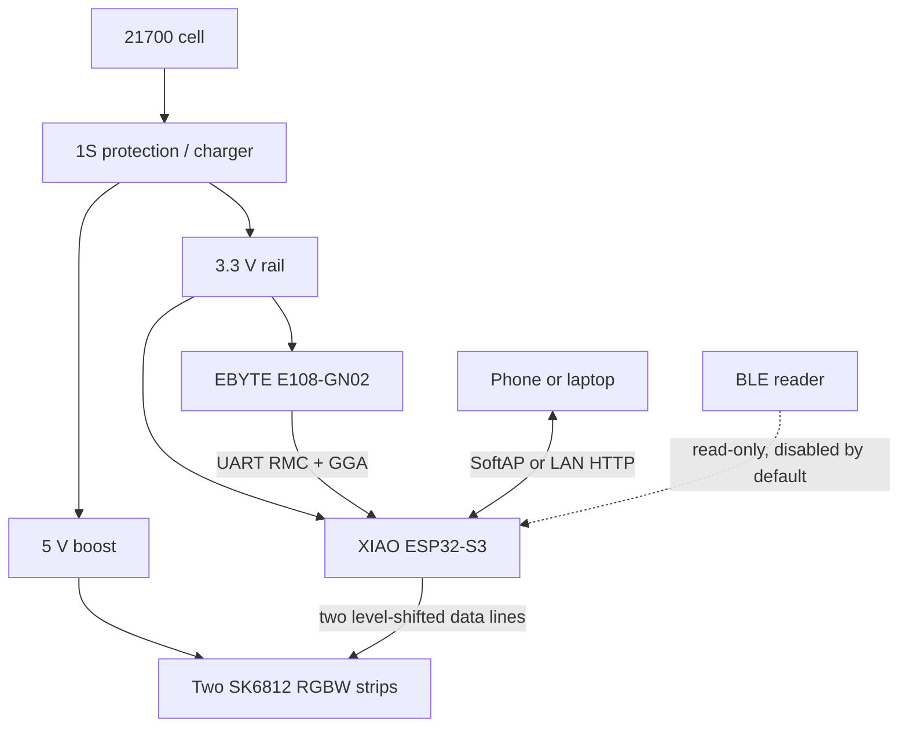
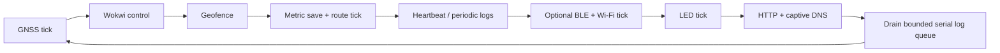

# Dog-RGB Architecture

**Status:** Current architecture, verified against the active firmware on 2026-08-12.

Dog-RGB is a local-first embedded system. The ESP32-S3 owns GNSS acquisition, metrics, route/session persistence, LED rendering, Wi-Fi policy, the HTTP portal, and an optional BLE summary. No backend is required for normal operation.

## System context

The power drawing is conceptual. The real charger/BMS/boost/regulator topology must be validated for the selected modules; do not infer a safe current path solely from this diagram.

## Repository boundaries

- [`Platformio/Dog-RGB`](../Platformio/Dog-RGB/) is the active embedded project.
- [`tests`](../tests/) and [`tools`](../tools/) exercise/extract the embedded portal on a host browser.
- [`docs`](.) contains current references plus dated design history.
- [`software`](../software/) is only a placeholder for optional future companion/cloud work.
- [`hardware`](../hardware/) is a hardware-area entry point; the authoritative pin/default values are currently in firmware headers.

## Firmware modules

| Module | Primary files | Responsibility |
| --- | --- | --- |
| Orchestrator | `src/main.cpp` | Boot order, bounded cooperative loop, heartbeat, periodic diagnostics, serial log queue |
| GNSS/metrics/sessions/routes | `include/gps/gps.h`, `src/gps/gps.cpp` | UART/NMEA, trust gates, distance/activity/speed, date rollover, current/completed sessions, two-hour route ring, JSON/BLE summaries |
| Geofence/Home | `include/geofence/home.h`, `src/geofence/home.cpp` | Home A/B persistence, auto/manual Home, distance, ten ranges, hysteresis |
| Wi-Fi policy | `include/wifi/wifi_mgr.h`, `src/wifi/wifi_mgr.cpp` | AP/STA transitions, credentials, event queue, retry/backoff, idle/hold policy, scan lifecycle, mDNS |
| HTTP portal | `include/web/portal_http.h`, `src/web/portal_http.cpp` | Route registration, request validation, response headers, bounded exports, DNS/captive helpers |
| Embedded pages | `include/web/pages.h`, `src/web/pages.cpp` | Dashboard, Wi-Fi, configuration, and diagnostics HTML/CSS/JavaScript |
| Portal write lock | `include/web/portal_lock.h`, `src/web/portal_lock.cpp` | Optional 4–8 digit PIN, CRC record, constant-work comparison |
| Runtime configuration | `include/config/runtime_config.h`, `src/config/runtime_config.cpp` | Defaults, schema migration, validation, A/B persistence, hot application |
| LED UI | `include/led/led_ui.h`, `src/led/led_ui.cpp` | Status pixels, 12 effects, Speed/Geofence/Show/Simple renderers, welcome animation |
| Day Mode | `include/power/day_mode.h`, `src/power/day_mode.cpp` | Pure evaluation of enabled/trusted-time/day-window state |
| BLE summary | `include/ble/summary_ble.h`, `src/ble/summary_ble.cpp` | Read-only 16-byte characteristic and AP-aware advertising; compile-time disabled by default |
| Storage handles | `include/storage/nvs_store.h`, `src/storage/nvs_store.cpp` | Opens the default NVS namespaces and dedicated route partition |
| Utilities | `include/util/{geo,crc32,time_utils}.h`, `src/util/geo.cpp` | Haversine, CRC-32/IEEE, and wrap-safe time primitives |
| Wokwi control | `include/sim/wokwi_control.h`, `src/sim/wokwi_control.cpp` | Simulation-only command channel and fault/profile controls |
| Hardware/defaults | `include/pins.h`, `include/config.h` | Compile-time pin assignment, limits, timing, hardware layout, and fallback defaults |

Domain state is module-local (`static`/namespace scope) and exposed through narrow functions. There is no shared global `AppState` object.

## Boot sequence

Production boot follows this order:

1. Start the console and external status GPIO.
2. Open NVS handles with `storage::begin()`.
3. Load and validate runtime configuration; select the newest valid A/B generation or migrate/fall back to defaults.
4. If `DEBUG_AP_ONLY_MINIMAL` is enabled, start only Wi-Fi + portal and return from setup.
5. Start GNSS/metrics/routes, then restore Home/geofence state.
6. Start the LED driver and welcome animation when `LED_UI_ENABLED` is true.
7. If `BLE_ENABLED` is true, initialize BLE **before** Wi-Fi and wait the configured coexistence margin.
8. Start Wi-Fi policy and register/start HTTP plus the optional portal lock.
9. Start the simulation control channel (compiled to no-op behavior outside Wokwi as applicable).

BLE precedes Wi-Fi deliberately: initializing the Bluetooth controller after SoftAP can disrupt the shared RF scheduler. Normal production defaults avoid that path by keeping BLE off.

## Cooperative loop

Each phase records maximum observed time for `/api/dev`. There is no RTOS application task graph; the design relies on short cooperative ticks plus the framework's radio tasks.

Two blocking risks receive special treatment:

- HTTP route export writes are synchronous, so data is coalesced into 768-byte chunks and GNSS is serviced on both sides of each socket write.
- Serial output can block, so periodic logs format into a fixed queue and the loop reports application work separately from logging/drain time.

## Concurrency ownership

Arduino Wi-Fi callbacks execute outside the main application loop. They never mutate the Wi-Fi state machine directly. Instead, callbacks enqueue compact events into a fixed 16-entry queue; `wifi_mgr::tick()` drains them in order and owns transitions, retries, station counts, cached mode/channel/IP, and reconciliation.

Queue high-water and overflow counters are exposed in diagnostics. On overflow, the next owner tick reconciles from the driver rather than trusting an incomplete event history.

## Data flow

1. UART bytes are framed and checksum-validated as NMEA sentences.
2. RMC provides status, position, speed, UTC time/date; GGA provides fix quality, satellites, and HDOP.
3. A trusted fix requires current/acceptable evidence under runtime GNSS gates.
4. Trusted observations update speed usability, Haversine segments, active time, maximum speed, route points, and date-transition state.
5. Metrics feed the dashboard summary, sessions, LED range selection, geofence distance, optional BLE payload, and diagnostics.
6. Runtime configuration is validated as a complete semantic record, persisted, then applied to LEDs/Wi-Fi/mDNS.

Average speed is `distance / active_time`; it is not a mean of NMEA speed samples. Activity intervals require active evidence at both endpoints and reject gaps longer than the configured bound.

## Persistence model

| Store | Location | Contents |
| --- | --- | --- |
| `dogrgb` | Default `nvs` partition | Daily metric records/journal, session store, station credentials, migration marker |
| `dogrgb_cfg` | Default `nvs` partition | Runtime config A/B records, Home A/B records, optional portal-lock record |
| `dogrgb_trk` | Dedicated `tracknvs` partition | Route metadata and CRC-protected chunks |

Critical multi-field state uses version/magic/size validation, semantic checks, CRC-32/IEEE, generation numbers with wrap-safe ordering, and alternating slots. A save becomes active only after a complete verified write. Failed portal persistence restores the previous in-memory configuration.

Route storage is different because of volume:

- dedicated 192 KiB partition (`0x30000`);
- up to 1,440 points at a nominal 5-second interval (about two hours);
- chunked ring with CRC-protected metadata/payload;
- partial chunk rewritten every 15 seconds to bound reboot loss;
- invalid chunks are skipped independently during export;
- export iteration snapshots bounds so concurrent recording cannot expand the request indefinitely.

The partition table also provides dual OTA-sized app slots, SPIFFS space, and coredump space, but the repository does not currently implement an OTA product workflow or use SPIFFS for the portal.

## Wi-Fi and portal policy

The Wi-Fi manager can operate in OFF, AP, STA, or AP+STA mode. AP availability depends on GNSS, stationary state, initial/recent portal hold windows, client presence, and station status. Retries use wrap-safe bounded backoff.

The HTTP layer adds:

- wildcard DNS while AP is active and common captive-portal probe routes;
- relative redirects for unknown page paths;
- JSON 404/405 behavior for API paths;
- no-store and basic browser hardening headers;
- `X-Dog-Portal` on every write as a same-origin intent/CSRF guard;
- optional `X-Dog-Pin` validation for write routes;
- output escaping in both server interpolation and client rendering.

This is proportionate protection for a local DIY portal, not a claim of Internet-safe administration. There is no TLS, account system, encrypted application payload, or authorization on reads.

## LED composition

The default physical layout is two strips with 24 pixels each and two reserved status pixels per strip. Rendering order is mode-aware:

- welcome animation runs first;
- Day Mode can clear effect pixels while retaining status;
- Simple intentionally fills all pixels;
- Speed/Geofence/Show normally render the body then status;
- after an explicit Wi-Fi-OFF state and five minutes of stable GNSS, the retained homogeneous-rendering path can use the full strip; automatic AP idle shutdown currently stops SoftAP without entering this state;
- a critical status overrides normal status pixels where those pixels remain reserved.

See [LED UI](led_ui_spec.md) for exact behavior.

## Test architecture

- Host Python models/contracts target persistence and timing failure modes.
- Wokwi runs the production firmware image with a custom controllable NMEA chip and logic analyzer.
- The portal extractor converts C++ raw literals into local pages served with fixture APIs.
- Playwright tests mobile behavior, accessibility, degraded states, and visual baselines.
- CI runs host contracts, portal behavior/a11y checks, pinned visual comparisons, and the production PlatformIO build with size/artifact evidence.

See [Testing and simulation](testing.md) for commands and limitations.

## Deliberate constraints

- Local-first; no required cloud/backend.
- BLE remains compile-time optional and off by default.
- Advanced security/production provisioning remains optional for this DIY phase.
- No battery percentage is invented without a gauge/divider and calibrated measurements.
- No runtime, thermal, waterproofing, or pet-safety claim is accepted from simulation alone.
- Cooperative loop and synchronous `WebServer` are retained while bounded work and diagnostics satisfy the prototype needs.

Future modules should preserve these constraints or document an explicit architecture decision before changing them.
