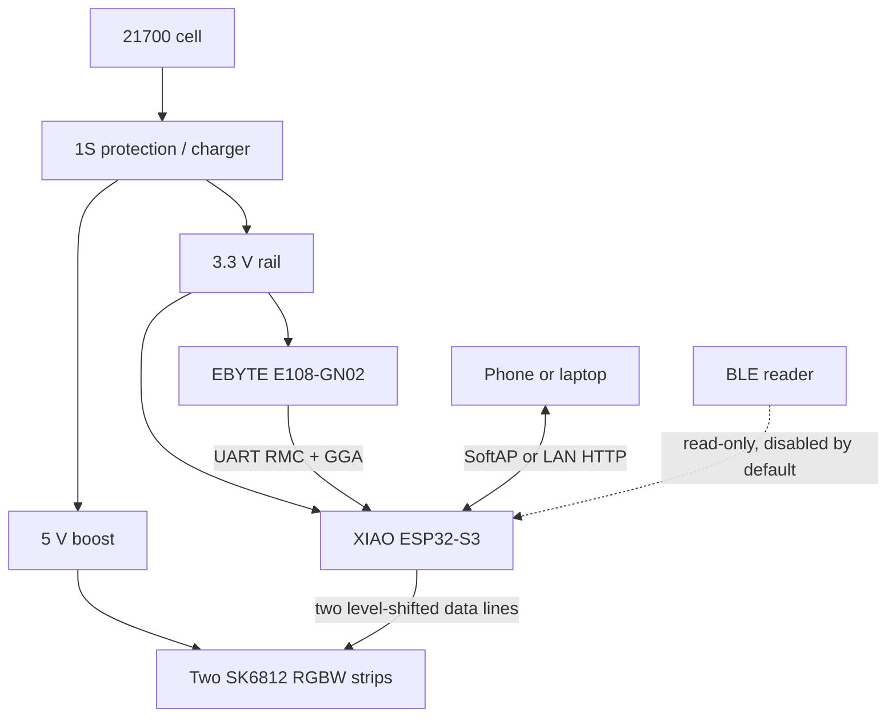
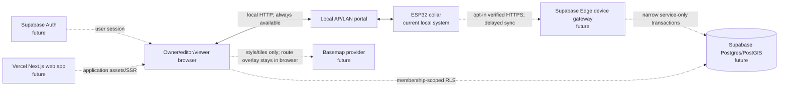
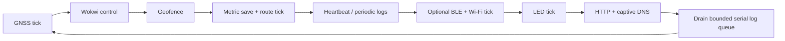
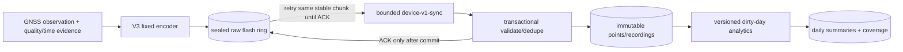
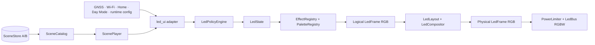

# Dog-RGB Architecture

**Status:** Current local architecture plus accepted optional-cloud target, verified/reviewed 2026-08-13. Cloud runtime, database, website, and firmware sync are not implemented.

Dog-RGB is a local-first embedded system. The ESP32-S3 owns GNSS acquisition, metrics, route/session persistence, LED rendering, Wi-Fi policy, the HTTP portal, and an optional BLE summary. No backend is required for normal operation. The accepted web platform is an opt-in extension: it may delay synchronization when unavailable, but may never become a boot, tracking, LED, AP recovery, configuration, or local-export dependency.

## System context

The power drawing is conceptual. The real charger/BMS/boost/regulator topology must be validated for the selected modules; do not infer a safe current path solely from this diagram.

The accepted future cloud boundary is shown separately so it is not mistaken for current firmware:

There is no realtime/cellular path: the website can show only the last successfully synchronized state and timestamp.

## Repository boundaries

- [`Platformio/Dog-RGB`](../Platformio/Dog-RGB/) is the active embedded project.
- [`webui`](../webui/) owns the editable portal sources and deterministic generator; [`tests`](../tests/) and [`tools`](../tools/) exercise the generated bundles in a host browser.
- [`docs`](.) contains current references plus dated design history.
- [`contracts/device-v1`](../contracts/device-v1/) contains Phase 0 protocol schemas/fixtures. They are design/test artifacts until firmware/gateway code consumes them. The complete protocol, including dedicated revoke, passes 48/48 and is reconciled with the frozen v3 codec; the full match remains a permanent regression gate.
- [`tools/cloud_phase0`](../tools/cloud_phase0/) contains the deterministic v3/storage feasibility artifacts. Its corrected 664-slot byte-addressed candidate is non-production; the seven reproduced adversarial failures now have passing regressions, while independent host recovery/reclaim acceptance remains open. [`tools/map_bakeoff`](../tools/map_bakeoff/) is the synthetic Colombian cartography harness; its full credentialed provider comparison and origin-control tests remain open. Neither is production runtime code; local-only Phase 1 proceeds under the documented owner exception, while Phase 2 remains unauthorized.
- [`software`](../software/) is only a placeholder for optional future companion/cloud work.
- [`hardware`](../hardware/) is a hardware-area entry point; the authoritative pin/default values are currently in firmware headers.

## Firmware modules

| Module | Primary files | Responsibility |
| --- | --- | --- |
| Orchestrator | `src/main.cpp` | Boot order, bounded cooperative loop, heartbeat, periodic diagnostics, serial log queue |
| GNSS/metrics/sessions/routes | `include/gps/gps.h`, `src/gps/gps.cpp` | UART/NMEA, trust gates, distance/activity/speed, date rollover, current/completed sessions, two-hour route ring, JSON/BLE summaries |
| Geofence/Home | `include/geofence/home.h`, `src/geofence/home.cpp` | Home A/B persistence, auto/manual Home, distance, ten ranges, hysteresis |
| Wi-Fi policy | `include/wifi/wifi_mgr.h`, `src/wifi/wifi_mgr.cpp` | AP/STA transitions, credentials, event queue, retry/backoff, idle/hold policy, scan lifecycle, mDNS |
| HTTP portal | `include/web/portal_http.h`, `src/web/portal_http.cpp` | Route registration, request validation, response headers, bounded exports/scene bodies, DNS/captive helpers |
| Scene JSON contract | `include/web/scene_json.h`, `src/web/scene_json.cpp` | Strict allowlist parser, canonical user-scene import/export and field-level errors |
| Portal asset serving | `include/web/{generated_assets,portal_assets}.h`, `src/web/{generated_assets,portal_assets}.cpp` | Immutable gzip pages in flash, ETag/content negotiation and known-length responses |
| Portal web source/build | `../../webui/src`, `../../webui/build.mjs`, `../../webui/generated/manifest.json` | Editable dashboard/Wi-Fi/config/diagnostic sources and deterministic HTML→gzip→C++ pipeline |
| Portal write lock | `include/web/portal_lock.h`, `src/web/portal_lock.cpp` | Optional 4–8 digit PIN, CRC record, constant-work comparison |
| Runtime configuration | `include/config/runtime_config.h`, `src/config/runtime_config.cpp` | Defaults, schema migration, validation, A/B persistence, hot application |
| LED orchestration | `include/led/led_ui.h`, `src/led/led_ui.cpp` | Snapshot device-domain inputs, adapt schema-6 config, render logical body/status, retain current `LedState` |
| LED state and policy | `include/led/led_state.h`, `include/led/led_policy.h`, `src/led/{led_state,led_policy}.cpp` | Pure priority/intent selection from value-only inputs; no GPS, Wi-Fi, geofence, NVS, or pixel ownership |
| Effect registry/renderer | `include/led/effect_registry.h`, `src/led/effect_registry.cpp` | Stable ID/key metadata plus allocation-free RGB generation from explicit time, seed, runtime, and pixel span |
| LED palettes | `include/led/palette_registry.h`, `src/led/palette_registry.cpp` | Eight curated RGBW palettes, stable metadata and allocation-free sampling |
| LED scene model/catalog | `include/led/{scene,scene_catalog}.h`, `src/led/{scene,scene_catalog}.cpp` | 44-byte codec, validation, four immutable built-ins and four user-slot views |
| LED scene player/runtime | `include/led/{scene_player,scene_runtime}.h`, `src/led/{scene_player,scene_runtime}.cpp` | Volatile apply/cancel, active snapshot, shuffled Show bag, store/catalog ownership and diagnostics |
| LED layout/compositor | `include/led/{led_layout,led_compositor}.h`, `src/led/{led_layout,led_compositor}.cpp` | Semantic regions, A/B orientation, mirror, body crossfade, status and alert overlay |
| LED transport | `include/led/led_bus.h`, `src/led/{led_color,led_bus}.cpp` | Shared RGB↔RGBW conversion, NeoPixel ownership and dual-strip output |
| LED power model | `include/led/power_limiter.h`, `src/led/power_limiter.cpp` | Two-bus current estimate, global scale, slow release, diagnostics |
| Day Mode | `include/power/day_mode.h`, `src/power/day_mode.cpp` | Pure evaluation of enabled/trusted-time/day-window state |
| BLE summary | `include/ble/summary_ble.h`, `src/ble/summary_ble.cpp` | Read-only 16-byte characteristic and AP-aware advertising; compile-time disabled by default |
| Scene store | `include/storage/{scene_store,scene_nvs_backend}.h`, `src/storage/{scene_store,scene_nvs_backend}.cpp` | 196-byte A/B record, CRC/generation selection, recovery/readback and Preferences adapter |
| Storage handles | `include/storage/nvs_store.h`, `src/storage/nvs_store.cpp` | Opens the default NVS namespaces, scene namespace and dedicated route partition |
| Utilities | `include/util/{geo,crc32,time_utils}.h`, `src/util/geo.cpp` | Haversine, CRC-32/IEEE, and wrap-safe time primitives |
| Wokwi control | `include/sim/wokwi_control.h`, `src/sim/wokwi_control.cpp` | Simulation-only command channel and fault/profile controls |
| Hardware/defaults | `include/pins.h`, `include/config.h` | Compile-time pin assignment, limits, timing, hardware layout, and fallback defaults |

Domain state is module-local (`static`/namespace scope) and exposed through narrow functions. There is no shared global `AppState` object.

## Boot sequence

Production boot follows this order:

1. Start the console and external status GPIO.
2. Open NVS handles with `storage::begin()`.
3. Load and validate runtime configuration; select the newest valid A/B generation or migrate/fall back to defaults.
4. Load the independent scene A/B bank into `SceneCatalog` and reset/seed `ScenePlayer`; built-ins remain available even if that namespace fails.
5. If `DEBUG_AP_ONLY_MINIMAL` is enabled, start only Wi-Fi + portal and return from setup.
6. Start GNSS/metrics/routes, then restore Home/geofence state.
7. Start the LED driver and welcome animation when `LED_UI_ENABLED` is true.
8. If `BLE_ENABLED` is true, initialize BLE **before** Wi-Fi and wait the configured coexistence margin.
9. Start Wi-Fi policy and register/start HTTP plus the optional portal lock.
10. Start the simulation control channel (compiled to no-op behavior outside Wokwi as applicable).

BLE precedes Wi-Fi deliberately: initializing the Bluetooth controller after SoftAP can disrupt the shared RF scheduler. Normal production defaults avoid that path by keeping BLE off.

## Cooperative loop

Each phase records maximum observed time for the serial-only periodic `[SYS]` diagnostics; `/api/dev` does not expose loop/phase timings. There is no RTOS application task graph; the design relies on short cooperative ticks plus the framework's radio tasks.

Two blocking risks receive special treatment:

- HTTP route export writes are synchronous, so data is coalesced into 768-byte chunks and GNSS is serviced on both sides of each socket write.
- Serial output can block, so periodic logs format into a fixed queue and the loop reports application work separately from logging/drain time.

## Concurrency ownership

Arduino Wi-Fi callbacks execute outside the main application loop. They never mutate the Wi-Fi state machine directly. Instead, callbacks enqueue compact events into a fixed 16-entry queue; `wifi_mgr::tick()` drains them in order and owns transitions, retries, station counts, cached mode/channel/IP, and reconciliation.

Queue high-water and overflow counters are exposed in diagnostics. On overflow, the next owner tick reconciles from the driver rather than trusting an incomplete event history.

## Data flow

1. UART bytes are framed and checksum-validated as NMEA sentences.
2. RMC provides status, position, speed, UTC time/date; GGA provides fix quality, satellites, and HDOP.
3. A trusted fix requires current/acceptable evidence under runtime GNSS gates.
4. Trusted observations update speed usability, Haversine segments, active time, maximum speed, route points, and date-transition state.
5. At the LED tick, `ScenePlayer` consumes the latest fixed apply/cancel command or advances Show from its shuffled eligible-scene bag; it provides a copied recipe, never a live NVS reference.
6. Metrics, device-domain snapshots and that optional scene feed `LedPolicyEngine`, which selects a value-only `LedState`; renderers consume it without importing GNSS, Wi-Fi, geofence, HTTP or storage modules.
7. The selected effect/palette produce logical RGB; `LedCompositor` scales only the target body, maps semantic regions, orientation, mirror, transition and alert; then `LedBus` limits and converts the physical frame for RGBW transport.
8. Runtime configuration and scene-bank mutations are validated/persisted independently. Scene apply/cancel is volatile and never writes flash.

Average speed is `distance / active_time`; it is not a mean of NMEA speed samples. Activity intervals require active evidence at both endpoints and reject gaps longer than the configured bound.

## Persistence model

| Store | Location | Contents |
| --- | --- | --- |
| `dogrgb` | Default `nvs` partition | Daily metric records/journal, session store, station credentials, migration marker |
| `dogrgb_cfg` | Default `nvs` partition | Runtime config A/B records, Home A/B records, optional portal-lock record |
| `dogrgb_scn` | Default `nvs` partition | User-scene bank A/B records (`scene_a`, `scene_b`) |
| `dogrgb_trk` | Dedicated `tracknvs` partition | Route metadata and CRC-protected chunks |

Critical multi-field state uses version/magic/size validation, semantic checks, CRC-32/IEEE, generation numbers with wrap-safe ordering, and alternating slots. A save becomes active only after a complete verified write. Failed portal persistence restores the previous in-memory configuration.

Scenes keep a separate schema/generation from runtime config. Each `SCN1` record is exactly 196 bytes and contains four canonical 44-byte slots; two banks total at most 392 bytes of payload. A future/oversized record is read-only, while corrupt/ambiguous recovery requires an explicit request and writes two equivalent copies. Store unavailability disables user-scene mutations without preventing boot or the flash-resident built-ins.

Route storage is different because of volume:

- dedicated 192 KiB partition (`0x30000`);
- up to 1,440 points at a nominal 5-second interval (about two hours);
- chunked ring with CRC-protected metadata/payload;
- partial chunk rewritten every 15 seconds to bound reboot loss;
- invalid chunks are skipped independently during export;
- export iteration snapshots bounds so concurrent recording cannot expand the request indefinitely.

The partition table also provides dual OTA-sized app slots, SPIFFS space, and coredump space, but the repository does not currently implement an OTA product workflow or use SPIFFS for the portal.

## Wi-Fi and portal policy

The Wi-Fi manager can operate in OFF, AP, STA, or AP+STA mode. AP availability depends on GNSS, stationary state, initial/recent portal hold windows, client presence, and station status. Retries use wrap-safe bounded backoff.

The HTTP layer adds:

- wildcard DNS while AP is active and common captive-portal probe routes;
- relative redirects for unknown page paths;
- JSON 404/405 behavior for API paths;
- `no-store` for APIs/dynamic responses, while immutable HTML uses `no-cache` plus a content-derived ETag for safe revalidation;
- `X-Dog-Portal` on every write as a same-origin intent/CSRF guard;
- optional `X-Dog-Pin` validation for write routes;
- browser hardening headers on every response and client-side escaping before untrusted values enter the DOM.

This is proportionate protection for a local DIY portal, not a claim of Internet-safe administration. There is no TLS, account system, encrypted application payload, or authorization on reads.

## Optional cloud target (not implemented)

### Runtime boundaries

- **Website:** a future Next.js application on Vercel serves account/dog/history/configuration UX. The browser uses a Supabase publishable key plus its authenticated user session; it never receives server secret/service-role material.
- **User identity/data:** Supabase Auth and an explicitly exposed `api` schema use dog memberships and RLS. Owners, editors, and viewers receive only documented permissions. Public IDs are never treated as authorization.
- **Device gateway:** collars call versioned Supabase Edge Functions directly, not Vercel routes and not broad PostgREST. `user-v1-issue-claim`, `device-v1-claim`, consolidated `device-v1-sync`, and idempotent `device-v1-revoke` are the narrow accepted surface.
- **Private data:** claim/credential digests and replay receipts live in a non-exposed `private` schema. Device credentials are random, per-collar and revocable; plaintext persists only on the collar and is transient at the Edge gateway while a verified-TLS claim body or sync/revoke Authorization header is authenticated. It is never stored/logged server-side. The collar never stores human login or Supabase project keys.
- **Stable endpoint:** the default Supabase hostname is allowed for laboratory evidence. An owned `api.<domain>` Supabase custom domain is mandatory before field firmware so a project/provider move does not permanently pin devices to a provider-owned hostname.
- **Maps:** MapLibre consumes a provider style and an application-owned segmented GeoJSON view model. Route data stays in the authenticated browser; providers receive only normal style/tile requests and viewport/network metadata. Stadia Dark is provisional until the full MapTiler/Stadia credentialed bake-off and unapproved-origin tests are retained/scored.

See [ADR-0005](adr/0005-device-cloud-gateway-and-stable-hostname.md), [ADR-0006](adr/0006-cloud-data-model-and-access-boundaries.md), and [ADR-0009](adr/0009-map-renderer-provider-and-colombia-bakeoff.md).

### Telemetry flow and storage

Current route v2 is a ten-byte coordinate/minute record with a two-hour local window; it cannot support per-point speed/quality, stationary coverage, exact seconds, stable replay identity, or explicit gaps. It remains readable/exportable and can only enter cloud history as visibly limited legacy evidence.

The accepted target adds a fixed v3 observation/chunk format and a durable raw-partition outbox on the currently unused `0x150000` data partition:

A sealed chunk is immutable and retained until a durable post-commit ACK. Identical replay returns one logical result; the same ID with another hash is rejected. Full storage never overwrites unacknowledged observations: it reduces optional sampling/stops ordinary capture and records an explicit loss interval. Gaps remain gaps in maps and analytics.

The raw ring remains an accepted design direction with provisional deterministic model output, including simulated write/metadata/reclaim cuts. The corrected 664-slot byte-addressed candidate is **not yet accepted**: its seven reproduced adversarial fallback/loss/corruption failures now pass as regressions, but independent recovery/reclaim review is still open. Even after that gate closes, randomized ESP32 power removal, timing, wear distribution, and energy must be measured before firmware acceptance. See [ADR-0007](adr/0007-durable-telemetry-outbox-and-storage.md) and the [feasibility report](cloud/phase0-storage-feasibility.md).

### Cloud data model

The future database separates:

- normalized users/dogs/memberships/collars and roles;
- stable recordings, immutable accepted telemetry, chunks/receipts and explicit loss markers;
- device-reported summaries versus independently versioned cloud-derived summaries;
- current configuration winners, append-only revisions, and desired/apply outcomes;
- private claim-code/device-credential/request state.

Canonical telemetry preserves exact wire integers plus time/quality/provenance. PostGIS `geography(Point,4326)` is derived for spatial work; normal playback first filters/orders by recording/time/sequence. Initial indexes are relational/time/idempotency indexes. Table partitioning and GiST wait for the one-million-point/query evidence rather than being added speculatively.

Each dog has an IANA timezone. Local days can be 23, 24, or 25 hours; missing evidence becomes unknown, never inactivity. Raw points expire after 12 months by default while summaries/recording metadata remain until dog/account deletion. See [ADR-0006](adr/0006-cloud-data-model-and-access-boundaries.md), [ADR-0010](adr/0010-retention-and-truthful-activity-vocabulary.md), and the [field matrix](cloud/phase0-field-matrix.md).

### Bidirectional configuration

Configuration converges at coherent resource granularity with HLC LWW and a deterministic actor tie-break. AP writes and downloaded winners pass through the same firmware validation and A/B persistence path. The server stores desired state; the collar separately reports pending/applied/rejected for an exact server version.

Brightness is the first proof resource. Later resources group visual mode/Day Mode, all speed thresholds/effects, Simple effect, GPS quality gates, and fence distance. Home coordinates and LED power calibration are local-only for the first release, as are Wi-Fi/AP credentials, mDNS, and the local PIN. The device secret is excluded from configuration/history and used only as verified-TLS device authentication. See [ADR-0008](adr/0008-resource-level-hlc-lww-configuration-sync.md).

### Security and privacy boundary

The local AP remains plain HTTP and exposes documented reads to local-network clients. Internet mode introduces a different mandatory baseline: certificate/hostname verification, unique device credentials, claim expiry/rate limits, bounded/replay-safe requests, explicit database grants/RLS, revocation, and coordinate/secret-free logs. Secure Boot, flash encryption, eFuse/debug policy, signed OTA, and manufacturing key infrastructure remain optional later hardening.

Normal AP unlink is a two-phase state transition, not local credential deletion first. `REVOKE_PENDING` stops ordinary exchange and retries one exact `device-v1-revoke` request until the server has transactionally revoked the link and stored the replay receipt. Its schema-valid `200` disposition is `newly_revoked` or `already_revoked`; either valid result for the pending request permits local erasure. Exact replay returns the persisted original result, while a prior website/different-request revoke authenticates through the revoke-only tombstone and creates an `already_revoked` receipt. Generic errors never permit erasure. Offline force-clear remains available with an explicit warning that website-side revocation is still required.

The full controls and processors are in the [threat model](cloud/threat-model.md), [privacy/data-flow inventory](cloud/privacy-data-flow.md), [retention policy](cloud/retention-policy.md), and [credential checklist](cloud/credential-checklist.md).

## Generated local portal pipeline

The portal has no runtime template engine and does not interpolate configuration into HTML. `webui/src/pages/*.html` plus the shared CSS are the only editable sources. With the exact Node version from `.node-version`, `webui/build.mjs`:

1. validates UTF-8/LF inputs and rejects remote runtime resources;
2. inlines the shared CSS and minifies conservatively;
3. creates level-9 gzip with zero timestamp and a canonical `0xff` OS byte, so Windows and Unix produce identical payloads;
4. records input/output SHA-256 values, ETags, decoded/gzip sizes and budgets in `webui/generated/manifest.json`;
5. emits one aligned `PROGMEM` byte array and descriptor per page in `generated_assets.cpp`;
6. optionally writes decompressed `.ap-portal-preview/*.html` for local inspection.

The generated manifest and C++ arrays are versioned. Preview HTML is disposable and ignored. A PlatformIO pre-script verifies manifest/input/output hashes using only Python's standard library; it never runs Node, npm or the network. Therefore a clean checkout can compile firmware offline, while a developer changing portal sources must explicitly regenerate the tracked artifacts.

At runtime, `PortalAssetServer` selects the descriptor for `/`, `/wifi`, `/config` or `/dev`, negotiates gzip, attaches `Vary`, `ETag` and cache headers, handles `If-None-Match`, and calls `send_P` with the compressed byte length. It never constructs a `String` proportional to the decoded page. An absent `Accept-Encoding` is accepted for captive-view compatibility; an explicit gzip rejection returns `406` because no second raw representation is stored.

## LED composition

The default physical layout is two strips with 24 pixels each and two reserved status pixels per strip. Bus A body is forward and bus B body reverse; those compile-time declarations still require confirmation on the final mounting. Rendering is semantic:

- welcome alone owns complete strips during startup;
- normal effects, including Simple, render `body_left`/`body_right` or mirrored `body_all`;
- Show renders the four built-ins plus each valid/eligible user slot through a fixed shuffled bag; a manual scene is a volatile body override;
- normal status always owns the two reserved pixels;
- a visual state change crossfades body buffers for 500 ms while status stays current;
- Day Mode supplies a black body and normal status;
- System and Geofence alerts interrupt a fade and override only the `alert`/status region.

The policy priorities are explicit and native-tested: welcome `100`, System/Geofence alert `90`, Day Mode `80`, active range/Show/Simple/manual recipes `30`, and idle/guidance `20`. An alert does not silently replace the decorative intent; `LedAlert` and `critical_alert` let the compositor override only the pixels owned by the alert region.

The schema-6 `RangeEffect` records remain the runtime-config persistence contract. Scenes use schema/record version 1 in `dogrgb_scn`, so Fase 4 does not migrate `RuntimeConfig` or change persisted mode ID 2 for Show. `led_ui` copies range records or an optional scene snapshot into a temporary pure `LedPolicyConfig`.

See [LED UI](led_ui_spec.md) for exact behavior.

## Test architecture

- Host Python contracts and native C++ harnesses target persistence, timing, LED state, scene wire/player/store and strict JSON failure modes.
- Wokwi runs the production firmware image with a custom controllable NMEA chip and logic analyzer.
- The web generator produces the tracked flash arrays and, when requested, disposable decompressed preview pages from the same source/build path.
- Generator unit tests and smoke checks compare source fingerprints, manifest metadata, gzip hashes, decoded bytes, C++ arrays, size budgets and HTTP-serving contracts; they also work in a clean checkout without preview residue.
- Playwright serves generated bundles with fixture APIs and tests mobile behavior, accessibility, degraded states, scene workflows and visual baselines.
- CI runs host contracts, portal behavior/a11y checks, pinned visual comparisons, and the production PlatformIO build with size/artifact evidence.

See [Testing and simulation](testing.md) for commands and limitations.

## Deliberate constraints

- Local-first; no required cloud/backend. Optional sync is off by default and cannot remove AP/local operation.
- BLE remains compile-time optional and off by default.
- Internet-facing cloud security has a mandatory minimum in the threat model; hardware-rooted/production hardening remains optional for this DIY phase.
- No battery percentage is invented without a gauge/divider and calibrated measurements.
- No walk/run/inactivity/sleep or continuous-route claim is invented from current route v2, missing samples, or GNSS-only thresholds.
- Home and LED power calibration remain local-only in the first cloud release.
- No runtime, thermal, waterproofing, or pet-safety claim is accepted from simulation alone.
- Cooperative loop and synchronous `WebServer` are retained while bounded work and diagnostics satisfy the prototype needs.

Future modules should preserve these constraints or document an explicit architecture decision before changing them.
