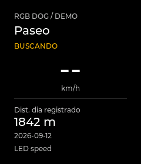
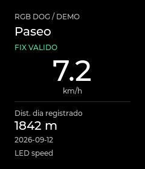
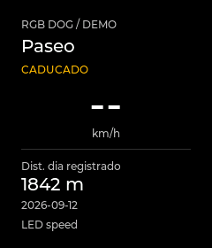

# Display I5 — shared static Paseo view

Date: 2026-09-12. **Software verified; USB comparison complete; black revision uploaded.** The
owner confirmed the previous I4 demo was visible and authorized continuing.
GNSS and strips remain unsoldered. I5 develops the independent display work;
I4's combined-load and portable-use acceptance remain open.

The workspace initially contained I4 changes on `238b58e`. During this session
the repository recorded I4 in `f26550c`, the first LVGL implementation in
`b868cfe`, and simulator/tests in `cccad6f`; subsequent documentation changes
were still local. Image and source hashes below identify the tested result
independently of those changing repository revisions.

## Delivered and visually reviewed on PC

A single static Paseo page: pure black surface, large white speed, explicit GPS
state and retained daily distance/date. Existing semantics, formatter and LED
mode names are shared by basic text, LVGL and PC. No new navigation, animation,
metric, GPS writer or storage schema. The stage-3 fixture remains explicitly
DEMO and never enters normal domain data.

| Searching | Valid fix | Stale |
| --- | --- | --- |
|  |  |  |

These are **actual LVGL 8.4.0 renders**, inspected at 240×280, not photographs
or a separate mockup. Text fits within the panel margin; invalid speed clears,
distance stays, and status has text as well as color. Repeated renders produced
the same PNG hashes. [Manifest](../assets/display-i5/manifest.json) records
configuration, view/formatter and image hashes. The owner saw the first LVGL
page but described its green-tinted background as bright gray and requested
black. These captures show the revised `#000000` palette; its physical appearance
has not yet been confirmed. The [technical investigation](../waveshare-lcd169-technical-research.md)
separates that preference from unproven driver/backlight faults.

## Stack, contracts and resources

LVGL 8.4.0 is pinned for both platforms; Arduino_GFX 1.6.7/core/partitions/GPIO
remain unchanged. Only Display product and stage 3 link graphics. One SPI owner,
one 9,600-byte RGB565 partial buffer, a 48 KiB LVGL pool and built-in fonts.
No SDL dependency in the first static PC tool: the official PC port informed
the CMake layout, while a headless callback produces the three captures.
See [implementation guide and primary sources](../../Platformio/Dog-RGB/docs/display-i5.md).

The shared UI changes labels only when content/color changes. Sampling stays
at 1 Hz. The port advances the LVGL clock in the cooperative loop and signals
flush-ready only after synchronous SPI returns. A small buffer does not bound
the aggregate handler duration; one handler may perform multiple transfers.
Stage 3 adds `s` for the simple page and `l` for LVGL, preserving live/demo mode.
`t`/`b`/`d`/`r` and `f`/`v` remain available. Only one renderer draws at a time.

| Target | Static RAM bytes | Flash usage bytes | Change from I4 |
| --- | ---: | ---: | --- |
| Classic | 57,636 | 1,151,879 | Unchanged |
| Wokwi | 57,556 | 1,151,319 | Unchanged |
| Waveshare product | 119,492 | 1,428,639 | +59,896 RAM / +219,980 flash |
| Waveshare I0 | 31,432 | 366,488 | Unchanged |
| Waveshare I1 | 31,672 | 369,996 | Unchanged |
| Waveshare I2 | 57,644 | 1,153,283 | Unchanged |
| Waveshare I3 | 119,516 | 1,430,559 | +59,912 RAM / +220,028 flash |

The simple-page command does not unload LVGL's statically allocated memory.
Its timing comparison runs inside the same I5 image; the separate I4 image is
the reference for total memory differences.

## Local verification

- Seven PlatformIO builds passed, using CLI 6.1.19 and the existing pinned
  core/libraries. No target-build warnings/errors in the successful full run.
  The final palette-only change was followed by Display product, stage 3 and
  Classic builds plus all three shared-LVGL CTest contracts. The table gives
  final black-image sizes; the first green builds used four more flash bytes
  in each graphics target and the same static RAM.
- Firmware host suite: **146/146 passed**, Python 3.11.9/native g++.
- Shared LVGL suite: **3/3 CTest contracts passed**, local CMake/Ninja and
  Clang 22.1.8, including actual UI and actual display service with fake SPI.
  Coverage includes unchanged-update suppression, bounds/long values, valid
  zero, all reception states, retained distance, demo labels, initialization
  order/failure, pause/backlight, text/LVGL switching and clock rollover.
- PC LVGL pool free space returned to **41,920 bytes** after 120 state updates
  and additional edge cases. Thirty renderer switches also passed the native
  service memory check. Native pool layout is not identical to 32-bit ESP32.
- The serial helper's five tests passed after adding backend observations and
  the `s`/`l` command allowlist. Existing 146-test count is unchanged.
- CI gained a separate shared-display test/capture job, retaining seven firmware
  targets. This is configuration, not evidence of a remote Actions run.

Two build integration issues were found and corrected before upload: unused
upstream widgets required disabled flex/grid features, and PlatformIO's library
compilation needed an explicit project include path for `lv_conf.h`. The final
config enables only the widgets used here; firmware/PC share that same file.
No portal behavior changed in this increment; I4's browser results are historical,
not a new hardware-HTTP or browser run.

## Physical image and observation

COM6 remained the authorized USB-only board. The previous I4 flashed image and
original mapped-partition backup were preserved. Stage 3 was uploaded with
esptool hash verification; no full-chip erase or configuration changes.

First, green-tinted image: **1,458,048 bytes**, SHA-256
`117c78beef68284177e6b7e9e2d188965763a236b01d4f3ee3440cf28272bcee`.
Preserved as `flashed-display.bin`. The initial 12-second smoke returned
`ready=1 ui=lvgl demo=1`, with LCD init 645,820 µs and no captured fatal/reset
markers; it was too short to include a SYS record and is not a soak result.

The **600.172-second comparison belongs to that first image**. Commands were
`f` at 0 s, `r` at 5 s, `s` at 180 s, `r` at 185 s, `l` at 300 s, `r` at
305 s, `b` at 360/390 s, `d` at 420/450 s and `r` at 455 s. Timing below uses
counter-reset windows and identifies manual redraws separately. There were
1,005 complete LCD reports and 20 SYS reports spanning 570 s; one malformed
record was excluded. Early buffered serial data are not treated as a new boot.

| Observation, first image | Result |
| --- | --- |
| Normal LVGL, final report before first backend switch | Maximum 18,479 µs; p95 histogram upper bound 20,000 µs |
| Normal text, final report before returning to LVGL | Maximum 4,528 µs; p95 upper bound 5,000 µs |
| Final normal LVGL window after reset | Maximum 18,185 µs; p95 upper bound 20,000 µs |
| Largest aggregate service observation including manual redraw | 49,997 µs |
| ESP32 free heap, all sampled SYS reports | 160,856 bytes |
| Lifetime minimum heap, final report | 160,100 bytes |
| LVGL pool, final report | Free 44,856; largest block 44,836 bytes |
| Log drops | 18,259 → 18,259 bytes; no increase during observed SYS window |
| Resets/fatal markers/clock regression observed | None |
| GPS | No data, RX 0, overflow 0; no receiver connected |

These are per-window histogram upper bounds, not an exact pooled percentile.
Serial states confirmed separate backlight-off and service-paused windows;
the paused sample timestamp stayed fixed. The basic renderer stayed inside the
same image and thus retained LVGL memory. This is a bare-board comparison,
not a matched real GNSS/LED/HTTP load test.

Final **black** image: **1,458,048 bytes**, SHA-256
`fd1dd5f2a9f958dfde4133f8523e6df83bfe53b60a65f795c924af6aa86d75f7`,
preserved as `flashed-display-black.bin` and matching the final stage-3 build.
Upload again passed esptool hash verification. A separate **90.204-second**
smoke sent `f` at 0 s and `r` at 5 s; its 3 SYS reports span 60 s. Final status
is `ready=1 enabled=1 light=1 demo=1 ui=lvgl`. Normal service maximum after
reset is **18,453 µs**, p95 upper bound **20,000 µs**; sampled free heap remains
**160,824 bytes**, lifetime minimum reaches 160,104. Log drops remain 7,795;
no captured reset/fatal marker or clock regression; GPS remains disconnected.
One malformed serial record was excluded. The board is left showing black
Paseo DEMO. This short smoke does not repeat the earlier ten-minute comparison.

The black smoke recorded a full-redraw/service maximum of **50,485 µs** before
the counter reset, exceeding the proposed 50 ms budget by 485 µs. The budget
is therefore **not fully met**. Normal incremental updates fit the initial
window on this bare board, but full-redraw scheduling needs attention before
I6 transitions or joint-load acceptance. No performance regression is attributed
to the palette from two differently timed runs. Initialization was 647,447 µs.

Raw builds, packages/symbols, flashed image, tests and serial observations live
in ignored `Platformio/Dog-RGB/artifacts/display-i5/`. The reproducible PC tool
and three reviewed PNGs are versioned.

## Remaining acceptance

Review the black palette and bars on LCD, address the full-redraw time budget
before animation, and complete I4's real GNSS/LED/portal load checks when connections are
available. PCB markings/color bars, electrical/current/battery behavior and
outdoor tracking are not proven by this increment. The host still has no
available Wi-Fi adapter for direct embedded HTTP tests. No claim of 20 FPS,
animation fluency or simultaneous live tracking is made. I6 remains deferred.
