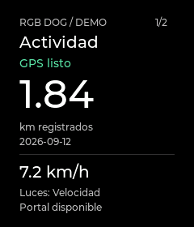
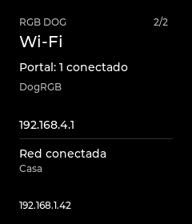
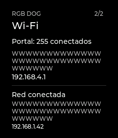

# Display I6a — Activity and Connection

Date: 2026-09-12. **Implemented, compiled, uploaded and observed on the USB bench.**
The owner authorized proceeding with the usage/screen plan.
COM6 is the same USB-only Waveshare board; GPS and strips remain unsoldered.
PCB/revision marking, actual button operation, optical appearance and combined
GNSS/LED/HTTP acceptance remain separate from software and serial-injected events.

The workspace carried I5 changes and later recorded `e211692`; commits changed
during the work. Binary/source hashes identify each measured revision. Unrelated
edits to root `AGENTS.md` were preserved and were not made by this increment.

## Delivered

Activity now emphasizes registered distance and its date, retaining valid-speed
semantics and the configured LED mode. Connection reads actual AP/STA state,
names and addresses without scanning, reconnecting or extending AP availability.
An explicit GPS DEMO does not simulate the radio. BOOT/GPIO0 is reserved and read
with a 30 ms debounce; short release advances, long holds are ignored and the
first click after light-off only wakes. Power-control pins retain their role.

No automatic sleep, rest detection, battery percentage, new walk lifecycle,
animation or cloud dependency. [Implementation and controls](../../Platformio/Dog-RGB/docs/display-i6.md)
and [product contract](../PLANS/2026-09-12_display-use-and-screens.md).

| Activity | Connection, AP + STA | Long SSIDs |
| --- | --- | --- |
|  |  |  |

Nine actual LVGL renders were inspected. The other captures cover searching,
stale data, AP-only, connecting, disconnected and radio-off. The
[manifest](../assets/display-i6/manifest.json) records PNG and source hashes.
The printable-ASCII SSID limit is explicit: unsupported bytes show `Nombre no
compatible`, retaining any usable IP. Arbitrary Unicode network names remain
an implementation limitation, not a verified font capability.

## Verification and resources

- Seven PlatformIO environments passed in 5:17.595, using CLI 6.1.19, the existing
  Arduino-ESP32 3.3.11/IDF 5.5.5 platform, Arduino_GFX 1.6.7 and LVGL 8.4.0.
- Each later display scheduling change was followed by Display product, stage 3
  and Classic builds; final targeted run took 1:18.062. Other targets' sources
  were not changed by those scheduling revisions.
- Firmware host suite **146/146 passed** in 22.483 s. The two legacy display
  tests also passed after the shared-root change.
- Shared-renderer CTest **4/4 passed**, including layout/semantics, real display
  service with fake SPI, panel-init failure and real connection snapshot with
  read-only Wi-Fi/config stubs. Tests include overlap, wrapped names, stale IP
  removal, radio-off versus AP-inactive, thirty page/backend cycles, bounce,
  long hold, rollover and wake without page advance.
- Native port tests verify a full initial frame before backlight, 51,308 pixels
  for a page change, margin restoration and delayed relighting after diagnostics.
  The native 64-bit LVGL pool returned to 41,312 bytes after the Activity fixture
  sequence; its layout differs from ESP32's 32-bit pool.
- Source/symbol checks isolate graphics and `capture_connection()` to the two
  display targets. The existing CI job invokes the extended renderer; a remote
  Actions run was not observed. The upstream CMake CMP0177 policy warning remains.

| Target | Static RAM bytes | Flash usage bytes | Change from final I5 |
| --- | ---: | ---: | --- |
| Classic | 57,636 | 1,151,879 | Unchanged |
| Wokwi | 57,556 | 1,151,319 | Unchanged |
| Waveshare product | 119,604 | 1,433,059 | +112 RAM / +4,420 flash |
| I0 | 31,432 | 366,488 | Unchanged |
| I1 | 31,672 | 369,996 | Unchanged |
| I2 | 57,644 | 1,153,283 | Unchanged |
| I3 displaycheck | 119,604 | 1,434,687 | +88 RAM / +4,128 flash |

The 48 KiB LVGL pool and 9,600-byte draw buffer remain unchanged. No DMA,
PSRAM framebuffer, SPI-frequency increase or second rendering task was added.

## Physical iterations and performance finding

All uploads passed esptool's write/hash verification, without a chip erase.
I5 images and the original mapped-partition backup remain preserved.

| Image | Bytes | SHA-256 |
| --- | ---: | --- |
| Initial I6a, `flashed-display.bin` | 1,461,792 | `fd04c43b244c9d7d0a1263c6ba65f33864f0960e4acbd1aa60200ee508aec277` |
| Shared root, `flashed-display-region.bin` | 1,462,352 | `bcac49f93d63cbbb5b7416b143210d63ca36011868efe52564c401367adf6484` |
| Final staged restore, `flashed-display-final.bin` | 1,462,416 | `9902cc61382e90d3d5a9ac9ac541b146a309f0f446dd7067f62989a64cd2eb86` |

The first 180.156-second observation injected thirty page changes and ten
light-off/wake cycles. It finished at Activity, `clicks=40`, with no observed
reset/fatal marker or clock regression. Six SYS samples spanned 150 s; sampled
heap was 160,736–160,752 bytes, final lifetime minimum 159,996. Log drops stayed
35,247. Normal updates ended at max 14,531 µs, p95 histogram upper bound 20,000 µs.
But page changes reached **55,543 µs**, exceeding the 50 ms budget.

The shared-root revision renders only the inner content. LVGL's transformed-area
invalidation expands it by five pixels on each side, yielding 51,308 pixels
versus 67,200: **23.65% less transfer**, verified natively. All nine PNG hashes
stayed identical. A second 180.204-second observation repeated the same navigation
and wake sequence, adding returns from bars and basic text. Navigation maximum
fell to **45,274 µs** (18.5% lower in these matched windows). Heap sampled
160,620–160,632 bytes, lifetime minimum 158,184; log drops stayed 32,592.
No reset/fatal marker or clock regression was observed. Normal updates ended at
max 14,673 µs with p95 upper bound 20,000 µs.

That second run exposed a different maximum, **52,932 µs**, on returning from
the bars: restoring margins and content in one service call still exceeded the
budget. The final image splits that diagnostic return into two loop iterations,
allowing GPS/LED/HTTP work between them and lighting only after completion. The
page-change path and all nine captures remain the same.

The final **120.078-second** capture (`navigation-final-2min.txt` and `.json`)
repeated thirty page changes and ten light-off/wake cycles, plus returns from
bars and basic text. It finished at Activity, light on, `clicks=40`. The maximum
aggregate display service time was **44,768 µs**, below the 50 ms budget in this
observed bare-board window and 19.4% below the first revision's maximum.
After resetting statistics for the final normal-update segment, maximum was
**14,522 µs**, with p95 histogram upper bound **20,000 µs**. Across the entire
mixed navigation workload the largest p95 upper bound was 50,000 µs.

There were 206 LCD reports, 204 GPS reports and four SYS reports spanning 90 s;
no malformed records, reset/fatal markers or GPS-clock regressions were observed.
Sampled heap was 160,620–160,624 bytes; the lifetime minimum decreased from
160,600 to 159,876 bytes. This short observation does not prove absence of leaks.
Log-drop bytes stayed at 25,929, with no increase during the capture. Final LVGL
free pool was 42,376 bytes, largest block 42,360. GPS remained `no-data` with
zero RX/overflow; Wi-Fi used the actual AP state, with no connected client or STA.
The final preserved image matches the build hash above; all seven image hashes,
graphics-symbol isolation and nine versioned PNG/source hashes were verified.

## Evidence limits and next acceptance

The counters above measure aggregate service/flush timing, not time until the
LCD pixel becomes visible. Histograms provide percentile upper bounds; the mixed
navigation workload is not a claim of normal-update p95 below 20 ms. These two-
and three-minute bare-board runs are not the I4 thirty-minute joint-load test or
an endurance result. The 50 ms result applies to individual service calls; the
two-stage diagnostic restore spans two loop iterations, not one complete-frame
latency measurement.
GPS stayed `no-data`, RX/overflow 0 throughout; this does not test UART reception.
The host has no available Wi-Fi adapter for direct embedded HTTP verification.

Physical BOOT presses and legibility require the owner's observation. After
those checks and joint-load acceptance, evaluate a brief transition and then
an optional inactivity timeout. Do not infer rest/sleep from lost GPS or make
radio/LED changes because the backlight turns off.

A subsequent 60.172-second passive capture sent no commands and observed no new
click (`clicks=40`, Activity throughout); physical-button acceptance remains open.
Its first line starts mid-record, explaining the single malformed record at
capture entry. Sampled heap stayed 160,620 bytes, with no observed reset/fatal
marker. Log drops were 280,233 at both SYS samples, higher than the preceding
capture after the USB-reader gap; this is not a continuous no-drop observation
across that gap. See `physical-button-observation.txt` and its JSON summary.

Raw captures, summaries, builds, images, source/symbol checks and inventory are
in ignored `Platformio/Dog-RGB/artifacts/display-i6/`. The nine PNGs, manifest,
simulator, tests and documentation are versioned project artifacts.
