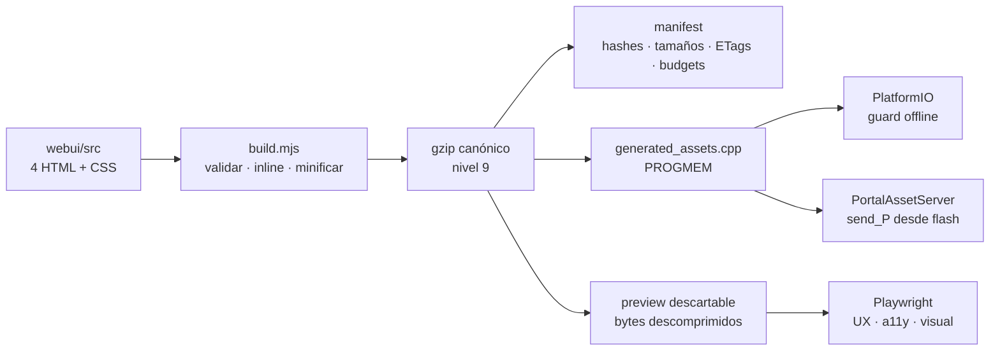

# Baseline de Fase 5 — 2026-08-13

Este registro acompaña el plan de [`RGB Dog × WLED`](../analisis-wled-y-plan-implementacion.md) y describe el estado final incluido en `v2.0.0` (`5276898`). La Fase 5 reemplaza el portal construido como strings C++ por fuentes web editables, generación reproducible, assets gzip en flash y un workspace gráfico que consume las APIs LED/escenas reales.

**Estado:** 5A y 5B completas en software. La aceptación sobre ESP32/collar, navegadores cautivos reales, radio, heap y cadencia LED continúa pendiente y se mantiene separada de los gates host.

## Resultado arquitectónico



Autoridad y ownership:

| Pieza | Rol | Política |
|---|---|---|
| `webui/src/pages/*.html` | Cuatro páginas editables | Fuente de verdad de markup/JS |
| `webui/src/styles/app.css` | Estilos compartidos | Se inlinea en cada página |
| `webui/build.mjs` | Generador determinista | Único camino fuente → bundle/firmware |
| `webui/generated/manifest.json` | Inventario verificable | Versionado; no editar a mano |
| `include/web/generated_assets.h` | Declaraciones generadas | Versionado; no editar a mano |
| `src/web/generated_assets.cpp` | Arrays gzip + descriptores | Versionado; una definición en flash |
| `src/web/portal_assets.cpp` | Transporte HTTP escrito a mano | Negociación, caché, ETag y `send_P` |
| `.ap-portal-preview/*.html` | Inspección local | Descartable e ignorado por Git |

`pages.cpp`, `pages.h` y `extract_pages.py` fueron eliminados. No queda builder `String`, extractor inverso ni segunda implementación de las páginas en producción.

## Pipeline reproducible

La toolchain queda fijada a Node.js `24.18.0` y `html-minifier-terser` `7.2.0`. El generador:

1. lee una lista explícita y ordenada de inputs y páginas;
2. rechaza BOM UTF-8 y retornos CR sueltos, y canoniza CRLF a LF;
3. valida doctype, `lang="es"`, marcador CSS único y ausencia de recursos HTTP externos;
4. inlinea CSS y minifica HTML/CSS/JS con opciones conservadoras, sin mangling global;
5. comprime con DEFLATE/gzip nivel 9 y verifica el round-trip inmediatamente;
6. exige header gzip sin campos opcionales, timestamp cero y byte OS `0xff`;
7. calcula SHA-256 del inventario, cada gzip y cada salida generada;
8. aplica presupuestos por ruta y al portal completo antes de escribir;
9. escribe únicamente los outputs cuyos bytes cambiaron.

El byte OS merece una decisión explícita: zlib emite `0x03` en Unix y `0x0a` en Windows. Ese byte no cambia la descompresión, pero sí el hash. Normalizarlo a `0xff` evita que el mismo portal genere diffs distintos según el sistema operativo.

El manifest contiene versión de schema/generador/toolchain, hashes y tamaños canónicos de cada input, fingerprint agregado, hashes de header/CPP, rutas, símbolos, MIME, encoding, tamaños raw/gzip, budgets y ETags. No contiene fecha, ruta absoluta ni metadata del host.

## Build offline y detección de drift

El flujo separa dos perfiles:

- **Constructor de firmware:** usa los arrays ya versionados. El pre-script `tools/check_web_assets.py` valida manifest, inputs, fingerprint y outputs con Python estándar; no invoca Node/npm ni accede a red.
- **Editor del portal:** instala el lockfile con `npm ci`, modifica `webui/src` y ejecuta `npm run webui:build`; antes de commit usa `webui:check`, unit, smoke y Playwright.

`webui:check` calcula los outputs esperados en memoria y falla si el manifest o C++ tracked están stale. El unit test y el smoke funcionan en un checkout limpio sin `.ap-portal-preview`; decodifican directamente los arrays autoritativos. Si existe preview local, el smoke también exige igualdad byte a byte.

Endurecimientos finales incluidos antes de etiquetar `v2.0.0`:

- canonicalización del byte OS gzip para igualdad Windows/Unix;
- unit test independiente de residuos locales de preview;
- smoke independiente de preview, conservando la comparación adicional cuando está presente.

## Contrato HTTP de páginas

Cada descriptor `WebAsset` conserva puntero gzip, tamaño comprimido, tamaño decodificado, MIME y ETag. Los handlers seleccionan un descriptor y `PortalAssetServer` sirve su array con longitud binaria conocida:

```http
HTTP/1.1 200 OK
Content-Type: text/html; charset=utf-8
Content-Encoding: gzip
Cache-Control: no-cache
Vary: Accept-Encoding
ETag: "sha256-<hash-del-gzip>"
X-Content-Type-Options: nosniff
X-Frame-Options: DENY
Referrer-Policy: no-referrer
```

Semántica comprobada por contrato estático:

- `send_P` transmite los bytes comprimidos directamente desde flash;
- no se usa `strlen()` ni se crea un `String` proporcional al HTML raw;
- `If-None-Match` acepta tag fuerte, forma débil, lista o `*` y responde `304`;
- ausencia de `Accept-Encoding` se acepta por compatibilidad con captive views;
- header vacío, `gzip;q=0` o rechazo equivalente responde `406` en texto;
- no se almacena una segunda copia raw del portal;
- HTML usa `no-cache` para revalidar; APIs y respuestas dinámicas conservan `no-store`.

Todavía debe comprobarse esa semántica con clientes cautivos reales: Android, iOS y navegadores de escritorio pueden variar en navegación inicial, headers y caché.

## Workspace de escenas, paletas y preview

La entrega 5B vive dentro de `/config` y consume los contratos de Fases 2–4:

- `/api/v1/led/capabilities` aporta efectos, paletas, rangos, defaults, modos, layout, límites, sentinels y features;
- `/api/v1/led/scenes` aporta built-ins, slots, estado activo, salud del store y generación;
- apply/cancel es volátil y no escribe NVS;
- built-ins se pueden aplicar o copiar a un slot, nunca sobrescribir;
- save/delete/import usa `expected_generation` y trata `409` sin descartar silenciosamente el borrador;
- import valida primero con `dry_run` y confirma después el reemplazo total;
- una capability ausente o incompatible degrada el workspace sin bloquear la configuración general.

El frontend no contiene un catálogo paralelo de effects/paletas/escenas. El smoke falla si reaparece una constante local de efectos en la fuente de configuración.

El canvas de dos tiras es accesible y aproximado. Usa layout/metadatos anunciados, baja cadencia, se pausa si la vista está oculta y respeta `prefers-reduced-motion`. No afirma replicar PRNG, timing exacto, RGB→RGBW, compositor, limitador, orientación física ni corriente.

## Tamaños finales

Fuente: `webui/generated/manifest.json` de `v2.0.0`.

| Ruta | Decodificado | Gzip | Gate gzip | Uso del gate |
|---|---:|---:|---:|---:|
| `/` | 28.642 B | 7.865 B | 12.288 B | 64,0 % |
| `/wifi` | 31.408 B | 8.521 B | 13.312 B | 64,0 % |
| `/config` | 83.328 B | 22.352 B | 23.552 B | 94,9 % |
| `/dev` | 31.717 B | 7.148 B | 10.240 B | 69,8 % |
| **Total** | **175.095 B** | **45.886 B** | **56.320 B** | **81,5 %** |

`/config` queda cerca de su gate porque incluye configuración completa, workspace de escenas, concurrencia, import/export y preview. Su crecimiento futuro exige revisar primero separación de responsabilidades o simplificación; no se debe ampliar el presupuesto silenciosamente.

## Recursos de firmware

| Métrica | Fase 4 | Fase 5 / `v2.0.0` | Delta |
|---|---:|---:|---:|
| RAM estática, producción | 57.636 B (17,6 %) | 57.636 B (17,6 %) | 0 B |
| Flash de aplicación, producción | 1.223.359 B (36,6 %) | 1.151.859 B (34,5 %) | −71.500 B |
| Imagen combinada final | — | 1.175.791 B | — |

La reducción confirma el beneficio de retirar builders/literales redundantes, pero no demuestra por sí sola la mejora de heap temporal. Falta medir el mínimo de heap antes/después de navegar repetidamente sobre el ESP32 real.

## Evidencia automatizada

| Verificación | Resultado final |
|---|---|
| Build producción `seeed_xiao_esp32s3` | `SUCCESS` |
| Build de simulación `wokwi` | `SUCCESS` |
| Suite host firmware | 131/131 |
| Generator unit | 4/4 |
| Smoke generado | 4/4 páginas; 175.095 B raw / 45.886 B gzip |
| Playwright comportamiento/a11y/security/responsive | 84/84 |
| Visual en renderer Linux fijado | 18/18 |
| Stale-asset guard en PlatformIO | Cumplido en build limpio |
| Reproducibilidad Windows/Unix | Cubierta por canonicalización CRLF/LF + byte OS y unit tests |

CI ejecuta host tests, `webui:check`, generator unit, smoke, Playwright, comparación visual en `mcr.microsoft.com/playwright:v1.62.1-noble`, y build/size/hash de firmware. Los artefactos de fallo visual duran siete días; binarios/ELF/map/baseline de firmware, catorce días.

## Criterios de salida

| Criterio | Estado | Evidencia / pendiente |
|---|---|---|
| `webui/src` como única fuente editable | Cumplido | Builders/extractor eliminados; smoke lo vigila |
| Outputs reproducibles y stale detection | Cumplido | Lockfile, Node exacto, canonicalización, hashes y tests |
| Firmware compilable offline sin Node | Cumplido | Assets tracked + pre-script Python estándar |
| Cuatro páginas desde flash, sin `String` raw | Cumplido en código/build | `PortalAssetServer`, `send_P`, arrays gzip |
| Editor derivado de capabilities/API | Cumplido en host | Smoke + Playwright + fixtures |
| Scene CRUD/import/export y conflictos | Cumplido en host | 84 Playwright + codec/API contracts |
| Budgets gzip/flash/RAM | Cumplido | Manifest y build final |
| Gzip/ETag/406/304 sobre ESP32 real | Pendiente | Requiere requests al servidor ejecutándose |
| Captive portal AP/STA en teléfonos | Pendiente | Matriz Android/iOS/desktop |
| Heap estable tras navegación/escenas | Pendiente | Medir mínimo y tendencia sobre dispositivo |
| Cadencia LED durante tráfico/NVS | Pendiente | Medir tick/gap, especialmente save/import |
| Recuperación tras cambio de credenciales | Pendiente | Reconnect y fallback físico |

## Comandos de reproducción

Desde la raíz:

```powershell
npm ci
npm run webui:check
npm run webui:unit
npm run smoke
npx playwright test --project=iphone-13-pro-max-chromium
```

Desde `Platformio/Dog-RGB`:

```powershell
python -m unittest discover -s test -p "test_*.py" -v
pio run -e seeed_xiao_esp32s3
pio run -e wokwi
```

La reproducción de capturas pixel a pixel debe usar el contenedor Linux fijado mediante `npm run ap-portal:visual:baseline`; un renderer Windows local no reemplaza ese baseline.

## Siguiente frontera

La Fase 5 está completa como software y pipeline de release. El siguiente trabajo no es otro frontend: es ejecutar el portal embebido en hardware/Wokwi runtime, registrar headers y latencias reales, navegar en clientes cautivos, medir heap y cadencia LED, provocar conflictos/escrituras/reboots y añadir esa evidencia a este baseline. Solo después puede declararse cerrada en producto.
