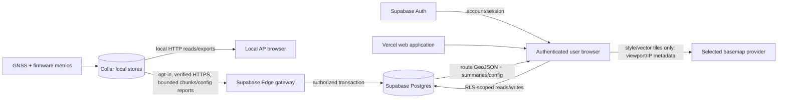

# Cloud privacy and data-flow inventory

**Status:** Phase 0 proposal, 2026-08-13. No cloud collection currently exists.

This document describes the accepted opt-in design so implementation can be tested against a concrete privacy boundary. It is not a published privacy notice or legal conclusion; jurisdiction, operator identity, contact details, subprocessors, and launch terms must be completed before inviting external users.

## User promise

- Dog-RGB remains local-first. Creating an account and enabling cloud sync are optional.
- With cloud disabled, the collar does not contact Dog-RGB cloud services or upload location/configuration.
- Pairing must say which dog/collar will upload route, time, statistics, device health, and supported configuration, and obtain an affirmative action.
- The collar never receives the user's website password. Local AP, Wi-Fi, Home, portal PIN, power calibration, and recovery continue to work without an account.
- Cloud can be unlinked; users can export and delete cloud data. Outages do not erase or disable local functionality.
- There is no public route sharing, advertising use, data sale, third-party session replay, or behavioral/marketing analytics by default.

## Data-flow diagram

The basemap provider does not receive route GeoJSON from Dog-RGB. It can infer the viewed tile area from tile requests and receives ordinary network metadata. Vercel may see web request metadata; device synchronization goes directly to the Supabase gateway and is not proxied through Vercel.

## Inventory and purpose

| Data class | Examples | Source of truth | Purpose | Cloud policy / sensitivity |
| --- | --- | --- | --- | --- |
| account identity | Supabase user ID, email, confirmation/recovery state | Supabase Auth | authentication, recovery, ownership | Cloud-required only for opt-in account; personal; never stored on collar |
| profile/dog metadata | display name, dog name, IANA timezone, optional profile attributes | authenticated user/database | organize and localize history | Cloud; collect minimum fields; do not infer medical/breed claims |
| membership/authorization | dog/user role owner/editor/viewer | database transaction | access control/sharing | Cloud; authorization-sensitive; no public sharing initially |
| public collar identity | random UUID, model, firmware/protocol/capabilities, paired/revoked state | collar + database | route uploads/config compatibility/support | Cloud after pairing; pseudonymous but linkable |
| precise location history | latitude/longitude, timestamps, route bbox/segments | collar observations | private route/history/map/statistics | High sensitivity; opt-in; 12-month raw default; never log |
| activity/statistics | accepted distance, device active time/speed, cloud moving/stationary/unknown/coverage | collar and versioned cloud algorithm | Today/history | Sensitive routine data; truthful-source/coverage labels required |
| data quality | fix/quality/time flags, gaps, satellites/diagnostic aggregates | collar | explain reliability and derive honest summaries | Upload only fields needed by accepted schema; avoid full debug stream by default |
| configuration | brightness and later safe coherent resources; desired/applied/rejected/revisions | last accepted resource mutation, device report | bidirectional configuration | Integrity-sensitive; roles + LWW; Home/power/secrets excluded first release |
| local-only secrets/settings | station/AP password, local PIN, Home coordinate, power calibration | collar local stores | local connectivity, recovery, safety/geofence | Never upload in first release; never include in logs/exports to cloud |
| device authentication | plaintext device credential; server HMAC digest, pepper version; claim-code digest | collar/private server schema | authenticate, pair, revoke | Secret; plaintext persists only on collar and crosses verified TLS transiently in claim/auth; never DB/log/browser/read API |
| operational/replay evidence | request/chunk/mutation IDs, body hash, ACK, error code, IP/rate metadata | gateway/database/provider | idempotency, abuse response, support | Minimize/redact; no coordinates/bodies; bounded retention |
| user-created export/delete state | export job, deletion request/status/receipt | authenticated database workflow | privacy rights and operational evidence | Contains references but deletion receipt has no location payload |
| basemap request metadata | IP, user agent/referrer, style/tile coordinates/viewport, map key/account | user's browser/map provider | render contextual map | External processor policy; no route GeoJSON or Home sent |

## Processing path and controls

### 1. Collar and local portal

GNSS and metrics are collected locally for the existing product whether cloud is enabled or not. Local HTTP is not TLS-protected and read routes expose coordinates/diagnostics to clients with AP/LAN access. That existing limitation must remain visible in setup documentation.

Cloud pairing stores a unique device credential and an opt-in state. A sync request contains only allowlisted versioned fields. The firmware must prove with negative contract tests that Home, Wi-Fi/AP passwords, portal PIN, power calibration, and full raw developer logs are absent.

### 2. Device gateway and Supabase

The gateway authenticates the unique collar, applies request/body/rate limits, validates schemas, commits idempotently, and returns ACK/config winners. Logs use allowlisted event names/counters and must not include authorization headers, claim codes, device credential, request bodies, coordinates, bboxes, map URLs with positions, or dog names.

Supabase stores account/data in separate authorization and private-secret boundaries. RLS derives access from memberships. Service keys and HMAC peppers exist only in server-side secrets. Region, backup plan, log retention, and subprocessors must be documented at deployment.

### 3. Vercel website and browser

The website uses the authenticated user's session and a Supabase publishable key constrained by RLS. It displays freshness, source, coverage, gaps, desired versus applied configuration, and legacy limitations. Sensitive pages are not indexed or publicly cached. Avoid third-party analytics, embedded support widgets, session replay, remote fonts, or error-report payloads until each receives an explicit privacy review and coordinate/secret scrub test.

Client errors should report opaque IDs and allowlisted state, never fetched route bodies. Content Security Policy and output escaping reduce unauthorized exfiltration but do not replace RLS.

### 4. Basemap provider

MapLibre requests the selected provider's style/glyph/vector/raster tiles for the current viewport. Dog-RGB overlays route GeoJSON locally. Network tests must show that exact route coordinates do not occur in provider request URLs/bodies. The privacy notice must name the chosen provider/link its policy, describe IP/viewport disclosure, and offer a non-map route table/summary. Exact origin restriction protects quota, not user anonymity.

## Choice and lifecycle

### Enable/pair

Before issuing a claim code, show:

- data classes to be uploaded and the high sensitivity of location history;
- sync occurs automatically on known Wi-Fi after pairing;
- first-release local-only fields;
- retention defaults, map-provider disclosure, and account deletion/export links;
- last-synchronized rather than live-tracking behavior;
- an explicit confirm action and recoverable cancellation.

Record policy/consent-copy version and timestamp without storing unnecessary client detail. Pairing one collar does not opt in another.

### Pause/unlink/revoke

A pause stops new uploads but keeps the account/credential unless the UI clearly says otherwise. Normal AP unlink enters `REVOKE_PENDING`, stops ordinary exchange, and retries one exact authenticated `device-v1-revoke`; the server transaction revokes the credential/link and stores its idempotent receipt before responding. Only a schema-valid matching `200` with `newly_revoked` or `already_revoked` clears locally. Exact replay returns its persisted original result; a prior website/different-request revoke uses revoke-only tombstone authentication to issue an `already_revoked` receipt. Generic errors retain state. Website-side revoke uses the user's authenticated authorization path. Offline force-clear warns that server revocation is still required. Unlinking does not silently delete history; offer separate delete choices.

### Access/export/delete

- Export account/dog/collar metadata, recordings, raw points (within retention), summaries/provenance, configuration revisions/outcomes, and membership in a documented machine-readable format.
- Permit owner deletion of a recording, dog, collar association, or account at the appropriate scope, with strong confirmation and reauthentication for destructive account/dog deletion.
- Remove active data within 24 hours, show job state/failure/retry, retain only a coordinate-free deletion receipt, and disclose encrypted backup expiry.
- Restores must replay deletion tombstones/jobs before exposing restored data.

## Accuracy and interpretation limits

The collar is not a live-tracking, anti-theft, medical, or sleep device. Website state is “last synchronized” with an explicit timestamp. Current sessions are boot recordings, not detected walks. Missing/poor-quality/offline time is unknown, not inactivity. The exact vocabulary is in [ADR-0010](../adr/0010-retention-and-truthful-activity-vocabulary.md).

## Data minimization checklist

Before adding a field, processor, or log:

1. What user feature or security invariant requires it?
2. Can it stay on the collar or be aggregated/coarsened first?
3. Is its source/quality/range/version explicit?
4. Who can read/write it, and is that enforced with a negative test?
5. Does it reveal Home/routine when combined with other fields?
6. What is its deletion/retention/backup behavior?
7. Could it enter logs, analytics, screenshots, URLs, support exports, or maps?
8. Is new consent/notice needed?

## Launch gates

- threat model and cross-user/RLS suite pass;
- opt-in/off/unlink/revoke work on physical collar under outage/lost-response cases;
- data export/deletion and backup-restore deletion drill pass;
- production provider/region/subprocessor/retention details are filled in;
- network/log/bundle scans contain no prohibited field or route coordinate;
- map privacy network capture passes and non-map fallback exists;
- privacy/terms/contact copy receives operator/legal review appropriate to launch jurisdictions.

## References

- [NIST Privacy Framework](https://www.nist.gov/privacy-framework)
- [Supabase Auth](https://supabase.com/docs/guides/auth)
- [Supabase Data API security](https://supabase.com/docs/guides/api/securing-your-api)
- [Supabase backups](https://supabase.com/docs/guides/platform/backups)
- [OpenStreetMap tile service privacy/usage boundary](https://operations.osmfoundation.org/policies/tiles/)
