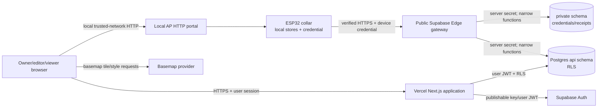

# Cloud threat model

**Status:** Phase 0 design baseline, 2026-08-13. The cloud gateway, accounts, and web application described here are not implemented.

**Applies with:** [ADR-0005](../adr/0005-device-cloud-gateway-and-stable-hostname.md), [data model ADR](../adr/0006-cloud-data-model-and-access-boundaries.md), [sync ADR](../adr/0008-resource-level-hlc-lww-configuration-sync.md), and the [privacy data flow](privacy-data-flow.md).

## Security objective and proportionality

Dog-RGB is a DIY project, but enabling an Internet service changes the minimum bar. TLS verification, unique/revocable device credentials, server authorization, request bounds, RLS, and safe secret/log handling are mandatory for cloud mode; they are not “advanced optional hardening.” Secure Boot, flash encryption, eFuse key protection, signed OTA, a locked debug port, HSM-backed peppers, and formal penetration testing remain optional later hardening unless deployment risk changes.

The primary security outcomes are:

1. one user cannot read or change another user's dog, route, collar, or configuration;
2. possession of one collar credential grants only that collar's narrow sync operations;
3. network attackers cannot read/modify credentials, routes, ACKs, or desired configuration;
4. retry, replay, power loss, and conflicting writes cannot duplicate history or falsely report application;
5. compromise or unlink has a tested containment/revocation path;
6. cloud failure never removes local AP recovery or ordinary offline operation.

## Scope, actors, and trust boundaries

Trust boundaries:

- physical collar/flash/debug pads versus anyone who obtains the device;
- unauthenticated local AP/LAN readers and optionally PIN-guarded writers;
- public Internet and DNS/TLS;
- public Edge Function boundary;
- browser/Vercel runtime versus Supabase user session and RLS;
- exposed `api` schema versus non-exposed `private` schema/service role;
- Dog-RGB browser route data versus third-party basemap tile requests;
- development/staging/production projects, domains, secrets, data, and logs.

Expected actors include an owner, editor, viewer, unpaired device, paired device, former member, thief with physical access, opportunistic Internet attacker, malicious website origin, compromised browser/dependency, and project operator. Supabase/Vercel/map providers are trusted processors within their documented controls, not assumed invisible.

## Assets and sensitivity

| Asset | Sensitivity / impact |
| --- | --- |
| route points, timestamps, Home/current vicinity | High: can reveal residence, routine, absence, and dog/owner movement |
| account identity, dog profile, memberships | Personal/authorization data |
| desired/reported configuration | Integrity-sensitive; some settings affect visibility/GNSS behavior |
| power calibration | Safety-sensitive; local-only in first release |
| Wi-Fi/AP passwords, portal PIN, device plaintext credential, server peppers/secret keys | Secret authentication material |
| telemetry ACKs, sequence/idempotency receipts, HLC state | Integrity/availability evidence; corruption can lose or duplicate history/config |
| firmware capabilities/version, operational diagnostics | Moderate; useful for support and exploitation reconnaissance |
| deletion/export/audit records | Privacy/security accountability evidence |

## Threat register

Severity is the Phase 0 design priority, not a quantitative certification.

| ID / category | Threat and consequence | Required controls | Verification / owner phase |
| --- | --- | --- | --- |
| T01 Spoofing | Attacker guesses/reuses a claim code and pairs another person's collar. | 80 cryptographically random bits encoded as 16 unambiguous Crockford Base32 characters, 900-second TTL, dog/collar binding, maximum five failed consumes plus rate limits, atomic consume, generic error, dedicated versioned claim-pepper HMAC only, audit without code. | Concurrent redemption, expiry, brute-force/rate-limit and cross-dog tests; Phase 1. |
| T02 Spoofing | Extracted/captured device credential impersonates collar. | 256-bit unique credential, verified TLS, server HMAC digest with a separate versioned device pepper, constant-time comparison, per-collar scope, rotation/revocation, no plaintext logs/DB. | Wrong/revoked/rotated credentials, digest leak review, compromise drill; Phases 1/3/7. |
| T03 Spoofing | Collar contains user password or a project-wide key. | Pairing exchange only; no account password, publishable key, secret/service-role key in firmware. Automated secret scans/negative fixtures. | Firmware/binary/source/request-log scan; each release. |
| T04 Tampering | MITM changes telemetry, ACK, clock anchor, or desired config. | TLS chain + hostname verification with maintained CA bundle; bounded clock bootstrap; never skip verification; fail closed. | Bad CA/hostname/expired/not-yet-valid/interception/clock tests; Phase 3. |
| T05 Tampering | Malicious remote config disables safety/visibility or sends invalid coupled state. | Membership role checks, complete resource schemas, capability/schema negotiation, common firmware validation, atomic A/B commit, last-known-good, reported rejection. Home/power local-only. | Boundary/fuzz/cross-field/power-cut and unauthorized-editor tests; Phases 1–4. |
| T06 Tampering | Service/RPC function is abused to alter another dog/private table. | Non-exposed `private`; revoke public/anon/authenticated execution; minimal service-only wrapper; fixed empty search path; schema-qualified SQL; transactional ownership checks. | Catalog privilege assertions and calls as anon/user/service, SQL review; Phase 1 and migrations. |
| T07 Repudiation | Lost response/replay makes device and server disagree about what committed. | Stable request/mutation/chunk IDs, canonical body hash, unique constraints, atomic receipt+data commit, return stored outcome. | Identical concurrent replay and same-ID/different-hash tests; Phase 1/3. |
| T08 Repudiation | Website says config is active after only accepting desired state. | Separate desired/pending/applied/rejected state keyed by exact server version; immutable revision/outcome audit. | Lost response, reboot, rejection, old report and UI copy tests; Phase 4. |
| T09 Information disclosure | IDOR/BOLA or bad RLS exposes another user's route. | Membership-derived RLS on every user-facing table/function, explicit grants/default privileges, server-side owner/editor/viewer authorization, unguessable IDs not treated as auth. | Anonymous/cross-user/former-member/role/crafted URL/RPC test suite; Phase 1 and CI. |
| T10 Information disclosure | Coordinates/secrets leak through logs, errors, analytics, traces, fixtures, screenshots, crash reports, or support tooling. | Structured allowlist logging; redact authorization, claim, device IDs where unnecessary, coordinates/bbox/query/body; synthetic fixtures; no third-party analytics/replay by default; bounded generic errors. | Automated log canaries/negative scans and operational review; Phases 1/3/7. |
| T11 Information disclosure | Basemap provider receives private route. | Keep GeoJSON in authenticated browser; never put route in tile/static-map/directions URLs; disclose that provider sees IP/viewport/referrer; origin-restrict map key. | Network capture proves no route coordinates; map bake-off and Phase 6. |
| T12 Information disclosure | Browser key/session or XSS exposes data. | Supabase publishable key only; RLS regardless of client; secure HttpOnly/SameSite session design where applicable; CSP; contextual output escaping; no untrusted HTML; dependency review. | XSS payload, CSP, cookie/session, logout/revocation and dependency scans; Phase 3/6. |
| T13 Denial of service | Oversized/compressed/parser-heavy sync, rapid claims, or database fan-out exhausts Edge/Postgres. | Exact content type/length and decompressed limits, fixed maxima, single-pass schema validation, rate/concurrency limits, query indexes/timeouts, no unauthenticated expensive RPC. | Boundary/fuzz/load/slow-client tests and budget alerts; Phases 1/3/7. |
| T14 Denial of service | Outage/full outbox blocks local collar or silently overwrites data. | Cooperative bounded sync, backoff/jitter, raw durable ring, never overwrite unACKed data, pressure diagnostics, explicit loss gap, cloud kill switch. | Prolonged outage/full ring/random power cut/loop-latency tests; Phase 2/3. |
| T15 Elevation | Service-role or server pepper reaches browser/collar/build artifact. | Server-only secret stores, separate envs, least-privilege CI, secret scan, no `NEXT_PUBLIC_`/firmware inclusion, rotation inventory. | Build bundle/binary scan and incident rotation drill; every deployment/Phase 7. |
| T16 Elevation | User-controlled metadata/role claim grants ownership. | Never authorize from `raw_user_meta_data`, URL IDs, dog profile, or client-submitted actor; normalized membership and server-derived actor. | Crafted JWT metadata and membership transition tests; Phase 1. |
| T17 Physical | Stolen collar/flash/debug access reveals credential/history. | Unique/revocable credential, no fleet secret, web revocation, minimal local secrets, optional later flash encryption/Secure Boot/eFuse/debug policy. | Lost-device drill mandatory; physical extraction hardening optional Phase 7+. |
| T18 Tampering/repudiation | Lost/spoofed unlink response makes the collar erase its only credential while the server link remains active. | Durable `REVOKE_PENDING`; exact request ID/body replay; one transactional revoke+receipt; schema-valid `200` disposition `newly_revoked|already_revoked`; revoke-only tombstone authentication for prior revoke; generic auth/network failures retain state. | Cut/lost-response/replay/prior website revoke/same-ID-different-body/forced-clear tests; Phases 1/3. |
| T18 Supply chain | Compromised npm/firmware dependency or map script runs malicious code. | Locked dependencies/toolchains, reviewed updates, CI hashes, CSP and self-host critical production assets where feasible, SBOM/advisories. | Clean reproducible builds and dependency review; continuous. |
| T19 Privacy deletion | Delete hides UI row but leaves active points/config/derived copies or reappears after restore. | Transactional deletion workflow, background purge with status, all-class inventory, backup tombstone/replay procedure, provider-lag disclosure. | Export-before/delete, 24-hour purge, restore-from-backup drill; Phase 7. |
| T20 Time/LWW | Future/unknown device clock dominates configuration forever. | HLC monotonic state, clock-quality labels, server bounds/anchors, deterministic rebase/audit, server-stamped web writes. | Future/backward/unknown/SNTP/reboot/tie vectors; Phases 0–4. |

## Security invariants

- Cloud-disabled means no cloud DNS/TLS/upload and no account dependency.
- The AP local read surface remains documented as visible to anyone with local network access; cloud security does not retrofit confidentiality onto HTTP AP reads.
- The device gateway authenticates before privileged parsing/database work and accepts only its versioned allowlist.
- One device credential cannot enumerate dogs/users, query arbitrary rows, or act for another collar.
- Telemetry is acknowledged only after its data and replay receipt commit.
- The same identifier with a different body is never accepted as a retry.
- Remote configuration is desired until the collar durably applies and reports the exact version.
- Wi-Fi/AP passwords, portal PIN, Home, power calibration, and server keys never enter first-release cloud data. The plaintext device credential is excluded from sync/config/history bodies and persistent server data, but necessarily crosses verified TLS in the claim body or sync/revoke Authorization header.
- Logs and durable test artifacts contain neither secrets nor real coordinates.

## Lost device, unlink, and incident response

Normal unlink is online and two-stage:

1. set local state to `REVOKE_PENDING`, immediately stop telemetry/config exchange other than revocation;
2. authenticate one bounded `device-v1-revoke` request carrying a durable request ID and schema-bounded reason; the transaction revokes the credential/collar cloud link and stores its replay receipt before responding;
3. retry the exact request after a lost response; it returns the persisted original logical response. Erase local device credential/cloud metadata only after a schema-valid matching `200` with `newly_revoked` or `already_revoked`, never after a generic `401`/`403`/timeout;
4. website-initiated revocation uses the authenticated user/RLS/service path; a later device revoke authenticates only through the non-usable revoke tombstone and creates an `already_revoked` receipt;
5. website shows revoked/offline state and rejects all later sync attempts.

Forced offline clear is allowed for DIY recovery but must explain that it cannot invalidate a copied server credential. The user must revoke from an authenticated website session. Compromise response rotates the affected credential, not a global fleet key; a leaked server pepper/secret requires environment-wide rotation, receipt/audit review, and notification analysis.

## Optional later hardening

- ESP32 Secure Boot, flash/NVS encryption, eFuse-backed keys, disabled JTAG/debug policy;
- signed OTA with staged rollback and anti-rollback policy;
- separate HSM/KMS pepper/signing key and short-lived workload identity;
- formal external penetration test, SAST/DAST, WAF/bot controls, security monitoring/SIEM;
- network egress allowlists and certificate pinning only after a rotation/recovery design.

These controls are valuable but must not be advertised before hardware/operational evidence exists.

## Review triggers

Review this model before field pairing, public sharing, notifications, OTA, mobile apps, Google Maps/geocoding, Home/power cloud sync, new sensor/health inference, multi-tenant support beyond memberships, a new cloud/map processor, or any public API. Re-run it after a security incident or material Supabase/Vercel/Auth architecture change.

## Primary references

- [NISTIR 8259A, IoT Device Cybersecurity Capability Core Baseline](https://csrc.nist.gov/pubs/ir/8259/a/final)
- [NISTIR 8259 Rev. 1, Foundational Cybersecurity Activities for IoT Device Manufacturers](https://csrc.nist.gov/pubs/ir/8259/r1/final)
- [OWASP API Security Top 10](https://owasp.org/API-Security/)
- [Supabase Data API security](https://supabase.com/docs/guides/api/securing-your-api)
- [Supabase RLS](https://supabase.com/docs/guides/database/postgres/row-level-security)
- [Supabase Edge Function secrets](https://supabase.com/docs/guides/functions/secrets)
- [Espressif ESP-TLS](https://docs.espressif.com/projects/esp-idf/en/latest/esp32/api-reference/protocols/esp_tls.html)
