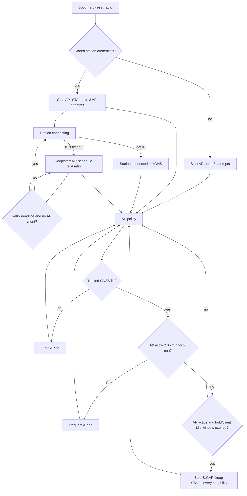

# Wi-Fi/AP State and Policy Diagram

**Status:** Current simplified behavior. For timing and edge cases, see [Wi-Fi, Access Point, and Captive Portal](wifi_portal_spec.md).

Additional rules:

- A new/restarted AP has a 15-minute hold.
- Any portal request adds a five-minute hold.
- No-client idle timeout is ten minutes after holds expire.
- `>=2.5 km/h` clears stationary accumulation.
- AP/STA callbacks enqueue into a 16-entry fixed queue; the main loop owns transitions.
- Automatic idle shutdown stops SoftAP, not the entire Wi-Fi subsystem.
